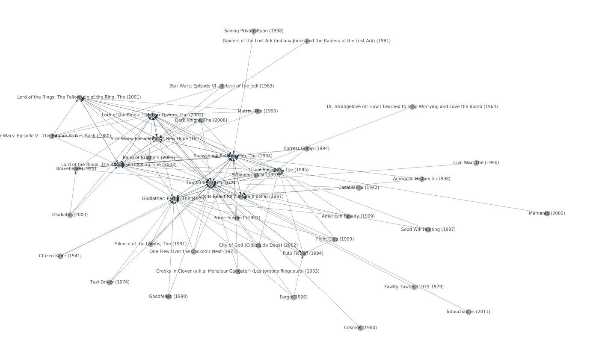

# 什么是激进的内容问题，你的推荐系统是否深受其害？

> 原文：<https://towardsdatascience.com/what-is-the-radical-content-problem-and-does-your-recommender-system-suffer-from-it-7fe017f9a8b1?source=collection_archive---------66----------------------->

## 可解释的建议如何帮助你发现新的见解。

克林特·帕特森在 [Unsplash](https://unsplash.com?utm_source=medium&utm_medium=referral) 上拍摄的照片

*这篇文章是我关于可解释建议系列文章的第 3 部分，基于我的* [*BSc 论文*](https://github.com/villekuosmanen/SHProject/raw/master/dissertation.pdf) *。* [*第一部分*](/explainable-recommendations-why-opening-black-boxes-matters-bd5754af63a2) *介绍了可讲解推荐的概念，而* [*第二部分*](/how-i-implemented-explainable-movie-recommendations-using-python-7aa42a0af023) *介绍了我使用 Python 和 React.js 实现的可讲解电影推荐。*

推荐系统的使用在过去的十年里越来越多，它们被认为是 YouTube、网飞和亚马逊等应用程序不可或缺的一部分。虽然推荐帮助用户在无限的选项海洋中找到他们喜欢的视频、电影或项目，但他们这样做不会没有问题。最近，一些推荐系统因将用户引向一个“兔子洞”,内容越来越激进而受到批评。这种系统的一个例子是 YouTube 的推荐系统，它根据用户的观看历史为用户推荐视频和频道。在研究右翼频道时，研究人员发现了一些证据，表明 YouTube 的推荐算法通过向用户推荐越来越激进的频道而使用户变得激进[1]。值得注意的是，这并不意味着推荐系统有任何问题——事实上，它似乎完全按照设计的那样工作，向有兴趣观看视频的用户准确地推荐视频。这个问题可以称之为**部首内容问题**，关于解决它的学术研究很少。

作为我关于可解释的推荐的论文的延伸，我选择寻找是否有任何可解释的方法可以用来阻止推荐系统推荐越来越激进的内容，或者发现问题是否首先存在。推荐系统中的可解释性以前主要关注用户体验，但也许它也能帮助数据科学家更好地理解他们自己的模型？

基于潜在因素模型的推荐系统是很难解释的。到目前为止，事后解释方法，如关联规则[2]已被用于解释个人的建议。然而，由于关联规则集将推荐系统的行为作为一个整体封装起来，因此它可以用于发现关于推荐系统整体的知识。为此，推荐系统被映射为一个使用生成的关联规则的网络。因为关联规则的形式是(X，Z => Y)，所以它们可以被认为是有向图，其中 X，Z 和 Y 是图的节点。然后可以使用标准的图形可视化技术来可视化该图形。下图显示了使用从 MovieLens 20m 数据集挖掘的关联规则生成的图形。注意，类型为(X，Y) => Z 的规则显示在两条边上，X => Z 和 Y => Z。

从推荐系统中挖掘的关联规则被可视化为有向图。每个节点代表一部电影，而每个边(箭头)代表一个关联规则中的因果关系，即 A→b . Ville Kuosmanen 的图像

可视化的图可以潜在地用于回答关于基础推荐系统的许多问题，但是最有趣的一个是该系统是否遭受极端内容问题，指的是推荐系统向已经评级了流行的温和项目的用户推荐越来越极端的小众项目。这个问题对于像 YouTube 这样的开放视频平台来说特别有意义，YouTube 被指控向流行、温和的“门户”视频的观众推广更极端的内容[1]。为了对网络进行定量分析，应该定义一个合适的“极端性”度量。电影极端评分的一个例子可以是它的分类年龄分级。YouTube 和 Twitter 等没有客观年龄分级的平台上的内容可能更难进行极端排序，但情感分析等机器学习技术可能会用于此。

每一项都可以被赋予一个极端值，随着越靠近聚类中心，网络中极端值越大的部分可以被自动识别出来。因为极端内容倾向于关注特定的社区或用户组，所以分析应该基于基于聚类的关联规则，而不是全局挖掘的规则(如这里所做的)。这将潜在地允许平台管理员容易且客观地找到最激进的社区，并在需要时对其内容设置适当的限制或年龄分级。

在这种情况下，对网络的视觉检查似乎将诸如*《肖申克的救赎》、《指环王:双塔奇谋》和《教父》*等电影置于网络的中心，这些电影似乎并不比它们的前身更极端。这样，对网络的视觉检查表明，这里描述的推荐系统不会遭受极端内容问题。当然，应该进行更彻底的分析检查来确认这一发现，但这超出了本项目的范围。

这篇文章结束了我关于可解释的推荐系统的系列文章。我喜欢了解更多关于可解释的人工智能的需求和挑战，以及在这个过程中对推荐系统的深刻理解。感谢阅读！

[1]:里贝罗，M. H .，奥托尼，r .，韦斯特，r .，阿尔梅达，V. A .，&梅拉，W. (2019)。审核 YouTube 上的激进化途径。 *arXiv 预印本 arXiv:1908.08313* 。

[2]:皮克，g .，&王，J. (2018 年 7 月)。推荐系统潜在因素模型的事后可解释性。《第 24 届 ACM SIGKDD 知识发现和数据挖掘国际会议论文集》(第 2060–2069 页)。ACM。