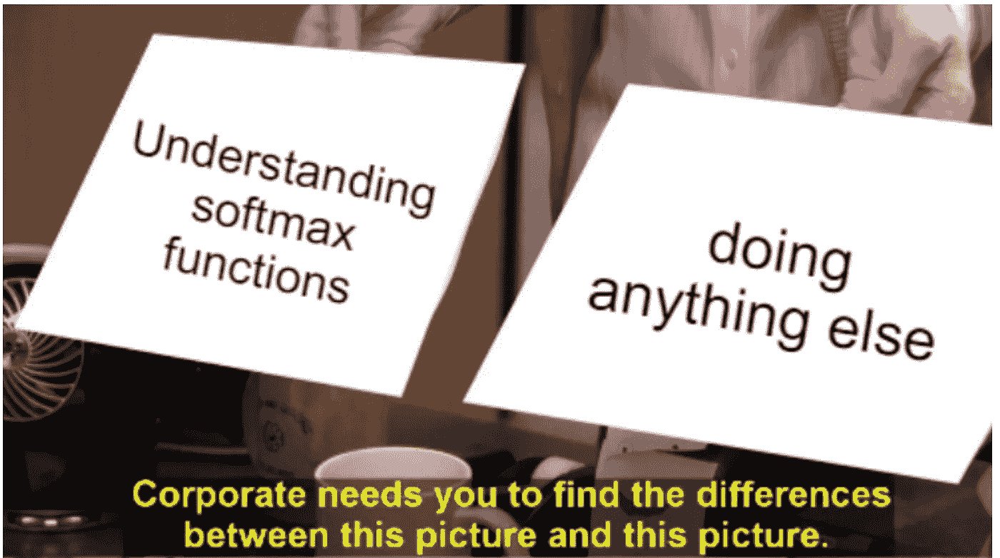
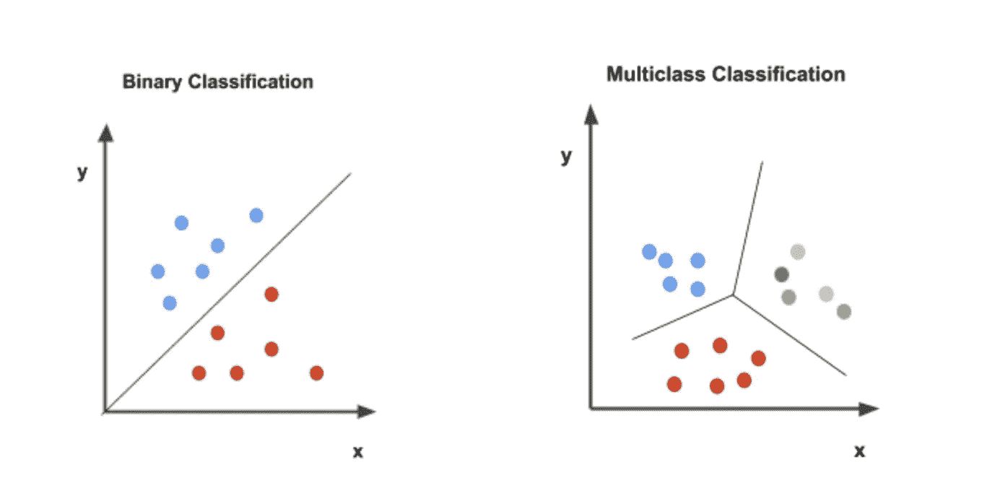
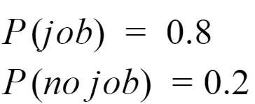
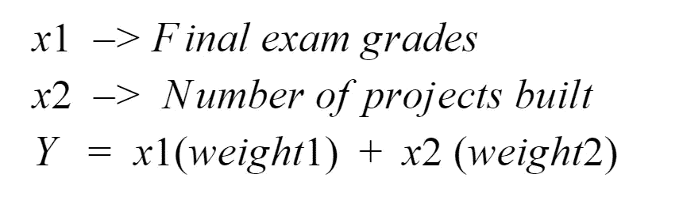
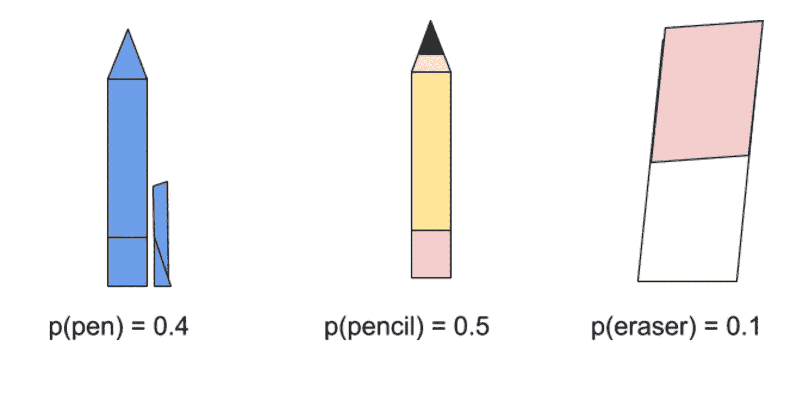
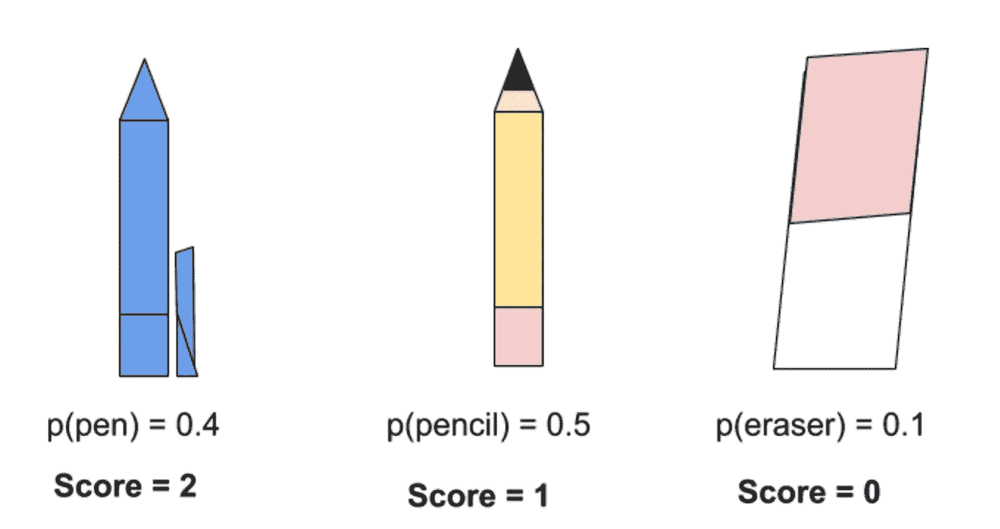
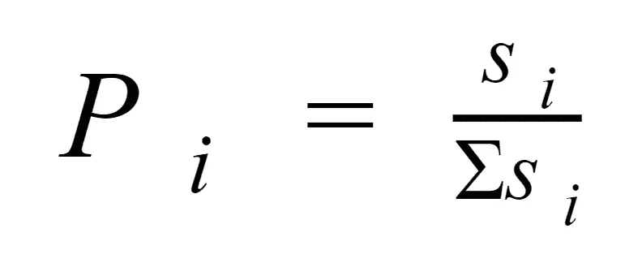
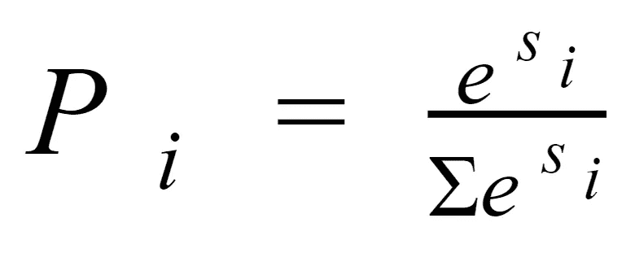

# 什么是 Softmax 函数？—少年解释道

> 原文：<https://towardsdatascience.com/what-is-the-softmax-function-teenager-explains-65495eb64338?source=collection_archive---------23----------------------->

## softmax 函数的简要说明，什么是 softmax 函数，它是如何工作的，以及一些代码。



作者通过 [Imgflip](https://imgflip.com/memegenerator) 生成的图片


图片由作者通过 [Imgflip](https://imgflip.com/memegenerator) 生成

> softmax 函数是一个激活函数，它将真实值转化为概率。

在一个正常的学年，此时此刻，我可能正坐在离家两个小时的咖啡店里，读着我计算机编程课前的讲座。或者，此时此刻，我可能正在上课，试图跟上我的教授对*精确方程*的解释。随着世界各地的学校关闭，像我这样的学生只能靠自己来对抗拖延症。一场可悲的斗争，一场我显然不会赢的斗争。在过去的几周里，尽管我的大学有大量的在线工作，但我已经决定这是学习我所能学习的关于深度学习的一切的最佳时间。像许多其他好奇的人一样，我决定在 Udacity 上参加一个名为[深度学习与 PyTorch](https://www.udacity.com/course/deep-learning-pytorch--ud188) 的课程(自然，本文的灵感来自于这个课程中的概念。)

如果你已经阅读了我上一篇关于[感知器](https://medium.com/@anjalibhardwaj2700/what-is-a-perceptron-basics-of-neural-networks-c4cfea20c590) **，**的文章，你已经知道感知器是一种二进制分类算法，它使用一些线性函数进行预测。但是如果我们想要对两种以上的数据进行分类呢？我们如何做到这一点？我们实际上可以使用一个激活函数，称为 softmax 函数。**在本帖中，我们将讨论什么是 softmax 函数，比较二进制分类和多类分类，讨论 softmax 函数如何工作，并提供一些示例代码。**

# **什么是 Softmax 函数？**

softmax 函数是逻辑函数的推广，可用于对多种数据进行分类。softmax 函数接受不同类别的实际值，并返回概率分布。

标准逻辑函数能够进行二元分类，而 softmax 函数能够进行多类分类。



作者图片

# **让我们看看二元分类和多类分类是如何工作的**

**二元分类模型**

假设我们有一个模型，我们知道你得到或得不到工作的概率是，



作者图片

因此，你得到工作的概率是 p(工作)= 0.8，因此，你得不到工作的概率是 p(没有工作)= 0.2。

该模型将接受一些输入，如你的期末考试成绩是多少？或者你建了多少个项目？基于线性模型，它将返回一个“分数”(作为一个未绑定的值)，分数越高，可能性越大。



作者图片

那么得到工作的概率就简单的是分数的 sigmoid 函数。(如果你想知道更多关于 sigmoid 函数如何工作的信息，请查看视频。).正如我们所知，sigmoid 函数会将分数转换为概率，其中概率介于 0 和 1 之间。

然后将这个概率与我们已知的概率进行比较(所以，p(工作)= 0.8，p(不工作)= 0.2)。

**多类分类**

假设，我们试图建立一个模型，对 3 个不同的项目进行分类。一支铅笔，一支钢笔和一块橡皮。假设得到铅笔的概率是 p(铅笔)= 0.5，得到钢笔的概率是 p(钢笔)= 0.4，得到橡皮擦的概率是 p(橡皮擦)= 0.1。因此概率看起来像，



作者图片

其中概率之和为 1。

现在，让我们对我们的模型执行与二元分类相同的步骤，给定一些输入，计算线性函数，并给每个项目打分。



作者图片

现在我们有了分数，我们怎样才能找到这三项的概率呢？这就是 softmax 函数发挥作用的地方。

# **soft max 功能是如何工作的？**

给定上面的无界分数，让我们试着把这个转换成概率。

## 现在你可能会问，**“为什么我们不能只使用一个 sigmoid 函数？”**

我们需要一个能做两件事的函数，

1.  使结果概率介于 0 和 1 之间。
2.  使所得概率之和等于 1。

Sigmoid 函数并不总是等于 1。换句话说，sigmoid 函数输出独立的分布 p(x1)和 p(x2 ),因此对于 sigmoid 函数，我们可以说 p(作业)= 0.89，p(非作业)= 0.26，这两者之和不等于 1。因此，当我们有独立的二进制标签时，如红色或蓝色，猫或狗等，sigmoid 函数是有用的。正如我们将很快看到的，softmax 函数的分布与输出变量 p(x1，x2，x3)等相关联。

我们将这些分数转换成概率的一种方法是使用这个函数，



作者图片

一个项目的分数，超过所有分数的总和。这是可行的，因为每个概率都在 0 和 1 之间。它还会使每个概率加起来为 1。

这看起来不错，但是你可能已经猜到有一个问题。如果分数是负数呢？这可能是有问题的，因为概率不再等于 1。

怎么才能让每个数字都是正数呢？我们可以试着用一个指数函数，这样函数看起来就像这样，



作者图片

我们做到了！

这就是所谓的 softmax 函数。它可以接受真实值并将其转化为概率。这非常有用，因为现在我们可以对两种以上的数据进行分类。(关于视频解释，我建议你看看这个！)

# **代号**

现在我们来看看如何用 python 编写 softmax 函数的公式。

```
import numpy as npdef softmax(L):
    expL = np.exp(L) #calculating the numerator 
    sumExpL = sum(expL) #calculating the denominator 
    result = []
    for i in expL:
        result.append(i*1.0/sumExpL) #divind the numerator and denominator 
    return result

    # Note: The function np.divide can also be used here, as follows:
    # def softmax(L):
    #     expL = np.exp(L)
    #     return np.divide (expL, expL.sum())
```

*这段代码直接取自 Udacity 课程，* [*深度学习用 Pytorch*](https://classroom.udacity.com/courses/ud188/lessons/b4ca7aaa-b346-43b1-ae7d-20d27b2eab65/concepts/9e1364a8-e8b4-4eac-be12-4d44a139f721) *。*

这个 softmax 函数接受一个值 L，它表示分数。计算函数的分子和分母，然后除以它。

# 关键要点

**什么是 softmax 函数？**

softmax 函数是可以执行多类分类的激活函数。它接受真实值并进行概率分布。这个函数看起来像这样，


作者图片

# Week✨的 DL 视频

看看这深深的假！这看起来像是流行歌手爱莉安娜·格兰德，但这个视频实际上是来自热门的 youtuber 网站 Emma Chamberlain。

# 额外资源/引用

[本文在很大程度上基于 Udacity 教授的 PyTorch 深度学习课程。你一定要去看看！](https://classroom.udacity.com/courses/ud188/lessons/b4ca7aaa-b346-43b1-ae7d-20d27b2eab65/concepts/9e1364a8-e8b4-4eac-be12-4d44a139f721)

这个视频很好地解释了[乙状结肠](https://www.youtube.com/watch?v=Aj7O9qRNJPY)的功能。同样是 Youtuber 上的这个视频很好地解释了 softmax 的功能。

这里是对 softmax 函数及其与逻辑回归的关系的一个很好的概述。

阅读维基百科总是有用的！

吴恩达也很好地解释了 softmax 函数！

关于 sigmoid 函数和 softmax 函数之间差异的详细解释可以在 reddit 表单上阅读。

# **哪里可以找到我**😝

[我的 LinkedIn！](http://www.linkedin.com/in/anjalibhardwaj2700)请随时与我联系，我喜欢谈论人工智能！

[关注我的中页了解更多](https://medium.com/@anjalibhardwaj2700)！