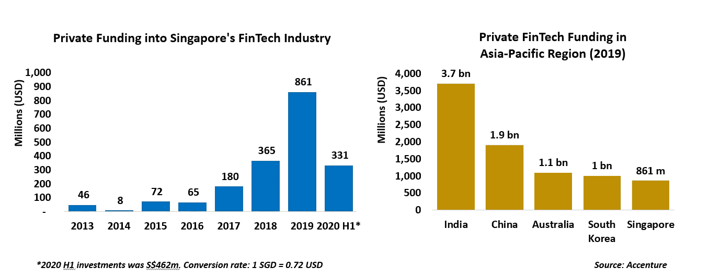
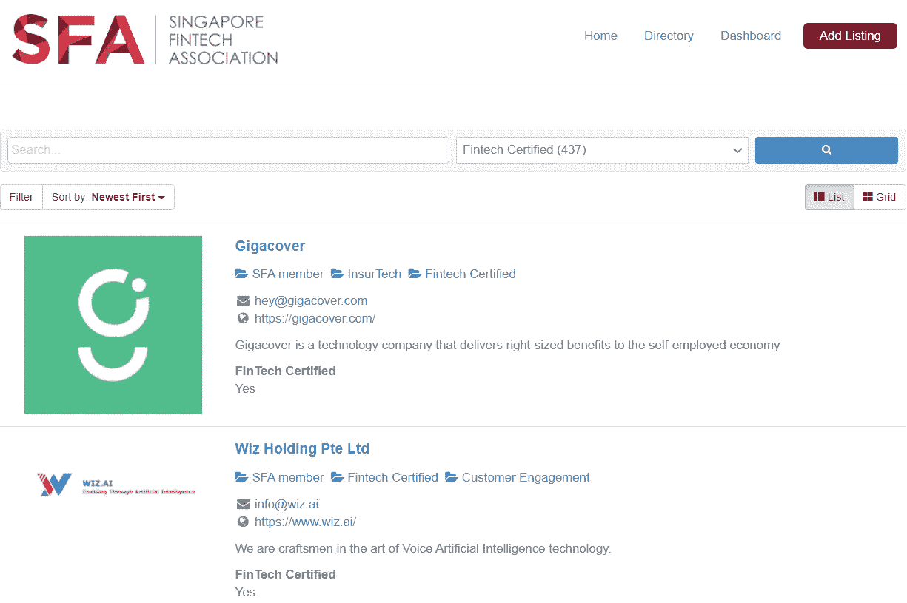
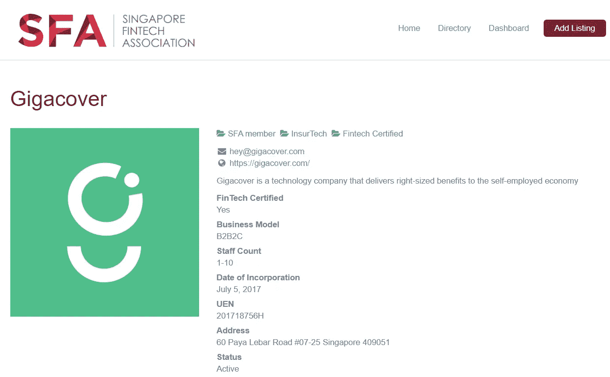
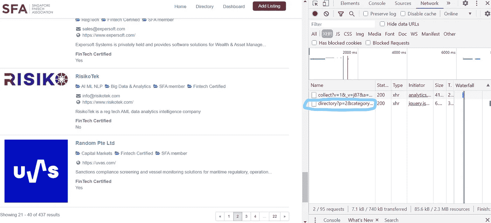
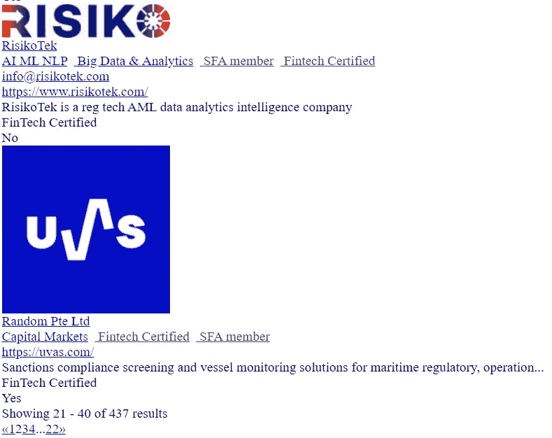
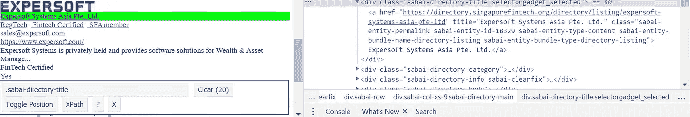
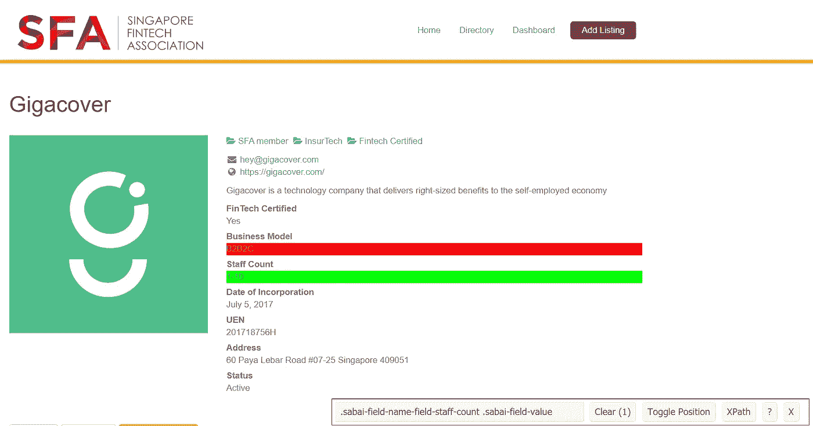
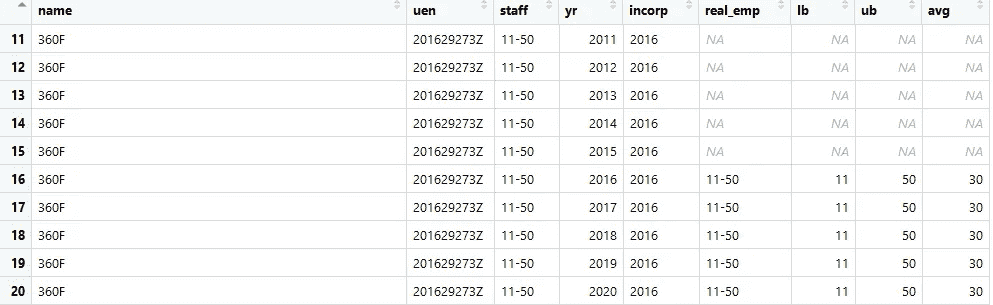
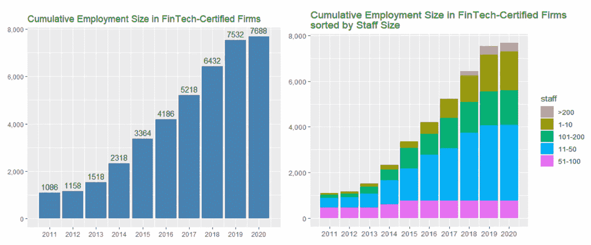
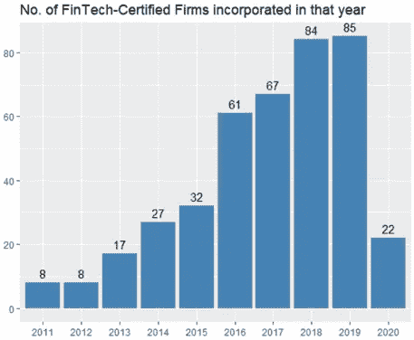

# 新加坡的金融科技行业现状如何？

> 原文：<https://towardsdatascience.com/what-is-the-state-of-the-fintech-industry-in-singapore-45adb2c0d939?source=collection_archive---------54----------------------->

## 基于 R 的网页抓取分析

图片来源:安德烈·弗朗索瓦·麦肯齐，来自 [Unsplash](https://unsplash.com/photos/D5tFUB_42IU)

自 2015 年以来，流入新加坡的金融科技私人资金呈指数级增长。据[埃森哲](https://newsroom.accenture.com/news/fintech-fundraising-grew-strongly-in-most-major-markets-in-2019-accenture-analysis-finds.htm)称，2019 年，新加坡金融科技行业从私人投资者那里获得了创纪录的 8.61 亿美元资金，巩固了其作为亚太地区第五大金融科技市场的声誉。

鉴于私人资金大量流入新加坡的金融科技行业，或许值得研究一下这个新兴行业是否在****就业增长*** 方面取得了收益。哪些类型的金融科技公司已经在新加坡开展业务？他们涉足哪些金融活动？他们是新成立的公司，还是大公司？要回答这些问题，我们首先需要定义什么是金融科技。*

**

*作者图片*

***那么，什么是 FinTechs 呢？** 不幸的是，尽管世界各地的许多统计机构似乎都同意使用公司的“主要业务活动”这一概念，但目前还没有关于金融科技是什么的可靠定义。金融科技公司可以被定义为以提供金融服务为主要业务活动的公司，并以技术为支撑。但是，这也不是一个非常精确的定义。*

*一般来说，许多人认为金融科技是“游戏规则改变者”，寻求彻底改变金融服务的提供方式。这一问题因“TechFins”的出现而变得更加复杂，TechFins 主要是也涉足金融服务领域的科技公司。科技巨头，如阿里巴巴，也有一个银行部门，被认为是 TechFins。那么，你如何从技术股中筛选出技术股呢？*

***数据集**
在等待金融科技的正确工作定义尘埃落定的时候，我发现[新加坡金融科技协会](https://singaporefintech.org/) (SFA)维护着一份目录清单，列出了“*”金融科技认证的*(见下文)*。那么在新加坡成为" [***FinTech 认证***](https://singaporefintech.org/fintech-certification/) "是什么意思呢？你的金融科技公司必须(一)在新加坡注册并运营；(ii)为作为核心业务的金融部门提供技术解决方案，以及(iii)拥有随时可用的工作产品。**

****

**图片作者，来自[新加坡金融科技协会](https://directory.singaporefintech.org/?zoom=15&is_mile=0&directory_radius=0&hide_searchbox=0&hide_nav=0&hide_nav_views=0&hide_pager=0&featured_only=0&feature=1&perpage=20&sort=newest&keywords&category=41)**

**事实证明，通过点击网站上的每个个人列表，我们可以获得相当广泛的信息，如特定的“金融科技认证”公司何时成立，其估计员工人数是多少，其商业模式以及其涉足的金融服务类型。下面的例子说明该公司是一家“ *InsurTech* ”。**

****

**图片作者来自[新加坡金融科技协会](https://directory.singaporefintech.org/directory/listing/gigacover)**

**通过从新加坡金融科技协会的网站上抓取这些列表，我们可以获得这里金融科技公司的全面概述，如它们的商业模式，金融活动类型和就业增长。那么让我们开始吧！**

**事实证明，该网站使用 AJAX 来呈现其页面。使用 AJAX，web 应用程序可以异步地从服务器发送和检索数据，而不会干扰现有页面的显示和行为。虽然这是网站开发者的梦想，但对网站抓取者来说却是噩梦。**

**但是，在检查 Chrome 开发者工具时，我发现了网站调用数据的“秘密”页面。**

****

**作者图片，来自[新加坡金融科技协会](https://directory.singaporefintech.org/?p=2&category=41&zoom=15&is_mile=0&directory_radius=0&view=list&hide_searchbox=0&hide_nav=0&hide_nav_views=0&hide_pager=0&featured_only=0&feature=1&perpage=20&sort=newest)**

**如果我们点击嵌入在 Chrome 开发者工具中的 URL，我们会看到这样一个页面:**

********

**图片作者，来自[新加坡金融科技协会](https://directory.singaporefintech.org/sabai/directory?p=2&category=41&zoom=15&is_mile=0&directory_radius=0&view=list&hide_searchbox=0&hide_nav=0&hide_nav_views=0&hide_pager=0&featured_only=0&feature=1&perpage=20&sort=newest&__ajax=%23sabai-embed-wordpress-shortcode-1%20.sabai-directory-listings-container&_=1604288018542)**

**现在，如果我们仔细观察嵌入在 Chrome 开发者工具中的 URL，你可能会注意到“p=2”。这控制了页码。你可能会注意到上图中总共有 22 页和 437 个结果(即金融科技认证公司)。我们可以通过创建一个从“p=1”到“p=22”的 URL 列表来开始我们的 web 抓取过程。**

**现在，从这份包含 22 个网址的列表中，我们希望获得每家金融科技公司的名称及其具体网址。回想一下，我们有 437 家 FinTech 认证的公司，所以我们应该得到一个有 437 行的数据框架。为了获得您在下面的代码中看到的“ *html_nodes( )* 中的参数，我使用了一个名为[*SelectorGadget*](https://chrome.google.com/webstore/detail/selectorgadget/mhjhnkcfbdhnjickkkdbjoemdmbfginb?hl=en)*的便捷工具，可以从 Chrome 上免费下载。***

******

***图片由作者提供，来自[新加坡金融科技协会](https://directory.singaporefintech.org/sabai/directory?p=2&category=41&zoom=15&is_mile=0&directory_radius=0&view=list&hide_searchbox=0&hide_nav=0&hide_nav_views=0&hide_pager=0&featured_only=0&feature=1&perpage=20&sort=newest&__ajax=%23sabai-embed-wordpress-shortcode-1%20.sabai-directory-listings-container&_=1604288018542)***

***现在我们已经有了 437 家金融科技认证公司的具体网址，我们可以有效地获取员工规模、商业模式等信息。类似地，这里使用了 *SelectorGadget* 来提取我们需要的各个字段。***

****

**图片作者，来自[新加坡金融科技协会](https://directory.singaporefintech.org/directory/listing/gigacover)**

**现在我们手头上有了所有 437 家金融科技认证公司的数据，我们可以开始做一些分析了。**

****就业增长**
我们的数据集目前是“wide”格式。我们可以将其转换为“长”格式，并可视化就业人数如何随着时间的推移而演变。不过，需要注意的是，所有 437 家金融科技认证公司报告的员工人数都是一个范围，比如“11-50”，而不是实际人数。此外，由于我们没有关于一家公司的员工人数如何随时间变化的纵向数据，我们将假设一家公司的员工人数从其成立到今天保持不变。**

**出于这一分析的目的，我们想研究 2011 年至 2020 年间就业如何演变。我们可以通过查看公司 UEN 的前 4 位数字来判断公司是哪一年成立的。假设一家公司在 2016 年成立，那么它在 2016 年之前的雇佣规模将被分配 NA 值，如下所示。**

****

**现在我们可以使用 **dplyr 的** *group_by( )* 和*summary()*命令为可视化准备数据。**

****

**作者图片**

**嗯，在我们的数据集中，437 家金融科技认证公司的就业人数似乎一直在稳步增长。事实上，就业增长与流入新加坡的金融科技私人资金正相关，后者自 2015 年以来有所增加。然而，由于新冠肺炎经济衰退，2020 年的增长率似乎有所放缓。**

**如果我们按照每个企业的员工规模来看就业增长，我们会注意到，一般来说，这是由微型企业和初创企业(即雇用不到 50 名工人的企业)的增长所支撑的。或许是一个令人鼓舞的迹象，在最近几年(2018 年至 2019 年)，新加坡已经能够吸引更大的金融科技公司，尽管只有少数几家，它们雇用了 200 多名工人*(红条)*。**

****公司成立**
这里，我们要统计某一年成立的 FinTech 认证公司的数量。同样，我们着眼于 2011 年至 2020 年期间。**

****

**作者图片**

**自 2013 年以来，在新加坡注册的金融科技认证公司的数量一直呈上升趋势。随着 2019 年创纪录的 8.61 亿美元金融科技私人资金涌入新加坡，这一年公司数量的快速增长也就不足为奇了。尽管我们距离 2020 年底还有大约两个月的时间，但新冠肺炎经济衰退对金融科技行业的负面影响是非常明显的。**

****商业模式与金融服务类型**
商业模式这里指的是某个特定的事务所是“B2B”、“B2C”还是“B2B2C”。至于金融服务的类型，可以有很多，从支付、贷款、经纪、汇款等等。我们可以从一些清理后的数据中获得这些关于金融科技认证公司性质的见解。**

**在我们数据集中的 437 家金融科技认证公司中，约 79%的公司至少服务于 B2B 领域。至于金融科技公司提供的金融服务类型，如"**人工智能和机器学习**"、"**支付**、"**平台**、"**区块链**、**借贷**等活动最受欢迎。**

**这一发现得到了埃森哲**(2019)的有力支持，该公司称:****

****“投资于 ***支付的初创企业*** 和投资于*的初创企业拿走了 fintech 募资的大头，分别占总数的*34%***20%***，而 ***投保 techs*** 在*中抽成*******

*****新加坡的金融科技产业确实在增长，未来看起来确实令人兴奋。除了 2020 年，在私人金融科技融资和宽松监管的帮助下，公司成立和就业增长在过去 5 年中明显呈上升趋势。我预计，新冠肺炎经济衰退对金融科技初创企业的打击将尤其严重，相当多的初创企业甚至可能不得不倒闭。但是每一次危机都是一次机会，幸存者可能会变得更加强大。*****

********非常感谢您的阅读！********