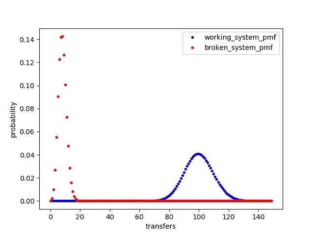
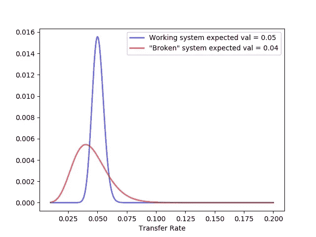

# 这个指标的方差是多少？

> 原文：<https://towardsdatascience.com/what-is-the-variance-in-that-metric-80ecde7313a3?source=collection_archive---------48----------------------->

## 了解业务指标概率分布的效用以及如何在 Python 中计算它们


Sergign 从[photodune.net](https://photodune.net/item/pencil-and-graph/24956886)拍摄的照片

分析师通常会观察一段时间内的趋势，以了解指标中的噪声水平，但通常衡量中的噪声不会在用于决策的数据中表现出来。重复出现并向上传递的语句类似于“我们同比下降 20%”下降 20%可能真的很糟糕，或者如果指标有噪声，这可能只是发生的事情。当然，经验会告诉人们这是否是一个在下降 20%时确实超出正常范围的指标，但经验并不总是不偏不倚和听到的。大多数商业指标都是比例的形式。在本文中，我将探索我们如何评估标准业务度量的可信度。

# 情况

一名团队成员说“我们的转换率是 4%。这比我们通常看到的 5%有所下降。那就是转移率下降了 20%！一定是什么东西坏了！我们都需要停止正在做的事情，进行调查。”

你说“在我们从重要项目中抽调大量人员进行调查之前，让我们仔细看看这些数字。东西坏了之后你转了几次？东西坏了之后有多少次尝试？在“工作”系统崩溃之前，它进行了多少次转移？之前尝试了多少次？”您的同事在他们的电子表格中找到了以下数字。

```
old_transfers = 100
old_attempts = 2000
new_transfers = 8
new_attempts = 200transfer_rate_old = old_transfers/old_attemptstransfer_rate_new = new_transfers/new_attemptspercent_improvement = (transfer_rate_new-transfer_rate_old)/transfer_rate_old*100
```

因为像这样的许多业务度量是比例，所以它们可以被建模为二项式分布。这太棒了。我喜欢二项式分布，因为感觉上我可以免费得到方差。我只需要知道试验的次数，然后就是:方差神奇地显示为 n*p*(1-p)。但是等等，n 和 p 是什么？n 是试验的次数或度量中的分母，参数 p 可以作为业务度量来估计。在我们的例子中，旧的工作系统是 0.05，坏的系统是 0.04。

我们可以绘制破损系统的转移率和工作系统的转移率的概率质量函数，假设它们遵循二项式分布。在这篇文章中，我不打算深究这些假设。目的是演示一种简单的方法来估计业务指标中的噪声，以便做出更明智的决策；如果您打算使用这种方法，我鼓励您深入研究这些主题，以确保您的数据符合使用这种简单方法所需的所有假设。我发现 Bootstrapping([https://en . Wikipedia . org/wiki/Bootstrapping _(statistics)](https://en.wikipedia.org/wiki/Bootstrapping_(statistics)))是一种很好的方式来更好地了解你的数据如何符合模型(可能是我的下一篇文章)。

```
import numpy as np
import matplotlib.pyplot as plt
import scipy.stats as statsplot_max_x = 150
x_values = range(plot_max_x)
working_system_pmf = stats.binom.pmf(x_values, old_attempts, old_transfers/old_attempts)
plt.plot(x_values,working_system_pmf, 'b.', label = 'working_system_pmf')
broken_system_pmf = stats.binom.pmf(x_values, new_attempts, new_transfers/new_attempts)
plt.plot(x_values,broken_system_pmf, 'r.', label = 'broken_system_pmf')
plt.ylabel('probability')
plt.xlabel('transfers')
plt.legend()
```



那么，我在这个图中看到了什么？嗯，每个客户要么转账，要么不转账，所以任何 n 次尝试的可能性都是有限的。如果我们只有三个客户，所有可能的转移值将是 0、1、2 或 3。图上的 x 值是转移的次数，y 值是破损系统和工作系统的概率。这个概念可能会令人困惑。我们不知道转账吗？我们确实知道所测量的转移。故障系统为 8，工作系统为 100。但是，这并没有完全描述我们想知道的东西。我们真正感兴趣的是破碎系统的未来传输速率，这就是这个图所表示的。我发现把我们的度量看作是对系统真实价值的一次尝试是有帮助的。我们测量了损坏系统的 8 次传输，但是我们知道每个测量都包含噪声。也许每 200 次尝试就有 10 次传输才是坏系统的真实传输速率？该图显示了在给定我们已有信息的情况下，尚未执行的测量的可能结果。随着我们收集更多的数据，我们对系统的真实速率有了更好的估计。但是我们不能等。系统可能被破坏了。我们需要正确解读现有的数据。

显然，工作系统将有更多的转移，因为我们有这么多的客户使用这个系统。在该图中，工作系统的曲线看起来更粗，这通常与更多的噪声有关。但这是骗人的。工作系统的曲线中所示的最高转移为大约 125，相对于在大约 17 处具有曲线的最高部分而测量的转移数仅为 8 的损坏系统，这比测量的转移数 100 大不了多少。所以，在工作系统中，相对方差更小，因为我们做了更多的测量。

但是我仍然不知道如何处理这些信息。我们似乎没有更接近于比较这些比率。也许我们推进调查，忘记分析？由于贝叶斯方程和共轭先验的魔力，我们实际上比你想象的更接近理解我们对系统崩溃的信心。

## 后验∝先验⨉似然

为了简单起见，我们将使用均匀分布作为非信息先验信念。不要让这种说法把你搞糊涂了。这只是意味着，在我们开始为两个系统中的任何一个收集数据之前，我们将避免谈论我们认为的传输率是多少。将均匀分布用于我们的先验信念会导致后验分布，即我们感兴趣的传输速率，它只是一个带有`alpha = 1+ transfers`和`beta = 1 + (attempts — transfers)`的贝塔分布。α和β是进行β分布所需的两个参数。这些就像是正态分布所需的均值和标准差参数。

二项式分布用于描述一系列 n 个独立实验的成功次数。我们将用来描述转移率的贝塔分布，被用来描述连续变量的行为，如定义在 0 和 1 之间的区间上的比例。

Bayes 方程允许我们获得使用每个系统收集的数据的概率分布(图 1 ),并将其转换为指标(传输速率)的概率估计值。同样，这是一个你应该深入了解的领域，以理解我所做的假设。简而言之，我假设在收集两个系统的数据之前我对传输速率一无所知，并且我利用了每个系统所有可能的传输速率的总概率为 1 的事实。

```
x = np.linspace(0.01, 0.2, 1000)
working_system_transfer_rate_pdf = stats.beta.pdf(x, old_transfers+1, (old_attempts-old_transfers)+1)/np.sum(stats.beta.pdf(x, old_transfers+1, (old_attempts-old_transfers)+1))
broken_system_transfer_rate_pdf = stats.beta.pdf(x, new_transfers+1, (new_attempts-new_transfers)+1)/np.sum(stats.beta.pdf(x, new_transfers+1, (new_attempts-new_transfers)+1))
# notice that I normalize the transfer rate by dividing each value by the total 
plt.plot(x, working_system_transfer_rate_pdf, 'b-', lw=2, alpha=0.6, label='Working system expected val = ' + str(np.round(old_transfers/old_attempts, 3)) )
plt.plot(x, broken_system_transfer_rate_pdf, 'r-', lw=2, alpha=0.6, label='"Broken" system expected val = ' + str(np.round(new_transfers/new_attempts, 3)) )
plt.legend()
plt.xlabel('Transfer Rate')
```



那么我们在看什么？我们知道每个系统都有一个传输速率。我们进行的测量越多，对传输速率的估计就越准确。我们测得故障系统的传输速率为 0.04，但如果我们再测量该系统几天，我们知道我们对实际传输速率的估计会有一些变化，因为任何测量中都有噪声。该图显示了在给定我们当前拥有的数据的情况下，每个系统的传输速率的概率分布的估计值。该图向我们显示，尽管损坏系统的传输速率的期望值是 0.04，但是损坏系统具有 0.05 或更高的传输速率的可能性很大。根据这张图表，我可能会推迟启动大规模调查，但我们必须将这些信息与更低传输速率的成本信息结合起来。

## 结论

如上图所示的图表可以帮助我们做出更明智的商业决策。通过对概率分布和 Bayes 方程以及几行代码的了解，我们可以绘制概率分布图来比较业务指标。文章的代码可以在这里找到[https://github.com/bprazen/business_metric_analysis](https://github.com/bprazen/business_metric_analysis)。