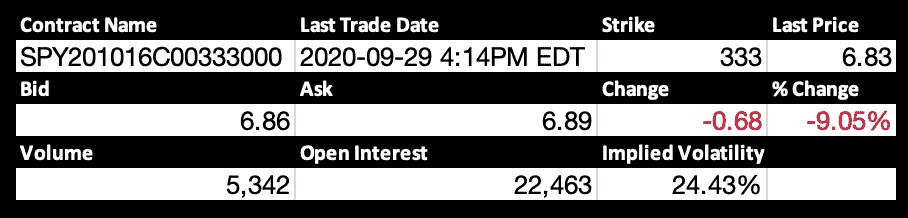

# 什么是波动风险溢价？

> 原文：<https://towardsdatascience.com/what-is-the-volatility-risk-premium-634dba2160ad?source=collection_archive---------17----------------------->

## 投资组合中的可视化和实现


照片由[像素](https://www.pexels.com/photo/ace-bet-business-card-262333/?utm_content=attributionCopyText&utm_medium=referral&utm_source=pexels)的[皮克斯拜](https://www.pexels.com/@pixabay?utm_content=attributionCopyText&utm_medium=referral&utm_source=pexels)拍摄

# 波动风险溢价的概念

在 [Black-Scholes 模型](https://medium.com/swlh/deriving-the-black-scholes-model-5e518c65d0bc)的衍生之后，讨论开放到它在普通期权定价中的位置。市场根据供求规律决定特定履约和到期的利率和期权价格。唯一不容易作为布莱克-斯科尔斯方程输入的参数是波动率。由于除波动率之外的每个参数都是可用的，并且由市场决定，布莱克-斯科尔斯方程的逆方程允许我们找到市场参与者预期的波动率:[隐含波动率](https://medium.com/swlh/what-is-implied-volatility-35a94b9afbef)。从经验上看，隐含波动率的有趣之处在于，它倾向于高估已实现波动率，这主要是由于市场参与者及其已实现对手的预期。

## 蒙特卡洛定价图解

想想下面这段欧洲人打电话给间谍的话。



使用一个通用的蒙特卡罗定价模拟让我们能够说明这一现象。我们假设基础资产遵循扩散过程(几何布朗运动)。考虑以下 Python 代码来计算欧式看涨期权产生的预期现金流净现值。换句话说，期权的*公允价格*。

蒙特卡洛模拟给出的最终买入价格为:

```
Monte Carlo Euro Call price:  5.09259969279995
```

现在，考虑以下使用市场隐含波动率的蒙特卡洛模拟价格。

```
Monte Carlo Euro Call price:  6.450104207093876
```

在一个完美的世界中，使用隐含波动率的期权价值将收敛于期权的 Black-Scholes 或市场价值。真正的问题是，为什么期权的公允价格和市场价格之间存在差异？看波动率，可以问另一个问题:为什么市场隐含的波动率往往高于已实现的波动率？

## 市场参与者的行为研究

在耶鲁大学的一项研究中，市场参与者倾向于高估重大崩盘的概率，导致对期权的需求增加。这种对风险的高度感知可能会导致人们更愿意购买这些期权来对冲投资组合。换句话说，投资者愿意为防范重大市场崩溃的期权支付溢价，即使从统计数据来看，这些崩溃的概率较小，甚至可以忽略不计。

## 波动风险溢价组合构建

波动风险溢价存在的概念意味着从利润和多样化中获取和受益的能力。提取 VRP 的最纯粹的方法在于 S&P500 的卖空期权头寸。从长期来看，这种策略产生正回报，同时也保持了多样化的好处，因为它与股票的相关性极低。

# 摘要

波动率风险溢价是指隐含波动率往往高于实际波动率，因为市场参与者往往高估了市场大幅崩盘的可能性。这种高估可能解释了作为股票投资组合保护的期权需求的增加。因此，这将提高这些期权的价格，并解释隐含波动率高于实际波动率的趋势。波动风险溢价的存在可以被利用为一种有利可图的策略，同时有助于分散风险，因为 S&P500 的空头期权头寸往往保持较低的贝塔系数。

# 参考

Marroni，l .，& Perdomo，I. (2014 年)。金融衍生品的定价和对冲:从业者指南。怀利。

纳滕贝格，S. (2015 年)。*期权波动和定价:高级交易策略和技术*。纽约:麦格劳-希尔教育公司。

Sullivan，r .，Israelov，r .，Ang，I .，& Tummala，h .理解波动风险溢价。2020 年 9 月 29 日检索，来自[https://www . aqr . com/Insights/Research/White-Papers/Understanding-the-Volatility-Risk-Premium](https://www.aqr.com/Insights/Research/White-Papers/Understanding-the-Volatility-Risk-Premium)