# 什么是时间序列分解，它是如何工作的？

> 原文：<https://towardsdatascience.com/what-is-time-series-decomposition-and-how-does-it-work-9b67e007ae90?source=collection_archive---------8----------------------->


照片由 [nutraveller](https://pixabay.com/users/nutraveller-5661007/) 通过 [Pixabay](https://pixabay.com/) ( [Pixabay 许可](https://pixabay.com/service/license/))

## 此外，我们还将深入了解使用 Python 的强大时间序列分解算法

时间序列可被视为由 4 个部分组成:

季节性成分
趋势成分
周期性成分
噪声成分。

## 季节性成分

季节性因素解释了人们在许多数据集中看到的周期性起伏，如下图所示。

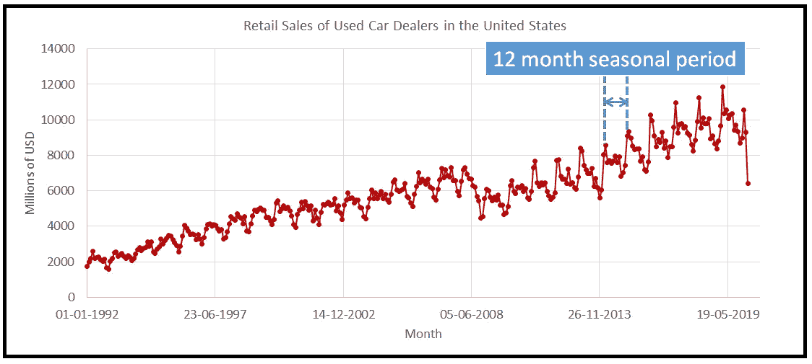

零售二手车销售。数据来源:[美国弗雷德](https://fred.stlouisfed.org/series/MRTSSM44112USN)(图片由[作者](https://sachin-date.medium.com/))

在上面的例子中，季节周期大约为 12 个月，在 3 月达到高峰，在 11 月或 12 月触底，然后在 3 月再次达到高峰。

时间序列可以包含多个叠加的季节周期。一个经典的例子是气象站每小时温度的时间序列。由于地球绕地轴旋转，气象站的每小时温度图将显示 24 小时的季节周期。地球也以倾斜的方式围绕太阳旋转，导致了季节性的温度变化。如果你连续 365 天跟踪气象站上午 11 点的温度，你会看到第二种模式出现，其周期为 12 个月。24 小时长的日形态叠加在 12 个月长的年形态上。

在每小时天气数据的情况下，人们知道是什么潜在的物理现象导致了这两种季节模式。但在大多数情况下，不可能知道将季节性引入数据的所有因素是什么。因此，很难发现隐藏在时间序列中的所有季节周期。

也就是说，常见的季节周期是一天、一周、一月、一季(或一季)和一年。

季节性也可以在更长的时间尺度上观察到，例如太阳周期，它遵循大约 11 年的周期。

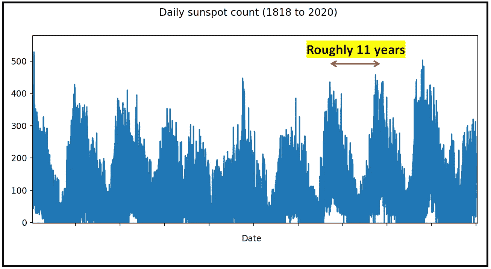

每日太阳黑子计数。数据来源: [SILSO](http://www.sidc.be/silso/datafiles) (图片由[作者](https://sachin-date.medium.com/)提供)

## 趋势组件

趋势部分指的是跨季节期间的数据模式。

下图所示的零售电子商务销售时间序列展示了一个可能的二次趋势( *y = x* )，该趋势跨越了长达 12 个月的季节周期:

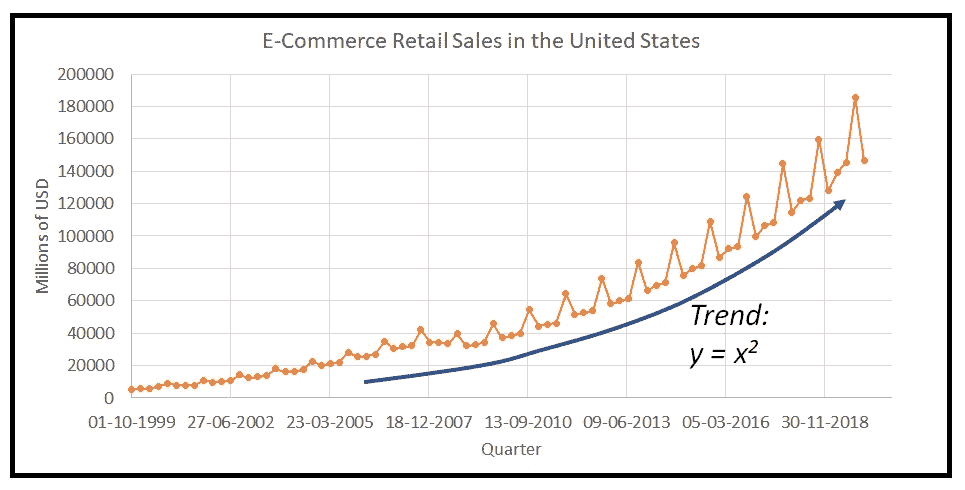

零售电子商务销售。数据来源:[美国弗雷德](https://fred.stlouisfed.org/series/ECOMNSA)(图片由[作者](https://sachin-date.medium.com/)提供)

## 周期性成分

周期性成分代表跨季节发生的现象。周期性模式不像季节性模式那样有固定的周期。周期性模式的一个例子是股票市场经历的对世界事件的繁荣和萧条的循环。

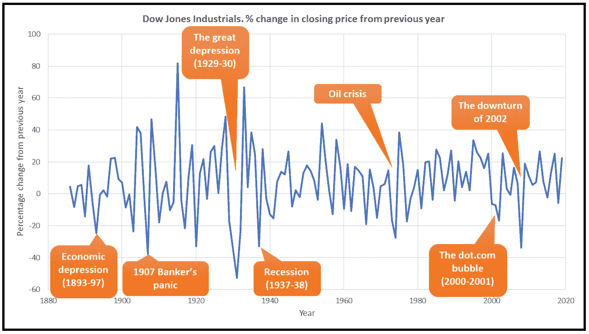

道琼斯收盘价比上一年(1880 年至 2020 年)的百分比变化。数据来源:【MeasuringWorth.com】T4via[维基百科](https://en.wikipedia.org/wiki/Dow_Jones_Industrial_Average))(图片由[作者](https://sachin-date.medium.com/))

周期性成分很难被分离出来，它常常被与趋势成分结合在一起而被“搁置”。

## 噪声成分

当你从时间序列中分离出季节性和趋势时，噪声或随机成分会留下来。噪音是你不知道或无法测量的因素的影响。这是已知的未知的影响，或未知的未知。

## 加法和乘法效应

趋势、季节性和噪声成分可以以**加法**或**乘法**的方式组合。

**相加组合**
如果季节和噪声分量改变趋势的量与趋势值无关，则趋势、季节和噪声分量被认为以**相加**的方式表现。这种情况可以表示如下:

*y_i = t_i + s_i + n_i*

其中 *y_i* =时间序列在第*个*时间步的值。
*t_i* =第*与*时间步的趋势分量。
*s_i* =第*与*时间步的季节分量。
*n_i* =第*个*时间步的噪声分量。

**乘法组合** 如果季节和噪声分量改变趋势的量取决于趋势的值，则这三个分量以乘法方式表现如下:

*y_i = t_i * s_i * n_i*

## 使用 Python 将时间序列分解为趋势、季节和噪声分量的分步过程

有许多可用的分解方法，从简单的基于移动平均的方法到强大的方法，如 STL。

在 Python 中， *statsmodels* 库有一个 *seasonal_decompose()* 方法，可以让你在一行代码中将时间序列分解成趋势、季节性和噪声。

在我的文章中，我们喜欢进入杂草中。所以在我们使用 *seasonal_decompose()* 之前，让我们深入了解一个简单而强大的时间序列分解技术。

让我们了解分解在幕后是如何工作的。

我们将手动将时间序列分解为趋势、季节和噪声成分，使用基于移动平均值的简单程序，步骤如下:

步骤 1:确定季节周期的长度
步骤 2:隔离趋势
步骤 3:隔离季节性+噪声
步骤 4:隔离季节性
步骤 5:隔离噪声

我们将以美国用户汽车经销商的零售销售时间序列为例:


零售二手车销售。数据来源:[美国弗雷德](https://fred.stlouisfed.org/series/MRTSSM44112USN)(图片由[作者](https://sachin-date.medium.com/))

让我们将数据加载到熊猫数据框架中，并绘制时间序列:

```
**import** pandas **as** pd
import numpy as np
import math
from matplotlib import pyplot as pltmydateparser = **lambda** x: pd.**datetime**.**strptime**(x, '%d-%m-%y')df = pd.**read_csv**('retail_sales_used_car_dealers_us_1992_2020.csv', **header**=0, **index_col**=0, **parse_dates**=['DATE'], **date_parser**=mydateparser)fig = plt.figure()fig.suptitle(**'Retail sales of used car dealers in the US in millions of dollars'**)df[**'Retail_Sales'**].plot()plt.show()
```

**现在让我们开始逐步分解这个时间序列。**

**第一步:**尝试猜测数据中季节性成分的持续时间。在上面的例子中，我们猜测是 12 个月。

**第二步:**现在运行一个以 12 个月[](https://www.itl.nist.gov/div898/handbook/pmc/section4/pmc422.htm)****移动平均线为中心的数据。这一移动平均值分布在总共 13 个月的时间里。即在中心月份的左侧和右侧各有 6 个月。以 12 个月为中心的移动平均线是两个移动平均线的平均值，两个移动平均线相差 1 个月，实际上是一个加权移动平均线。****

****下面举例说明了如何在 Microsoft Excel 中计算这种居中的 MA:****

****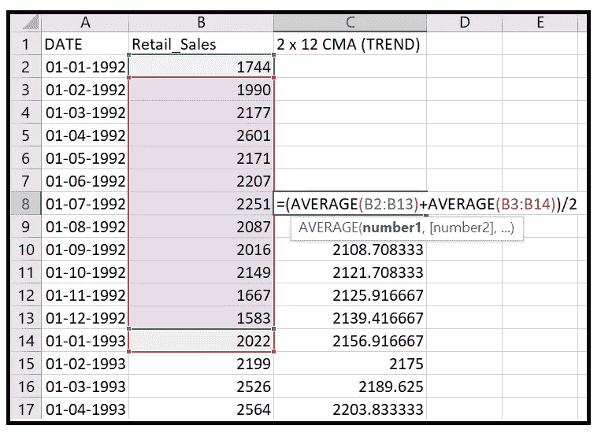****

****2 x 12 居中移动平均线的图示(图片由[作者](https://sachin-date.medium.com/)提供)****

****这种 MA 将消除季节性和噪音，并显示趋势。****

****继续我们的 Python 示例，下面是我们如何在 Python 中计算居中移动平均值:****

```
****#Add an empty column to store the 2x12 centered MA values**
df[**'2 x 12 CMA (TREND)'**] = np.nan**#Fill it up with the 2x12 centered MA values
for** i **in** range(6,df[**'Retail_Sales'**].size-6):
    df[**'2 x 12 CMA (TREND)'**][i] = np.round(
        df[**'Retail_Sales'**][i - 6] * 1.0 / 24 + 
        (
            df[**'Retail_Sales'**][i - 5] + 
            df[**'Retail_Sales'**][i - 4] + 
            df[**'Retail_Sales'**][i - 3] + 
            df[**'Retail_Sales'**][i - 2] + 
            df[**'Retail_Sales'**][i - 1] + 
            df[**'Retail_Sales'**][i] + 
            df[**'Retail_Sales'**][i + 1] + 
            df[**'Retail_Sales'**]i + 2] + 
            df[**'Retail_Sales'**][i + 3] + 
            df[**'Retail_Sales'**][i + 4] + 
            df[**'Retail_Sales'**][i + 5]
        ) * 1.0 / 12 + 
        df[**'Retail_Sales'**][i + 6] * 1.0 / 24**
```

****请注意，索引*【I-6】*和*【I+6】*处的值是如何通过 *1.0/24* 进行加权的，而其余值是如何通过 *1.0/12 进行加权的。*****

****让我们绘制包含在列**‘2 x 12 CMA(趋势)’:**中的结果时间序列****

```
*****#plot the trend component***fig = plt.figure()fig.suptitle(**'TREND component of Retail sales of used car dealers in the US in millions of dollars'**)df[**'2 x 12 CMA (TREND)'**].plot()plt.show()**
```

****如您所见，我们的移动平均转换突出了零售时间序列的趋势部分:****

****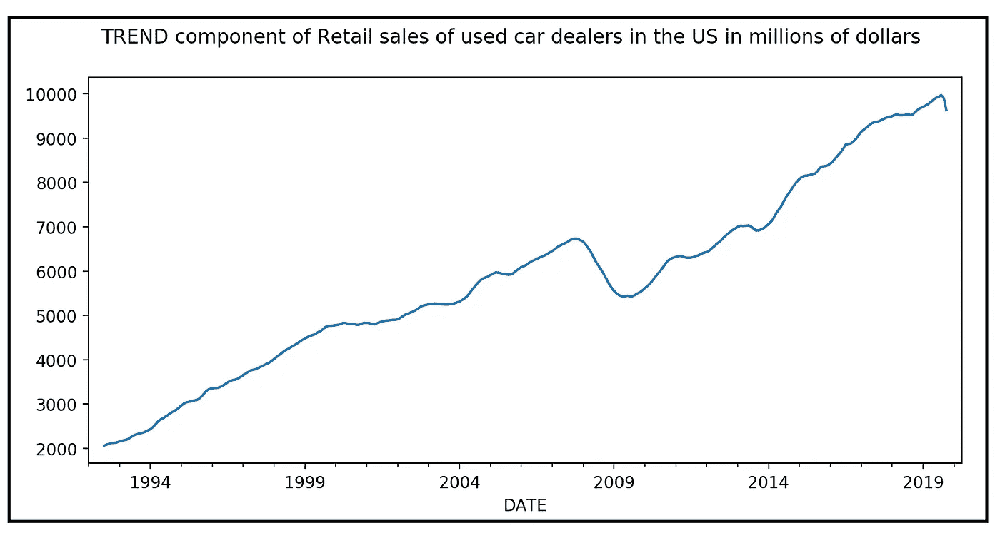****

****(图片由[作者](https://sachin-date.medium.com/)提供)****

******第三步:**现在我们要做一个决定。根据组成是**乘法还是加法**，我们将需要**从原始时间序列中除以或减去**趋势分量，以检索季节和噪声分量。如果我们检查原始的汽车销售时间序列，我们可以看到**季节性波动与时间序列**的当前值成比例增加。因此，我们将假设季节性是倍增的。我们还将大胆假设噪声是乘法噪声。****

****因此，假定零售二手车销售时间序列具有以下乘法分解模型:****

*****时间序列值=趋势分量*季节分量*噪声分量*****

****因此:****

*****季节性成分*噪声成分=时间序列值/趋势成分*****

****我们将在数据框中添加一个新列，并使用上面的公式填充季节和噪声分量的乘积。****

```
**df['SEASONALITY AND NOISE'] = df['Retail_Sales']/df['2 x 12 CMA (TREND)']**
```

****让我们绘制新的列。这一次，我们将看到季节性和噪音通过:****

```
**fig = plt.figure()fig.suptitle(**'SEASONALITY and NOISE components'**)plt.ylim(0, 1.3)df[**'SEASONALITY AND NOISE'**].plot()plt.show()**
```

****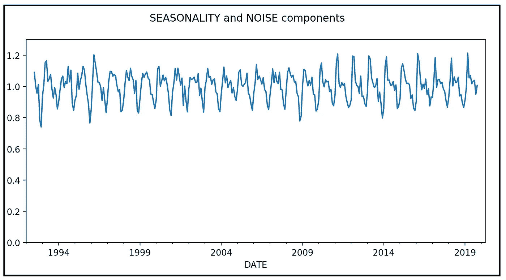****

****(图片由[作者](https://sachin-date.medium.com/)提供)****

******步骤 4:** 接下来，我们将通过计算所有一月、二月、三月等月份的季节性成分的平均值，从季节性和噪声的混合中获得“纯”季节性成分。****

```
*****#first add a month column***df[**'MONTH'**] = df.index.strftime(**'%m'**).astype(np.int)***#initialize the month based dictionaries to store the running total of the month wise  seasonal sums and counts*** average_seasonal_values = {1:0, 2:0, 3:0, 4:0, 5:0, 6:0, 7:0, 8:0, 9:0, 10:0, 11:0, 12:0}average_seasonal_value_counts = {1:0, 2:0, 3:0, 4:0, 5:0, 6:0, 7:0, 8:0, 9:0, 10:0, 11:0, 12:0}***#calculate the sums and counts* for** i **in** range(0, df[**'SEASONALITY AND NOISE'**].size):
    **if** math.isnan(df[**'SEASONALITY AND NOISE'**][i]) **is False**:
        average_seasonal_values[df[**'MONTH'**][i]] =  
            average_seasonal_values[df[**'MONTH'**][i]] +
            df[**'SEASONALITY AND NOISE'**][i] average_seasonal_value_counts[df[**'MONTH'**][i]] =
            average_seasonal_value_counts[df[**'MONTH'**][i]] + 1***#calculate the average seasonal component for each month* for** i **in** range(1, 13):
    average_seasonal_values[i] = average_seasonal_values[i] / average_seasonal_value_counts[i]***#create a new column in the data frame and fill it with the value of the average seasonal component for the corresponding month***df[**'SEASONALITY'**] = np.nan**for** i **in** range(0, df[**'SEASONALITY AND NOISE'**].size):
    **if** math.isnan(df[**'SEASONALITY AND NOISE'**][i]) **is False**:
        df[**'SEASONALITY'**][i] = 
            average_seasonal_values[df[**'MONTH'**][i]]**
```

****让我们画出这个纯季节成分:****

```
*****#plot the seasonal component*** fig = plt.figure()fig.suptitle(**'The \'pure\' SEASONAL component'**)plt.ylim(0, 1.3)df[**'SEASONALITY'**].plot()plt.show()**
```

****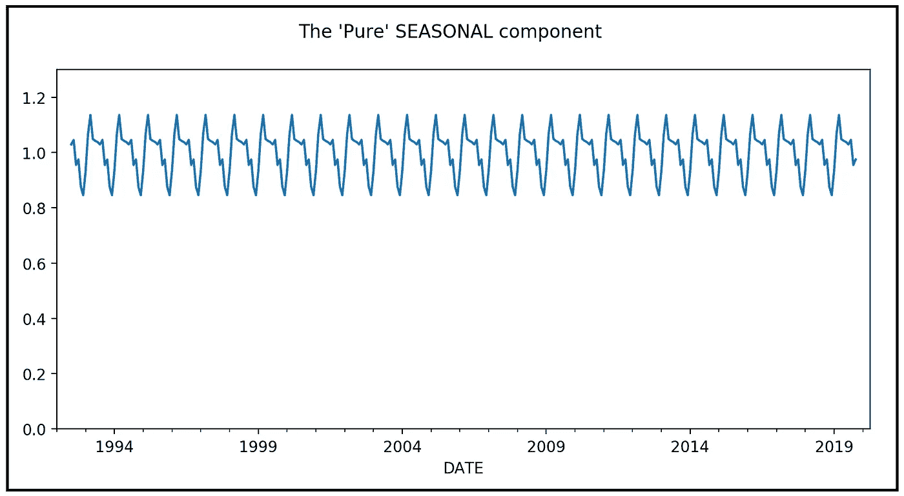****

****(图片由[作者](https://sachin-date.medium.com/)提供)****

******第五步:**最后，我们将之前分离出的噪声季节值除以平均季节值，得出每个月的噪声分量。****

****噪声分量=噪声季节性分量/平均季节性分量****

```
**df[**'NOISE'**] = df[**'SEASONALITY AND NOISE'**]/df[**'SEASONALITY'**]*#plot the seasonal component*fig = plt.figure()fig.suptitle(**'The NOISE component'**)plt.ylim(0, 1.3)df[**'NOISE'**].plot()plt.show()**
```

****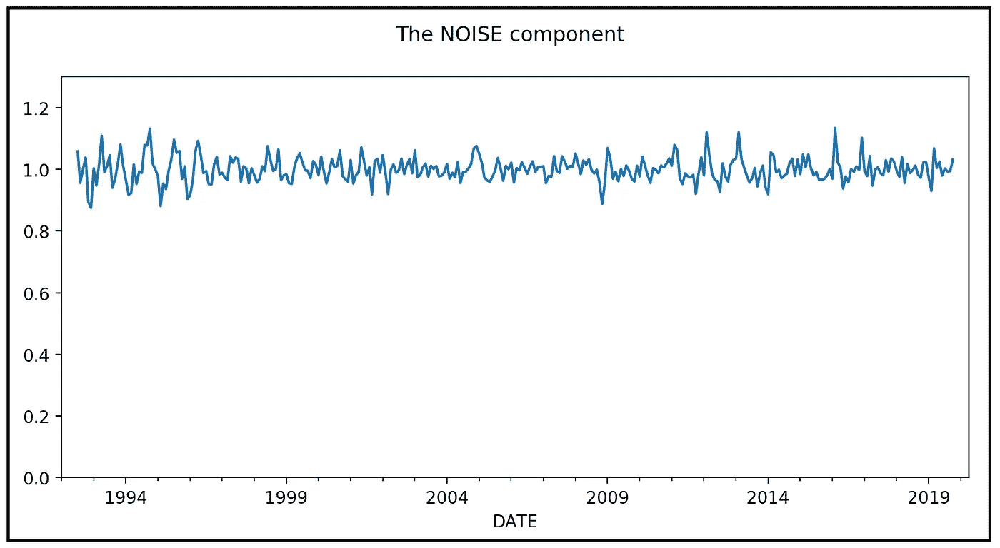****

****(图片由[作者](https://sachin-date.medium.com/)提供)****

****所以你有它！我们只是手工制作了将时间序列分解成趋势、季节和噪声成分的程序。****

****以下是时间序列及其组成部分的拼贴画:****

****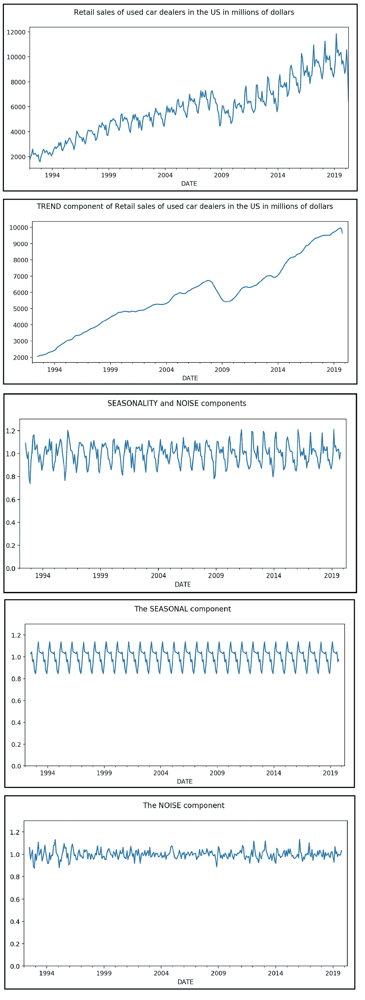****

****(图片由[作者](https://sachin-date.medium.com/)提供)****

## ****使用 statsmodels 的时间序列分解****

****现在我们知道了分解是如何从内部工作的，我们可以稍微欺骗一下，在 statsmodels 中使用 seasonal_decompose()在一行代码中完成上述所有工作:****

```
****from** statsmodels.tsa.seasonal **import** seasonal_decomposecomponents = **seasonal_decompose**(df['Retail_Sales'], **model**='multiplicative')components.**plot**()**
```

****这是我们得到的图:****

****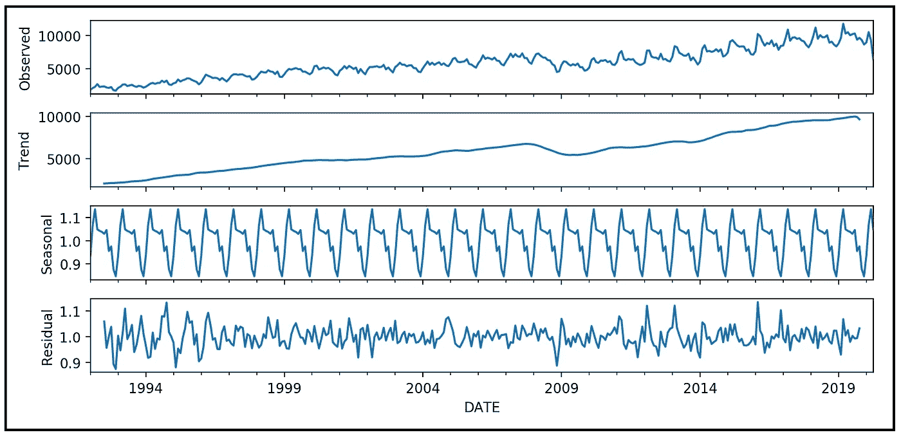****

****零售二手车销售数据集上的季节性分解()的输出(图片由[作者](https://sachin-date.medium.com/)提供)****

****以下是完整的 Python 源代码:****

****这里的[是到 Python 例子中使用的数据集的链接](https://gist.github.com/sachinsdate/40b07da727f8d3d2476dbef4a2f06b6a)。****

## ****引用和版权****

****美国人口普查局，零售销售:二手车经销商[MRTSSM44112USN]，检索自圣路易斯美联储银行弗雷德；[https://fred.stlouisfed.org/series/MRTSSM44112USN](https://fred.stlouisfed.org/series/MRTSSM44112USN)，2020 年 6 月 17 日，根据[弗雷德版权条款](https://fred.stlouisfed.org/legal/)。****

****美国人口普查局，电子商务零售销售[ECOMNSA]，从圣路易斯美联储银行检索；[https://fred.stlouisfed.org/series/ECOMN](https://fred.stlouisfed.org/series/ECOMN)，根据[弗雷德版权条款](https://fred.stlouisfed.org/legal/)。****

****SILSO，世界数据中心—太阳黑子数和长期太阳观测，比利时皇家天文台，在线太阳黑子数目录:[http://www.sidc.be/SILSO/,](http://www.sidc.be/SILSO/,)1818–2020([CC-BY-NA](https://creativecommons.org/licenses/by-nc/4.0/)****

****塞缪尔·h·威廉姆森，“美国 DJA 每日收盘价，1885 年至今”，MeasuringWorth，2020 年
网址:[http://www.measuringworth.com/DJA/](http://www.measuringworth.com/DJA/)****

****本文中的所有图片版权归 [Sachin Date](https://www.linkedin.com/in/sachindate/) 所有，版权归 [CC-BY-NC-SA](https://creativecommons.org/licenses/by-nc-sa/4.0/) 所有，除非图片下面提到了不同的来源和版权。****

*****感谢阅读！如果你喜欢这篇文章，请* [***关注我***](https://timeseriesreasoning.medium.com) *获取关于时间序列分析的技巧、操作方法和编程建议。*****