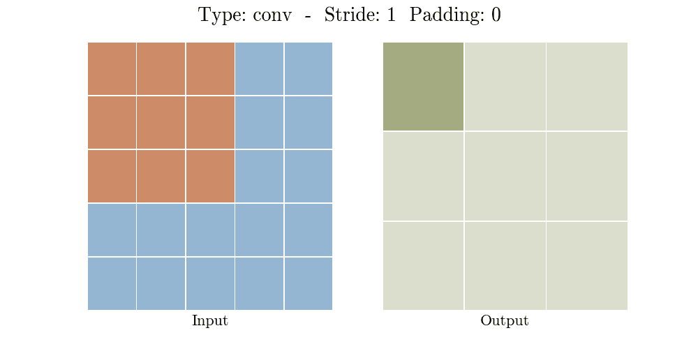
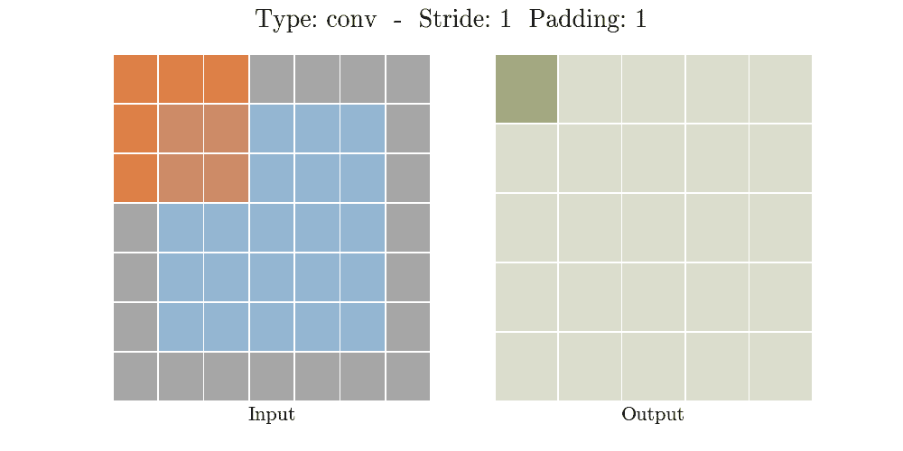
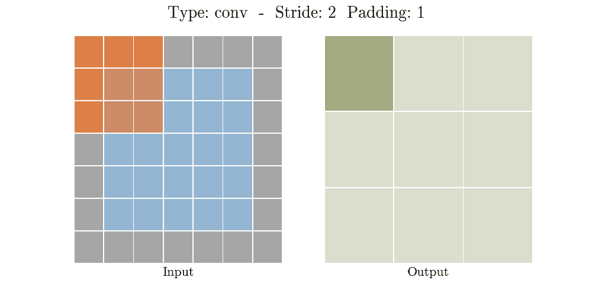
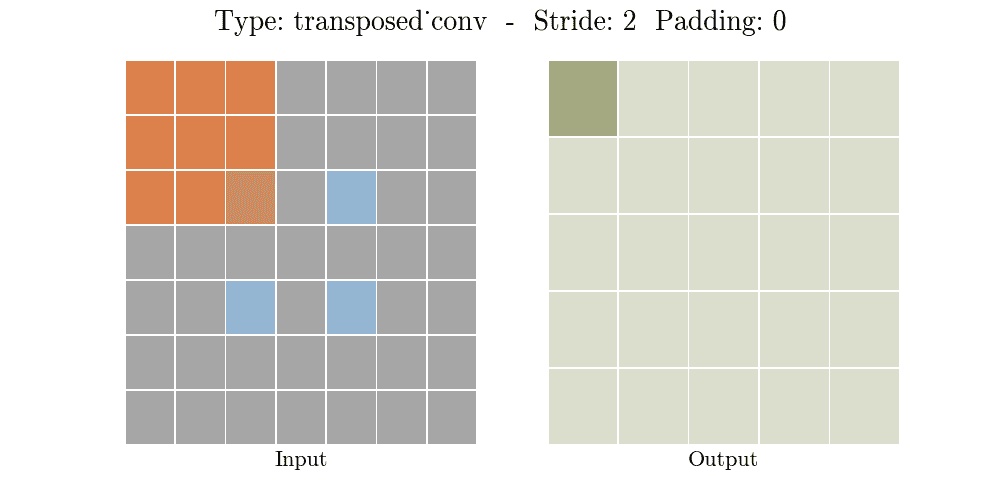
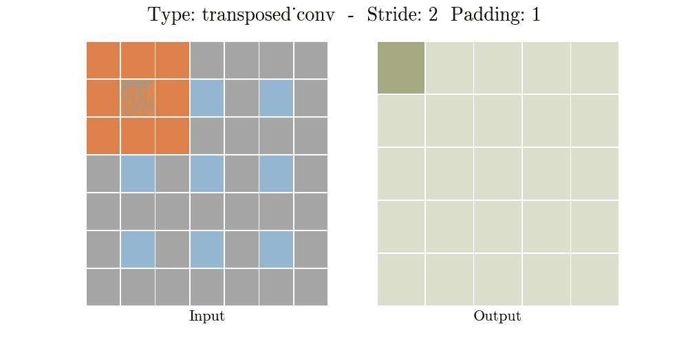

# 什么是转置卷积层？

> 原文：<https://towardsdatascience.com/what-is-transposed-convolutional-layer-40e5e6e31c11?source=collection_archive---------1----------------------->

## 通过动画 gif 和 [python 代码](https://github.com/aqeelanwar/conv_layers_animation)解释

转置卷积层也被(错误地)称为解卷积层。解卷积层与标准卷积层的操作相反，即如果通过标准卷积层生成的输出被解卷积，则可以恢复原始输入。转置卷积层类似于去卷积层，因为两者生成的空间维度是相同的。转置卷积不按值反转标准卷积，而是只按维度反转。

转置卷积层的功能与标准卷积层完全相同，只是对输入特征映射进行了修改。在解释相似性之前，我们先来看看标准卷积层是如何工作的。

## 标准卷积层:

大小为 ***ixi*** 的输入上的标准卷积层由以下两个参数定义。

*   **填充*****【p】:***原输入周围填充的零的个数增加到***(I+2 * p)x(I+2 * p)***
*   **步幅** ***(s):*** 在输入图像上滑动时内核移动的量。

下图显示了卷积层如何分两步工作。

在第一步中，用零填充输入图像，而在第二步中，将内核放置在填充的输入上并滑动，生成作为内核和重叠输入区域的点积的输出像素。通过进行由步幅定义的大小的跳跃，内核滑过填充的输入。卷积层通常进行下采样，即输出的空间维度小于输入的空间维度。

下面的动画解释了卷积层在不同跨距和填充值下的工作原理。

对于给定尺寸的输入 ***(i)*** 、内核 ***(k)*** 、填充***(p)***和步幅***(s)***，输出特征图的尺寸由下式给出

## 转置卷积层:

另一方面，转置卷积层通常用于上采样，即生成空间维度大于输入特征图的输出特征图。正如标准卷积层一样，转置卷积层也是由填充和步幅定义的。padding 和 stride 的这些值是假设对输出执行以生成输入的值。也就是说，如果您获取输出，并执行定义了步幅和填充的标准卷积，它将生成与输入相同的空间维度。

实现转置卷积层可以更好地解释为 4 步过程

*   **步骤 1:** 计算新的参数 z 和 p’
*   **第二步:**在输入的每一行和每一列之间，插入 z 个零。这增加了输入到**的大小*(2 * I-1)*×2 * I-1)**
*   **步骤 3:** 用 p’个零填充修改后的输入图像
*   **步骤 4:** 以步长 1 对步骤 3 生成的图像进行标准卷积

完整的步骤如下图所示。

作者图片

下面的动画解释了卷积层在不同跨距和填充值下的工作原理。

对于给定尺寸的输入 ***(i)*** 、内核 ***(k)*** 、填充***(p)***和步幅 ***(s)*** ，输出的尺寸特征图***【o】***由下式给出

## 总结:

下表总结了两种卷积，标准卷积和转置卷积。

*   转置卷积背后的思想是执行可训练的上采样
*   转置卷积是标准卷积，但是具有修改的输入特征映射。
*   步幅和填充**与**并不对应于图像周围添加的零的数量以及在输入上滑动图像时内核的移动量，这与标准卷积运算中的情况不同。

## Python 代码:

gif 是用 python 生成的。完整的代码可以在[https://github.com/aqeelanwar/conv_layers_animation](https://github.com/aqeelanwar/conv_layers_animation)找到

# 奖金:

可以在下面的链接中找到这个主题和机器学习中许多其他重要主题的紧凑备忘单

 [## 机器学习面试主题的备忘单

### ML 面试的视觉备忘单(www.cheatsheets.aqeel-anwar.com)

medium.com](https://medium.com/swlh/cheat-sheets-for-machine-learning-interview-topics-51c2bc2bab4f) 

如果这篇文章对你有帮助，欢迎鼓掌、分享和回复。如果你想了解更多关于机器学习和数据科学的知识，请关注我@[**Aqeel an war**](https://medium.com/u/a7cc4f201fb5?source=post_page-----40e5e6e31c11--------------------------------)**或者在**[***LinkedIn***](https://www.linkedin.com/in/aqeelanwarmalik/)***上与我联系。***