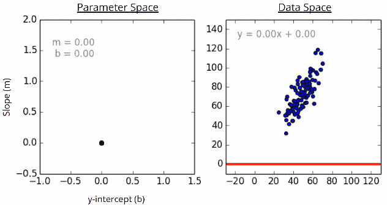
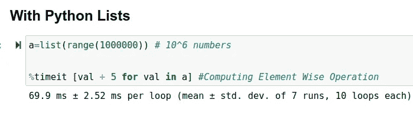
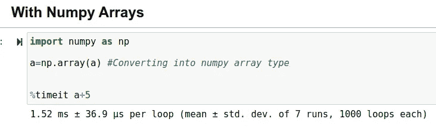
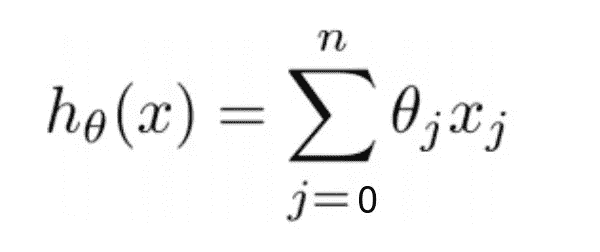
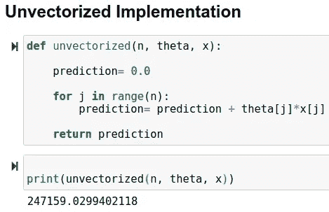
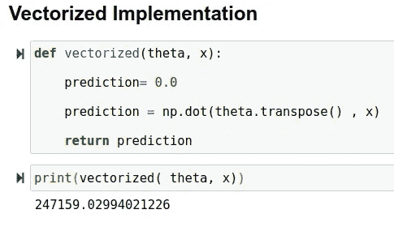
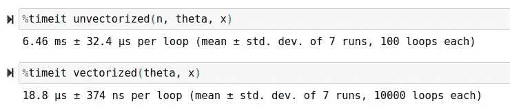

# 机器学习中的矢量化是什么？

> 原文：<https://towardsdatascience.com/what-is-vectorization-in-machine-learning-6c7be3e4440a?source=collection_archive---------4----------------------->


SpaceX 在 [Unsplash](https://unsplash.com?utm_source=medium&utm_medium=referral) 上拍摄的

使用矢量化让您的代码快速执行

## 您将学到的内容:

1.  什么是矢量化？
2.  矢量化在机器学习中有多重要？
3.  示例:非矢量化与矢量化实现
4.  矢量化实施的优势
5.  jupyter 笔记本演示

我第一次了解矢量化的概念是在 Coursera 平台上学习吴恩达教授的最著名的课程**机器学习**。

根据吴恩达教授的说法:

*“执行矢量化的能力已经成为一项关键技能*

所以，让我们学习这项技能，并将其纳入我们的工具箱:)

## 什么是矢量化？

构造化是一种可以让你的代码快速执行的技术。当你从零开始实现算法时，这是一个非常有趣和重要的优化算法的方法。

现在借助 C/C++、Octave/Matlab、Python、…等高度优化的数值线性代数库。我们可以让代码高效运行。

感谢专门做数值计算的人！

在本教程中，我们将使用:

**Numpy:**Python 中的快速数值计算库

## 矢量化在机器学习中有多重要？

就像在现实世界中，我们感兴趣的是以尽可能减少错误的方式有效地解决任何类型的问题。

在机器学习中，有一个优化算法的概念，它试图减少错误，并计算出机器学习模型的最佳参数。

因此，通过在优化算法中使用矢量化实现，我们可以使计算过程比非矢量化实现快得多。

优化算法的一个基本例子:**梯度下降**



梯度下降如何工作的例子，图片由[凯文·宾兹](https://kevinbinz.com/about-me/)在[来源](https://kevinbinz.com/2019/05/26/intro-gradient-descent/)上提供

现在让我们先玩玩 **Numpy** 来了解一下如何使用高度优化的计算库



Python List 和 Numpy 数组的性能比较

使用 Numpy:平均每循环花费 **1.52 毫秒**

没有 Numpy:平均每个循环花费了 **69.9 毫秒**

## 代码:

```
# With Python Listsa=list(range(1000000)) #10^6 numbers generated
%timeit [val + 5 for val in a] #Computing Element Wise Operation# With Numpy Arraysimport numpy as np
a=np.array(a) #Converting into numpy array type
%timeit a+5
```

**range()** : range 函数用于生成一段时间内的数字序列

**%timeit** :这是一个 ipython 神奇的函数，可以用来计时一段特定的代码。

## 非矢量化与矢量化实施



线性回归的假设函数

让我们使用线性回归的假设函数来理解矢量化的概念，其中**θ**表示权重/系数， **x** 表示特征

现在有两种方法可以实现上述功能:

1.  使用 For 循环
2.  使用矢量化

首先，让我们为θ和 x 向量生成随机数

```
n=10000# Generate n random numbers between 0 - 1
theta = np.random.rand(n)#Generate n random integers between 0 - 100 
x = np.random.randint(0, 100, n)
```

现在观察非矢量化代码和矢量化代码之间的区别



对于循环与矢量化实现

两种实现给我们相同的输出，但问题是计算效率如何？

## 比较性能



非矢量化代码和矢量化代码的性能比较

**使用未向量化的代码**:平均每个循环花费 **6.46 毫秒**

**使用向量化代码:**平均每循环花费了 **18.8 秒**

## 代码:

```
# Unvectorizeddef unvectorized(n, theta, x):

    prediction= 0.0

    for j in range(n):
        prediction= prediction + theta[j]*x[j]

    return prediction# Vectorizeddef vectorized(theta, x):

    prediction= 0.0

    prediction = np.dot(theta.transpose() , x)

    return prediction#Comparing Performance%timeit unvectorized(n, theta, x)
%timeit vectorized(theta, x)
```

## 矢量化实施的优势

1.  我们的代码运行高效
2.  我们的代码变得更加简单，易于调试

## 演示时间:)

Jupyter 笔记本电脑演示(非矢量化与矢量化实施)

## 源代码

本教程中使用的所有代码都可以在我的 GitHub 帐户上获得[点击这里](https://github.com/jalalmansoori19/Classfiying-Iris-flower-species/blob/master/vectorization.ipynb)


埃米尔·佩龙在 [Unsplash](https://unsplash.com/) 上的照片

## 结论

在本教程中，您学习了矢量化技术，这是提高代码效率的方法之一。

下节课再见:)

## 接触

Gmail-> jalalmansoori19@gmail.com

github->[https://github.com/jalalmansoori19](https://github.com/jalalmansoori19)

## 参考

1.  [https://speaker deck . com/jakevdp/losing-your-loops-fast-numpy-pycon-2015](https://speakerdeck.com/jakevdp/losing-your-loops-fast-numerical-computing-with-numpy-pycon-2015)
2.  吴恩达教授在 Coursera 上的机器学习课程