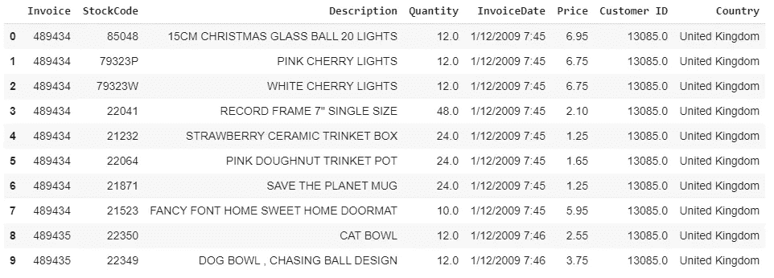
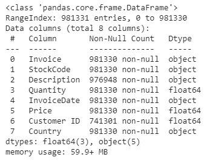
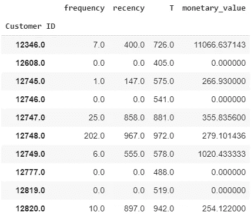
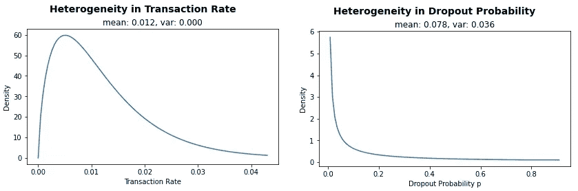
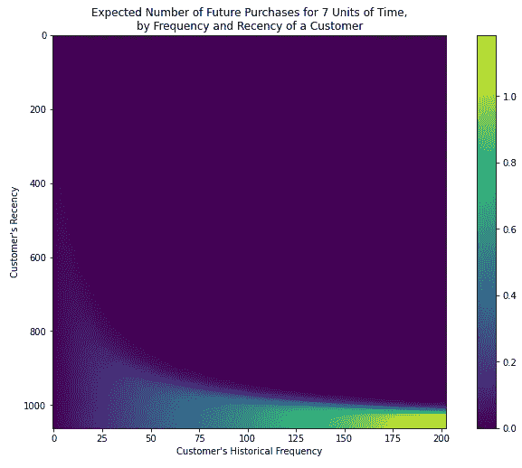
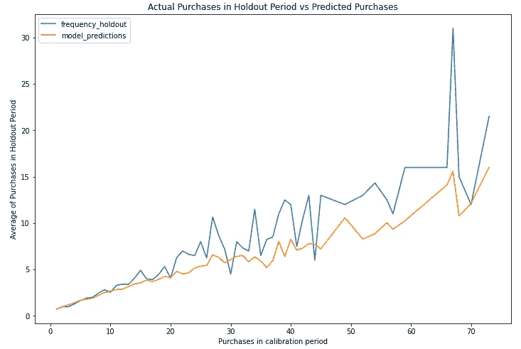
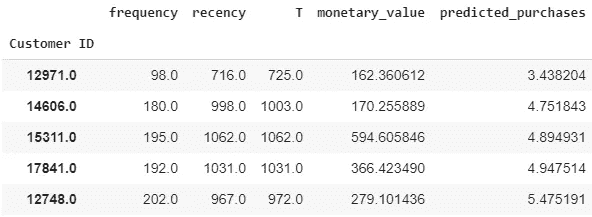
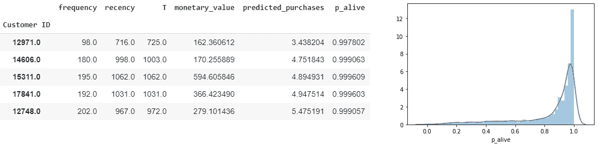
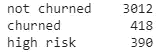
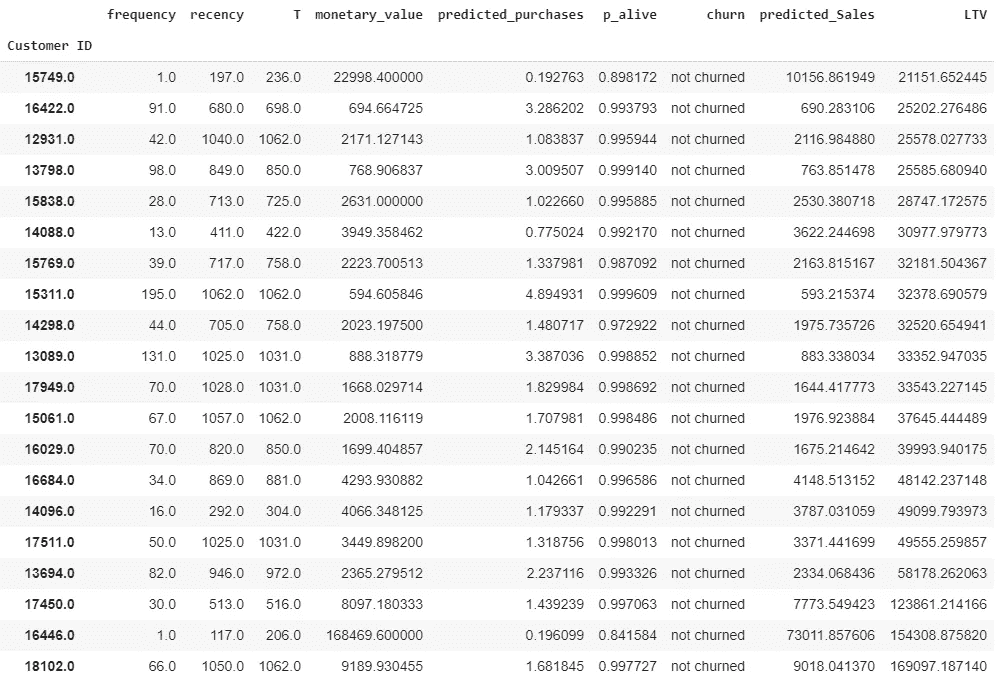

# 客户一生的价值是什么？

> 原文：<https://towardsdatascience.com/what-is-your-customers-worth-over-their-lifetime-dfae277fd166?source=collection_archive---------15----------------------->

## 使用 Python 估算非订阅环境下客户的终身价值(LTV ),以设计适当的保留策略并最大限度地减少客户流失

米歇尔·汉德森在 [Unsplash](https://unsplash.com?utm_source=medium&utm_medium=referral) 上的照片

在我之前在[发表的一篇文章](/how-to-not-predict-and-prevent-customer-churn-1097c0a1ef3b)中，我们讨论了生存分析技术来预测我们的客户何时会流失，以及针对客户的策略来最小化客户流失。这是在一个合同设置中，其中“死亡”是客户终止或不续订他们的订阅。

在本帖中，我们将着眼于购买直到你死(BTYD)类的统计模型，以分析非订阅业务模型中客户的行为和购买模式，以建模和预测客户的终身价值(CLV 或 LTV)。

# 什么是客户 LTV？

客户的终身价值是指公司在整个客户关系中(无论是在单个客户层面、群体层面还是整个客户群层面)预期从客户那里获得的净收入或收入总额，使用现金流贴现法(DCF)将其贴现为当前的美元价值。

根据可用的数据，LTV 可以代表总收入或净收入，即收入*减去*成本。使用收入数字通常不太麻烦，因为客户级别的历史销售数字很容易获得。然而，计算特定于客户的成本可能需要某些假设，这就有点主观臆断了。

# 为什么是 LTV？

在非合同商业模式中，公司与其客户之间没有合同或订阅协议(例如，电子商务或零售)，我们可以在任何给定交易后停止购买。或者我们可以在 12 个月后回来重复购买。因此，没有明确的二进制事件来识别特定客户是否仍然活着。这使得实际上不可能通过逻辑回归或决策树有效地预测作为二元事件的流失。

在没有合同协议的情况下，分析我们的客户的更好方法是预测我们可以预期我们的客户在未来与我们一起消费的货币价值，以及预测的客户流失概率——给定他们的历史购买模式和行为。

请注意这里的区别:我们不知道在观察结束日期，客户是否已经发生了变化。因此，我们不能训练算法来预测在模型训练期间我们不可用的数据点(流失)。相反，流失概率将通过基于购买历史的其他统计和概率方法来确定。

# BTYD 模型介绍

我们将利用以下两个统计和概率模型:**贝塔几何/负二项分布(BG/NBD)模型**和**货币价值的伽马-伽马模型**来分析历史客户购买行为数据和模式，并预测未来的购买频率和货币价值。这些模型已被经验证明优于传统方法，并遵循购买直到你死(BTYD)统计模型。

BG/NBD 模型预测预定义时期内的未来预期交易数量以及客户存活的概率。而 Gamma-Gamma 模型将结合到 BG/NBD 模型中，根据以预定贴现率贴现后的当前美元价值来预测购买的预期货币价值。

这两个模型都在 Python 的`lifetimes`包中实现。

## 模型假设

在基本层面上，上述两个模型依赖于以下假设:

*   每个顾客有两个硬币:一个'**购买**硬币，决定其购买的概率，并由他**连续投掷**；以及决定退出且不再购买概率的“**骰子**硬币，每次购买后**翻转一次**
*   当处于活动状态时，客户进行的交易数量遵循泊松过程，交易率用λ表示(一个时间间隔内的预期交易数量)。简单来说，泊松过程是一系列离散事件，其中事件之间的平均时间是已知的，但事件的确切时间是随机的。下一个事件的发生独立于前一个事件。因此，在我们的案例中，客户是否会重复购买与其历史购买行为无关。这似乎违反直觉(从同一家企业多次购买的客户通常会再次购买)，但在实证研究中却得到了很好的支持。
*   每个客户都有自己的购买硬币(有自己的正面和反面概率)
*   类似于“购买”硬币，每个客户都有自己的“死亡”硬币，每次交易后都有特定的存活概率
*   在每次交易后，顾客以概率`p`变得不活跃，即，在每次交易后，每个顾客将投掷第二个“骰子”硬币以确定他是否重复购买
*   交易率`λ`和退出概率`p`在客户之间独立变化，分别遵循伽马和贝塔分布
*   客户特定交易的货币价值围绕其平均交易价值随机变化
*   不同客户的平均交易额各不相同，但任何特定个人的平均交易额不会随时间而变化
*   平均交易值在客户中的分布与交易过程无关

## 数据要求

BG/NBD 和 Gamma-Gamma 模型在客户层面只需要以下数据点:

*   **最近度**代表顾客最近一次购物的年龄。这等于客户第一次购买和最后一次购买之间的持续时间。因此，如果 X 女士只进行了一次购买，她的新近度将是 0。
*   **频率**代表客户进行**重复**购买的周期数。这意味着它比客户购买的总周期数少 1。如果使用天数作为单位，那么频率就是客户第一次购买后购买的天数(或任何时间段)。如果顾客只购买了一次，他的频率将是 0。此外，频率不考虑同一时间单位内的多次购买。因此，如果 Y 先生在第 1 天购买了两次，在第 3 天购买了三次，那么尽管每天购买了多次，他的频率仍然是 1。
*   **时间**表示无论选择什么时间单位，顾客的年龄。这等于客户第一次购买和研究期末之间的持续时间。
*   **货币价值**代表给定客户的**重复**购买的平均值，即所有重复购买的总和除以重复购买的时间单位总数。货币价值可以是利润、收入或任何其他金额，只要它是为每个客户一致计算的。

我们可以通过`lifetimes`中一个叫做`summary_data_from_transaction_data`的便利实用函数，从以下交易级数据(通常在内部报告系统中可用)中提取上述四个所需的数据点:

*   发票或交易日期
*   发票或交易货币价值

# BG/NBD 和 Gamma-Gamma 模型在运行

我们将在项目中使用公开的电子商务零售数据。该数据集包含近三年间从英国一家在线零售公司购买的所有商品，可从[此处](https://drive.google.com/file/d/1sAQ2hf2WoPzDBftEcACN6ZZVzVqIXeCR/view?usp=sharing)下载。

原始数据的格式如下:

## 数据预处理

接下来，我们将执行以下步骤，将原始数据转换为所需的格式:

*   将`InvoiceDate`转换成日期时间格式，并从中提取日期值
*   删除缺少`Customer ID`的行，因为我们的分析将在单个客户级别进行
*   从`Quantity`字段中过滤出负值，因为这些值可能与客户退货有关，而与 LTV 预测无关
*   为每张发票(`Quantity x Price`)的`Sales`新建一列，并过滤出`lifetimes` : `Customer ID`、`InvoiceDate`、`Sales`所需要的这些列
*   使用`summary_data_from_transaction_data`函数将我们的事务级数据转换成`lifetimes`所需的汇总形式

生成的数据将采用以下形式:

客户# 12608 只购买了 1 次(没有重复)，因此根据模型定义，其频率和最近次数都是 0，并且其年龄是 405 天(即，在分析中第一次购买和期末之间的持续时间)。货币价值也是 0，因为它是所有重复购买的平均值，因此忽略了唯一的一次购买。

另一方面，顾客# 12745 总共购买了两次，因此:

*   `frequency`为 1，即 1 次重复购买
*   `recency`是两次购买之间的天数
*   `T`是首次购买和观察结束日期之间的天数
*   `monetary_value`是第二次购买的总价值，即唯一的重复购买。对于 1 次以上的重复购买，它将是所有重复购买的平均销售额

最后一个预处理步骤是排除我们没有重复购买的客户，即频率为 0。BG/NBD 和 Gamma-Gamma 模型都专注于对有重复交易的客户进行计算。如果我们考虑一下，对于一个只进行过一次历史购买的客户来说，用任何模型来预测未来交易的概率和货币价值都是相当具有挑战性的。否则，该模型将预测只有一次购买交易的客户仍然活着的概率为 100%，这是不现实的。

迄今完成的工作代码如下:

# BG/NBD 模型培训和可视化

训练 BG/NBD 模型就像训练 scikit 中的任何其他 ML 算法一样——使用`lifetimes.BetaGeoFitter()`的`fit`方法学习。

`lifetimes`有几个内置的效用函数来绘制和验证 BG/NBD 模型的内在假设:

*   `lifetimes.plotting.plot_transaction_rate_heterogeneity`绘制λ(顾客购买倾向)的估计伽玛分布。理想情况下，这应该反映一种异质分布，即不集中在一个单一的值
*   `lifetimes.plotting.plot_dropout_rate_heterogeneity`绘制`p`的估计贝塔分布，客户在交易后立即退出的概率(“骰子”)硬币。这也应该显示一种异质分布

尽管交易率在我们的数据中似乎是不均匀的，但退出概率的不均匀性较小，大多数值仅集中在小于 0.1 左右。一个潜在的原因可能是我们的数据中重复购买的客户数量较少——在更长的时间内收集更多的数据可能有利于我们的建模目的。然而，我们将继续我们的练习，看看它进展如何。

## 模型可视化

一旦 BG/NBD 模型经过训练，我们可以从以下图表中收集有用的见解:

**频率/最近热度图**

此热图显示了客户在下一个时间段可能进行的交易数量(默认值为 1，即第二天、第一周等。基于我们数据中的交易频率)，给定模型参数:

我已经使用`T = 7`作为函数的参数来分析未来 7 天的预期购买次数。

直观上，我们可以看到，高频率(多次重复购买)和新近性(最近最后一次重复购买)的客户在未来有望购买更多。我们的最佳客户位于热图的右下角，其特征是重复购买次数超过或等于 175 次，最近一次购买是在他们超过 1000 天时。

简而言之:

*   有多次重复购买(频率)和首次购买与最近一次购买之间有较长时间间隔(最近)的客户可能是未来的最佳客户
*   多次重复购买(频率)但第一次和最近一次购买(最近)的时间间隔较短的客户可能永远不会再回来
*   浅蓝色和绿色区域的客户很有兴趣，因为他们可能会回来购买，但我们仍然可以预计他们在接下来的七天内会购买大约 0.7 次。这些客户可能需要一点哄骗或推动才能回来购买更多

**活动热图的概率**

该热图显示了在给定模型参数的情况下，客户存活的概率:

无论客户是否经常购买，只要他们具有历史上较高的最近购买率(即，他们第一次购买和最近一次购买之间的时间间隔大于或等于 1000 天)，其存活的可能性几乎为 1.0。

此外，新近度稍低的客户(即，最近一次购买是在他们第一次购买之后相对较短的时间段之后)即使没有进行大量的重复购买也具有较高的存活概率。

购买了大量商品但购买时间较短的客户很可能已经退出(右上象限)。

模型训练和可视化的代码如下:

# 英国天然气公司/NBD 模型验证

为了执行模型交叉验证，我们可以将事务数据划分为校准和维持数据集。然后，我们将使用维持数据集作为生产数据(在模型训练期间不可见)，根据校准数据拟合新的血糖/NBD 模型，并比较维持期内重复购买的预测和实际数量。

在维持期内，实际重复购买次数和预测重复购买次数的平均值对比图揭示了以下情况:

在上面的图中:

*   x 轴代表在校准期间观察到的频率值
*   y 轴代表维持期的平均频率(蓝线)和模型预测的平均频率(橙线)

正如我们所见，在大约 15 次重复购买后，该模型可以非常准确地预测客户群的行为。对于更高的频率值，该模型确实产生了更多的误差，并且低估了平均重复购买量。如前所述，这很可能是因为我们的数据中有大量重复购买的客户数量相对较少。

英国天然气公司/NBD 模型验证代码:

# 伽马-伽马模型训练

现在，我们将根据我们的数据拟合 Gamma-Gamma 模型，根据每个客户的购买模式来计算他们未来可能的销售额。

没有比这更简单的了:

# 预测时间

现在我们已经训练好了两个模型，让我们在客户层面做一些预测。首先，我们将预测每位客户在未来 30 天(或您选择的任何其他天数)内的购买数量:

CustomerID 12748 预计将在接下来的 30 天内进行 5 到 6 次购买。

接下来，我们将计算客户存活的概率，并绘制其分布图:

分布图揭示了预期大多数客户有很高的存活可能性。在与业务和营销团队讨论之后，假设我们决定采用以下概率阈值来对客户进行分类:

*   如果活着的概率小于 0.5
*   如果存活的概率在 0.5 到 0.75 之间，则存在高流失风险
*   否则不搅动

我们得到以下计数:

接下来，我们将使用我们训练好的 Gamma-Gamma 模型来预测未来 12 个月的平均未来交易价值和 LTV，假设月贴现率为 0.01%。根据预期的 LTV，我们的前 20 名客户是:

现在，我们已经有了每个客户的估计流失率、未来购买价值和 ltv，这些客户在历史上都曾在我们这里购买过一次以上。

预测代码:

# 结论

现在，尽管我们没有与最有价值和风险最大的客户签订合同，但我们已经对他们有了一些可操作的见解。

完整的 Jupyter 笔记本可以在 GitHub [这里](https://github.com/finlytics-hub/LTV_predictions/blob/master/LTV_Analysis.ipynb)获得。

一如既往，如果您想讨论任何与数据分析、机器学习、金融和信贷风险分析相关的问题，请随时联系 [me](https://www.finlyticshub.com/) 。

下次见，继续！

# 参考

[1]法德尔，P. S .，哈迪，B. G. S .和李，Ka。(2005).简单的方法“计算你的顾客”:帕累托/NBD 模型的替代方案。营销科学。24.275–284.10.1287/mksc

[2]法德尔，P. S .和哈迪，B. G. S. (2013 年)。货币价值的伽玛-伽玛模型。从[这里检索](http://www.brucehardie.com/notes/025/gamma_gamma.pdf)