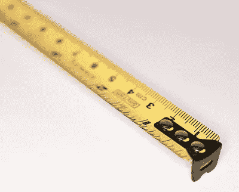
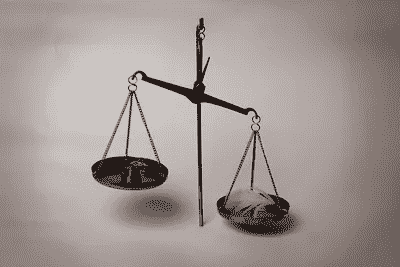

# 你的样本量是多少？伪复制的危险

> 原文：<https://towardsdatascience.com/what-is-your-sample-size-the-dangers-of-pseudo-replication-c66cab14fc69?source=collection_archive---------46----------------------->

## 你的不确定性估计正确吗？

简单吧？在统计学入门课程中，样本量总是给定的。n = 1000。或者 n = 20。但在现实世界中，你得自己算出 n。

如果数据是平面的，那么 n 就是行数。简单。

但是现实世界的许多数据并不平坦。n 是什么？何谓爱情?狐狸说了什么？生命、宇宙、万物的意义是什么？这些都是让我夜不能寐的问题。

我们将从一个过于简单的例子开始。乍一看，问题“n 是什么？”听起来毫无用处，但是希望到最后你会发现这是一个普遍存在的实际商业问题。我们有一万行数据是很常见的，但是“样本大小”更接近于十。

“样本量”在不确定性的量化中起着直接的作用。一个点估计是不够的；什么是似是而非的数值范围？

# 平面数据

假设你想知道一所学校学生的平均身高。我是神谕，知道真实的平均身高是 167 cm，但你不知道。

你找到了 10 名志愿者，他们是正态分布人群中的代表性样本(嘿，我说想象一下)。你拿出卷尺，以厘米为单位记录下:

> 151 180 156 158 147 163 166 161 167 171

在这种情况下，很简单。n = 10，你可以在 162 附近建立一个 95%的置信区间(155，169)。167 在这个 CI 内。

在给定的设置下，95%的随机样本将产生包含 167 的 95% CI。

# 不平衡数据

你从折扣店买了你的卷尺，你被告知它被诅咒了:它提供的测量值稍微有些偏差，但平均来说是正确的。



未被描绘的:不可思议的恐怖。([来源](https://www.flickr.com/photos/wwarby/4915970843))

它带有第二个卷尺，免费！第二个卷尺是*也同样被*诅咒。但是你可以选择颜色！


你选择黄色是因为你是个无趣的人。([来源](https://www.flickr.com/photos/wwarby/4915970843))

当你宣布你将进行第二次测量时，一半的学生说他们上课会迟到并匆忙离开。您使用第二盘磁带记录了前五名学生的身高，所以现在您的数据看起来像

> 151 180 156 158 147 163 166 161 167 171

> 153 187 159 157 145

你有 10 个学生，但有 15 个测量值。这就是**伪复制** —你收集了更多的数据，但是采样单位(学生)的数量不变。

你应该如何估计平均身高？如果你平均 15 次测量，那么有些学生会被重复计算。你的不确定性水平将会下降，因为你的观察不再独立。学生的三围取决于学生的真实身高。

正确的方法是取每个学生的平均测量值，这样你的数据看起来就像:

>152 183.5 157.5 157.5 146 163 166 161 167 171

然后取平均值，得到 162.4 的估计值——可以说是平均值的平均值。(如果你没有为你的 A/B 测试这样做，你要么有一个 ***警告*** 问题，要么有一个更好更先进的方法。)但是如何建立置信区间呢？你更确定前五个值，但是我们要假装后五个值携带同样多的信息吗？

就此而言，n 是什么？模型的正确自由度是什么？我们无法回答这个问题(实际上，[我们可以](https://documentation.sas.com/?docsetId=statug&docsetTarget=statug_glimmix_details40.htm%3Flocale&docsetVersion=14.2&locale=en)，但仅限于 iid 高斯误差)，但最好假设 n=10，而不是 n=15。如果答案存在的话，我们希望它在 10 到 15 之间。我们稍后再讨论这个。

# 平衡数据

下课后，剩下的五个学生来找你进行第二次测量(嘿，他们是好人)。你疯狂地嘲笑你现在完整的数据集，你迫不及待地释放它的潜力来解开宇宙的秘密:

> 151 180 156 158 147 163 166 161 167 171

> 153 187 159 157 145 164 163 161 166 172

取所有观察值的平均值和标准差，构造 n = 20 的 95%置信区间，得到以 162.4 为中心的区间(157.6，167.1)。


图为:进行假设检验后的普通科学家。([来源](https://www.flickr.com/photos/adamrice/156643942))

然后闪电击中你，因为宇宙不想让这种错误的分析见天日。

## 怎么了?

假设您重复测量三次以上，并记录这些观察结果:

> 151 180 156 158 147 163 166 161 167 171

> 153 187 159 157 145 164 163 161 166 172

> 154 187 156 156 146 163 164 160 168 169

> 152 180 159 155 146 165 162 161 167 170

> 152 183 158 162 145 166 165 158 165 172

将这些视为 50 个独立的观察值(换句话说，忽略伪复制)将导致以 162.3 为中心的(159.4，165.1)的非常窄的 95% CI。167 的真正价值远在 CI 之外。

如果你对不同的学生重复这个设置，167 将会比期望的 5%的时间更多地位于区间之外。

问题是:你在观察同样的 10 个学生。为什么一遍又一遍地看到它们会让你更加确信人口意味着什么？如果这行得通，当人们可以多次盯着同一个东西看时，为什么还要花这么多钱来收集数据呢？

鉴于**测量误差来自相同的正态分布**(即误差为高斯分布，与学生的真实身高无关)，正确的方法是取平均值的平均值:

> 152.4 183.4 157.6 157.6 145.8 164.2 164.0 160.2 166.6 170.8

因为我们只观察了 10 名学生，所以我们构造了 n = 10 的 95%置信区间，得到以 162.3 为中心的(154.9，169.7)。

事实上，数据很少是平衡的。即使你建立了一个最终目标是获得平衡数据的研究，参与者也可能会退出。

如果加粗的误差假设不合理(例如二进制结果)，那么我们不能这样做，必须使用更复杂的模型:

# 贝叶斯机器学习来拯救！

在其核心，贝叶斯 ML 处理伪复制(虽然它也适用于平面数据)。

这听起来并不显著，直到您意识到绝大多数数据都遭受伪复制。企业有回头客，并(希望)从每个客户那里进行多次测量。研究可能希望随着时间的推移跟踪同一批人。


数据的层次结构

还记得我们如何将 15 个观察压缩成 n=10 个吗？你可以有十几家商店，每家都有数千名顾客，但是一旦有人提出一些问题(“促销的平均提升是多少？”)，**你实际上必须将 10，000 个观察值压缩成 n=12 个**。要么这样，要么你必须假装你的从属观察是独立的。不太漂亮。

大多数流行的机器学习算法(xgboost、随机森林、GLM 等。)本身不处理伪复制。有两种可能的选择。可以在交叉验证中适当随机化折叠(来自同一个学生的观察永远不要去不同的折叠！)并希望结果可以一般化。或者，您可以汇总数据(例如，按学生计算测量值的平均值)并丢弃一些信息。

下面是我用来生成上述数据的 R 代码:

```
num_students <- 10
num_pseudoreps <- 5set.seed(12)
height <- rnorm(num_students, 167, 10)
meas <- matrix(0, nrow = num_pseudoreps, ncol = num_students)
for(i in 1:num_pseudoreps){
  meas[i,] <- round(height + rnorm(num_students, 0, 2))
}
```

为了得到类似频率主义者的估计，我将使用具有极弱/均匀先验的 MCMC 来拟合一个[随机效应模型](https://en.m.wikipedia.org/wiki/Random_effects_model)。在实践中，这些先验知识[不应该在基本例子之外使用](/stop-using-uniform-priors-47473bdd0b8a)。

```
library(rstan)balanced <- data.frame(
  student = sort(rep(1:num_students, num_pseudoreps)),
  measured = as.numeric(meas)
)
unbalanced <- data.frame(
  student = c(1:10, 1:5),
  measured = c(meas[1,], meas[2, 1:5])
)model <- stan_model(model_code = '
  data {
    int<lower=0> N;
    int<lower=0> S;
    real y[N];
    int<lower=1, upper = S> students[N];
  }
  parameters {
    real mu; 
    vector[S] mu_s;
    real<lower=0> pop_sigma; 
    real<lower=0> meas_sigma;
  } 
  model {
    mu ~ normal(0, 10000);
    pop_sigma ~ uniform(0, 1000);
    meas_sigma ~ uniform(0, 1000);
    mu_s ~ normal(mu, pop_sigma);
    y ~ normal(mu_s[students], meas_sigma);
  }
')set.seed(1)
mcmc <- sampling(
  model,
  data = list(
    N = nrow(balanced),
    S = num_students,
    y = balanced$measured,
    students = balanced$student
  ),
  iter = 5000
)
posterior <- mcmc@sim$samples[[4]]$mu[1001:5000]
```

使用具有 50 个观察值的平衡数据，后验分布具有(154.2，170.2)的 95%可信区间和 162.3 的平均值。这比我们之前得到的 CI 略宽，部分是因为我们估计了一个额外的讨厌的参数:测量误差。

神奇发生在不平衡的情况下。95%可信区间是(154.4，170.0)，我们不必猜测使用什么 n。在这个示例中，好处并不明显，因为我们正在使用忽略伪复制是最不*有害的设置。*

然而，当我们越来越远离舒适的:

*高斯分布(如二元结果、严重偏斜的人口分布)

*不相关的参数(例如，忠诚客户可能会访问更多的*和*花费更多)

*有些平衡的数据(例如，一些客户一周访问 100 次，而另一些客户只访问一次)

采用平均值会给出越来越差的结果。(查看我的 [GLM 文章](/a-primer-on-generalized-linear-models-ab1769a03100)以了解精确加权平均值的细节。)



铁是羽加迪姆 leviosa。([来源](https://www.flickr.com/photos/adamrice/156643942)

直觉上，这是因为平均值假装所有的抽样单位具有相等的权重，即使它们并不相等。

考虑到一些最普遍的指标是百分比(例如转化率)或极度右偏(例如平均支出)，贝叶斯机器学习在每个组织中都有一席之地。

最后，如果你经常需要在工作中进行统计推断，可以考虑将贝叶斯机器学习作为你工具箱的核心部分。它们实际上是为解决真实数据中普遍存在的伪复制问题而设计的。