# 关联需要什么

> 原文：<https://towardsdatascience.com/what-it-takes-to-be-correlated-ce41ad0d8d7f?source=collection_archive---------9----------------------->

## 以及在我们的分析中如何解释它


舒伊布·阿卜尔哈萨尼在 [Unsplash](https://unsplash.com?utm_source=medium&utm_medium=referral) 上拍摄的照片

相关性(确切地说是统计学上的相关性)是对两个变量之间相互关系的一种度量，不管它们是不是因果关系。这种程度的测量可以在任何类型的数据上进行(连续的和连续的，分类的和分类的，连续的和分类的)。尽管相关性说明了它是如何衡量相互关系的，但相关性度量的存在并不能为因果关系提供有力的证据。这意味着相关性并不意味着因果关系。那么相关性是如何有用的呢？

相关性是有用的，因为它可以表明实践中可以利用的预测关系。例如，一天中温度越高，卖冰淇淋的次数越多。这也可能意味着因果关系，因为当天气较热时，人们倾向于购买冰淇淋，而当天气较冷时。然而，就像我之前陈述的那样；大多数时候，相关性并不意味着任何因果关系。

在我们进入相关性和它如何计算之前，让我展示一下协方差的概念。

# 协方差

在统计学中，协方差是变量 X 和 y 之间关联的度量，确切地说，它度量的是变量的线性关系趋势。这里我将展示协方差是如何计算的。

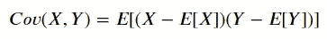

协方差的计算方法是将变量的每个成员减去其平均值(以数据为中心)。将这些居中的分数相乘，以测量一个变量的增加或减少是否与另一个变量相关联。最后，计算这些居中分数的期望值( *E* )作为关联的汇总。另一项中的期望值本身就是平均值或均值( *μ)* 。

协方差的问题在于，X 和 Y 可以取各自范围内的任何值。这模糊了解释过程，并且使得相互之间的协方差比较变得不可能。例如， *Cov* ( *X* ， *Y* ) = 7 和 *Cov* ( *A* ， *B* ) = 5 会告诉我们这些对分别是正相关的，但是很难判断 *X* 和 *Y* 之间的关系是否强于 *A* 和 *B 这就是相关性变得有用的地方-通过数据中的可变性测量来标准化协方差，它将产生具有直观解释和一致尺度的产品。*

现在，让我们完成第一个关联。

# 皮尔逊相关系数

皮尔逊相关是数据分析过程中最常用的相关之一。皮尔逊相关度量变量连续 X 和变量连续 Y 之间的线性关系，其值介于 1 和-1 之间。换句话说，皮尔逊相关系数通过一条线来衡量两个变量之间的关系。

让我们看看皮尔逊相关系数是如何计算的。

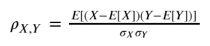

如果你注意到，分数方程的上边(分子)类似于我们之前讨论的协方差方程。这意味着我们也可以将皮尔逊相关系数表述如下。

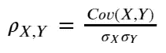

上面的等式表明协方差除以 X 标准偏差(σX)和 Y 标准偏差(σY)的乘积。标准差的除法过程是为了标准化我们的数据，并确保相关值落在 1 比 1 的范围内。这简化了我们的相关性解释。那么，我们如何解释皮尔逊相关性呢？

当相关系数**接近值 1** 时，意味着变量 X 和 y 之间存在**正关系**，正关系表示一个变量的增加与另一个变量的增加相关。另一方面，**相关系数越接近-1** 就意味着存在一种**负相关关系**，即一个变量的增加会导致另一个变量的减少。**如果 *X* 和 *Y* 是独立的**，那么**相关系数接近于 0** ，尽管即使两个变量之间有很强的关系，皮尔逊相关也可能很小。

如果你从上面的解释中意识到，实际上皮尔逊相关系数和回归线的斜率之间有明显的联系。首先，让我展示一个带有回归线的散点图的例子。

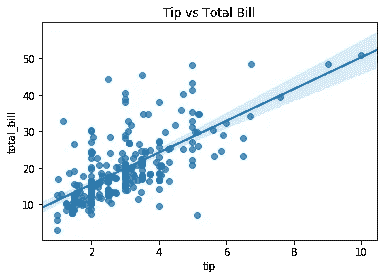

在上图中，回归线是最佳的，因为它使所有点到回归线的距离最小。由于这一特性， *Y* 和 *X* 的回归线的斜率在数学上等价于 *X* 和 *Y、*之间的相关性，通过它们的标准偏差来标准化。

换句话说，皮尔逊相关系数反映了两个变量之间的关联性和可变性。这一特性也意味着皮尔逊相关易受异常值的影响。

这种与直线斜率的关系说明了为什么皮尔逊相关性描述了线性关系，以及为什么相关性在预测建模中很重要。

如果我们想测量变量之间的非线性关系呢？接下来我会展示一些其他的测量方法来描述这种非线性关系。

# 斯皮尔曼等级相关

与皮尔逊相关系数不同，斯皮尔曼等级相关测量两个变量之间的单调关系(严格地增加或减少，而不是两者都增加)，并通过值的等级顺序来测量。尽管 Spearman 秩相关法仍然适用于离散的顺序变量，但仍然可以测量连续变量 X 和连续变量 Y 之间的相关性。

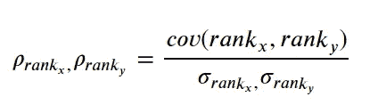

这里我们根据数据等级而不是分数来计算 Spearman 等级相关性。这意味着我们计算数据秩和秩标准差之间的协方差。如果所有的秩是唯一的或者秩之间没有联系，我们可以将等式简化如下。

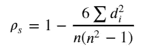

其中 n 是观察次数，d 是秩差。这个公式只有在没有领带的情况下才严格使用。

Spearman 等级相关可以类似地解释为 Pearson 相关系数，因为它们的值在-1 到 1 之间。**得分越接近 1** 意味着变量之间存在**正单调关系**(数据不断增加)，反之亦然。如果**变量 X 和变量 Y 独立**，则值将为**等于 0** 。

当我们谈论等级时，等级到底是什么？下面是我从维基百科上获得的一个排名过程的例子。

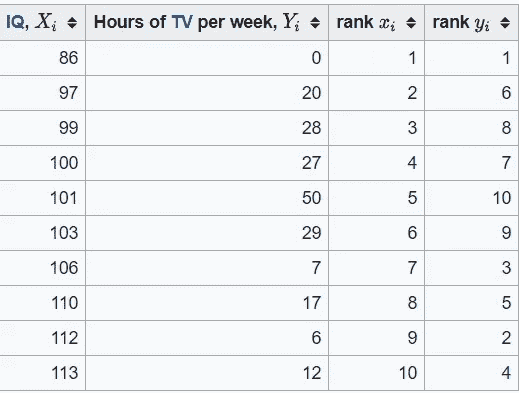

更容易理解排名的方法是，我们将数据从最小到最大排序，并根据数据顺序分配排名。1 是最小的等级，这意味着等级 1 被分配给相应列的最小值。为什么是各自的专栏？从上表中我们可以看出，我们根据各自的列对数据进行排序，因为我们想知道列 X 和列 Y 的排序之间的协方差；我们给每一列分配等级。准确的说，我们要的是每行之间的排名差。

皮尔逊和斯皮尔曼相关性之间的差异在下图中得到最好的说明。

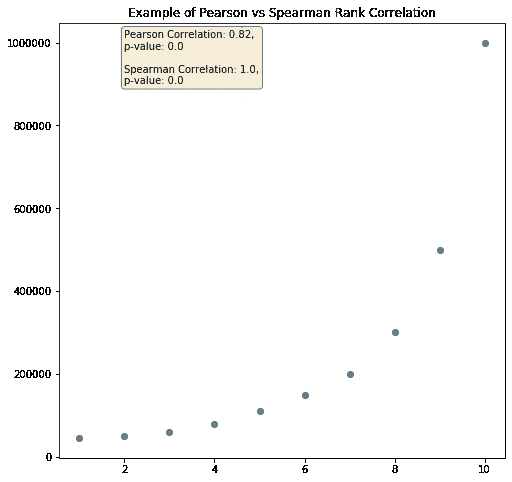

皮尔逊相关与斯皮尔曼等级相关

因为我们的上述数据显示了完美的正单调关系(数据总是增加)和非线性关系；我们的 Spearman 相关等于 1。在这种情况下，皮尔逊关系较弱，但仍然显示出很强的相关性，因为数据之间存在部分线性关系。

# 肯德尔τ秩相关

另一种测量变量之间非线性关系的方法是应用肯德尔的 Tau 等级相关性。Kendall Tau 等级相关系数衡量给予同一组对象的两组等级之间的相似程度。然而，与 Spearman 系数不同，Kendall Tau 只测量方向一致性，而不测量等级差异。因此，这个系数更适合于离散数据。下面是我们如何测量肯德尔τ相关性。

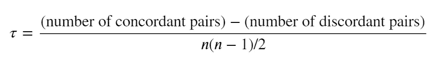

其中和谐对是等级一致的值对(( *x* 1， *y* 1)，( *x* 2，*y*2)):*x*1<*x*2 和 *y* 1 < *y* 2 或 *x* 1 > *x* 2 和不和谐对是不遵循这些的等级对

从上面的等式中，我们可以看出，测量值取决于物体对的反转次数。为了评估它们，每个等级顺序由所有对象对的集合来表示(例如，[a，b]和[b，a]是表示对象 a 和 b 的两对)。让我们使用一个样本数据集来衡量我们的相关性。


数据集示例

上面是一个样本数据集，在各自的列中有排名。我们需要根据之前的规则来计算一致对和不一致对的数量。(1，2)和(2，7)是 1 <2 and 2<7 while (1,2) and (4,1) are discordant pairs because 1 < 4 but 2 > 1 的整合对。如果是我们的数据集示例，对应对是:

*   (1，2)和(2，7)
*   (1，2)和(3，5)

不和谐的一对是:

*   (1，2)和(4，1)
*   (2，7)和(3，5)
*   (2，7)和(4，1)
*   (3.5)和(4.1)

这意味着我们有 2 个一致对和 4 个不一致对。使用前面的等式 2–4/(4(4–1)/2)将得到-0.33。

Kendall Tau 将取 1 到+1 之间的值，其中**值越接近 1** 表示当**一个等级顺序与另一个等级顺序完全相反**和**时，值越接近+1 表示两个等级顺序相同**。Kendall Tau 相关性也可以解释为处于相同顺序(一致)的对象的概率与处于不同顺序(不一致)的观察之间的概率差。

肯德尔τ适用于我们想知道变量的顺序是否相似的情况；尤其是如果我们的数据是离散的。然而，还有其他方法来测量离散变量相关性( [Shaked Zychlinski](https://medium.com/u/43218078e688?source=post_page-----ce41ad0d8d7f--------------------------------) 已经写了一篇关于它的很好的文章[这里](/the-search-for-categorical-correlation-a1cf7f1888c9)但是我想更详细地阐述它)

# **克莱姆的 V 型**

克莱姆 V 是两个离散变量之间关联的度量。测量基于皮尔逊卡方统计，输出范围在 0 到 1 之间；**值越接近 0** 表示两个变量之间的**关联越少**而 **1** 表示两个变量之间的**关联越强**。没有负(-)值作为输出，因为不存在负关联。克莱姆的 V 计算是用下面的公式计算的。

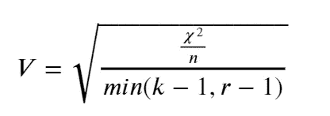

其中，χ是卡方统计量，n 是观察值的数量，k 是列数，r 是行数。

因为 Cramer 的 V 过高估计了关联强度(卡方统计值倾向于随着行和列的数量之间的差异的增加而增加)，我们需要纠正偏差。这是通过下面的等式完成的。

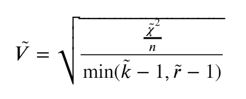

在哪里

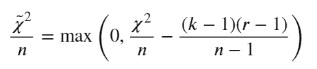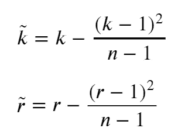

# 数据集示例

幸运的是，python 中的 scipy 和 pandas 模块为我们提供了一种计算所有数字的简单方法。在我的例子中，我将使用 seaborn 的 tips 样本数据集。

```
#Importing the important module
import pandas as pd
import matplotlib.pyplot as plt
import seaborn as sns#Load the dataset
tips = sns.load_dataset('tips')#Creating new category based on the tip feature (0: tip below 3 and 1 tip equal or more than 3)tips['tip_category'] = tips['tip'].apply(lambda x: 1 if x>3 else 0)
```

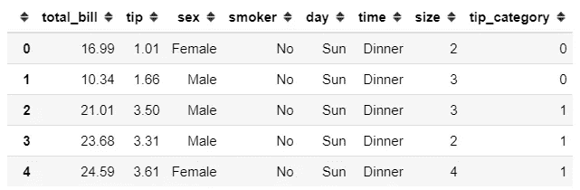

假设我们想知道 total_bill 和 tip 特性之间的关系。用熊猫的方法。corr，我们可以在几秒钟内测量我们的相关性。熊猫。corr 方法只提供 3 种相关度量；皮尔森，斯皮尔曼和肯德尔。

```
#Using the .corr method from pandas, default is Pearson Corellation 
tips[['total_bill', 'tip']].corr()
```


total_bill 与小费变量之间的皮尔逊相关系数

```
tips['total_bill', 'tip']].corr('spearman')
```


total_bill 与小费变量之间的 Spearman 等级相关性

如果我们需要相关结果作为统计假设测试，我们可以使用 scipy 模块中的函数来计算。

```
from scipy.stats import pearsonr, spearmanrpearsonr(tips['total_bill'], tips['tip'])
#Output: (0.6757341092113647, 6.6924706468630016e-34)spearmanr(tips['total_bill'], tips['tip'])
#Output: SpearmanrResult(correlation=0.6789681219001009, pvalue=2.501158440923619e-34)#Where the first number represent the Correlation Coefficient and #the second number represent the p-value.
```

在相关分析中，我们可以检验变量之间是否存在关系的统计假设。正式的说法是:

*   H0:变量 X 和变量 Y 之间没有统计学上的显著关系
*   H1:变量 X 和变量 Y 之间有一种统计上的显著关系

就像任何其他假设检验一样，我们基于 p 值评估我们的假设。通常，我们将 alpha 水平设置为 95%，这意味着如果 p 值低于 0.05，那么我们拒绝 H0，接受 H1。在这种情况下，H0 是相似的，如果我们说变量 X 和变量 Y 是独立的。

我们也可以用类似于上面的方法计算肯德尔τ相关性。如前所述，Kendall Tau 相关性更适合应用于离散变量，为此，我举一个大小和 tip_category 之间关系的例子。

```
tips[['size', 'tip_category']].corr('kendall')
```

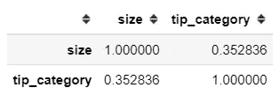

Kendall Tau 尺寸和小费之间的相关性 _ 类别

```
from scipy.stats import kendalltaukendalltau(tips['size'], tips['tip_category'])
#Output: KendalltauResult(correlation=0.3528363722264162, pvalue=6.456364135002584e-09)
```

计算克莱姆的 V 需要一个额外的模块，校正偏差版本需要我们自己定义。对于未校正的版本，我们可以使用 researchpy 模块来帮助计算我们的 Cramer's V。让我们将其应用于性别和大小变量之间的关系。

```
pip install researchpy #only if you never have this module beforefrom researchpy import crosstab
cross, res = crosstab(tips['sex'], tips['size'], test = 'chi-square')
res
```

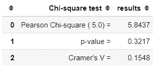

使用 researchpy，我们可以获得关于统计测试和相关性分析的信息。尽管如我之前所说，它还没有修正，这意味着它高估了关联强度。出于这个原因，我会使用之前由 [Shaked Zychlinski](https://medium.com/u/43218078e688?source=post_page-----ce41ad0d8d7f--------------------------------) 定义的偏差校正的 Cramer V 函数。

```
def cramers_v(x, y):
    import scipy.stats as ss
    confusion_matrix = pd.crosstab(x,y)
    chi2 = ss.chi2_contingency(confusion_matrix)[0]
    n = confusion_matrix.sum().sum()
    phi2 = chi2/n
    r,k = confusion_matrix.shape
    phi2corr = max(0, phi2-((k-1)*(r-1))/(n-1))
    rcorr = r-((r-1)**2)/(n-1)
    kcorr = k-((k-1)**2)/(n-1)
    return np.sqrt(phi2corr/min((kcorr-1),(rcorr-1)))cramers_v(tips['sex'], tips['size'])
#output: 0.058202656344848294
```

正如我们在上面看到的，修正和未修正版本之间的关联强度是不同的。

# **结论**

我已经展示了几种测量变量之间关系的方法，以及我们如何解释这种测量。

得出相关值之间存在因果关系的结论是很诱人的，但正如许多人以前说过的那样，“相关性并不意味着因果关系”。事情可能不像数字显示的那样简单。在我们得出任何结论之前，我们需要批判性思维来剖析我们从这种相关性中获得的信息。

# 如果你喜欢我的内容，并想获得更多关于数据或作为数据科学家的日常生活的深入知识，请考虑在这里订阅我的[时事通讯。](https://cornellius.substack.com/welcome)

> 如果您没有订阅为中等会员，请考虑通过[我的推荐](https://cornelliusyudhawijaya.medium.com/membership)订阅。