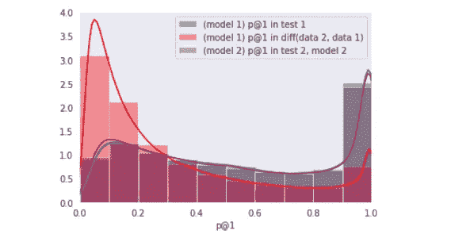
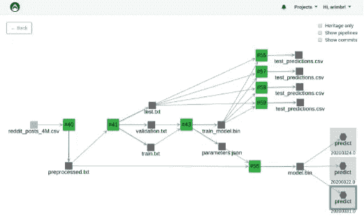
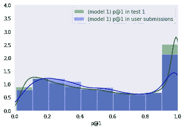
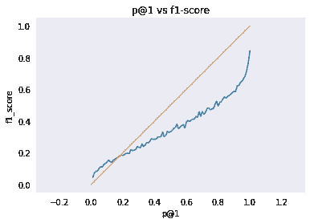
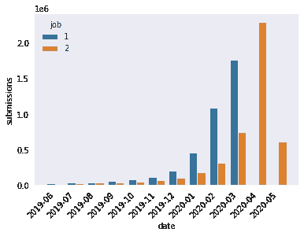
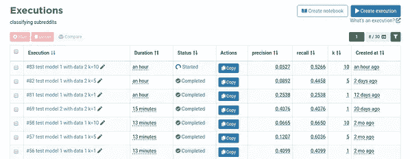
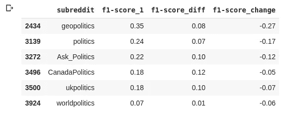
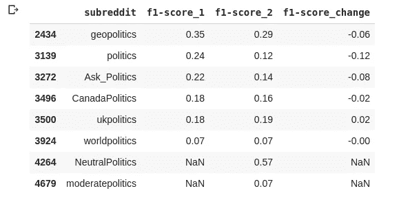
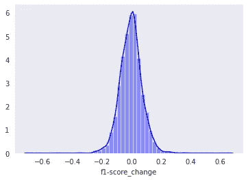
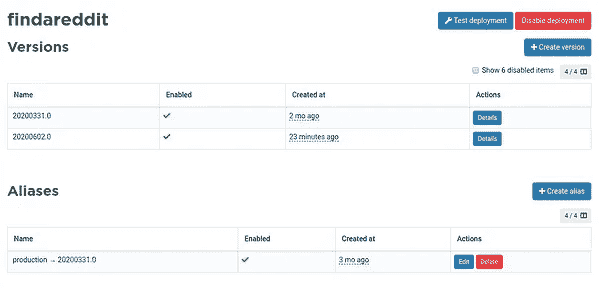

# 我从机器学习的 CI/CD 中学到了什么

> 原文：<https://towardsdatascience.com/what-ive-learned-about-ci-cd-for-machine-learning-bc9504de6191?source=collection_archive---------72----------------------->

## 了解为什么经常重新训练机器学习模型是必要的，以及如何为文本分类模型建立 CI/CD 管道

用模型给出的概率分布度量概念漂移。

大多数软件开发团队已经采用持续集成和交付(CI/CD)来更快地迭代。然而，机器学习模型不仅依赖于代码，还依赖于数据和超参数。在生产中发布新的机器学习模型比传统的软件开发更复杂。

机器学习工程师还在讨论机器学习中的 CI/CD 实际上是什么意思，使用哪些工具。大多数机器学习团队使用几种工具来拼接他们自己的流程，以发布一个新模型——更新每月发布一次，每天发布一次——这不是最佳方式。

在[之前的一篇文章](/classifying-4m-reddit-posts-in-4k-subreddits-an-end-to-end-machine-learning-pipeline-ee511d26b362)中，我在 400 万篇 Reddit 帖子上训练了一个机器学习模型，将一篇帖子分类到一个子编辑中。一个月后，我注意到 Reddit 上的主题发生了变化，我需要收集新的数据来重新训练模型。在本文中，我将介绍发布新版本的步骤，描述如何为这类项目构建 CI/CD 管道，以及为什么在机器学习中经常重新训练模型是必不可少的。

# 出现了持续集成的需求

为了收集 5k 个最受欢迎的子编辑的 1k 个最新帖子，我创建了两个使用 Python Reddit API 包装器的 CLI。我将数据存储在 SQLite 数据库中。

之前，我用 fastText 训练了**一个文本分类器，并在测试分割**中报告了 0.4 的 f1 分数和 0.6 的召回率。这意味着大约三分之二的情况下，前五个预测包括人类在测试数据集上选择的子集合。

从数据工件、执行和 API 端点之间的依赖关系生成的端到端 ML 管道。

测试分割的性能可能不代表新数据的性能，这有几个原因。例如，预计用户在某些子编辑上发布的主题会随着时间而变化。在机器学习中，这被称为概念漂移，为了避免概念漂移，人们需要定期重新训练并发布新版本的模型。

> 概念漂移是指目标变量的统计特性随时间以不可预见的方式发生变化。 [*百科*](https://en.wikipedia.org/wiki/Concept_drift)

# 为机器学习模型收集用户反馈

为了收集用户反馈，我将模型部署为一个 API， [Valohai 团队制作了一个 UI](https://valohai.com/subreddit-finder/) 来与模型交互。我在[黑客新闻](https://news.ycombinator.com/item?id=22823109)上分享了 UI。

下面你可以比较测试数据和 [8k 用户提交](https://docs.google.com/spreadsheets/d/1NBY1o85ZiNpcm4tcYhKk_Z0TNxm2Q-MhptuCi9qJJoQ/edit#gid=997279876)的 p@1(模型给出的第一次预测正确的概率)的分布。

测试数据的平均 p@1 为 0.549，用户提交的平均 p @ 1 为 0.531。我很惊讶地看到概率如此接近，这意味着模型达到了类似的确定性水平。如果这些值太远，这意味着模型是根据不代表实际使用的数据训练的。

在[之前的文章](/classifying-4m-reddit-posts-in-4k-subreddits-an-end-to-end-machine-learning-pipeline-ee511d26b362)中，我报道了 f1-分数与 p@1 正相关但稍有滞后。因此，**当标签未知时，模型给出的概率可用作估计 f1 分数的代理**。下面，0.55 的 p@1 对应于 0.4 的 f1 分数。

重要的是，不要仅仅依靠定量测试来建立对机器学习模型的信心。对黑客新闻的评论大多是正面的，但也提出了一些模型不起作用的案例。很少有人报告说它对一些子街道不起作用。在大多数情况下，模型没有在这些子街道上训练，因为它们不是最流行的子街道的一部分。这很难定量衡量，但知道这一点很重要。

> *尝试使用搜索词“爱尔兰软件开发人员”来查找/r/DevelEire。运气不好，但如果查询是“爱尔兰软件开发商 Reddit”，谷歌会把它作为第一个结果。* [*黑客新闻讨论*](https://news.ycombinator.com/item?id=22823109)

也有评论建议采用更复杂的模型。

> 改进的一个地方是使用更好的单词嵌入集。FastText 确实很快，但它不再靠近 SOTA。您最有可能使用简单的平均池，这就是为什么许多用户得到的结果看起来不对。尝试一种分块方法，为文档的每个块获取一个向量，并将这些向量水平连接在一起(如果向量是 50d，每个文档做 5 个块，那么无论文档有多长，每个文档都有一个 250d 的固定向量)。这部分解决了高度稀释的载体的问题，这是一些用户报告的不良结果的原因。你也可以做“专注池”,像变压器头一样进行池操作——尽管这是一个 O(N)操作，所以 YMMV。 [*黑客新闻讨论*](https://news.ycombinator.com/item?id=22823109)

在这一点上，我可以构建一个可能执行得更好的更复杂的模型，或者简单地收集更多的数据。**更多的数据往往比更好的模型对性能有更大的影响**。在生产机器学习中，避免复杂性是能够快速迭代并降低维护模型成本的关键。

从长期来看，还有第三种方法可以改进模型，即构建一个持续的集成和交付管道，定期用新数据重新训练模型，以便性能不会随着时间的推移而下降。

# 测量概念漂移

为了衡量概念漂移，我在训练第一个模型一个月后收集了最新的 Reddit 提交内容。

我导出了旧的子数据的新提交，并比较了测试和新数据之间的 f1 分数。有了 Valohai，我可以运行版本控制的执行，并在一个界面上比较它们。当在团队中工作时，这避免了陷入一个团队成员在本地运行一个实验并报告不同结果的情况。但是你忽略了哪些数据集、代码和参数。在一个团队中，如果没有版本控制，就像没有发生一样。

比较执行#56 和执行#81，我看到**召回从 0.40 下降到 0.25** 。该模型在新数据上表现不佳。该模型知道它，因为它也可以在新数据的 p@1 的分布上看到。

用模型给出的概率分布度量概念漂移。

在对执行#69 中的新数据进行再训练之后，新模型对新测试数据实现了类似的 0.40 召回率。新模型在额外的 700 个子数据集上进行训练，使其对最终用户更有用。

实际上，当我将数据随机分为训练、验证和测试时，模型在新数据上的性能低于 0.4。按时间顺序划分更好，在旧数据上训练，在最新数据上测试。正如 Szilard Pafka 在 Twitter 上指出的:

> 您应该在时间有序的测试集上测量准确性。这种“实际”准确度通常会低于通过标准交叉验证获得的准确度。不要欺骗自己，当您在生产中部署您的模型并开始在真正新的数据上使用它时，时间间隔的准确性将是您实际获得的准确性。

我当然被愚弄了，但我要补充的是，当在生产中进行机器学习时，获得更好的理论准确性并不是你的最终目标。重要的是使用相同的指标来比较每个版本控制的实验。

最后，**由你的企业和终端用户来决定你的机器学习模型是否有用**。如果 Reddit 部署了这样的模型，那么该模型的有用性可以通过选择该模型建议的子编辑的用户百分比来衡量。

# 机器学习的持续集成

机器学习中的持续集成意味着**每次你更新代码或数据，你的机器学习管道就会重新运行**。集成是在发布新模型以验证最新数据和代码之前完成的。我还没有为这个项目设置它，但这是我打算如何与瓦罗海这样做。

Valohai 附带了一个开放的 API，当推送新代码时，我可以用它来触发机器学习执行和管道。例如，我可以定义一个 [Github 动作来触发每次提交的 Valohai 执行](https://docs.valohai.com/tutorials/apis/triggerExecFromGitHub/)。我还可以创建特定的规则，只触发特定提交的执行，并根据机器学习存储库中修改的代码决定运行哪个执行。如果您的数据不断更新，您可能只想定期重新训练模型。

您可以**使用 p@1 之类的代理来测量概念漂移，并在出现重大性能损失之前发布新版本**。还可以使用 Github actions 定期调度工作流，使用最新数据在 Valohai 上运行机器学习管道。

# 机器学习模型验证

大多数机器学习团队不会在没有一些人工验证的情况下部署到生产中。例如，比较生产模型和新候选模型的不同报告。

要建立对新模型的信心，您可以将它应用于所有历史数据并比较预测。结果不应该完全不同。然后，您可以**检查性能发生显著变化的数据片**。

对于 subreddit 分类器，我比较了每个标签的性能。下面，你可以看到当我使用旧模型和最新数据时，关于政治的子主题的 f1 分数显著下降。

f1-score_diff 是将旧模型应用于新数据时的 f1 值= diff(数据 2，数据 1)

用新数据重新训练模型后，我注意到性能损失较小，r/ukpolitics 略有改善。还有两个新的分支:中立政治和温和政治。

总体而言，f1-score_change 分布遵循 0 附近的正态分布。大多数子记录的性能变化在-20%到+20%之间。新模型仍然是准确的，更有用的，因为它是在更多的子数据集上训练的。我现在有信心发布机器学习模型的新版本。

# 机器学习的连续交付

理想情况下，您可以首先将您的模型部署到您的临时环境中，并让它运行几天。您还可以通过 canary 版本向一部分用户软发布您的新模型。

Valohai 帮助您为您的机器学习 API 创建不同的版本，并在必要时轻松回滚。将一个新模型作为 API 端点发布就像用一个执行生成的模型工件创建一个新版本一样简单。在测试了新版本之后，您只需要更改生产版本的别名。

为了发布新版本，我将别名从“生产→ 20200331.0”更改为“生产→ 20200602.0”

# 结论

当数据属性改变以克服概念漂移时，重新训练机器学习模型是重要的。为了最终在机器学习中实现 CI/CD，你可以从自动化你当前过程的某些部分开始。

首先，它有助于为每个机器学习执行版本化数据、代码和参数，并将结果附加到您的拉取请求。然后，您可以使用 [Valohai](http://valohai.com) 创建端到端的机器学习管道，当代码和数据发生变化时，外部会触发这些管道。最后，您可以创建使用最新数据运行的参数化报表。

Valohai 已经为机器学习执行、数据、管道和 API 部署提供了版本控制，简化了生产中新模型的集成和部署。Valohai 包括托管的 Jupyter 笔记本电脑，以对您的所有机器学习代码进行版本控制，并轻松地使笔记本电脑实验成为公司范围内生产流水线的一部分。

# 资源

*   [Github 上的机器学习流水线代码](https://github.com/arimbr/valohai-fasttext-example)
*   [与模型交互的子编辑查找器用户界面](https://github.com/arimbr/valohai-fasttext-example)

*最初发表于*[T5【https://blog.valohai.com】](https://blog.valohai.com/cicd-for-machine-learning)*。*