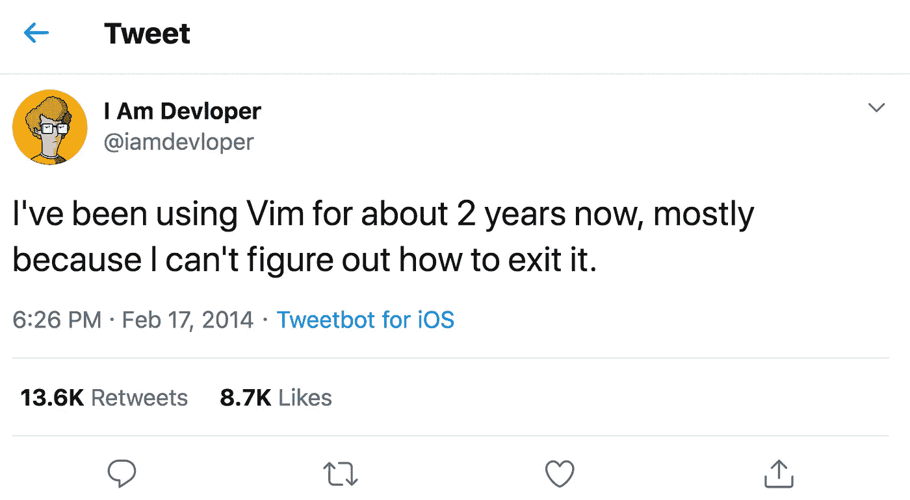
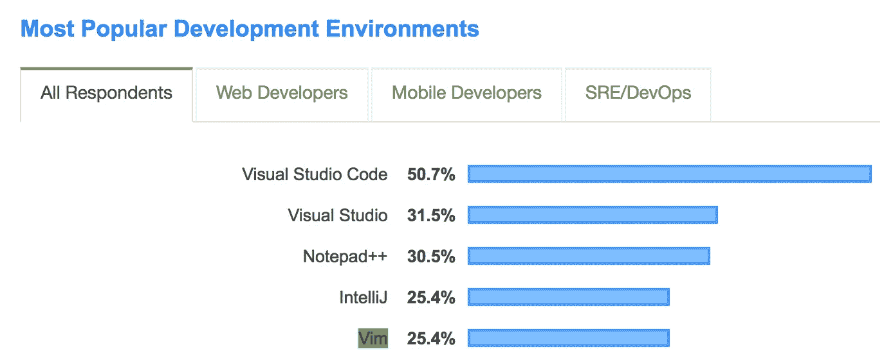
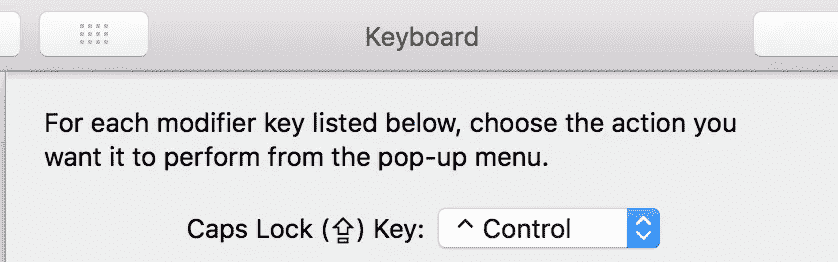
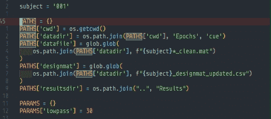
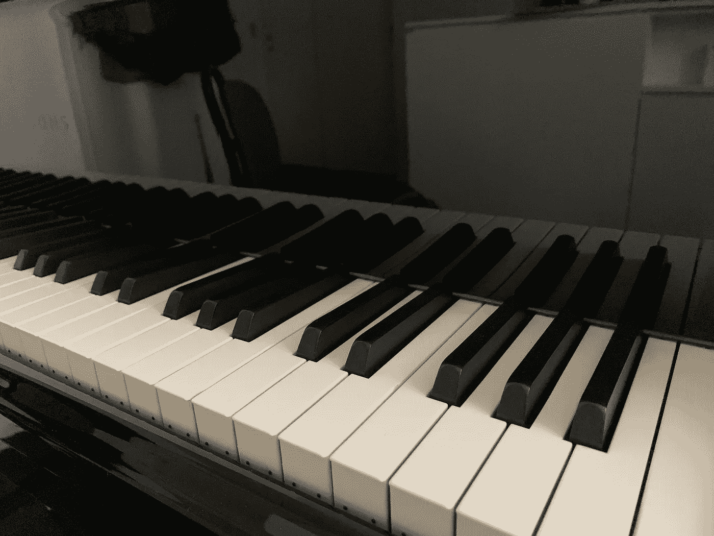

# 连续 15 天使用 Vim 后，我学到了什么

> 原文：<https://towardsdatascience.com/what-ive-learned-after-using-vim-15-days-straight-ceda7e773a6d?source=collection_archive---------25----------------------->

## 学习和生活课程

## 从 Vim noob 到业余爱好者的旅程

[发推文](https://twitter.com/iamdevloper/status/435555976687923200)强调 Vim 挑战的模因/笑话

# Vim 是什么？

Vim 代表**Vi**sual**Im**proven，一个最初为 Unix 创建的编辑器。

# 为什么使用 Vim？

## **很厉害**。

您可以非常快速地进行复杂的编辑。查看我的 [surround.vim 帖子](/how-i-learned-to-enjoy-vim-e310e53e8d56)来感受一下它的威力。

 [## 我是如何学会享受活力的

### 刻意的练习和环绕。vim 让我爱上了 Vim

towardsdatascience.com](/how-i-learned-to-enjoy-vim-e310e53e8d56) 

## **符合人体工程学。**

如果您知道如何触摸键入，使用 Vim 意味着您可以将手放在主行键上，而不必不断地将手移到箭头键、触控板或鼠标上。

## **到处都是。**

它安装在几乎每个系统上，而其他编辑器如 Emacs 和 Nano 可能不可用。它是跨平台的(适用于 Windows、macOS 和 Linux)。大多数系统中的默认编辑器是 Vim，因此至少知道如何使用它进行基本编辑，以及最重要的是如何退出 Vim ( `Escape :q!` then Enter)是很有用的。

如今，即使是笔记应用程序也可以让你使用 Vim。一款相对较新、非常流行且功能强大的笔记应用 [**Obsidian**](https://medium.com/@ausius/take-better-notes-with-this-free-note-taking-app-that-wants-to-be-your-second-brain-1a97909a677b) 使用 Vim 绑定:

 [## 使用这个免费的笔记应用程序做更好的笔记，它将成为你的第二大脑

### 黑曜石使连接想法变得容易，帮助你更好地思考和写作

medium.com](https://medium.com/@ausius/take-better-notes-with-this-free-note-taking-app-that-wants-to-be-your-second-brain-1a97909a677b)  [## 如何记笔记:来自人工智能、神经科学、社会学家和免费应用程序的见解

### 帮助您更好地记笔记和思考的见解和工具

medium.com](https://medium.com/@ausius/how-to-take-notes-insights-from-ai-neuroscience-a-sociologist-and-a-free-app-34b4be63080a) 

# 我为什么想学 Vim？

## **FOMO 或 f** 耳朵 **o** f **m** 丢失 **o** ut **。**

虽然许多人从来没有“了解”Vim，但是许多开发人员和程序员使用它，并且非常信赖它。Vim 用户是否知道一些非用户不知道的事情？我想给 Vim 一个机会，这样我就能理解为什么它如此两极分化，并看看 Vim 是否也会在我身上生长。

Vim 是最受欢迎的开发环境之一( [Stack Overflow 2019 调查](https://insights.stackoverflow.com/survey/2019#development-environments-and-tools))

## 我想挑战自己，提高我的工作效率。

我喜欢学习新的想法和生产力工具，并且我总是试图在学习方面做得更好。我认为学习 Vim 为实施和测试有效的学习策略提供了一个很好的机会。

 [## 2 元学习原则帮助你更有效地学习

### 高效获取知识和技能

medium.com](https://medium.com/@ausius/2-meta-learning-principles-to-help-you-learn-more-efficiently-44061c9951e1) 

## **我想说服自己，我不是一只老狗。**

我弹钢琴和打字已经快三十年了(分别从 5 岁和 7 岁开始)。学习 Vim 感觉真的很像学习如何弹钢琴和触摸打字——它包括学习新的手部动作和运动。

但是，当我大脑中的神经连接仍然具有高度可塑性时，我就获得了钢琴和打字技能；小时候，我的大脑就像一块海绵，急切地等待着吸收它遇到的一切。

我是不是变成了一只学不会新把戏的老狗？我不(想)相信那件事。我想证明自己是错的。我想说服自己，我仍然可以快速学习新技能。我想知道我还能重新连接我大脑中的神经通路。

# 我的学习计划

我没有制定或遵循任何具体的循序渐进的计划。缺乏计划看起来是个坏主意，特别是因为有效的学习通常需要在学习之前做好计划。但我并不担心，因为我心里已经有了一个项目。

*我的简单到可笑的项目和目标:从现在开始每天使用 Vim。*

我经常用 Python、R 和 JavaScript 编写代码，我的计划是只允许我自己使用 Vim 来编写代码。本尼·刘易斯用这种方法学会了流利地说多种语言。这应该也适用于维姆。

我预料会有挣扎，尽管我不确定会有多少挣扎。我告诉自己，每当我陷入困境时，我就会用谷歌搜索解决方案——这种策略应该会奏效，因为目前的形势(新冠肺炎)，大多数人的生产力都受到了影响，所以如果我因为 Vim(我是一名博士生)而行动缓慢，很可能没有人会问为什么。

在每一天结束时，我总结了我的一天，并记录了我的进展，你可以在下面看到。

# 第一天

**灰心丧气。艰难地移动光标。**

我学会了用`hjkl`导航和移动光标，以及 Vim 中的编辑模式:普通、插入和可视化。我还学会了如何用`d`删除文本，用`y`复制或拖动，用`v`选择。

我努力编辑文本，但没有完成多少工作。我的大部分时间都花在了在网上搜索解决方案，或者盯着我的显示器，努力记住该按哪个键。

Vim 用户经常将 Caps Lock 键重新映射到^控件

# 第二天

**痛苦而缓慢。艰难地选择和改变文本。**

我使用 Visual Studio 代码，所以我安装了 [Vim 扩展，](https://marketplace.visualstudio.com/items?itemName=vscodevim.vim)，它支持 Visual Studio 代码中的 Vim 键绑定。让自己完全沉浸在 Vim 中可能是最快的学习方法。

我还经常使用 [RStudio](https://rstudio.com/) ，并意识到我还可以启用 Vim 键绑定(选项>代码>键绑定)。糟糕透了——我挣扎着用 Vim 选择和编辑文本，并一直使用我的旧键盘快捷键。

 [## 4 个键盘快捷键，可高效编辑文本并提高工作效率

### 高效地在文本中导航和移动光标

medium.com](https://medium.com/better-programming/4-keyboard-shortcuts-to-edit-text-efficiently-and-improve-productivity-66894c8d51b8) 

我创建了一个文本文档来跟踪按键绑定。我还为 Anki 添加了几个重要的按键，这是一个空格重复的抽认卡应用程序，我已经用了将近十年了。从现在开始，每当我第一次学习新的按键绑定时，我都会添加到 Anki 中，这样我就可以定期查看它们，并将其保存在长期记忆中。

# 第三天

糟糕透了。我一定是做错了什么。

尽管我今天又学了几个动作，但我仍然在和 Vim 做斗争。比如我知道怎么用`vip`选择段落。但是，这仍然不是很好——过去我花 5 分钟完成的事情现在需要 10 分钟以上。因此，我别无选择，只能经常使用我的[非 Vim 键盘快捷键](https://medium.com/better-programming/4-keyboard-shortcuts-to-edit-text-efficiently-and-improve-productivity-66894c8d51b8)。否则，我将无法完成任何工作。

我开始怀疑我是不是做错了什么。不知道其他 Vim 用户刚开始用 Vim 的时候有多纠结？人们怎么才能学会喜欢这个怪物呢？

在 YouTube 上找了几个视频，打算明天去看。[其中一个](https://youtu.be/DAUxjfiD4hY?t=54)比较了使用和不使用 Vim 时手在键盘上的动作。这个视频有点说服我坚持下去。

# 第四天

**受到启发。隧道里的一些光。**

> 我喜欢维姆，因为我还没有达到极限。克里斯·图米

我今天看了几个 YouTube 视频，但是克里斯·图米的掌握 Vim 语言是一个启示。Chris 改变了我对文本编辑的看法:**我们大部分时间都在编辑现有文本，而不是编写新文本。我希望我在第一天就看到了这个视频。**

我意识到 Vim 旨在使编辑变得容易，而普通的文本编辑器只关注写作。我迷上了 Vim 并安装了 Vim，这样我也可以在 Firefox 中使用 Vim。

我对 Vim 的兴奋溢出到学习爵士钢琴(我是一个古典钢琴家)。我想做更多的事情来发展和重组我大脑中的连接。我认为这是明智地成长和衰老的关键。我练习了所有调的 ii-V-I 音级，遵循的是[四度循环](https://en.wikipedia.org/wiki/Circle_of_fifths#Structure_and_use)，这显然比古典音乐家使用的五度循环更适合爵士乐。

我不再使用`v`、`d`和`i`的组合来编辑文本，因为`ciw`已经成为我最好的朋友。

练习 ciw:改变一个内部单词重复。

# 第五天

**改进。我在维姆和爵士钢琴上变得更好。**

显然，要学习 Vim，你必须把鼠标当成你的死敌。使用鼠标会妨碍您学习 Vim 和提高。

我开始使用相对行号(`:set relativenumber`)——另一个游戏规则改变者。我现在可以更高效地浏览文档。我还使用`Shift }`和`Shift {`在段落或文本块之间导航。

我还听了[塞隆尼斯·蒙克](https://en.wikipedia.org/wiki/Thelonious_Monk)的钢琴独奏，并试着在我的钢琴上随机应变。

在过去的几天里，我也一直头痛得很厉害，我想知道这是否是我与 Vim 斗争的结果？

# 第六天

**兴奋。维姆成了我的朋友。**

`ct`和`cT`是我的新宠。我用它们来删除和修改从光标当前位置到某个字符的文本。

我使用阿尔弗雷德[并且总是重新映射⌘-space 来启动阿尔弗雷德而不是聚光灯。但是现在我想尽可能地保持我的手在 home 行键上，所以我现在用 Caps-lock-space 启动 Alfred(用我的左手小指和拇指；大写锁定已重新映射到第 1 天的^控制)。](https://www.alfredapp.com/)

我尝试在 bash 中用`set -o vi`启用 Vim，在 zsh 中用`bindkey -v`启用 Vim，但是我不太喜欢这种体验，所以我禁用了它。

# 第七天

**缓慢而稳步的进步。尽管还在挣扎。**

今天在 Visual Studio 代码中工作时，我经常使用 Ctrl-W 在窗口/窗格之间切换。过去花我 1 个小时的事情现在要花我 1.5 甚至 2 个小时。我从来没有这么努力去压抑和抑制我使用箭头键的习惯。

我想知道其他人用了多长时间才变得擅长使用 Vim？

# 第八天

**前路漫漫。**

今天用 Visual Studio 代码写了好几个小时的 Python，R，MATLAB 代码。我还发现了 [radian，](https://github.com/randy3k/radian)一个非常漂亮的 R 控制台。

我越来越擅长复制和粘贴，但粘贴后仍无法高效替换文本。观看[这个视频](https://www.youtube.com/watch?v=qxdg-nhMSmQ)有一点帮助——使用`f`或`t`跟随一个字符找到当前行中的字符，并按`;`或`,`前进到下一个或移动到上一个匹配的字符。

多亏了这个 [stackoverflow 问题](https://stackoverflow.com/questions/46181488/in-vim-how-to-search-and-replace-in-current-line-only)，我也学会了如何替换或替换当前行中的字符:`:s/old/new/g`将当前行中的所有`old`替换为`new`。要仅替换第一个匹配实例，请移除`/g`标志。

# 第九天

隧道还没有尽头。

我花了几个小时用 Visual Studio 代码把 Python 代码写成 PDF 文件。这花费了我比预期多得多的时间(不出所料)，但是在那之后，我在导航和编辑文本方面肯定感觉舒服多了。

# 第 10 天

**乐趣和快乐。**

我今天安装了我的第一个 Vim 插件。我故意避免安装任何插件，直到今天，因为我想确保在使用任何插件之前，我掌握了基本知识。

今天，我觉得我已经准备好使用一个插件了，尤其是如果我认为它会大大提高我的工作效率的话。我安装了 [surround.vim，](https://github.com/tpope/vim-surround)，这有助于修改事物周围的事物对——这是编程时非常常见的编辑。比如把`array(x)`变成`print(array(x))`，文字用括号括起来。我喜欢它。

我现在开始喜欢使用 Vim 了。事实上，我并不期待在 MATLAB 和 RStudio 的 ide 中无法使用 Vim 的地方编码。

# 第 11 天

**激动人心。**

今天我学习了许多新的动作和技巧。例如，我可以使用`%`在匹配的括号之间跳转。这很酷，对编程非常有用。

# 第 12 天

**更多学习**。

我今天开始做一个 JavaScript 和 Node.js 项目，一整天都在 Visual Studio 代码中使用 Vim。事实上，我今天用了将近 14 个小时的 Vim，并且有很多机会使用 surround.vim 插件。

vim 允许您添加、删除和更改成对的事物

# 第 13 天

**说 Vim。**

我读了几节[实用 Vim，](https://www.amazon.com/Practical-Vim-Thought-Pragmatic-Programmers/dp/1934356980)这显然是学习 Vim 的最佳书籍之一。

我已经开始欣赏维姆的哲学，感谢像维姆的[崇拜](http://www.more-onions.com/tech/2016/7/30/the-cult-of-vim)这样的文章。我觉得我终于开始说维姆语了。

> 在我看来，使用 vim 的正确方法是通常停留在正常模式，只在插入模式下进行短暂的输入。对维姆的崇拜

> vim 的“禅”是你在说一种语言，我学到的思考正常模式命令的一个好方法是作为一种语言，用动词、名词和形容词。动词是你的命令，如 *'c'* (改变)， *'d'* (删除)， *'y'* (猛拉)，名词是你的动作，如 *'w'* (单词)， *'}'* (段落)，或 *'G'* (eof)，形容词/副词是你的数字前缀和你的描述词，如 *'a'* vim 命令应该组合成“句子”，在更高的层次上，向 vim 描述您想要做什么。

我现在意识到了自己的无能，并且知道我需要在哪些具体技能上努力才能最快地提高。因此，我开始使用[刻意练习](https://medium.com/@ausius/2-meta-learning-principles-to-help-you-learn-more-efficiently-44061c9951e1)，一种强大的学习策略，来[提高我的 Vim 技能](/how-i-learned-to-enjoy-vim-e310e53e8d56)。

# 第 14 天

**结构。**

我今天买了 Udemy 的 Vim 大师班，因为我觉得我的学习中的一些结构可能会有所帮助。我完成了前几节，真的很喜欢。也许我应该在第一天就开始上这门课。

# 第 15 天

**毕业了。**

最近我觉得在 Visual Studio 代码中使用 Vim 很舒服，所以我再次尝试在 RStudio 中使用 Vim。第二天我很讨厌它，但今天还不算太糟，所以我可能会继续在 RStudio 中使用 Vim。

虽然只有两周加一天，但是我已经非常喜欢它了，以至于我决定写一篇关于如何使用 surround.vim 插件的教程，这个插件在让我喜欢上 vim 的过程中发挥了巨大的作用。

 [## 我是如何学会享受活力的

### 刻意的练习和环绕。vim 让我爱上了 Vim

towardsdatascience.com](/how-i-learned-to-enjoy-vim-e310e53e8d56) 

# 摘要

学习 Vim 提醒了我坚持的重要性，尤其是在最初挣扎的时候。我喜欢这种挑战，其中包括大量的学习、奋斗和真正的头痛。

但我最终还是让自己大吃一惊:我从没想过在短短的 15 天里，我就能和 Vim 有家的感觉。我从来没有想到学习 Vim 会激励我最终学习和练习爵士钢琴。

我的钢琴

毫无疑问，我越来越喜欢 Vim 我明白为什么它是一种疾病。

> TL；DR:如果你不使用 Vim，不要读这篇文章。或者如果你读了，不要相信它。继续使用你现在喜欢使用的东西。不要下维姆兔子洞。
> 
> ——Reddit 用户军团 b 在[r/程序员幽默](https://www.reddit.com/r/ProgrammerHumor/comments/338tx5/vim/)

对于那些总是试图改善自己的人来说，Vim 是会上瘾的。只要你每天都有时间和精力学习 Vim，你一定会找到提高的方法。

我不再像 15 天前甚至 5 天前那样纠结于 Vim。我每天都在进步，因为我经常使用它；但是就像每一种语言一样，我知道我永远也不会完全掌握 Vim，因为它太复杂了(无论如何,“完全掌握”某样东西又意味着什么呢？).这提醒了我应该如何生活——关注过程，不断成长，永不停滞。

*更多帖子，* [*订阅我的邮件列表*](https://hauselin.ck.page/587b46fb05) *。*