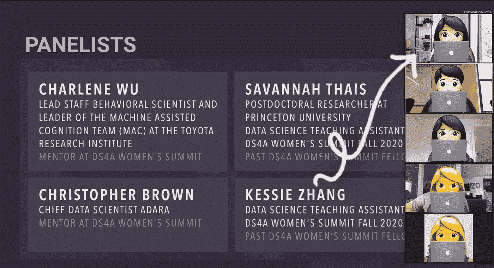

# 提高公众演讲技巧的 4 个技巧

> 原文：<https://towardsdatascience.com/what-ive-learned-as-a-first-time-webinar-speaker-f94419ce4729?source=collection_archive---------36----------------------->

## 作为第一次参加网络研讨会的演讲者，我学到了什么

在 [Unsplash](https://unsplash.com/s/photos/presentation?utm_source=unsplash&utm_medium=referral&utm_content=creditCopyText) 上由 [Nycholas Benaia](https://unsplash.com/@nycholasbenaia?utm_source=unsplash&utm_medium=referral&utm_content=creditCopyText) 拍摄的照片

我最近在一个由 [Correlation One](https://www.correlation-one.com/) 主办的关于导师效应的网络研讨会上发言，这是一个由领先雇主赞助的数据和分析培训项目。虽然这不是我第一次在众人面前发言，但我以前从未被邀请担任小组成员。作为一名新毕业生成为演讲者之一的想法听起来完全令人生畏，但却非常令人兴奋。我参加过许多数据科学会议，会上发言人分享了他们的成功故事。谁能想到有一天我也会被邀请来分享我的经历！我一直梦想有一天我会成为演讲者之一，激励人们，但我从来没有想到这一天会这么快到来。

我感到紧张，但兴奋地分享我的经历。(图片由作者提供)

在我的成长过程中，几乎所有的老师都告诉我，我在公开演讲方面会很糟糕，因为我太害羞了，从来不说话。我记得几年前，我的老板甚至建议我参加演讲会来提高我的公众演讲能力。我去年才意识到，我也可以成为一名优秀的公众演说家。

当我在 Metis 的时候，我必须为我参与的每个项目做一个报告。我记得在我第一次演讲后，我收到的第一个反馈是我需要畅所欲言。所以，我决定我必须提高我的公共演讲技巧。最后，我的老师和同事对我的成长印象深刻，这对我意义重大！不管你过去有多糟糕，你总是可以扩展你的技能。

在这个博客中，我想分享一些我学到的提高我公开演讲技巧的经验。

# 写你的演讲稿

一旦你准备好了演讲稿，你现在能做的就是准备你想说的话。但是你从哪里开始呢？

我从我想涵盖的主题的大致轮廓开始。实际上，就像我写任何博客文章一样。没有必要坚持你的大纲，但是有一个大纲可以让你保持在正轨上，这样你就不会错过任何东西。写演讲稿时，用你平时说话的方式来写。如果你想吸引观众的注意力，可以随意加入一些闲聊或幽默。如果你不确定如何写提纲，查阅一些例子会很有帮助。

在你想好你的主题后，你可以开始考虑你想在每个主题/问题上花多少时间。

如果这是一个演示文稿，我尽量不要在每张幻灯片上放超过三个项目符号。经验法则是不要在你的幻灯片上列出太多的细节，因为当你的听众可以直接从幻灯片上读出来的时候，听你的演讲还有什么意义呢！

# 实践

练习，练习，练习！除非你是那种可以不假思索地谈论任何事情的人，否则你需要做好准备。因为英语是我的第二语言，所以练习对我来说更重要。我是那种在压力下容易忘记该说什么的人。但是，如果你练够了，我敢保证这种尴尬的情况绝对不会发生！

检查你的幻灯片。你甚至可以自己计时。PowerPoint 允许你添加一个[屏幕计时器](https://support.microsoft.com/en-us/office/insert-an-on-screen-timer-4c3a70d3-8d59-4972-a368-8b4ffc31a606)，帮助你记录你在每张幻灯片上花了多少时间。这将有助于你确保在有限的时间内涵盖所有要点。我不建议在最后一刻改变你的牌，因为这会让你感到有些措手不及。你甚至可能会跳过幻灯片，因为你忘记了你想说什么。

如果你愿意多走一步，我建议你自己录下来。听完你自己的陈述后，你可以试着微调你的演讲。如果你自己都不相信自己说的话，你怎么能指望听众会相信呢？此外，这是一个记录你进步的好方法！

# 处理紧张情绪

你就快到了！！对许多人来说，在演讲前感到紧张是完全正常的。不骗你，我一紧张就会手心冒汗。那完全没问题！真正帮助我在演讲中保持冷静的一个方法是不要去想观众。你可以假装在和自己或家人说话。你也可以在远处找到几个点/物体，当你说话时聚焦在上面，这样看起来你好像在看着观众，而你并没有。

这也是我需要改进的地方。但是我相信我做得越多，我就会越好。你也是！

# 反馈

恭喜你！你做到了！！！如果你收到任何负面反馈，不要难过。如果有人愿意花时间批评你，你应该把它当成你成长和变得更好的机会。记住，只要你付出努力，一切都可以得到改善！

> *“我明白了，人们会忘记你说过的话，会忘记你做过的事，但人们永远不会忘记你带给他们的感受。”―玛娅·安杰洛*

我最怕的是人们会对我评头论足。事实证明，人们对你的评价远低于你对自己的评价。你可能认为人们可能永远不会忘记你做过或说过的令人尴尬的事情，但大多数人实际上都很健忘。他们可能不记得你到底说了什么，但他们会记得你是否自信。所以不用担心太多，去做就是了！

# 最后的话

最后，我想说的是，不要让你的现状决定你的未来。

> 如果你努力工作，保持专注，永不放弃，你最终会得到你想要的生活――唐纳德·米勒

我非常感激 Correlation One 邀请我成为小组成员之一。此外，我想对主办 [DS4A 节目](https://www.correlation-one.com/)的 Correlation One 大呼小叫。如果你对数据科学感兴趣，想接触招聘经理和招聘人员吗👥来自世界 500 强企业，并且有行业导师指导，不要犹豫，赶紧申请吧！

**感谢阅读！我希望这篇博客对你有所帮助。**

如果你喜欢我的内容，请关注我❤️，看看我最近的博客:

 [## 用例子理解和选择正确的概率分布

### 举例说明最常见的离散概率分布

towardsdatascience.com](/understanding-and-choosing-the-right-probability-distributions-with-examples-5051b59b5211)  [## 作为分析师如何准备商业案例面试？

### 作为数据分析师或数据科学家，我们不仅需要知道概率和统计，机器学习算法…

towardsdatascience.com](/how-to-prepare-for-business-case-interview-as-an-analyst-6e9d68ce2fd8)  [## 构建电子商务产品推荐系统:第二部分——模型构建

### 这个博客是我之前工作的延续，在我之前的工作中，我谈到了我是如何收集产品评论和…

medium.com](https://medium.com/@kessiezhang/building-a-product-recommendation-system-for-e-commerce-part-ii-model-building-8b23a9b3ac27)  [## 为电子商务建立一个产品推荐系统:第一部分——网络搜集

### 今天，如果我们想到机器学习在商业中最成功和最广泛的应用，推荐者…

medium.com](https://medium.com/@kessiezhang/building-a-product-recommendation-system-for-e-commerce-part-i-web-scraping-798b6251ab51)  [## 如何将 Jupyter 笔记本转换成 PDF

### 用几行代码将 Jupyter 笔记本转换为 pdf(调试“500:内部服务器错误”)

towardsdatascience.com](/how-to-convert-jupyter-notebooks-into-pdf-5accaef3758)