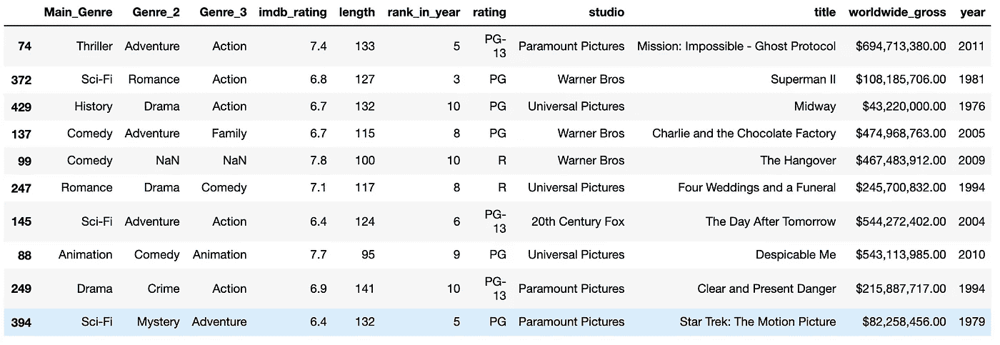
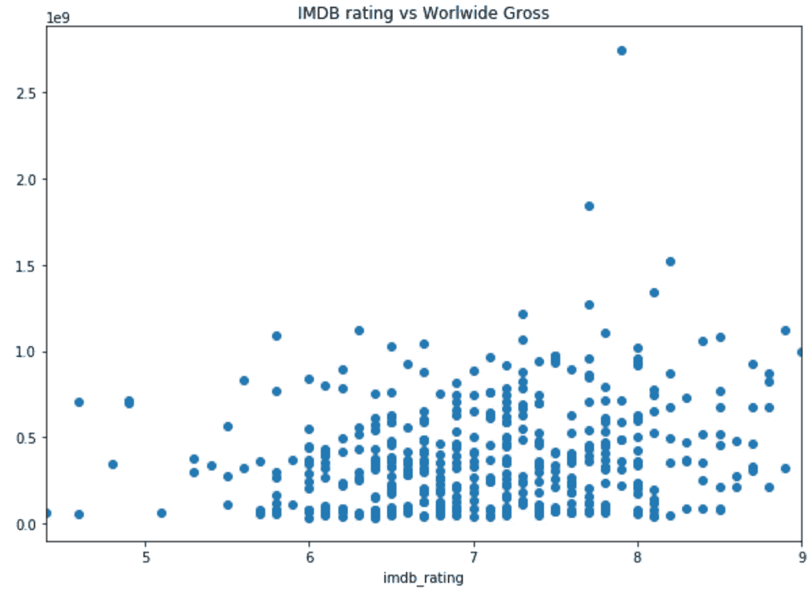
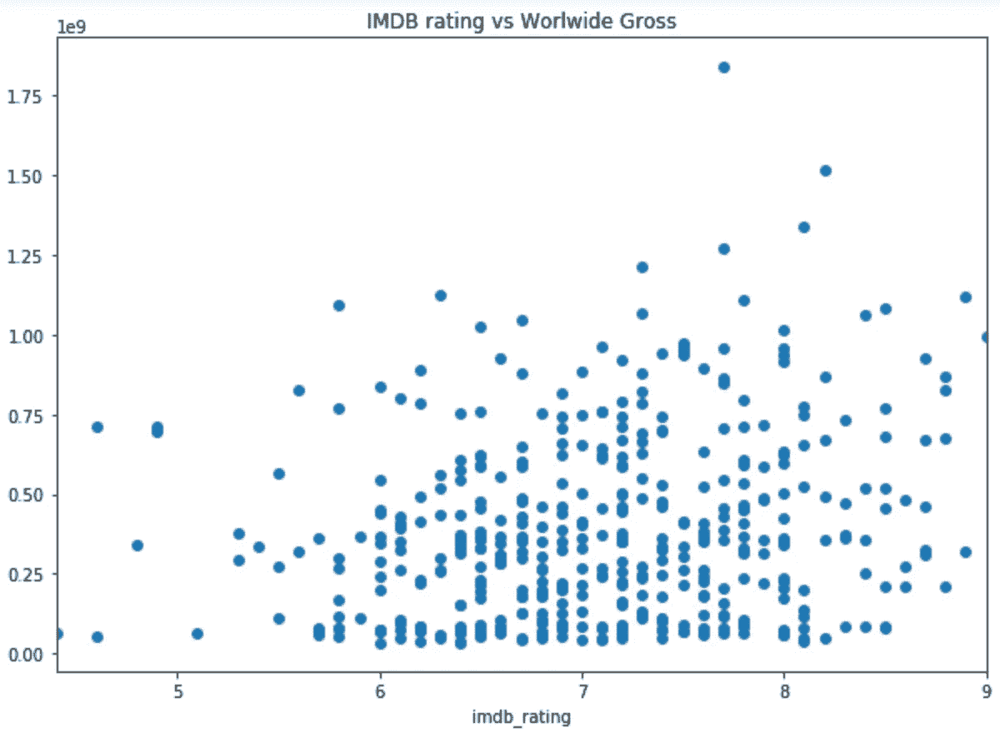
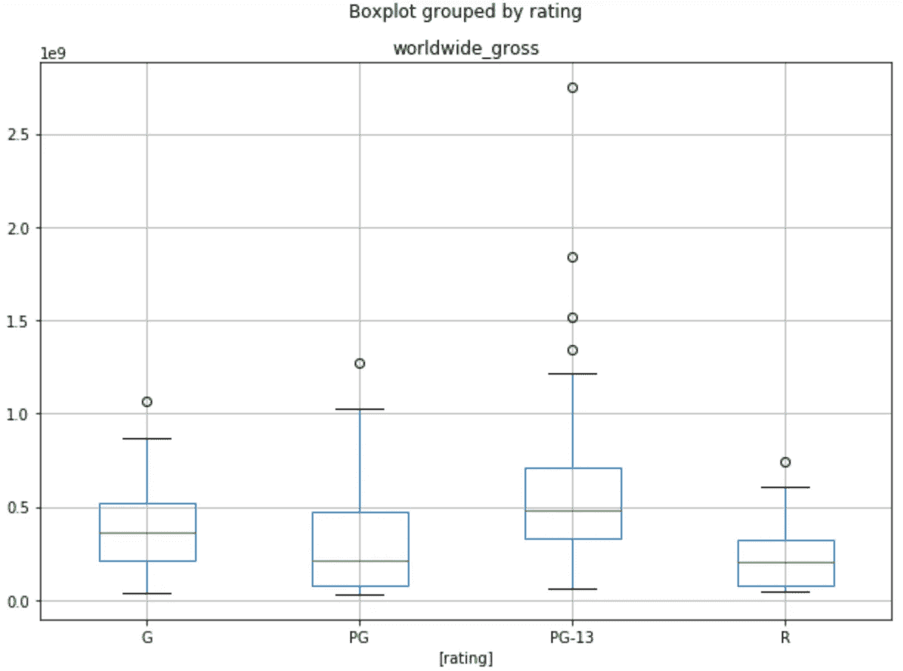
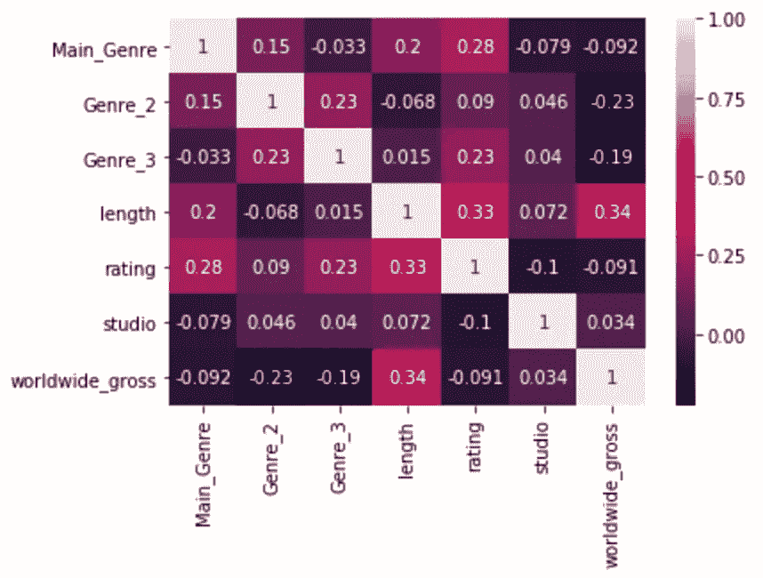

# 什么是高票房电影？

> 原文：<https://towardsdatascience.com/what-makes-a-high-grossing-movie-41ce3b2d0a6f?source=collection_archive---------54----------------------->

## 分析 44 年来最好的电影能告诉我们是什么造就了一部伟大的电影吗？

我发现了一个 Kaggle 数据集，我认为深入研究它会很有意思:[票房最高的 10 部电影(1975 年至 2018 年)](https://www.kaggle.com/bidyutchanda/top-10-highest-grossing-films-19752018) —这是一个很好的突破，远离了充斥着我们信息的新冠肺炎新闻！

**我想从这些数据中回答 3 个问题:**

1.  imdb 评分越高的电影票房就越高吗？
2.  票房较高的电影是因为它们面向更广泛的观众吗？
3.  电影票房能否在上映前根据数据集中的参数进行预测？

照片由[克里斯特·卢哈尔斯](https://unsplash.com/@kristsll?utm_source=unsplash&utm_medium=referral&utm_content=creditCopyText)在 [Unsplash](https://unsplash.com/s/photos/movie?utm_source=unsplash&utm_medium=referral&utm_content=creditCopyText) 拍摄

这是我正在使用的数据的快照:

原始数据集的样本。

让我们假设我们已经清理了所有的数据(关于探索和清理数据的细节，你可以查看[这篇文章](/explore-and-clean-first-steps-of-any-data-project-976a1d80d7aa)):它是我想要的格式，我知道那里有什么…现在让我们开始回答问题的有趣部分。

## 问题 imdb 评分越高的电影票房就越高吗？

为此，我比较了 IMDB 评级和全球总票房，看看是否有某种趋势。希望一个简单的情节能在这里给我们一个明确的答案…

IMDB 评分与每部电影的全球总票房之比

遗憾的是，从这个情节中我们真的看不出太多东西。似乎根本没有明显的趋势。从图上看，这很可能是因为在 7.8 的收视率和 27 亿的总票房之间有一个明显的异常点。那一点可能会扭曲图表…如果我们移除那一点，或许还有一些希望。

IMDB 评分与每部电影全球总票房的比较(不包括异常)

这里我们可以看到，除去异常的结果，我们仍然看不到太多的趋势。

**回答 1:不，我们不能说票房收入越高的电影在 imdb 上的评分就越高。**

## 问题 2:票房高的电影是因为它们面向更广泛的观众吗？

对于这一个，我正在看电影的适当观众年龄组的指定评级和电影的全球总收入。这将是一个有趣的问题，因为理论上分级为 G 的电影可以被任何人观看，而分级为 R 的电影只能被 18 岁以上的人观看。

每个收视率类别的全球总票房柱状图

在上图中，我们可以看到每个评级类别的总收入分布。最初，当你看剧情的时候，你可能会惊讶于向更多观众开放的电影比那些 PG-13 级别的电影票房低。

但是仔细想想，我们应该感到惊讶吗？

对这种趋势的一种可能的解释是，分级为 G 和 PG 的电影，尽管所有观众都可以观看，但很可能特别针对儿童。因此，大多数成年观众对它们不感兴趣。r 级电影自然不包括年轻人，而且经常被评为 r 级电影，因为其中的暴力、脏话和色情镜头可能会让观众倒胃口。

PG-13 电影可能对许多年轻观众(实际上是 13 岁以上)有合适的中间立场，但对更保守的成年观众来说不会太令人反感。PG-13 电影拥有最广泛的现实观众，而不仅仅是纸上谈兵，适合可以观看的年龄。

答案 2:是的(某种程度上)，吸引最多观众(即 PG-13)而不是理论上最多观众的电影是票房最高的电影。

## 问题 3:电影票房能否在上映前根据数据集中的参数进行预测？

这是一个要解决的复杂问题…数据集中有很多数据，关键是要找出什么对预测一部电影的成功有用。

我们可能都有自己对成功电影的理解——也许我们认为大多数人会去看动作片？或者实际上，理想的电影长度是 100 分钟左右，因为它足够长，可以让你安定下来，但又不会太长，让你感到无聊？但是到底是什么影响了一部电影的票房呢？

根据过去的数据，这是一个关于电影预发行的已知事物及其成功程度的关联图:

数据集中参数的相关性

具体来看我们真正关心的栏目:*全球总收入*。嗯，看起来电影的长度是电影成功的最大影响因素——它在两个不同变量之间有最高的正值 0.34。尽管如此，考虑到最高相关性是 1，它也不是那么高。

当使用这些参数来尝试和预测一部电影的成功时，事情并不像希望的那样顺利！预测相当糟糕，也许是因为我们知道的预发行的不同东西和最终的全球总票房之间的相关性很低。

**回答 3:不，我们不能预测一部电影预发行的成功。至少不仅仅是这个数据集中的数据。**

## 最后的话

看着这个数据集，44 年来每年票房最高的 10 部电影，我们可以确定以下几点:

1.  imdb 评分越高的电影票房就越高吗？**否**
2.  票房收入高的电影是因为它们面向更广泛的观众吗？**是的(算是)**
3.  电影票房能否在上映前根据数据集中的参数进行预测？**否**

***那些崭露头角的电影制作人真不幸——看起来没有简单的公式可以让你赚到数百万！***

## 全部结果

如果你想看我的完整分析，你可以在我的 [GitHub 库](https://github.com/shrutiturner/highestgrossingmovies)中找到。或许你可以创建一个更强大的模型来预测一部电影的全球票房？