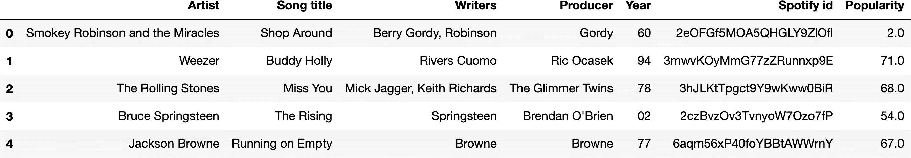
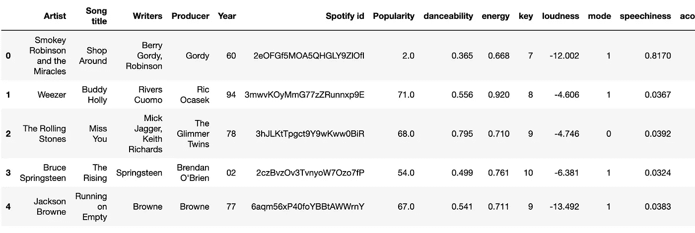

# 是什么让一首歌伟大？第二部分

> 原文：<https://towardsdatascience.com/what-makes-a-song-great-part-2-e82a44be659c?source=collection_archive---------47----------------------->

## [是什么让一首歌如此伟大](https://towardsdatascience.com/tagged/what-makes-a-song-great)

## 通过 Spotify 的 Python 分析滚石的 *500 首最棒的歌曲*


约翰·马特丘克在 [Unsplash](https://unsplash.com?utm_source=medium&utm_medium=referral) 上拍摄的照片

**【这是** [**系列三篇文章中的第二篇**](https://towardsdatascience.com/tagged/what-makes-a-song-great)

**在[第 1 部分](/rollingstone-for-medium-f1f638b9568e)中，我们研究了如何从网络上检索数据。在本文中，我们将更多地关注与 API 的交互和使用 Pandas。**

## **从 Spotify API 获取数据。**

**以前我们使用网络抓取来获得一个包含滚石乐队有史以来 500 首最伟大歌曲的数据框架。如果我们想创建一个 Spotify 播放列表呢？或者，更好的是，从 Spotify 获得更多数据来补充我们的数据？我们可以通过查询并发布到 Spotify 的 API 来实现。最简单地说，应用程序编程接口(或“API”)只是服务器的一部分，当您的浏览器或应用程序从互联网发送和检索数据时，它会与服务器进行交互。当你在 Spotify 中将一首歌添加到播放列表中，或者查看一首歌的时长时，你正在与它的 API 进行交互。**

**这是了解更多信息的良好起点:**

**[](https://medium.com/@perrysetgo/what-exactly-is-an-api-69f36968a41f) [## API 到底是什么？

### 你有没有听说过“API”这个词，并想知道这到底是什么？你是否有一个模糊的想法，但是…

medium.com](https://medium.com/@perrysetgo/what-exactly-is-an-api-69f36968a41f) 

## 步骤 1:设置

前往 Spotify 的 API [仪表盘](https://developer.spotify.com/dashboard/applications)，用你的标准账户登录，点击“创建应用”。从那里你应该复制*客户端 id* 和*客户端秘密*。这些将是您登录 API 所需的凭证。将它们粘贴到一个`.txt`文件中是个好主意(我的文件叫做`Spotify.txt`——见下文)。
现在我们可以连接到 API，如下所示(T2 行是避免忘记关闭文件的简洁方法):

```
file = 'Spotify.txt'# replace this with the path and file name you use
with open(file,'r') as f: 
    f = f.read().splitlines()
    cid = f[0].split(':')[1]
    secret = f[1].split(':')[1]client_credentials_manager = SpotifyClientCredentials(client_id=cid, client_secret=secret)
sp = spotipy.Spotify(client_credentials_manager=client_credentials_manager)
```

Python 有一个很棒的库叫做`spotipy`(就是上面代码中的`sp`)，这使得这比平常容易得多。[在这里](https://spotipy.readthedocs.io/en/2.13.0/)你可以阅读文档。或者像我一样，你可以通过阅读 Medium 上的一篇文章来了解一下——我推荐这篇:[https://Medium . com/@ samlupton/spot ipy-get-features-from-your-favorite-songs-in-python-6d 71 f 0172 df 0。](https://medium.com/@samlupton/spotipy-get-features-from-your-favourite-songs-in-python-6d71f0172df0.)

## 步骤 2:检索数据

现在让我们开始有趣的部分。为了从 Spotify 下载数据，我们首先检索 500 首歌曲中每一首的`track id`。让我们以*我的女孩*为例，由*诱惑*创作。

我们将从数据帧中提取艺术家和歌曲名称，并将结果传递给`spotipy`的`.search()`方法。

```
artist = df.Artist[412]
track = df['Song title'][412]
artist, track('The Temptations', 'My Girl')track_id = sp.search(q='artist:' + artist + ' track:' + track, type='track')
track_id{'tracks': {'href': 'https://api.spotify.com/v1/search?query=artist%3AThe+Temptations+track%3AMy+Girl&type=track&offset=0&limit=10',
  'items': [{'album': {'album_type': 'album',
     'artists': [{'external_urls': {'spotify': 'https://open.spotify.com/artist/3RwQ26hR2tJtA8F9p2n7jG'},
       'href': 'https://api.spotify.com/v1/artists/3RwQ26hR2tJtA8F9p2n7jG',
       'id': '3RwQ26hR2tJtA8F9p2n7jG',
       'name': 'The Temptations',
       'type': 'artist',
       'uri': 'spotify:artist:3RwQ26hR2tJtA8F9p2n7jG'}],
     'available_markets': ['AD',
      'AE',
      'AL',
      'AR',
      'AT',
      'AU',
      'BA',

   [...]

  'previous': None,
  'total': 143}}
```

虽然这看起来很可怕，但它是一个 [JSON 对象](https://www.w3schools.com/whatis/whatis_json.asp)，它的行为非常像一个 Python 字典。稍微检查一下就会发现，例如，如果一个列表本身是第一个键-值对(例如`{tracks : ...}`)中键`items`的值，那么实际的`id`是作为第一个项目中键 `id`的值嵌套的。同样，稍微挖掘一下，我们就能找到这首歌的`popularity`属性。

```
id_ = track_id['tracks']['items'][0]['id']popularity = track_id['tracks']['items'][0]['popularity']
```

现在我们可以把所有东西放进一个函数里。因为一些搜索可能没有结果，我们将使用`try... except...`块[处理异常](https://www.programiz.com/python-programming/exception-handling)。注意第 4 行中使用了`.zip()`函数，以避免更复杂的迭代。然后，我们检索数据并将其添加到我们的数据帧中。

```
def get_spotify_data(dataframe):
    """
    Takes a dataframe as input.
    Returns a list of track ids and a list of popularity scores from the Spotify API. 
    """
    from numpy import nan # we import np.nan to handle empty queries 
    track_ids = []
    popularities = []
    for [artist, song] in list(zip(dataframe['Artist'], dataframe['Song title'])):
        try:
            song_data = sp.search(q='artist:' + artist + ' track:' + song, type='track')
            track_id = song_data['tracks']['items'][0]['id']
            popularity = song_data['tracks']['items'][0]['popularity']
            track_ids.append(track_id)
            popularities.append(popularity)
        except:
            track_ids.append(nan)
            popularities.append(nan)
    return track_ids, popularitiestrack_ids, popularities = get_spotify_data(df)df['Spotify id'] = track_ids
df['Popularity'] = popularitiesdf.head()
```



很好。让我们使用 pandas 的`.isnull()`来检查我们的函数是否返回了任何丢失的值:

```
df.isnull().sum()Artist         0
Song title     0
Writers        0
Producer       0
Year           0
Spotify id    13
Popularity    13
dtype: int64
```

我们的查询没有返回 13 个项目。为了简洁起见，我将把它们从数据帧中删除。我可能会在稍后阶段添加一个解决方法。

```
df.dropna(inplace=True)
```

## 步骤 3:获取数据帧中的音频特征

Spotify 还跟踪音频功能，如可跳舞性、拍号、速度。我们可以通过将一个轨迹的 id 传递给它的`audio_features`方法来访问那些带有`spotipy`的。我将向你展示两种做这件事的方法。首先，我使用 Python 的[列表理解](https://docs.python.org/3/tutorial/datastructures.html#list-comprehensions)，这是一个稍微高级一点的特性，允许你以非常简洁的方式迭代地创建列表。但是如果感觉更舒服的话，你可以使用标准的`for`环。
点击[这里](https://developer.spotify.com/documentation/web-api/reference/tracks/get-audio-features/)了解 Spotify 音频功能的更多信息。

```
# using list comprehension
features = [sp.audio_features(id_) for id_ in df['Spotify id']]
features[0]#using a 'for' loop
features_2 = []
for id_ in df['Spotify id']:
    feature = sp.audio_features(id_)
    features_2.append(feature)*# Look at an example*features_2[0][{'danceability': 0.365,
  'energy': 0.668,
  'key': 7,
  'loudness': -12.002,
  'mode': 1,
  'speechiness': 0.817,
  'acousticness': 0.836,
  'instrumentalness': 2.58e-05,
  'liveness': 0.911,
  'valence': 0.216,
  'tempo': 53.071,
  'type': 'audio_features',
  'id': '2eOFGf5MOA5QHGLY9ZlOfl',
  'uri': 'spotify:track:2eOFGf5MOA5QHGLY9ZlOfl',  'track_href': 'https://api.spotify.com/v1/tracks/2eOFGf5MOA5QHGLY9ZlOfl',
  'analysis_url': 'https://api.spotify.com/v1/audio-analysis/2eOFGf5MOA5QHGLY9ZlOfl',
  'duration_ms': 217720,
  'time_signature': 4}]
```

我们有一个列表列表，每个列表对应一首歌，包含一个字典。下面是我们如何将每个功能添加到数据框中的相应列:

1.  创建特征列表
2.  遍历列表创建一个字典。键将对应于列名，值将是包含实际音频特性的列表
3.  接下来，遍历特性列表，用字典的 items()方法检索音频特性的标签和值对。追加到我们创建的字典中。
4.  用 for 循环将字典中的每一项作为新列添加

```
#STEP 1
k = list(features[0][0].keys())# STEP 2
dict_list = {} 
for key in k:
    dict_list[key] = []# STEP 3
for i in features:
    item = i[0].items()
    for pair in item:
        key, value = pair
        dict_list[key].append(value)# STEP 4
for key in dict_list.keys():
    df[key] = dict_list[key]
```

因为我们不需要一些列，所以我会去掉它们，看看我们的数据框架。

```
columns_to_drop = ['tempo', 'type', 'id', 'uri', 'track_href', 'analysis_url']
df.drop(columns_to_drop, axis=1, inplace=True)df.head()
```



完整的数据帧

我们都准备好了。在下一篇文章中，我们将最终开始探索和可视化我们的数据集。我希望你喜欢并学到了一些有用的工具。**