# 是什么造就了好酒…好酒？

> 原文：<https://towardsdatascience.com/what-makes-a-wine-good-ea370601a8e4?source=collection_archive---------19----------------------->

## 利用机器学习和部分依赖图寻找好酒

我不知道你怎么样，但我现在肯定想喝点酒。但不是一般的酒，而是好酒。品尝起来平衡、复杂而悠长的葡萄酒。很难说这些*实际上是什么意思*，Buzzfeed 的这些家伙肯定很难用语言描述好酒。

BuzzFeed 视频

当然，*葡萄酒的复杂性和深度*是难以捉摸的概念。但是，如果我们能够用数字准确地描述是什么让葡萄酒如此令人愉快呢？

在这篇博文中，我会

1.  使用 UCI 葡萄酒质量数据集，定性解释葡萄酒的化学特性为何令人满意。
2.  解释如何使用**部分相关图来解释葡萄酒的哪些化学特性是理想的。**
3.  在数据集上建立机器学习模型。
4.  用 python 绘制并解释**部分依赖图**。

所以我做了一点研究，从一个化学家的角度观察了品酒的世界。

# 1.用数据理解好酒

## 葡萄酒的什么化学特性使它令人向往？

为了理解是什么造就了一款好酒，我使用了 UCI【1】的[葡萄酒质量数据集。该数据集包含了 1599 个葡萄酒样品的化学性质和口味测试结果。这项研究中的葡萄酒是葡萄牙 Vinho Verde 葡萄酒的红色和白色变种，尽管我在这篇文章中只使用红色变种的数据。](https://archive.ics.uci.edu/ml/datasets/wine+quality)

葡萄酒由以下成分组成。


葡萄酒的成分。作者插图

1.  **酒精**。葡萄酒通常含有 5-15%的酒精。这就是让我们热爱葡萄酒的化合物。
2.  酸:酸赋予葡萄酒独特的酸味。缺乏固定酸度的葡萄酒被认为是平淡的或松软的 T21，这意味着它们的味道是单一的。葡萄酒中的酸度有两种来源。一种是天然存在于葡萄中的酸，用于发酵葡萄酒并带入葡萄酒中(固定酸*)。二、酵母或细菌发酵过程中产生的酸(*挥发性酸)。**

*   *固定酸度。这些“固定酸”是不容易蒸发的酸。它们是[酒石酸、苹果酸、柠檬酸或琥珀酸，](https://waterhouse.ucdavis.edu/whats-in-wine/fixed-acidity])它们大多来源于用来发酵葡萄酒的葡萄。*
*   *挥发性酸度。“挥发性酸”是在低温下挥发的酸。这些主要是醋酸，[能让酒尝起来像醋](https://rstudio-pubs-static.s3.amazonaws.com/57835_c4ace81da9dc45438ad0c286bcbb4224.html)。*
*   *柠檬酸。柠檬酸被用作一种[酸补充剂](https://www.randoxfood.com/why-is-testing-for-citric-acid-important-in-winemaking/)，增加葡萄酒的酸度。*

*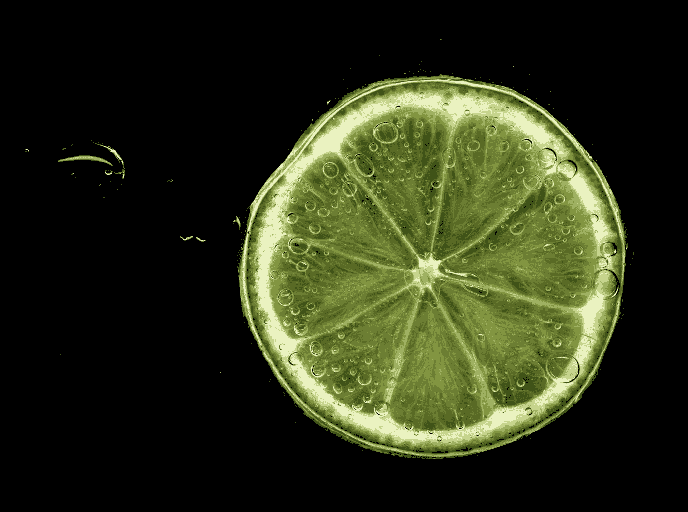*

*柠檬酸是水果中常见的天然酸。照片由[莱斯利·戴维森](https://unsplash.com/@lee_jay_dee?utm_source=medium&utm_medium=referral)在 [Unsplash](https://unsplash.com?utm_source=medium&utm_medium=referral) 拍摄*

*3.**残糖。**发酵过程中，酵母消耗糖分产生酒精。[酵母发酵葡萄酒后剩下的糖量称为残糖。](https://winefolly.com/deep-dive/what-is-residual-sugar-in-wine/)不出所料，残糖越高，酒味越甜。另一方面，尝起来不甜的酒被认为是干的。*

*4.**含硫化合物。**二氧化硫是酿酒中常用的化合物。它可以防止葡萄酒氧化和坏细菌的渗透，使其成为葡萄酒的神奇防腐剂。这些硫化合物可以进一步分为以下几种:*

*   **游离二氧化硫。*当二氧化硫添加到葡萄酒中时，[只有 35-40%以游离形式产生](https://www.terlatowines.com/knowledge/sulfur-dioxide-and-its-role-winemaking)。当以较大数量和较小批次添加时，可获得较高的游离 SO2 浓度。在其他条件不变的情况下，游离二氧化硫含量越高，防腐效果越强。*
*   **固定二氧化硫。*游离 SO2 与葡萄酒中的微生物强烈结合，产生*固定* SO2。如果葡萄酒中固定二氧化硫含量很高，这可能意味着[氧化或微生物腐败已经发生](https://www.awri.com.au/industry_support/winemaking_resources/fining-stabilities/microbiological/avoidance/sulfur_dioxide/)。*

***5。氯化物**。葡萄酒中氯化物盐的含量。不同地理、地质和气候条件的[出产的葡萄酒会有所不同。例如，靠近海边的葡萄园生产的葡萄酒比远离海边的葡萄酒含有更多的氯化物。](http://www.oiv.org/public/medias/2604/oiv-ma-d1-03.pdf)*

# *2.利用机器学习预测好酒*

## ***如何用偏相关图解释预测的葡萄酒质量***

*有了对葡萄酒令人满意的原因的这种理解，我们可以建立一个机器学习模型，根据葡萄酒的化学性质来预测葡萄酒的高质量和低质量。机器学习模型的结果可以使用部分相关图来解释，部分相关图在机器学习模型的所有特征中“隔离”个体特征，并告诉我们个体特征如何影响葡萄酒质量预测。*

> *M 更正式地说，部分依赖图可视化了一个特性对机器学习模型预测结果的边际效应[2]。*

*这似乎有点难以理解。我们从视觉上分解一下。*

## *部分相关图的可视化指南*

*想象一下，我们有一个经过训练的机器学习模型，它接受一些特征(酒精百分比、硫酸盐含量、pH 值和密度)，并输出对葡萄酒质量的预测，如下所示。*

**

*假设我们有以下表格格式的数据点。*

**

*我们把这个输入到训练好的机器学习模型中。瞧，模型根据这些特征预测葡萄酒质量得分为 5。*

*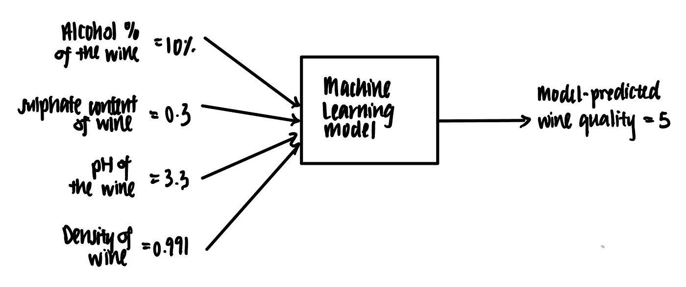*

*现在，我们增加数据点的数量，这样我们就有 5 个数据点，而不是 1 个数据点。*

**

*假设我们对酒精含量如何影响模型对葡萄酒质量的预测感兴趣。为了使“酒精含量”分布的模型边缘化，我们计算了所有其他特征(即硫酸盐含量、pH 值和密度)的平均值，如下表最后一行**所示。***

*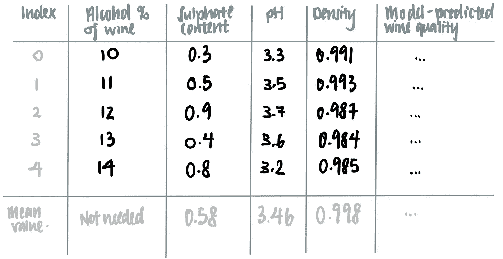*

*然后，我们将每种葡萄酒的酒精含量，以及硫酸盐含量、pH 值和密度的平均值输入机器学习模型。*

**

*使用这个逻辑，我们制作了部分相关图的如下表格表示。*

**

*然后我们可以用模型预测的葡萄酒质量对葡萄酒的酒精含量来绘制图表。这被称为**部分依赖图**。*

**

## *部分相关图背后的数学*

*下面是部分相关图的更严格的定义，它可以跳过而不损失连续性。*

*我们首先假设机器学习模型是一个函数 f，它接受所有特征 x 并输出一个预测 f(xs)。我们感兴趣的是发现输入特征 xs 的*之一*对预测的影响，而我们对所有其他输入特征 xc 对预测的影响不感兴趣。换句话说，我们希望隔离输入特征 xs。为此，我们*在特征 xc 的分布上边缘化*机器学习模型，这被视为 P(xc)。在这样的边缘化之后，我们获得机器学习模型对特定特征 xs 的*部分依赖函数。**

**

*在统计学中，我们可以通过大数定律用 xc 的所有值的和来近似 xc 的分布上的积分。这里，n 是数据集中的数据数量，而 xc 是来自我们不感兴趣的特征的数据集中的实际值。*

**

*让我们在数据集中应用这个公式。为了获得特征 ***酒精*** *对预测结果* ***质量的部分依赖图，我们使用以下等式。****

**

*请注意，在其他特征(如 pH 值、密度、硫酸盐)上有一个上标 *i* ，但在酒精上没有这样的上标 *i* 。这是因为我们对其他特征求和以获得其他特征的平均值。这些特征中的每一个的平均值与酒精的第 I 个值一起被输入到机器学习模型中以产生预测，如下例所示。*

# *4.构建葡萄酒质量预测的机器学习模型*

## *数据导入*

*既然我们理解了什么是部分相关图，让我们将它应用于我们的数据集。首先，我们把数据下载到 [UCI 站点](https://archive.ics.uci.edu/ml/datasets/wine+quality)。*

```
*import pandas as pddf = pd.read_csv('winequality-red.csv',delimiter=';')*
```

## *数据探索*

*数据集不包含任何丢失的数据，并且被认为足够干净，可以按原样使用。因此，我们可以从一些数据探索开始:*

1.  *我们看到数据集主要包含中等质量的葡萄酒(得分为 5-6)。*

```
*import seaborn as sns
import matplotlib.pyplot as pltplt.figure(figsize=(10,5))
sns.distplot(df['quality'],hist=True,kde=False,bins=6)
plt.ylabel('Count')*
```

**

*3.我们看到一些变量，如硫酸盐、酒精和柠檬酸含量似乎与质量相关。*

```
*fig = plt.figure(figsize=(15, 15))
var = 'sulphates' #or alcohol, citric acid
sns.boxplot(y=var, x='quality', data=df, palette='Reds')*
```

***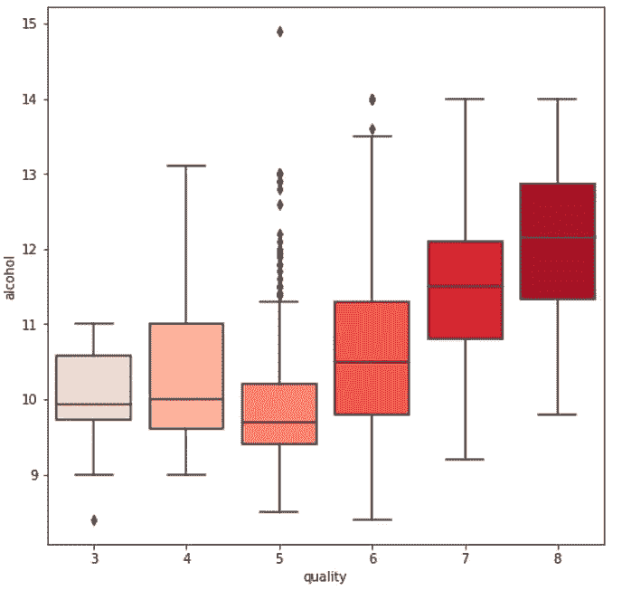***

*4.我们还观察到，一些变量似乎与质量的相关性较弱，如氯化物和残糖含量。*

*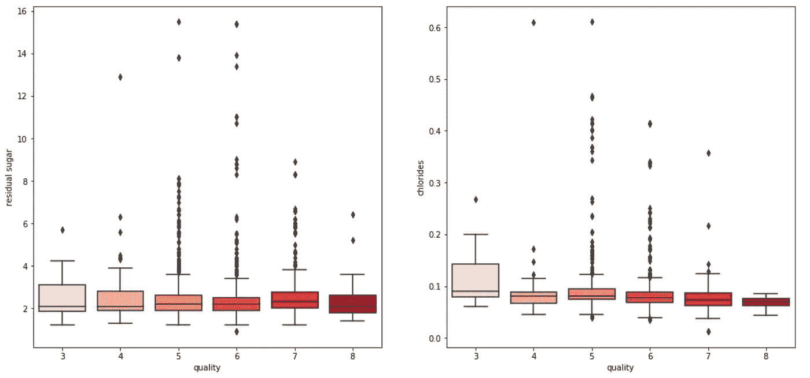*

## *模型结构*

*让我们快速建立一个机器学习模型，根据葡萄酒的所有化学性质来预测葡萄酒的质量分数。*

*这里，我们使用 25–75 的训练-测试分割比将数据分割成训练和测试数据集。*

```
*# Using Skicit-learn to split data into training and testing sets
from sklearn.model_selection import train_test_split# Split the data into training and testing sets
features = df.drop(['quality','pH','pH_class'], axis=1)
labels = df['quality']train_features, test_features, train_labels, test_labels = train_test_split(features, labels, test_size = 0.25, random_state = 42)*
```

*然后，我们将训练数据输入随机森林回归器。这里，没有进行超参数调整，因为这不是本文的重点。*

```
*from sklearn.ensemble import RandomForestRegressor
est = GradientBoostingRegressor()
est.fit(train_features, train_labels)*
```

*现在，让我们看看如何在 python 中使用！幸运的是，我们有一个优雅的包——[*PDP box 包*](https://github.com/SauceCat/PDPbox)*——*，它允许我们轻松地绘制部分相关性图，该图可视化了某些特征对所有 SKlearn 监督学习算法的模型预测的影响。太神奇了！*

*让我们首先安装 pdpbox 包。*

```
*!pip install pdpbox*
```

*接下来，我们绘制每个变量对质量分数的部分依赖图。*

```
*features = list(train_features.columns)for i in features:
    pdp_weekofyear = pdp.pdp_isolate(model=est, dataset=train_features, model_features=features, feature=i)
    fig, axes = pdp.pdp_plot(pdp_weekofyear, i)*
```

# *各特征对葡萄酒质量的偏相关图*

## *酸性*

*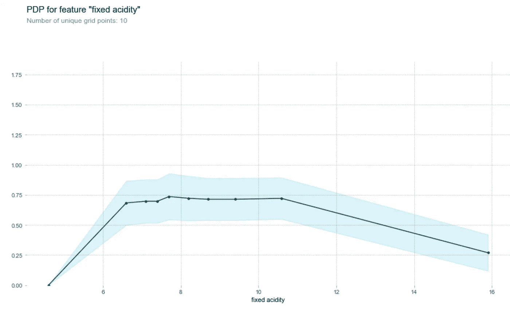**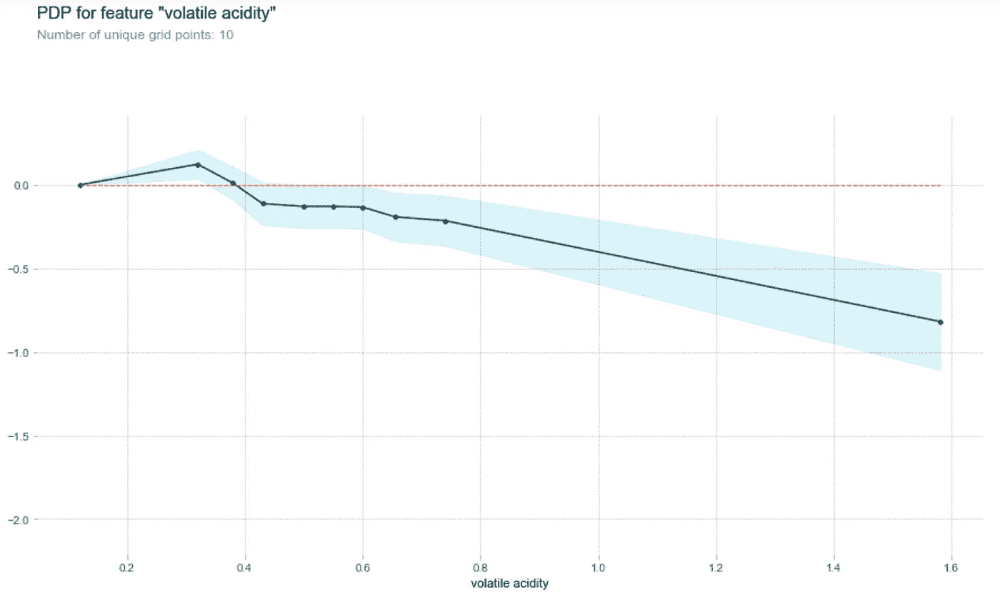*

*我们先来了解一下如何看这个图。纵轴是特征对目标变量预测的贡献，而横轴是数据集中特征的范围。例如，我们看到大约 7.8 的**固定酸度**(上面的第一张图表)将为预测的葡萄酒质量分数贡献大约 0.75。*

*品酒师似乎更喜欢 pH 值较低(酸度较高)的葡萄酒。特别是，他们似乎喜欢在葡萄酒中加入柠檬酸。这并不奇怪，因为好酒应该是酸性的(即不是平的)。然而，他们不喜欢挥发性酸(挥发性酸让葡萄酒尝起来像醋！)*

## *酒精含量*

*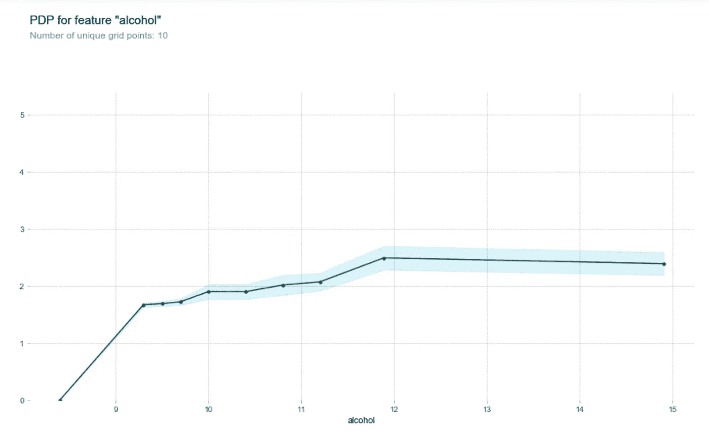*

*葡萄酒的主要吸引力之一是它能帮助人们放松——这就是酒精的作用。品酒师似乎喜欢酒的酒精含量更高。*

## *硫酸盐含量*

***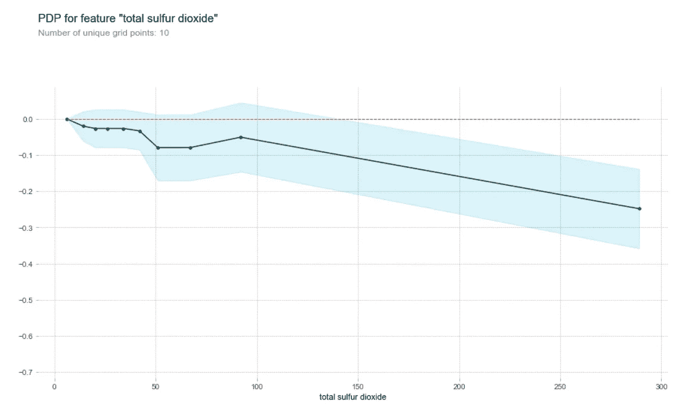*

*   *硫酸盐含量越高，模型对其质量达到某一阈值的预测就越高。为什么会这样呢？2018 年《自然》杂志的一项研究表明，二氧化硫与葡萄酒中的其他化学化合物(代谢物)反应生成亚硫酸盐化合物，这是最古老葡萄酒的化学特征。**看起来品酒师似乎喜欢较高的亚硫酸盐化合物，这可能使葡萄酒尝起来更陈年。***
*   *另一方面，模型认为二氧化硫含量高的葡萄酒质量较低。这并不奇怪，因为二氧化硫含量高通常与氧化和葡萄酒中细菌的存在有关。*

## *糖和氯化物*

*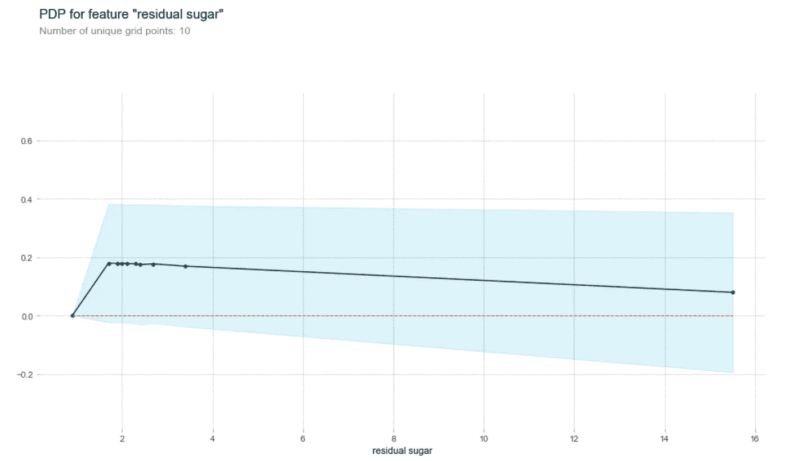***

***一般来说，氯化物和残糖的量似乎对葡萄酒质量的预测影响不大。**我们观察到，两个图都在特征的小幅度处具有聚类点，并且在特征的较高幅度处具有异常值。忽略异常值，我们看到特征量的变化似乎不会很大地改变质量预测，即点的梯度相对较小。因此，特征的改变不会导致葡萄酒质量预测的改变。*

## *二氧化硫+ pH 水平对预测葡萄酒质量的影响*

*我还对二氧化硫和 pH 值对预测质量的综合影响感兴趣。*

*为了对此进行研究，让我们首先将 pH 值分成 4 个具有相同数量数据点的区间。这一步不是完全必要的，尽管它使部分依赖图的可视化更容易。*

```
*pd.qcut(df['pH'],q=4)
>>  [(2.7390000000000003, 3.21] < (3.21, 3.31] < (3.31, 3.4] < (3.4, 4.01]]# Create a categorical feature 'pH_class'
cut_labels_3 = ['low','medium','moderately high','high']
cut_bins=  [2.739, 3.21, 3.31, 3.4, 4.01]
df['pH_class'] = pd.cut(df['pH'], bins=cut_bins, labels=cut_labels_3)# One-hot encode the categorical feature 'pH class' into 4 columns
pH_class = pd.get_dummies(df['pH_class'])# Join the encoded df
df = df.join(pH_class)*
```

*然后，我们也可以绘制两个变量对预测的部分依赖图作为等值线图。*

```
*inter_rf = pdp.pdp_interact(
    model=est, dataset=df, model_features=features, 
    features=['total sulfur dioxide', ['low','medium','moderately high','high']]
)fig, axes = pdp.pdp_interact_plot(inter_rf, ['total sulfure dioxide', 'pH_level'], x_quantile=True, plot_type='contour', plot_pdp=True)*
```

*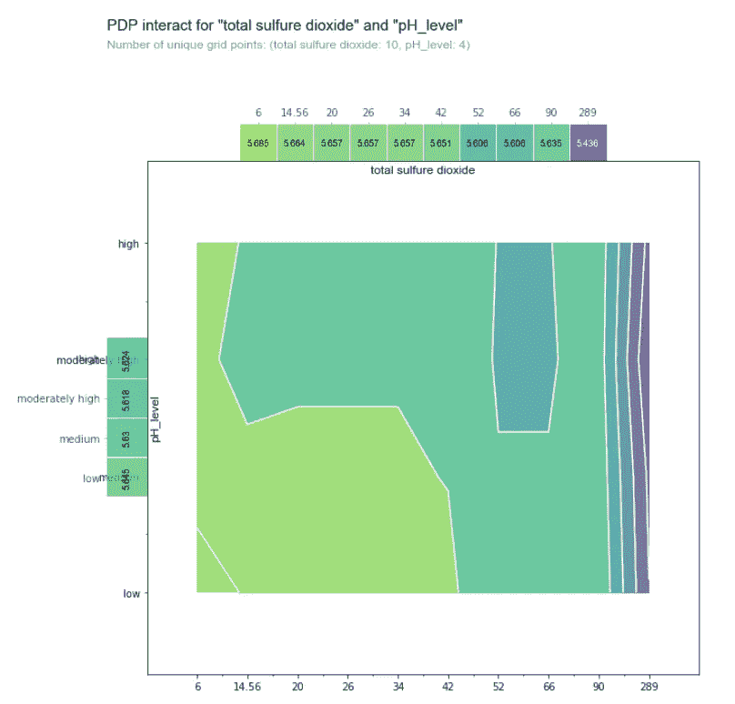*

*当我们改变 y 轴上的 pH 值(分类变量)和总二氧化硫含量(数值变量)时，等高线图的颜色显示了预测的质量。*

*蓝色区域表示低预测质量，而黄色区域表示高预测质量。这告诉我们，葡萄酒的 pH 值越低，二氧化硫含量越低，葡萄酒的质量越高(这对应于图表的左下角)。另一方面，超过二氧化硫含量的某个阈值(~66)，我们看到 pH 不再对预测的质量分数有影响，因为在图表右侧的等高线图上只有垂直线。*

# *该喝一杯了！*

*恭喜你坚持到现在。既然你是品酒的行家，是时候运用你的知识了。喝一杯，看看你能否将从部分依赖情节中学到的知识运用到实际中。(微妙的暗示:我随时都可以喝一杯——只要在 LinkedIn 上联系我就行了！)*

*[](https://www.linkedin.com/in/voon-hao-tang/) [## 特拉维斯唐| LinkedIn

### Gojek 的数据分析师](https://www.linkedin.com/in/voon-hao-tang/) 

PS/如果你对模型的可解释性感兴趣，一定要看看我的另一篇关于使用[石灰解释黑盒模型对乳腺癌数据](/interpreting-black-box-ml-models-using-lime-4fa439be9885)的预测的文章。

# 参考

[1] Paulo Cortez，葡萄牙吉马雷斯米尼奥大学，[http://www3.dsi.uminho.pt/pcortez](http://www3.dsi.uminho.pt/pcortez)A . Cerdeira，F. Almeida，T. Matos 和 J. Reis，葡萄牙波尔图 Vinho Verde 地区葡萄栽培委员会
【2】Friedman，Jerome H .【贪婪函数逼近:梯度提升机器】统计年鉴(2001):1189–1232。

插图由作者完成。*