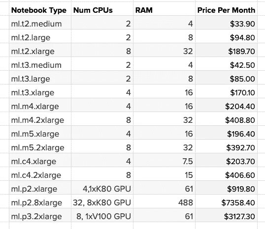
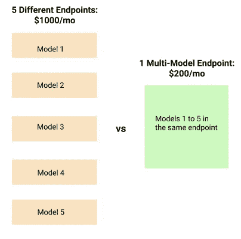
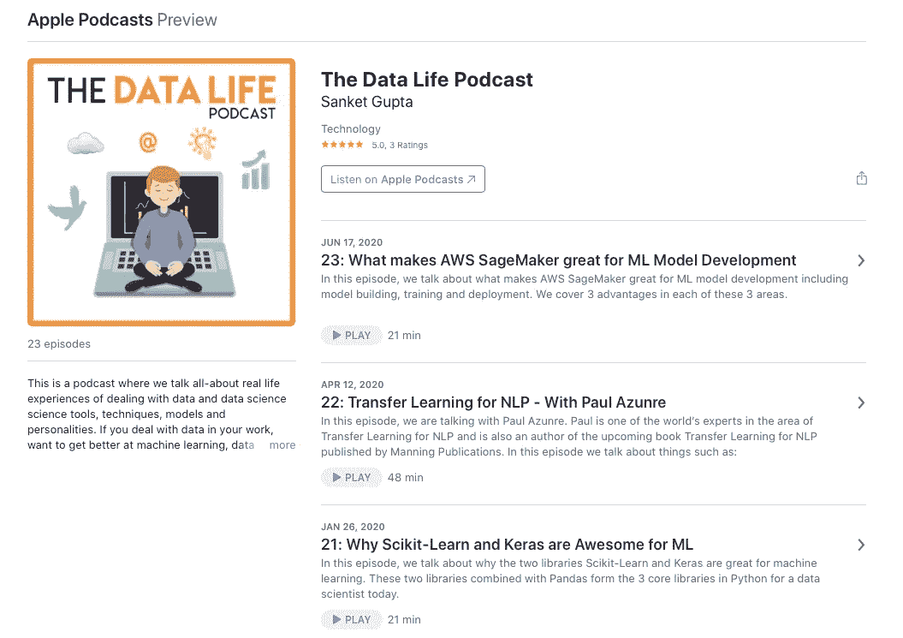

# 亚马逊 SageMaker 非常适合机器学习的 10 个理由

> 原文：<https://towardsdatascience.com/what-makes-aws-sagemaker-great-for-machine-learning-c8a42c208aa3?source=collection_archive---------10----------------------->

## 学习 SageMaker 使构建、训练和部署您的 ML 模型的过程更加容易。

Amazon Web Services 是世界上最常用的云提供商，数据科学家越来越需要像 DevOps 人员一样了解云服务。数据科学家需要建立和使用数据管道，使用数据仓库，在云中训练和托管 ML 模型等。在这篇博客中，我们将专注于机器学习模型的开发。

亚马逊 SageMaker 使得在全球范围内扩展 ML 模型成为可能[ [来源](https://unsplash.com/photos/Q1p7bh3SHj8)

[亚马逊 SageMaker](https://aws.amazon.com/sagemaker/) 是 AWS 提供的一项强大服务，用于构建、训练和部署你的机器学习模型。它由 AWS 于 2017 年发布，并迅速获得了很大的人气，然而，没有多少数据科学家在使用这项服务，因为它相当新。在这篇博客中，我们将讨论 SageMaker 以及如何在您的机器学习项目中使用它——不仅用于构建和训练模型，还用于部署您的模型以供成千上万的用户使用。

SageMaker 的一个伟大之处是它的模块化设计。如果您喜欢在其他地方进行培训，而只是使用 SageMaker 进行部署，那么您可以这样做。如果您只是喜欢训练您的模型并使用其超参数调整功能，您也可以这样做。这是我真正喜欢 SageMaker 的地方。考虑到这一点，让我们开始了解亚马逊 SageMaker。我们将涵盖 SageMaker 帮助的 3 个广泛领域:模型构建、模型培训和模型部署——以及每个领域的 3 个优势。

# 模型结构

在最基本的层面上，SageMaker 提供了 **Jupyter 笔记本**。您可以使用这些笔记本来构建、培训和部署 ML 模型。许多数据科学家使用这些[笔记本](https://jupyter.org)进行探索性数据分析和模型构建阶段。您可能想开始使用类似熊猫的东西来探索数据集—您有多少丢失的行？数据的分布是什么样的？有没有数据不平衡之类的？您可以构建许多不同的模型，从来自 [Scikit Learn](https://scikit-learn.org/stable/) 的逻辑回归或决策树到来自 [Keras](https://www.tensorflow.org/guide/keras/sequential_model) 的深度学习模型，并快速获得基准性能。因此，当您使用 SageMaker 时，笔记本界面保持不变，没有任何区别！

那么你可能会问的一个问题是→使用 SageMaker 笔记本而不是本地或者某处 EC2 服务器上托管的笔记本有什么优势？嗯，SageMaker 允许您决定您喜欢的机器类型，因此您不需要管理任何复杂的 ami 或安全组——这使得入门非常容易。SageMaker 还提供对 GPU 和具有大量 RAM 的大型机器的访问，这在本地设置中是不可能的。

让我们把 SageMaker 对于建模的所有优势罗列出来:
**1。**从 2 核和 4GB 的机器到 96 核和 768GB RAM 的机器，您只需点击一下按钮就可以访问这些机器，笔记本电脑就托管在这些机器中，无需您付出任何额外的努力。您不必管理任何安全组或 ami，也不必管理机器的 IP 地址或任何东西。下面列出了不同类型的笔记本电脑，以及全天候运行时每月的价格。

不同 AWS 实例的 CPU/GPU 数量、RAM 和定价[ [定价](https://aws.amazon.com/sagemaker/pricing/)、[计算](http://Source 2)

**2。第二个**优势是它附带预配置的环境——您不需要单独安装 TensorFlow 或其他公共库。

**3。**另一个优势是，您可以将您的 Github 帐户与这些笔记本相关联，这样您就可以在构建模型时继续使用 Github repo，而无需担心下载和上传文件以进行版本控制！这可通过 SageMaker 笔记本电脑的 JupyterLab 界面获得。我真的很喜欢这个功能。

# 模特培训

下一步是模特训练。您可以使用相同的笔记本来训练模型，并在 S3 存储模型工件和文件，然后移动到模型部署的下一步。但是，如果你正在做一个需要几个小时训练的模型，比如说，带有复杂 LSTM 模型的语言翻译模型，该怎么办呢？在这种情况下，您可以从 Sagemaker notebook 本身调用一个 GPU 来训练模型，而不是使用可能在小型实例上运行的 notebook 本身。这样，您可以在运行笔记本电脑的同时节省成本，因为大多数任务都是围绕构建、检查和探索模型进行的。同样，对于培训模型培训本身，您可以使用另一台机器，该机器不同于用于运行笔记本的机器。

所以使用 SageMaker 进行模型训练的优势有:
**1 .**你可以在非 GPU t2.medium 上运行笔记本电脑，价格约为 40 美元/月，但你可以使用 p2.xlarge GPU 实例，价格约为每小时 1.2 美元——只有用于实际训练模型的秒数才会向你收费。这可以节省大量成本。通常你会用 GPU 启动 EC2 服务器——安装所有的东西，运行你的脚本，并且必须记住关闭它。在这里，你是自动按秒计费的实际训练时间。所以重复一遍，你可以使用一个便宜的实例来托管你的笔记本电脑，它可以运行 24 小时，不会花很多钱，但然后使用 GPU 来训练笔记本电脑本身的模型。

**2。**sage maker 用于模型训练的另一个特性是超参数调优。您可以创建超参数调整作业，以便您的模型可以在一夜之间调整，并在早上向您显示最佳超参数。

**3。**另一个优势是你可以使用亚马逊自己的预建模型，这些模型已经过高度优化，可以在 AWS 服务上运行。这些模型是预先构建的，您不需要做太多的工作来构建和检查模型。您可以使用预构建的 XGBoost 或 LDA 或 PCA 或 Seq to Seq 模型，所有这些都可以通过名为`sagemaker`的高级 Python SDK 获得。这是一个很好的机会来提一下，也有一个低级别的 SDK 来访问 SageMaker，它是使用`boto3` — `boto3`编写的，是访问 Python 中其他 AWS 服务的常用方法。

# 模型部署

最后，我最喜欢使用 SageMaker 的原因是为了模型部署。即使您的模型可能不太复杂，并且可以在您的本地机器上轻松地进行训练，您仍然需要在某个地方托管该模型。然后是关于扩展模型的问题→你能建立一个服务来服务你的 ML 输出，可以被成百上千的用户同时使用吗？潜伏期呢？如果需求突然激增怎么办？对于所有这些，SageMaker 非常棒，因为它允许您在端点后托管模型。这个端点是一个运行在某个隐藏的 EC2 服务器上的服务。当然，您仍然需要选择您喜欢的实例类型。但是您不需要担心设置这个服务器——在创建端点的过程中，您可以选择诸如自动扩展组、您想要多少个服务器等等。

所以使用 SageMaker 进行模型部署的优势是:
**1。**在一个端点中托管 ML 模型——然后你可以从任何其他用通用语言编写的代码中调用这个端点。你也可以从 Lambda 函数中调用这个模型。这样，您的 web 应用程序就可以调用 Lambda 函数，该函数可以调用模型端点。如果您在某个地方托管自己的 API，那么 API 代码可以调用这个端点。您还可以配置 API Gateway 来接收 HTTP 请求，该请求调用 Lambda 函数，然后该函数调用 SageMaker 端点，如下所示:

使用 API 网关、Lambda 和 SageMaker 端点部署 ML 模型

注意:Amazon 将 SageMaker 模型托管在一个一天 24 小时运行的物理服务器上——服务器不会根据收到请求的时间而打开/关闭。因此，SageMaker 在无服务器领域处于 EC2 和 Lambda 的中间。服务器像 EC2 一样一直运行，但是你不能像 Lambda 一样配置和管理它。

**2。**另一个很大的优势是你可以在同一个端点上托管多个模型。为此，您需要创建一个定制的 Docker 容器映像。这相当复杂，但是 AWS 的 Github 中有启动代码。您将需要创建您自己的映像并在 ECR 中托管它，然后在托管多个模型时使用该映像。多模型端点允许您托管多个模型，并且实例被预先配置为处理多个模型的负载，而您不必担心这方面的开发。

多型号终端可以为您节省大量成本

**3。**您所有的日志都可以轻松存储在 CloudWatch 日志中。您不需要创建自己的日志管道，这是另一个优势。您可以监控机器上的负载，并根据需求扩展机器。

但是，有什么问题呢？SageMaker 价格昂贵，比 AWS 的同等 EC2 服务器选项贵 30%到 40%。一个 t2.medium 的价格是 33 美元/月，但是 SageMaker 的同等 ml.t2.medium 的价格是 40 美元/月。但我觉得所有这些优势在总体上造成了很大的成本差异——你只需为你在昂贵的服务器上使用的模型训练时间按秒收费。这让我想到了第十个优势，即亚马逊不断创新，并带来了新功能，如[SageMaker Studio](https://aws.amazon.com/blogs/aws/amazon-sagemaker-studio-the-first-fully-integrated-development-environment-for-machine-learning/)——因此，当您在模型管道中使用 sage maker 时，您将能够获得所有这些优势。

我觉得它可能会遇到 SageMaker 是一个神奇的药丸，可以解决你可能遇到的每个 ML 问题。我要说，这不是一个神奇的药丸，而是一个非常有用的工具。您仍然需要使用“handler”函数来配置预处理和后处理管道，并弄清楚您想要如何为多模型端点配置 Docker 容器。所有这一切都不容易，AWS 文档也不是那么好——因此，我建议您从小处着手，部署 MNIST 端点，然后从那里开始构建。SageMaker 是一个很好的工具，但我想描绘出完整的画面——很高兴听到你如何使用它，也让我知道我是否在这一集错过了什么。通过 LinkedIn 或 T2 的电子邮件或下面的评论联系我。祝你的 ML 之旅一切顺利！

如果你更喜欢听这个博客的音频版本，我也为这个博客录了一段播客——在这里我会更详细地介绍每一点。你可以在[苹果播客](https://podcasts.apple.com/us/podcast/the-data-life-podcast/id1453716761)、 [Spotify](https://open.spotify.com/show/6xWi36lOBHpHRabi9eO1Bj) 或 [Anchor.fm](https://anchor.fm/the-data-life-podcast) 上听，或者在我最喜欢的播客应用之一:[阴天](https://overcast.fm/itunes1453716761/the-data-life-podcast)上听。

[我谈论类似话题的播客](https://podcasts.apple.com/us/podcast/the-data-life-podcast/id1453716761)

对于评论/反馈/问题，或者如果你认为我在这一集里错过了什么，请通过[sanket@omnilence.com](mailto:sanket@omnilence.com)或 LinkedIn:[https://www.linkedin.com/in/sanketgupta107/](https://www.linkedin.com/in/sanketgupta107/)联系我

资源:
1。[亚马逊 SageMaker 端点](https://aws.amazon.com/blogs/machine-learning/build-a-serverless-frontend-for-an-amazon-sagemaker-endpoint/)的无服务器前端
2。[多模型端点](https://aws.amazon.com/blogs/machine-learning/save-on-inference-costs-by-using-amazon-sagemaker-multi-model-endpoints/)
3。[超参数调整作业](https://aws.amazon.com/blogs/machine-learning/amazon-sagemaker-automatic-model-tuning-becomes-more-efficient-with-warm-start-of-hyperparameter-tuning-jobs/)