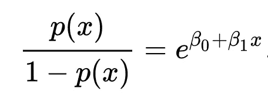

# 是什么让逻辑回归成为一种分类算法？

> 原文：<https://towardsdatascience.com/what-makes-logistic-regression-a-classification-algorithm-35018497b63f?source=collection_archive---------20----------------------->

## 进入现实世界

## 对数优势，基线的逻辑回归解释。

凯勒·琼斯在 [Unsplash](https://unsplash.com?utm_source=medium&utm_medium=referral) 上拍摄的照片——已编辑

> 逻辑回归是一个[统计模型](https://en.wikipedia.org/wiki/Statistical_model)，其基本形式使用一个[逻辑函数](https://en.wikipedia.org/wiki/Logistic_function)来模拟一个[二元](https://en.wikipedia.org/wiki/Binary_variable) [因变量](https://en.wikipedia.org/wiki/Dependent_variable)，尽管存在许多更复杂的[扩展](https://en.wikipedia.org/wiki/Logistic_regression#Extensions)。
> —维基百科。

*—所有图像(情节)均由作者生成和修改。*

很可能，对于每一个数据从业者来说， ***线性回归*** 恰好是实现机器学习的起点，在这里你了解到*为给定的独立规则集*预言一个连续值。

## 为什么是逻辑的，不是线性的？

让我们从最基本的一个开始，在*二元分类中，模型应该能够预测因变量为两个可能类之一，可能是 *0 或 1* 。如果我们考虑使用*线性回归*，我们可以预测给定规则集的值作为模型的输入，但它将预测连续值，如 0.03、+1.2、-0.9 等。这不适于将其归类到两类中的一类，也不适于将其识别为预测一类的概率值。*

****例如*** 当我们要预测一个网站是否是恶意的当 URL 的长度作为一个特征给定时，响应变量有两个值，良性和恶意。*

**

*分类数据的线性回归—按作者*

*如果我们试图将线性回归模型拟合到二元分类问题，模型拟合将是一条直线，并且可以看出为什么它不适合使用相同的直线。*

*为了克服这个问题，我们使用了一个 ***sigmoid 函数*** ，它试图用指数曲线拟合数据来建立一个好的模型。*

# *Logistic/Sigmoid 函数*

*逻辑回归可以用*逻辑函数*来解释，也称为 *Sigmoid 函数*，它接受任何实际输入 *x* ，并输出 0 和 1 之间的概率值，该概率值定义为:*

**

*使用上述逻辑函数的模型拟合可以如下所示:*

**

*分类数据的逻辑回归—按作者*

*此外，对于任何给定的自变量 t，让我们将其视为单变量回归模型中的线性函数，其中 *β0* 是截距， *β1* 是斜率，由下式给出:*

**

*输出 0 和 1 之间的值的通用逻辑函数 *p* 将变成，*

**

*我们可以看到，可分为两类的数据可以使用逻辑函数对线性函数中的给定变量进行建模。但是输入变量 x 和输出概率之间的关系不容易用 sigmoid 函数来解释，我们现在引入了***Logit***(log-odds)函数，使得该模型可以用线性方式来解释。*

# *对数概率函数*

*对数赔率函数*也称为赔率的自然对数*，是标准逻辑函数的逆函数，可以定义并进一步简化为:*

**

*在上述等式中，术语如下:*

*   **g* 是 [logit](https://en.wikipedia.org/wiki/Logit) 功能。对于 *g(p(x))* 的等式表明 logit 等价于线性回归表达式*
*   **ln* 表示[自然对数](https://en.wikipedia.org/wiki/Natural_logarithm)*
*   **p(x)* 是因变量落入两类 0 或 1 之一的概率，给定预测值的某种线性组合*
*   **β0* 是线性回归方程的[截距](https://en.wikipedia.org/wiki/Y-intercept)*
*   **β1* 是回归系数乘以预测值*

*通过进一步简化上述方程并对两边进行指数运算，我们可以推导出概率与线性模型之间的关系如下:*

**

*左项称为 ***赔率*** ，定义为等价于线性回归表达式的指数函数。在两边都有 *ln* (对数基数 e)的情况下，我们可以将对数优势和独立变量 *x* 之间的关系解释为线性。*

## *为什么要回归？*

*概率 *p(x)* 随变量 x 的变化不能直接理解，因为它是由 sigmoid 函数定义的。但是通过上面的表达式，我们可以解释变量 x 的对数几率的变化是关于变量 *x* 本身的线性变化。具有线性方程对数优势图可以被看作是，*

**

*对数优势与独立变量 x——作者*

*因变量的概率结果表明，线性回归表达式的值可以从负无穷大变化到正无穷大，然而，在用 sigmoid 函数进行变换之后，所得的概率表达式 *p(x)* 的范围在 0 和 1 之间，即 0 < p < 1。因此，这就是**使逻辑回归成为回归分类算法的原因**，它根据决策边界将线性回归的值分类到特定类别。*

# *判别边界*

*决策边界被定义为一个*阈值*值，它帮助我们将 sigmoid 函数给出的预测概率值分类到一个特定的类别中，积极的或消极的。*

## *线性决策边界*

*当两个或多个类别可以线性分离时，*

**

*线性决策边界—作者*

## *非线性边界*

*当两个或多个类别不能线性分离时，*

**

*非线性决策边界—作者*

# *多类分类*

*[多类](https://en.wikipedia.org/wiki/Multiclass_classification)和二元逻辑回归背后的基本直觉是一样的。但是，对于一个多类分类问题，我们遵循一个 [***一个 v/s 全部分类***](https://houxianxu.github.io/implementation/One-vs-All-LogisticRegression.html) 。如果该模型有多个独立变量，则传统方程被修改为:*

**

*这里，对数优势可定义为当线性回归变为使用 *m* 个外植体的多元回归时，与存在的多个独立变量线性相关。*

*如果我们必须预测天气是晴天、雨天还是刮风，我们正在处理一个多方面的问题。我们把这个问题转化为三个二元分类问题，即是否晴天、是否下雨和是否刮风。我们对输入要素独立运行所有三个分类*，概率值相对于其他分类最大的分类成为解决方案。**

# **结论**

***逻辑回归是最简单的机器学习模型之一。它们容易理解，可解释，并且能给出相当好的结果。每一个使用逻辑回归的从业者都必须知道对数概率，这是这种学习算法背后的主要概念。考虑到业务需求和关于模型如何在模型中使用不同独立变量的解释，逻辑回归非常容易解释。这篇文章旨在提供一种简单的方法来理解回归背后的思想和逻辑回归提供的透明性。***

**感谢阅读。你可以在这里找到我的其他[机器学习相关的帖子](https://towardsdatascience.com/@imsparsh)。**

**希望这篇帖子有用。我感谢反馈和建设性的批评。如果你想谈论这篇文章或其他相关话题，你可以在这里或在 [LinkedIn](https://www.linkedin.com/in/imsparsh/) 给我发短信。**

** [## 贷款信用风险模型中的贷款违约分析

### 探索和分析贷款违约背后的驱动因素，即，使贷款审批流程风险…

towardsdatascience.com](/insightful-loan-default-analysis-in-lending-credit-risk-model-b16bbfc94a2f)**