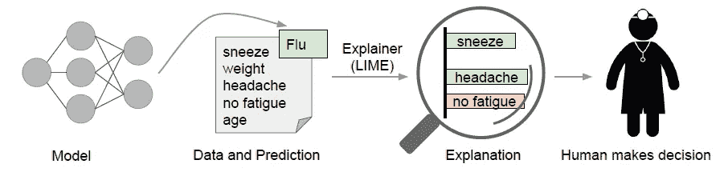
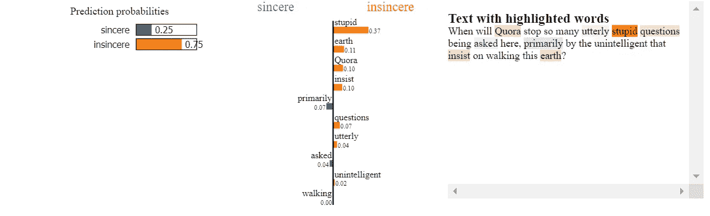

# 使用 LIME 解释文本分类器结果

> 原文：<https://towardsdatascience.com/what-makes-your-question-insincere-in-quora-26ee7658b010?source=collection_archive---------32----------------------->

## 是什么让你的问题在 Quora 变得不真诚？


Jules Bss 在 [Unsplash](https://unsplash.com/?utm_source=unsplash&utm_medium=referral&utm_content=creditCopyText) 上的照片

在之前关于在现实世界应用中利用可解释性的[帖子](/leveraging-explainability-in-real-world-ml-applications-part-1-3be567c00594)中，我简要介绍了 XAI(人工智能中的可解释性)，它背后的动机，以及可解释模型在现实生活场景中的应用。

在这篇文章中，我将介绍 LIME，这是最著名的本地可解释模型之一，以及如何应用它来检测使 Quora 平台中的问题不真诚的术语。

# 什么是石灰，它是如何工作的？

作者在[1]中提出了 LIME，它是一种算法，通过用一个可解释的模型局部地近似它们，以一种可靠和可理解的方式解释任何分类器或回归变量的单个预测。

例如，ML 模型使用一组特征(喷嚏、体重、头痛、无疲劳和年龄)预测患者患有流感，而 LIME 突出显示了患者历史中导致预测的症状(最重要的特征)。打喷嚏和头痛被认为是导致流感的原因，而没有证据表明疲劳会导致流感。有了这些解释，医生就可以做出是否相信模型预测的明智决定。



来源:“我为什么要相信你？”
解释任何分类器的预测[1]

> *解释预测是呈现文本或视觉工件，提供对实例组件(例如文本中的单词、图像中的补丁)和模型预测之间关系的定性理解[1]。*

## 石灰背后的直觉

LIME 是一个局部代理模型，这意味着它是一个经过训练的模型，用于近似底层黑盒模型的预测。但是，它的想法是将数据的变化生成到机器学习模型中，并测试预测会发生什么，使用这种扰动的数据作为训练集，而不是使用原始的训练数据。

换句话说，LIME 生成一个新的数据集，由置换样本和黑盒模型的相应预测组成。在这个新的数据集上，LIME 然后训练可解释的模型(例如，Lasso、决策树等等)，该模型通过采样实例与感兴趣实例的接近度来加权。


加粗的红叉是正在解释的例子。LIME 对实例进行采样，使用黑盒模型(由蓝色/粉色背景表示)获得预测，并通过与被解释的实例的接近程度(此处由大小表示)对它们进行加权。虚线是学习过的局部解释[1]。

# **将 LIME 应用于 Quora 数据集和逻辑回归模型**

Quora 虚假问题分类任务的数据集可以从这个[链接](https://www.kaggle.com/c/quora-insincere-questions-classification/data)下载。训练数据包括被问的问题，以及它是否被识别为不真诚。

我们来看这个数据集的两个问题和对应的类(1 为不真诚，0 为真诚的问题):

*   不真诚的问题:为什么特朗普相信普京告诉他的一切？他是共产主义者，还是愚蠢透顶？
*   真诚的问题:纬度和繁荣之间的强相关性可以部分地用另一个(如果被证明存在的话)有利的环境温度和大脑着迷之间的相关性来解释吗？

预处理步骤包括将数据分为训练集和验证集，然后将问题矢量化为 tf-idf 向量。

预处理代码。

黑盒模型是一个逻辑回归模型，以 tf-idf 向量作为输入。

作为黑箱模型的逻辑回归。

现在是时候应用 LimeTextExplainer 函数来为预测生成局部解释了。该函数需要解释的问题(索引 130609)、从黑盒模型(逻辑回归)生成的问题的预测标签以及用于解释的特征数量作为参数。

使用 LimeTextExplainer 为一个实例生成解释。

上述代码的结果如下:

```
Question: 
When will Quora stop so many utterly stupid questions being asked here, primarily by the unintelligent that insist on walking this earth?
Probability (Insincere) = 0.745825811972627
Probability (Sincere) = 0.254174188027373
True Class is: insincere
```

分类器把这个例子做对了(它预测言不由衷)。
使用以下说明，以加权特征列表的形式给出解释:

结果是:

```
[('stupid', 0.3704823331676872),
 ('earth', 0.11362862926025367),
 ('Quora', 0.10379246842323496),
 ('insist', 0.09548389743268501),
 ('primarily', -0.07151150302754253),
 ('questions', 0.07000885924524448),
 ('utterly', 0.040867838409334646),
 ('asked', -0.036054558321806804),
 ('unintelligent', 0.017247304068062203),
 ('walking', -0.004154838656529393)]
```

这些加权特征是一个线性模型，它近似于测试实例附近的逻辑回归分类器的行为。粗略地说，如果我们从问题中删除“愚蠢”和“地球”，预测应该向相反的类别(真诚)移动大约 0.48(两个特征的权重之和)。我们来看看是不是这样。

结果是:

```
Original prediction: 0.745825811972627
Prediction after removing some features: 0.33715161522095155
Difference: -0.40867419675167543
```

不出所料，在从实例词汇表中删除了“地球”和“愚蠢”这两个词后，这个类现在变得真诚了。

结果可以显示在不同类型的可视化石灰。



注意，对于每一类，线上右边的单词是正的，左边的单词是负的。因此，“愚蠢”对不真诚是积极的，但对真诚是消极的。

您还可以使用下面的代码获得解释的条形图:


# 摘要

LIME 能够在本地解释任何类型的分类器(SVM、神经网络等)的预测。在这篇文章中，我将其应用于 Quora 问题数据集，以解释是什么使 Quora 中的问题不真诚，但它也可以集成到图像和结构化数据分类器中。您可以通过此[链接](https://github.com/marcotcr/lime/tree/master/doc/notebooks)访问更多代码和示例。

如果你有问题，欢迎在下面评论或通过[邮箱](http://amami.maha@ymail.com)或 [Linkedin](https://www.linkedin.com/in/maha-amami-phd-088b42b2/) 提问。我会回答的。

全部代码发布在我的 [GITHUB 简介](https://github.com/amamimaha)的[链接](https://github.com/amamimaha/Explainable-Models/blob/master/Quora%20sincere%20questions.ipynb)中。

我会继续张贴关于 XAI 和其他有趣的话题。敬请期待！！

# 参考

[1]里贝罗，M. T .，辛格，s .，& Guestrin，C. (2016 年 8 月)。“我为什么要相信你？”解释任何分类器的预测。《第 22 届 ACM SIGKDD 知识发现和数据挖掘国际会议论文集》(第 1135-1144 页)。

石灰码:[https://github.com/marcotcr/lime](https://github.com/marcotcr/lime)