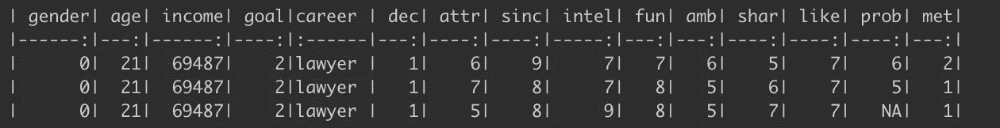
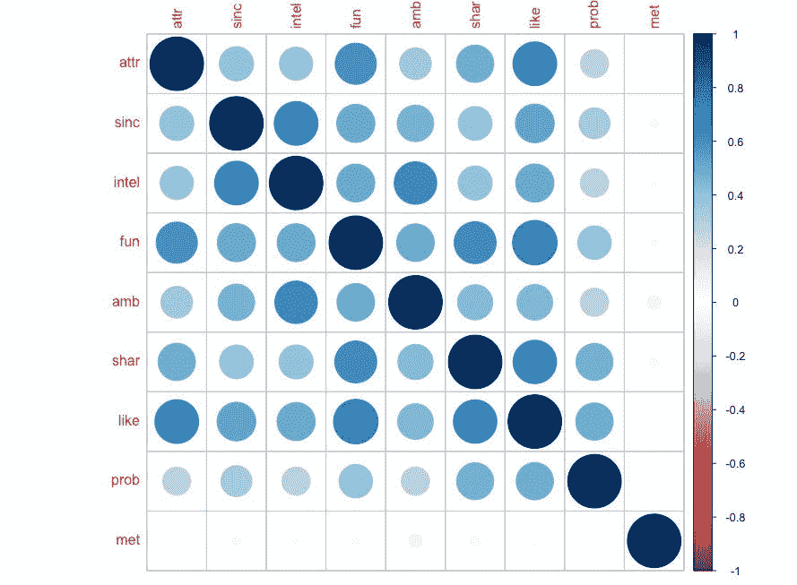
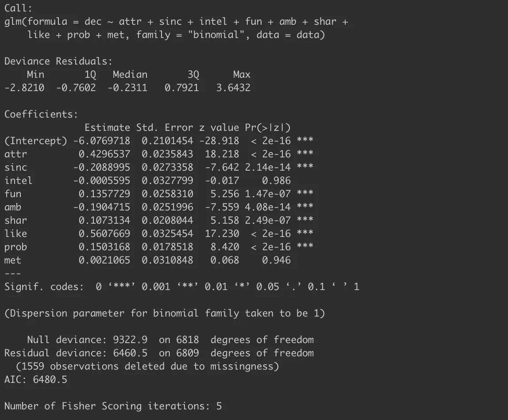
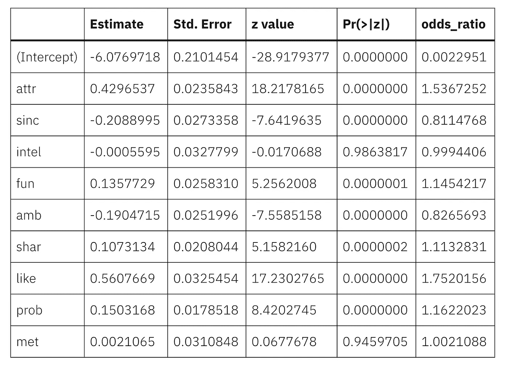
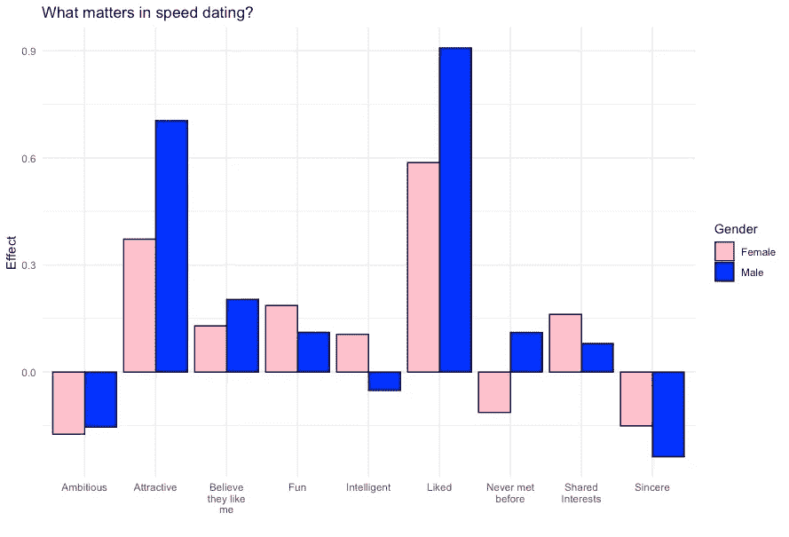

# 速配中什么最重要？

> 原文：<https://towardsdatascience.com/what-matters-in-speed-dating-34d29102f6cb?source=collection_archive---------33----------------------->

## 如今约会很复杂，所以为什么不获取一些快速约会技巧，同时学习一些简单的回归分析呢？

今天是情人节——人们思考爱情和关系的日子。人们相遇并建立关系的方式比我们父母或祖父母那一代要快得多。我敢肯定，你们中的许多人都被告知过去是怎样的——你遇见某人，和他们约会一段时间，求婚，结婚。在小城镇长大的人也许有一次寻找爱情的机会，所以他们确保不会把它搞砸。

今天，找到一个约会对象不是一个挑战——找到一个合适的对象可能是个问题。在过去的 20 年里，我们经历了从传统约会到在线约会，再到快速约会，再到在线快速约会。现在你只要向左或向右滑动，如果你喜欢的话。

在 2002 年至 2004 年间，哥伦比亚大学进行了一项速配实验，他们跟踪了 21 次速配会议，这些会议主要是年轻人与异性的会面。我在这里找到了数据集和数据的关键:[http://www . stat . Columbia . edu/~ gel man/arm/examples/speed . dating/](http://www.stat.columbia.edu/%7Egelman/arm/examples/speed.dating/)。

我感兴趣的是在短暂的互动中发现某人的什么，这决定了某人是否认为他们是匹配的。如果你以前从未做过，这是一个练习简单逻辑回归的好机会。

# 速配数据集

上面链接中的数据集非常庞大——超过 8000 个观察值，每个观察值有近 200 个数据点。然而，我只对速配约会本身感兴趣，所以我简化了数据，上传了一个较小版本的数据集到我的 Github 账户[这里](https://github.com/keithmcnulty/speed_dating)。我将把这个数据集拉下来，并对其进行一些简单的回归分析，以确定是什么因素影响了人们是否认为他们是匹配的。

让我们提取数据，快速浏览前几行:

```
library(tidyverse) 
library(corrplot) download.file("https://raw.githubusercontent.com/keithmcnulty/speed_dating/master/speed_data_data.RDS", "speed_dating_data.RDS") data <- readRDS("speed_dating_data.RDS") head(data, 3) 
```



我们可以从这个关键算出:

1.  前五列是人口统计数据——我们以后可能要用它们来查看子群。
2.  接下来的七列很重要。评估人决定此人是否匹配。然后我们在六个特征上打满分:吸引力、真诚、聪明、有趣、雄心和共同的兴趣。
3.  `like`栏是总体评分。`prob`列是关于评价者是否相信对方会喜欢他们的评级，最后一列是关于两人是否在快速约会之前见过面的二元数据，较低的值表示他们以前见过面。

我们可以在任何分析中忽略前四列。我们这里的结果变量是`dec`。我对其余的潜在解释变量感兴趣。在我开始做任何分析之前，我想检查一下这些变量中是否有高度共线的——也就是说，有非常高的相关性。如果两个变量测量的是差不多一样的东西，我可能应该去掉其中一个。

```
corr_matrix <- data %>% 
  dplyr::select(attr, sinc, intel, fun, amb, shar, like, prob, met) %>% 
  as.matrix() M <- cor(corr_matrix, use = "complete.obs") corrplot::corrplot(M)
```



好吧，很明显，当你快速约会时，会有迷你光环效应。但是没有一个升得很高(例如超过 0.75)，所以我要把它们都留在这里，因为这只是为了好玩。如果我的分析有严重的后果，我可能想在这个问题上多花一点时间。

# 对数据运行逻辑回归

这个过程的结果是二进制的。回答者决定是或否。我给你说，这太苛刻了。但是对于一个统计学家来说，这很好，因为它直接指出二项式逻辑回归是我们的主要分析工具。让我们运行一个逻辑回归模型来分析我上面提到的结果和潜在的解释变量，看看结果。

```
model <- glm(dec ~ attr + sinc + intel + fun + amb + shar + like + prob + met, data = data, family = "binomial") summary(model)
```



所以，感知智力并不重要。(这可能是被研究人群的一个因素，我相信他们都是哥伦比亚大学的本科生，所以我怀疑他们的 s at 平均分都很高——所以智力可能不是一个区分因素)。你以前是否见过某人也一样。其他一切似乎都扮演着重要的角色。

更有趣的是每个因素在多大程度上扮演了 T2 的角色。上面模型输出中的系数估计告诉我们每个变量的影响，假设其他变量保持不变。但在上面的表格中，它们是以对数优势表示的，我们需要将它们转换成常规优势比，以便更好地理解它们，所以让我们调整我们的结果来做到这一点。

```
ctable <- coef(summary(model)) 
odds_ratio <- exp(coef(summary(model))[ , c("Estimate")]) (coef_summary <- cbind(ctable, as.data.frame(odds_ratio, nrow = nrow(ctable), ncol = 1))) %>% knitr::kable()
```



所以我们有一些有趣的观察结果:

1.  不出所料，受访者对某人的总体评价是他们是否决定与之匹配的最大指标。
2.  吸引力似乎是婚姻的主要正面指标。
3.  有趣的是，真诚和雄心**降低了**匹配的可能性——它们似乎让潜在的约会对象扫兴。
4.  其他因素也发挥了较小的积极作用，包括被调查者是否认为利益是对等的。

# 比较性别

当然，人们很自然地会问，在这些动态中是否存在性别差异。因此，我将对这两个性别子集重新进行分析，然后创建一个图表来说明任何差异。

```
# females only model_f <- glm(dec ~ attr + sinc + intel + fun + amb + shar + like + prob + met, data = data %>% dplyr::filter(gender == 0), family = "binomial") ctable_f <- coef(summary(model_f)) 
odds_ratio_f <- exp(coef(summary(model_f))[ , c("Estimate")])
coef_summary_f <- cbind(ctable_f, as.data.frame(odds_ratio_f, nrow = nrow(ctable_f), ncol = 1)) # males onlymodel_m <- glm(dec ~ attr + sinc + intel + fun + amb + shar + like + prob + met, data = data %>% dplyr::filter(gender == 1), family = "binomial") ctable_m <- coef(summary(model_m)) 
odds_ratio_m <- exp(coef(summary(model_m))[ , c("Estimate")]) coef_summary_m <- cbind(ctable_m, as.data.frame(odds_ratio_m, nrow = nrow(ctable_m), ncol = 1)) chart_data <- coef_summary_f %>% 
  dplyr::add_rownames() %>% 
  dplyr::left_join(coef_summary_m %>% dplyr::add_rownames(), by = "rowname") %>% 
  dplyr::select(rowname, odds_ratio_f, odds_ratio_m) %>%
  tidyr::pivot_longer(cols = c("odds_ratio_f", "odds_ratio_m"), names_to = "odds_ratio") %>% 
  dplyr::mutate(
Effect = value - 1, 
Gender = ifelse(odds_ratio == "odds_ratio_f", "Female", "Male"),
Factor = dplyr::recode(rowname, amb = "Ambitious", attr = "Attractive", fun = "Fun", intel = "Intelligent", like = "Liked", met = "Never met\nbefore", prob = "Believe\nthey like\nme", shar = "Shared\nInterests", sinc = "Sincere")) ggplot(data = chart_data %>% dplyr::filter(rowname != "(Intercept)"), aes(x=Factor, y=Effect, fill=Gender)) + geom_bar(stat="identity", color="black", position=position_dodge()) + theme_minimal() + 
labs(x = "", title = "What matters in speed dating?") + scale_fill_manual(values=c('#FFC0CB', '#0000FF'))
```



我们发现了一些有趣的差异。不出所料，外表吸引力似乎对男性更重要。根据长期以来的信念，智力确实对女性更重要。与男性相比，它有着显著的积极作用，而男性似乎没有发挥有意义的作用。另一个有趣的区别是，你以前是否见过某人对两组人都有显著影响，但我们以前没有看到，因为它对男性和女性有相反的影响，所以平均起来是不重要的。男人似乎更喜欢新的互动，而女人喜欢看到熟悉的面孔。

正如我上面提到的，整个数据集非常大，所以这里有很多可以探索的地方——这只是可以收集到的一小部分。如果你最终用它来玩，我对你的发现很感兴趣。

最初我是一名纯粹的数学家，后来我成为了一名心理计量学家和数据科学家。我热衷于将所有这些学科的严谨性应用到复杂的人的问题上。我也是一个编码极客和日本 RPG 的超级粉丝。在 [*LinkedIn*](https://www.linkedin.com/in/keith-mcnulty/) *或*[*Twitter*](https://twitter.com/dr_keithmcnulty)*上找我。也可以看看我在*[*drkeithmcnulty.com*](http://drkeithmcnulty.com/)*的博客。*