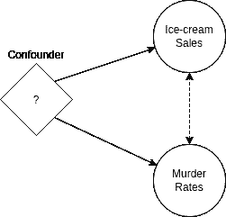

# 谋杀和冰淇淋与数据驱动的产品管理有什么关系？

> 原文：<https://towardsdatascience.com/what-murder-and-ice-cream-have-to-do-with-data-driven-product-management-9c3cafc34da9?source=collection_archive---------62----------------------->

unsplash.com

## 答案是:**混杂因素。**

研究表明谋杀率和冰淇淋销量之间有一种虚假的关系。( [1](https://bit.ly/3e1K3Es)

这种虚假的关系并不意味着一个导致另一个。接下来会发生什么？是温暖的天气导致人们买更多的冰淇淋，变得更加暴力——“温暖的天气”是我们的混淆因素。( [2](https://en.wikipedia.org/wiki/Confounding) )

# 这与数据驱动的产品管理有什么关系？

你的数据驱动软件产品依赖于很好地利用从原始数据中推断出来的洞察力和特性的能力(显然还有其他因素，比如设计等)。识别和整合的相关混杂因素越多，你的洞察力就越强。因此，你的产品功能越好，顾客越满意，业务表现越好。当产品管理团队拥有变量选择(独立变量、相关变量和混杂变量)方面的专业知识，并结合领域知识时，就会出现这种情况。

在成为数据驱动的项目经理的过程中，最初的步骤是艰难的，但从长远来看，它会变得更容易。以下是数据驱动的产品管理可以如何开始(这不包括业务方面):

1.  阐明产品将解决或填补的问题或市场空白。
2.  从基于数据的产品构思开始，而不是从产品的视觉方面开始。(这一点非常重要，尽管跳到 PowerPoint 并画出产品的样子以及路线图非常有诱惑力，因为这让业务领导层更容易理解)。
3.  考虑数据来源、所有权、合同方面、隐私和 GDPR。
4.  接近相应的团队:除了软件开发等常见的团队，还要接近 DevOps、数据科学、数据工程、法律团队等。并向他们介绍新产品。
5.  询问有关数据字段、数据新鲜度、外部和内部数据集成能力、管道、可用性、数据收集、法律方面的所有权、技术方面的所有权的技术细节。
6.  咨询内部领域专家，询问还有哪些混杂因素会影响你的产品洞察力。
7.  请务必与外部领域专家进行交叉检查，而不要提供与产品细节相关的内部数据。询问与你潜在产品的洞察力有任何关系的变量。这将有所帮助，因为外部专家不会因任何性质的内部公司信息而产生偏见。
8.  与数据科学和数据工程团队交叉检查新信息。问什么是可能的。
9.  创建数据的产品/业务工作流，直至洞察。
10.  索要软件、基础设施和数据架构设计图。这将使产品管理人员能够创建各种依赖关系的整体图，并主动采取行动。
11.  明确数据集成和收集选项——尤其是在数据湖可用的情况下。
12.  让 UX /用户界面专家根据现有的工作流程和数据来完成他们的工作。有了可用的数据和数据驱动，UX/UI 的工作变得简单多了。
13.  规划和设计数据，这些数据将在产品推出和收集新的数据功能后提供。这将有助于您的新产品功能避免最终的冷启动问题。
14.  进一步的步骤是大多数 PM 团队的标准。

如果可能，并且你已经准备好了，与最终用户协商，并采纳反馈，特别是当产品开始有设计的时候。

我相信今天最常见的方法，但幸运的是逐渐消失，是从用户界面开始一个产品。不过以我的经验来看，这类产品的成功率是比较低的。从全局来看，这并不一定是坏事——想想从失败中学习，快速迭代，拥抱失败，等等。一些企业可以忍受迭代许多 POC/MVP，直到最后，很少一部分成功进入产品。然而，以学习的名义提供高的软件产品实验失败率似乎正在消失。理想情况下，成功/尝试的比率必须尽可能接近值 1(例如在开发成 POC 的 10 个产品创意中，有 5 个已经投入生产并获得成功:成功/试用比率等于 0.5)。

**建议:**作为一家公司，记录 PoC 级别的所有产品计划，并查看有多少计划最终被推向市场(附带持续成功指标)。可接受的比率必须由企业定义。我认为有道理的经验法则是，所有试验的成本不得超过劳动力支出的 20%。这种方法的主要好处之一是，产品管理将非常容易呈现数据驱动的成功结果，并要求更多的预算。

如果产品是增量开发的，那么产品成功的机会更大；大量基于数据、领域专业知识、用户反馈和科学。因为可以更好地控制成本，所以公司对基于各方面数据创建的产品感兴趣:自有原始数据、市场数据、客户数据、业务数据、要收集的数据、第三方数据等。

让我们回到这篇文章的核心，混杂因素。这里有一个例子。

想象一下，你的公司开发了一个软件，可以为员工推荐奖金。你的软件看工资率，以前的表现，性别，工作任期(任何角色)。你的软件使用机器学习来推荐奖金(使用协同过滤)。这是一个转折。机器学习模型是有偏见的，因为公司的文化建立在性别歧视的基础上，它倾向于高薪员工，它倾向于更长的工作任期。这意味着，推荐者将向职位最高、在公司工作时间最长、在加入公司时表现出色但现在不一定表现出色的男性员工推荐最高奖金。推荐者将会错过一位高产的中层管理女商人，她已经在公司工作了几年，而且一直表现出色。

# 你的软件使用机器学习并且是数据驱动的…或者是吗？

有很多因素会影响这些建议。考虑时间是一个混杂因素。如果 ML 模型将加权时间维度整合到工作任期和以前绩效的函数中，则推荐会更好。请注意，时间有它的关系方面。更长的工作任期不一定意味着更好的绩效，但机器学习模型可能会基于公司习惯而变得有偏见，以奖励更老的任期员工(见下文的人力资本理论)。绩效评估越老，与今天的奖金就越不相关，这需要反映在你的模型参数中，也许作为一个衰减参数。

以下引用说明了组织可能采用的不同方法。

人力资本理论表明，随着知识和技能随着任期的延长而增加，工作绩效也会提高。相比之下，关于工作设计的文献表明，随着工作年限的增加，员工可能会变得更加无聊，工作积极性更低。( [3](https://www.sciencedirect.com/science/article/pii/S0001879113001395)

对于产品经理来说，在将精力投入到路线图、工作流程、功能和设计之前，考虑尽可能多的数据变量是非常重要的。尽管混杂因素通常很难识别和整合，但它们很可能会给你的产品带来备受追捧的秘方。

作为思考的食粮，这里有几个问题。如果我们能够控制气候变暖的干扰因素，让它一直保持在零，会发生什么？你能消除或控制使你的产品见解复杂化或使你的产品贬值的混淆因素吗？