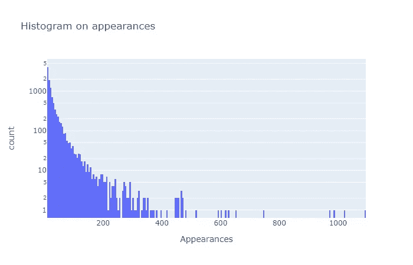
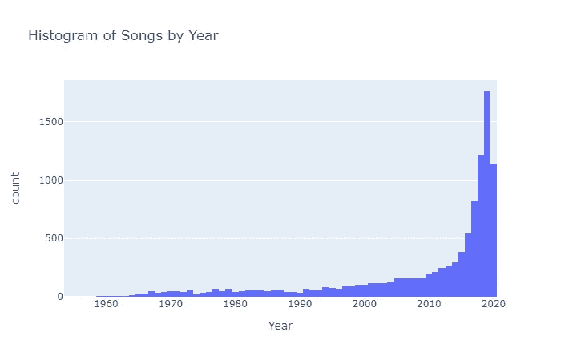
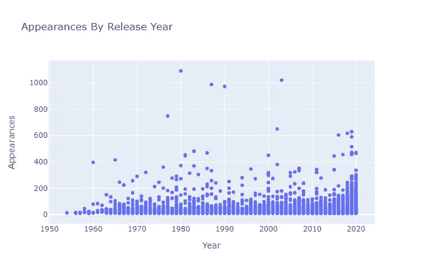
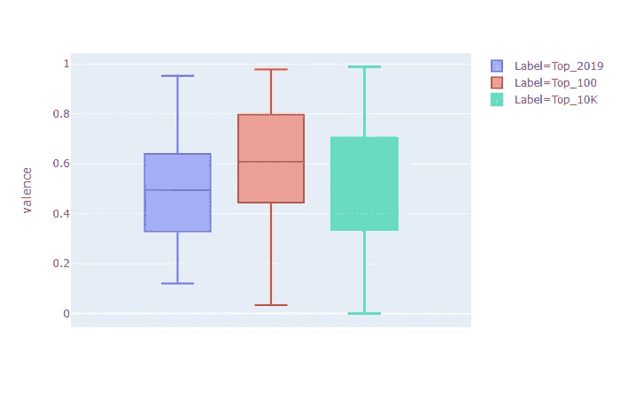
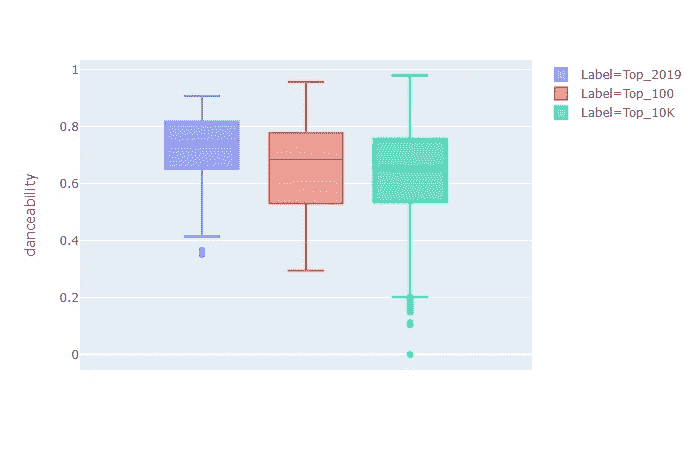
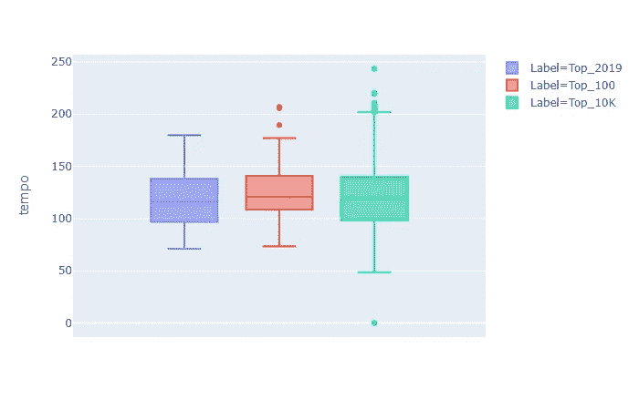
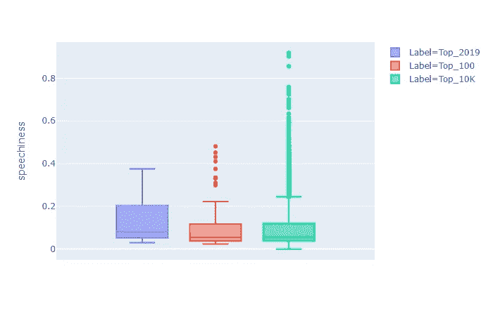
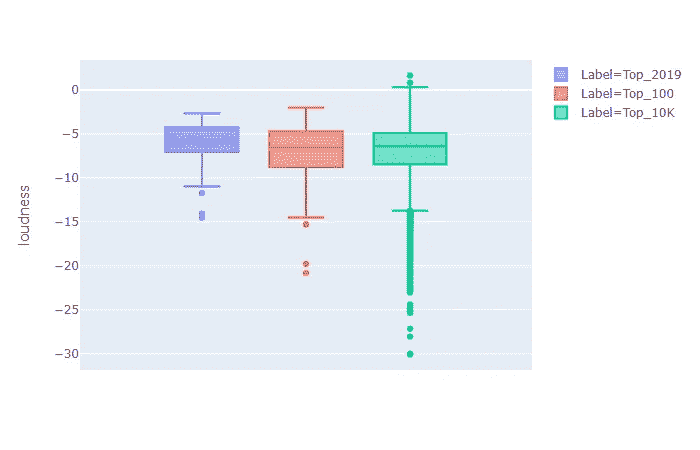
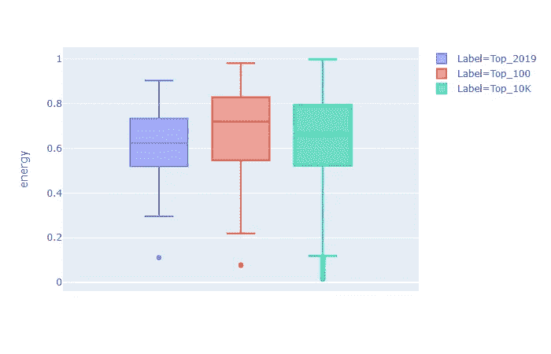
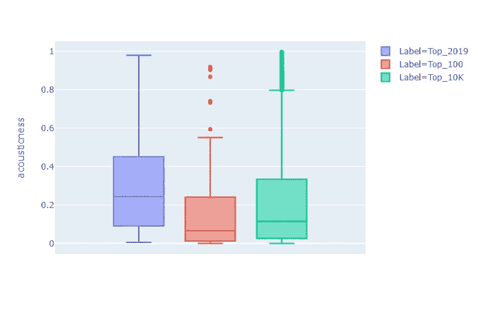

# 冠状病毒期间我们听什么音乐？使用数据科学的报告

> 原文：<https://towardsdatascience.com/what-music-do-people-listen-to-during-the-coronavirus-a-report-using-data-science-1a2035d12430?source=collection_archive---------36----------------------->

## 一切都变了，我们的音乐习惯也不例外。

西蒙·诺在 [Unsplash](https://unsplash.com?utm_source=medium&utm_medium=referral) 上的照片

大约[20 亿人现在被隔离](https://www.theguardian.com/world/2020/mar/24/nearly-20-of-global-population-under-coronavirus-lockdown)，我们生活的方方面面都因病毒而改变。娱乐和其他的没什么不同。网飞达到了历史上的巅峰。[人们用 Zoom 开派对](https://www.nytimes.com/2020/03/17/style/zoom-parties-coronavirus-memes.html)和[新闻媒体推荐隔离 Spotify 播放列表](https://www.vox.com/culture/2020/4/6/21210117/quarantine-playlist-coronavirus-spotify-music-for-isolation)。隔离播放列表的报道不是巧合。我给其中的几个投稿，并在我的社交媒体流上发现了几十个。人们正在制作许多冠状病毒主题的播放列表。这一切让我很好奇。在冠状病毒时代，我们在听什么？

我决定从 Spotify 播放列表中收集包含疫情相关词汇的数据，并对其进行分析。我想发现热门歌曲的频率，并将它们的音乐特征与隔离前我们听的歌曲进行比较。

谢天谢地，Spotify 有一个有用的 API。在这里，我将描述收集数据然后嵌入代码的过程。

首先，我们将使用 API 来收集包含我们想要的术语的所有播放列表。我搜索了四个术语，尽量做到包罗万象。我用来收集数据的术语是“COVID”、“corona”、“Quarantine 2020”和“Coronavirus”。搜索分别返回了 7940、9322、9383 和 2830 个结果。但是这里出现了第一个问题。用 Spotify API 每次搜索只能得到两千个结果。

坏消息是由于限制，我们只能得到一些数据。所以，我们讨论的一切都是关于数据的样本。
好消息是，先前的数字是重叠的，因此真正唯一的总数没有那么高，样本将是足够的。
经过四次请求，我们获得了 7085 个唯一播放列表。

结果的一个样本能够适合这里

让我们看看播放列表。平均一个播放列表有 103 首歌曲和一个非常有创意的名字。好吧，也许最后一个没有被科学证明。最大的播放列表包含 8846 首歌曲，有人听完它们的可能性为零，最短的播放列表包含 3 首歌曲。

现在我们想使用 API 来收集关于播放列表的数据。我们想得到他们包括的歌曲和关于歌曲的数据。

运行代码后，我们发现播放列表包含 725，824 首曲目和 275，316 首独特的歌曲。有很多歌曲，其中大多数只在几个播放列表中，这表明它们与情况无关。我想为将要进一步分析的数据添加一个过滤器。我决定一首好的第一个过滤器是一首歌至少在 10 个播放列表中；这给了我 10K 周围的歌曲，所以我只收集这些歌曲的元数据。元数据主要是音频特征。

我想解释一些关键的音频特性，我们稍后需要了解。

*   **速度**:音轨的速度，单位为每分钟节拍数(bps)
*   **效价**:衡量音轨音乐积极性的一个指标，效价越大，歌曲越积极
*   **音量**:一首歌的音量有多大，单位是分贝(dB)
*   可跳舞性:一条赛道有多适合跳舞
*   **声音度**:音轨的声音置信度
*   **能量**:歌曲强度和活跃程度的量度

在 API 的[文档中有更多关于它们的信息。](https://developer.spotify.com/documentation/web-api/reference/tracks/get-audio-features/)

获取上述数据的脚本

现在让我们来玩我们的数据。

这是排名前 100 的歌曲列表。从他们的名字来看，他们中的大多数人都很清楚为什么他们会出现在这个播放列表中。

但是让我们更深入地了解一下 10K 歌曲排行榜。由于所施加的过滤器，一首歌曲最多出现 1091 次，最少出现 10 次。平均出现 29 次，75%的歌曲出现次数少于此。这意味着另外的 25%包含了更大的价值。下面的直方图可以更好的解释。

我们有 1954 年发行的最古老的歌曲和 2020 年发行的最新歌曲。大多数歌曲来自过去十年，但这并不意味着它们是我们播放列表中最受欢迎的，正如我们在下面的直方图中看到的那样。

按年份划分的歌曲直方图

按发行年份排列的外观散点图

我们可以做的进一步分析是将它们的音频特征与一些基线进行比较。我决定使用 2019 年播放列表的顶级曲目作为基线。这是我们在危机前听到的一小部分内容。

我用箱线图比较了三个数据集的主要音频特征，即 2019 年的前 100 首歌曲和我们数据的前 10k 首歌曲。

顶级 10K 数据集非常庞大，范围太广，最后的歌曲只出现在 7k 的 10 个播放列表中，因此具有更大范围的值和更少的信息是合乎逻辑的。

# 音频分析

在我们的数据中，效价更大，所以似乎我们听的是更积极的歌曲。

可跳舞性略低，这不应该让我们感到惊讶，跳舞和社交距离不是很好。

速度似乎与数据集无关。

在我们的数据中，速度是另一个稍低的指标。我有一种感觉，这是因为最近(包括 2019 年)我们有很多嘻哈/说唱的点击量，而我们的数据也包括前几十年的数据和更多样化的音乐流派。

像速度一样，响度似乎不会改变。

我们的数据具有较低的声音和略高的能量，我们可能处于锁定状态，但我们尽量不停机！

对歌曲频率和音频特征的分析导致了一些非常有趣的模式的发现...似乎我们在经历非常艰难的经历时，用音乐来帮助我们变得积极。

该项目可以有更多的功能。我能想到的第一件事是对播放列表的标题和描述做一些自然语言处理。欢迎在评论中提出更多想法，甚至写一篇关于它们的文章，并在那里贴上链接。

谢谢你对我的作品感兴趣。我希望你喜欢这篇文章，并学到了一些新东西。

# 待在家里。注意安全。