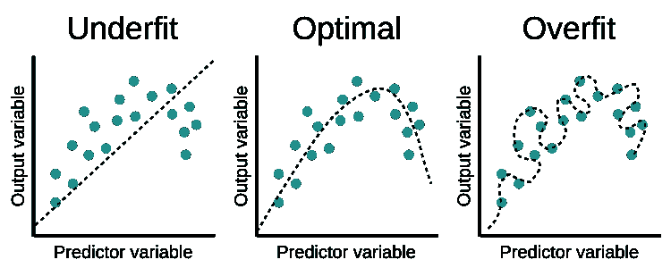

# “没有免费的午餐”在机器学习中真正意味着什么

> 原文：<https://towardsdatascience.com/what-no-free-lunch-really-means-in-machine-learning-85493215625d?source=collection_archive---------6----------------------->

## 揭开这个经常被误解的定理。

Riccardo Bergamini 在 [Unsplash](https://unsplash.com/s/photos/free-lunch?utm_source=unsplash&utm_medium=referral&utm_content=creditCopyText) 上拍摄的照片

谁不爱免费的午餐？你不用做饭，也不用花你的任何血汗钱。对任何人来说都很划算！事实是，除非你算上研究生院承诺免费披萨的特殊讲座和演讲，否则在机器学习领域就没有**免费的午餐。**

监督机器学习的“没有免费的午餐”(NFL)定理本质上暗示了**没有单一的机器学习算法是普遍适用于所有问题的最佳算法**。这是我在上一篇关于 XGBoost 局限性的文章中探讨的一个概念，XGBoost 是一种算法，由于它在学术研究和机器学习竞赛中的表现，在过去五年中获得了巨大的流行。

 [## 为什么 XGBoost 不能解决你所有的问题。

### XGBoost 和其他基于树的算法的一个关键限制。

towardsdatascience.com](/why-xgboost-cant-solve-all-your-problems-b5003a62d12a) 

本文的目标是利用这个经常被误解的定理并解释它，以便您可以欣赏这个定理背后的理论，并理解它对您作为机器学习实践者或数据科学家的工作的实际影响。

# 归纳的问题

奇怪的是，启发 NFL 定理的想法是由 18 世纪的一位哲学家首先提出的。是的，你没看错！不是数学家或统计学家，而是哲学家。

18 世纪中期，一位名叫大卫·休谟的苏格兰哲学家提出了他所谓的归纳 的 [**问题。这个问题是一个哲学问题，问归纳推理是否真的引导我们走向真知。**](https://plato.stanford.edu/entries/induction-problem/)

归纳推理是一种推理形式，我们根据过去的观察得出关于世界的结论。奇怪的是，这正是机器学习算法所做的。如果神经网络看到 100 张白天鹅的图像，它可能会得出所有天鹅都是白色的结论。但是如果神经网络看到一只黑天鹅会怎么样呢？现在，算法学习的模式突然被一个反例推翻了。这个想法通常被称为[黑天鹅悖论](https://deepai.org/machine-learning-glossary-and-terms/black-swan-paradox)。

Yuvraj Yadav 在 [Unsplash](https://unsplash.com/s/photos/black-swan?utm_source=unsplash&utm_medium=referral&utm_content=creditCopyText) 上拍摄的照片

休谟用这种逻辑来强调归纳推理的局限性——我们不能将一组特定的观察结果应用到一组更普遍的观察结果上。

> *“没有论证可以证明，那些我们没有经历过的实例，类似于那些我们经历过的实例。”——大卫·休谟在《人性论》中*

同样的想法成为 200 多年后机器学习的 NFL 定理的灵感。

# Wolpert 在机器学习中的应用

在他 1996 年的论文[学习算法之间缺乏先验区分](http://citeseerx.ist.psu.edu/viewdoc/download?doi=10.1.1.390.9412&rep=rep1&type=pdf)中，Wolpert 为监督机器学习引入了 NFL 定理，并在论文开头引用了 David Hume 的话。该定理指出，给定无噪声数据集，**对于任何两个机器学习算法 A 和 B，A 和 B 的平均性能在从均匀概率分布中抽取的所有可能的问题实例上将是相同的。**

为什么会这样呢？这又回到了归纳推理的概念。**对于机器学习问题，每个机器学习算法都预先假设特征和目标变量之间的关系。**这些假设通常被称为*先验假设*。机器学习算法在任何给定问题上的性能取决于算法的假设与问题的现实相符程度。**一种算法可能对一个问题表现得很好，但这并不意味着我们有理由相信，在同样的假设可能不起作用的另一个问题上，它也会表现得一样好。**这个概念基本上就是机器学习背景下的黑天鹅悖论。

**你在选择任何算法时做出的限制性假设就像你为午餐支付的价格。**这些假设将使你的算法在某些问题上自然更好，同时在其他问题上自然更差。

# 偏差-方差权衡

统计学和机器学习中与 NFL 定理密切相关的一个关键思想是**偏差-方差权衡**的概念。这一概念探讨了任何模型的两种误差源之间的关系:

*   模型的**偏差**是来自模型中潜在错误的先验假设的**误差。这些假设导致模型错过了关于机器学习问题的特征和目标之间的关系的重要信息。**
*   模型的**方差**是来自模型对训练数据微小变化的敏感度**误差。**

具有**高偏差的模型通常过于简单**并导致**欠拟合**，而具有**高方差的模型通常过于复杂**并导致**过拟合**。

过度拟合与欠拟合。来源: [Edpresso](https://www.educative.io/edpresso/overfitting-and-underfitting) ，根据 [CC BY-SA 4.0](https://creativecommons.org/licenses/by-sa/4.0/) 授权。

如上图所示，具有高偏差的模型无法正确拟合训练数据，而具有高方差的模型则很好地拟合了训练数据，以至于它记住了这些数据，却无法正确地将学到的知识应用到新的真实数据中。给定问题的最优模型介于这两个极端之间。**它有足够的偏差来避免简单地记忆训练数据，并且有足够的方差来实际拟合训练数据中的模式**。这种优化模型是通过优化偏差-方差权衡来实现对给定问题的测试数据的最低预测误差的模型，如下所示。

偏差-方差权衡。来源:[临床数据科学基础](https://www.ncbi.nlm.nih.gov/books/NBK543534/figure/ch8.Fig3/)，4.0 授权 [CC 下。](https://creativecommons.org/licenses/by/4.0/)

显然，每个机器学习问题都有一个不同的点，在这个点上，偏差-方差的权衡被优化，预测误差被最小化。正因如此，**没有一个超级算法能比每一个其他算法更好地解决每一个机器学习问题**。每种算法都做出假设，创造不同类型和水平的偏差，从而使它们更适合某些问题。

# “没有免费的午餐”对你意味着什么

所有这些理论都很棒，但对于作为数据科学家、机器学习工程师或只想开始学习机器的人来说，“没有免费的午餐”意味着什么？

是不是说所有算法都是平等的？不，当然不是。实际上，所有的算法并不都是平等的。这是因为整个机器学习问题集是 NFL 定理中的一个理论概念，它比我们实际尝试解决的实际机器学习问题集要大得多。在某些类型的问题上，一些算法可能通常比其他算法表现得更好，但是由于算法的先验假设，每个算法都有缺点和优点。

像 XGBoost 这样的算法可能会赢得数百场 Kaggle 比赛，但在预测任务中却惨败，因为基于树的模型中涉及到有限的假设。当涉及到图像分类和语音检测等复杂任务时，神经网络可能表现得非常好，但如果没有正确训练，就会因其复杂性而遭受过拟合。

实际上，这就是“没有免费的午餐”对你的意义:

*   **没有一种算法会比其他算法更好地解决你所有的机器学习问题**。
*   **在选择要使用的算法之前，确保你完全理解一个机器学习问题和所涉及的数据。**
*   所有模型的好坏取决于创建它们时的假设以及用来训练它们的数据。
*   **逻辑回归等更简单的模型偏差更大，容易欠拟合，而神经网络等更复杂的模型方差更大，容易过拟合。**
*   **给定问题的最佳模型位于两个偏差-方差极值的中间。**
*   **为了找到解决问题的好模型，您可能需要尝试不同的模型，并使用稳健的交叉验证策略对它们进行比较。**

# 来源

1.  《斯坦福哲学百科全书》，[归纳的问题](https://plato.stanford.edu/entries/induction-problem/)，(2018)。
2.  迪派，[黑天鹅悖论定义](https://deepai.org/machine-learning-glossary-and-terms/black-swan-paradox)，(2020)，deepai.org。
3.  D.休谟，[人性的论述](https://www.gutenberg.org/files/4705/4705-h/4705-h.htm)，(1739)，古腾堡计划。
4.  D.H.Wolpert，[学习算法之间缺乏先验区分](http://citeseerx.ist.psu.edu/viewdoc/download?doi=10.1.1.390.9412&rep=rep1&type=pdf)，(1996)，CiteSeerX。