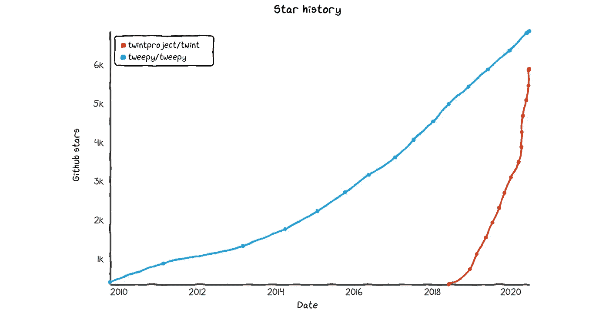
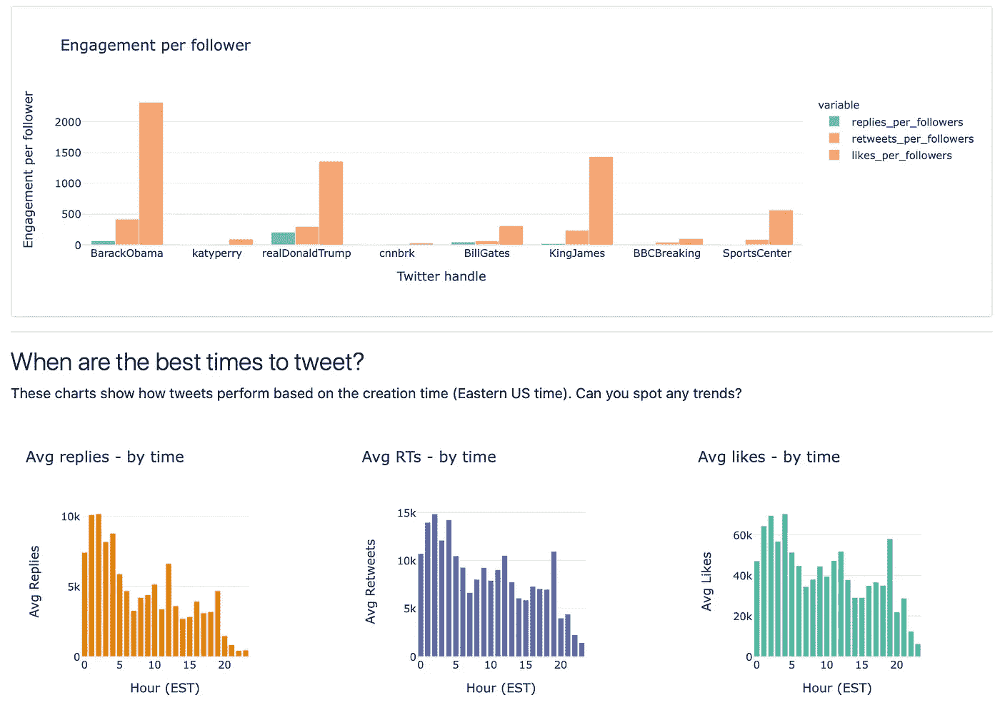

# 什么 Python 包最适合从 Twitter 获取数据？比较 Tweepy 和 Twint。

> 原文：<https://towardsdatascience.com/what-python-package-is-best-for-getting-data-from-twitter-comparing-tweepy-and-twint-f481005eccc9?source=collection_archive---------12----------------------->

## 回顾 Tweepy 和 Twint——两者的优缺点、代码片段、潜在用例以及我的建议。


Kon Karampelas 在 Unsplash 上拍摄的照片

[Twitter](https://twitter.com/home) 对于任何数据科学家来说都是绝对的宝库，无论他们是专业人士、学生还是业余爱好者。它将各行各业的人联系在一起，无论你是一名有抱负的音乐家还是 T4·泰勒·斯威夫特，无论你是一名职业篮球运动员还是勒布朗·詹姆斯，从当地政客到美国现任总统和前任总统。

它的用户群有多广，产生了多少数据？截至 2019 年第三季度，Twitter 的每日活跃用户群约为[1.45 亿人](https://blog.hootsuite.com/twitter-statistics/)，2018 年[每天发出 5 亿条推文](https://info.mention.com/hubfs/Twitter%20Engagement%20Report%202018%20%7C%20Mention.pdf)。即使有 280 个字符的限制，Twitter 数据提供了一片可以收获数据见解的沃土也就不足为奇了。

但是，我们如何收集这些数据呢？事实上，由于各种原因 Twitter 数据的预编译库是有限的(参见[此链接](https://gwu-libraries.github.io/sfm-ui/posts/2017-09-14-twitter-data)进行讨论)。Twitter 本身在特殊场合可能会提供自己的数据汇编，但这种情况很少。它们甚至可能不会公开提供——只对特定的开发人员和研究人员开放，比如这个与新冠肺炎相关的数据集。

这就是为什么我想在这篇文章中花些时间比较两个流行的第三方 Python 包， [Tweepy](https://github.com/tweepy/tweepy) 和 [Twint](https://github.com/twintproject/twint) 。

这两个库都非常受欢迎，正如你在下面 GitHub 受欢迎程度的图表中看到的。



Twint 和 Tweepy — GitHub 星史(【https://star-history.t9t.io/】T4)

我在这里[http://tweetdash.jphwang.com](http://tweetdash.jphwang.com)建立了自己的 Twitter 数据分析应用，为此我尝试了从两个库收集数据。



来自我的 Twitter 的屏幕截图[数据分析应用程序(链接)](http://tweetdash.jphwang.com)

和其他工具一样，它们并不完美，在我看来，Tweepy 和 Twint 各有优缺点。但是，它们是优秀的工具，即使以我有限的经验，我认为你的大部分 twitter 数据需求可以用一个或这些库的组合来满足。

事不宜迟，让我们开始吧！

# 总体差异

## 使用方法/认证

因此，我认为最大的区别是——Tweepy 是一个用于访问官方 Twitter API 的 Python 库——因此，您需要申请开发者访问权限并从 Twitter 获得密钥。

*   [申请 Twitter 开发者访问的链接](https://developer.twitter.com/en/apply-for-access)
*   [显示如何获取 Twitter API 密钥的链接](https://developer.twitter.com/en/docs/basics/authentication/overview)

另一方面，Twint 是一个抓取工具，旨在抓取 tweets 并克服 API 的限制。

*(注意:我不会进入关于网络抓取是否合法的讨论，或者 Twitter 的 TOS 关于抓取的说法。这只是对每个工具的讨论。)*

## 证明文件

[Tweepy 的文档](http://docs.tweepy.org/en/latest/)在我看来，是顶尖的。它的文档包括从身份验证到流的所有教程，还包括所有方法的 API 参考。

从零经验开始，您应该能够立即开始使用 Tweepy，立即下载时间线、用户信息或执行搜索。

另一方面，浏览 [Twint 的文档](https://github.com/twintproject/twint/wiki)会给你一种感觉，觉得这个包已经超过了文档的速度，或者他们只是还没有找到时间。

有趣的是，twint 可以从 shell 命令行使用——因此，如果用户愿意，他们可以直接运行 Twint，而无需进入 Python shell 或编写 Python 脚本。

这一切意味着什么？实际上，如果你想做的唯一的事情是收集大量的 Twint 可能是一个更好的工具，而 Tweepy 更适合收集更丰富的元数据，对于那些使用官方 API 的人来说，它具有灵活性和潜在的可扩展性。

这可能还是有点抽象。让我们继续看一些更具体的例子。

# 抓取推文

## 与 Tweepy

一旦你建立了你的开发者账户，你的密钥和令牌——这段代码片段将为你提供一组推文——在这种情况下，我将从勒布朗·詹姆斯的推特账户中抓取 200 条最新推文。

```
import tweepyauth = tweepy.OAuthHandler(consumer_key, consumer_secret)
auth.set_access_token(access_token, access_token_secret)

api = tweepy.API(auth)

screenname = 'KingJames'
tweets = api.user_timeline(screenname, count=200)
```

## 带 Twint

要用 Twint 做同样的事情，您实际上可以从**命令行/shell** 运行这个命令:

```
twint -u KingJames --limit 200 > testtwint.txt
```

要在 Python 中做到这一点，应该是这样的:

```
import twintc = twint.Config()
c.Limit = 200
c.Store_csv = True
c.Username = usernamec.Output = fname
twint.run.Search(c)
```

所以这两者都相对简单。它们都或多或少地包含了你可能想知道的关于每条推文的所有信息。

**Tweepy** 用这些列生成数据:

```
['created_at', 'id', 'id_str', 'full_text', 'truncated', 'display_text_range', 'entities', 'extended_entities', 'source', 'in_reply_to_status_id', 'in_reply_to_status_id_str', 'in_reply_to_user_id', 'in_reply_to_user_id_str', 'in_reply_to_screen_name', 'user', 'geo', 'coordinates', 'place', 'contributors', 'is_quote_status', 'retweet_count', 'favorite_count', 'favorited', 'retweeted', 'possibly_sensitive', 'lang']
```

另一方面， **Twint** 用这些列生成数据:

```
['id', 'conversation_id', 'created_at', 'date', 'time', 'timezone', 'user_id', 'username', 'name', 'place', 'tweet', 'mentions', 'urls', 'photos', 'replies_count', 'retweets_count', 'likes_count', 'hashtags', 'cashtags', 'link', 'retweet', 'quote_url', 'video', 'near', 'geo', 'source', 'user_rt_id', 'user_rt', 'retweet_id', 'reply_to', 'retweet_date', 'translate', 'trans_src', 'trans_dest']
```

对，是很多列。很混乱。但好消息是，这两组或多或少是相同的。他们必须这样，因为理论上他们都从 Twitter 上下载相同的数据。

## 性能差异

根据我的经验，在任何文本处理方案中，抓取推文所花的时间或多或少是无关紧要的。在我的体验中，Twint 要慢一点——这对我来说是有意义的，因为它利用 Twitter 的搜索功能进行抓取，而不是通过 Twitter 的原生 API。

这就引出了我的下一个观点…

## 限制

Tweepy 的最大限制是 Twitter API 的限制。Twitter 的 API 有各种限制，取决于你的账户等级([定价](https://developer.twitter.com/en/pricing))，最重要的是，Twitter 的 API 限制你在一个时间线内只能发布最后 3200 条推文。

另一方面，Twint 的主要限制是，它真的只是为了抓取推文而设计的，仅此而已。如果你想与 Twitter 互动——发布推文、屏蔽/屏蔽他人、发送 DM 等——这些都是 Twitter API 的领域，你应该求助于 Tweepy。

# 其他使用案例

正如所预示的那样，除了抓取一堆推文进行分析之外，对于几乎所有其他用例，我都会推荐 Tweepy 而不是 Twint。还有哪些用例？这里有一些例子。

## 自动跟踪

也许你想偶尔确保跟踪跟踪你的每个人:

```
auth = tweepy.OAuthHandler("consumer_key", "consumer_secret")
redirect_user(auth.get_authorization_url())
auth.get_access_token("verifier_value")
api = tweepy.API(auth)for follower in tweepy.Cursor(api.followers).items():
    follower.follow()
```

## 自动转发

也许你想建造一个机器人，当提到它的名字时，它会自动转发——你很幸运，因为这个机器人已经在这里被建造了(由[查尔斯·胡珀](https://github.com/chooper))。

## 在线教程

或者你可能想跟随这个关于 [RealPython](https://realpython.com/twitter-bot-python-tweepy/) 的教程。，并了解他们如何制作可以根据你的意愿自动收藏或转发的应用程序。

Twitter API 不仅提供了大量的例子，还提供了大量的例子来构建你自己的应用。这在 Twint 中是不可能的。Twint 或多或少做一件事，而且做得很好。但仅此而已。

# 推荐

还记得我说过我建立了自己的 Twitter 数据分析应用程序([http://tweetdash.jphwang.com](http://tweetdash.jphwang.com))？嗯，我的经验是 Twint 是一个很好的工具，可以为构建这个演示应用程序获取数据。

另一方面，学习和使用 Twint 的过程非常痛苦，因为它的文档非常少。当我试图做示例代码中没有显示的任何事情，或者偏离示例代码时，它需要的时间比我使用 Tweepy 时多几个数量级。

使用 Tweepy，我可以依赖它的官方文档、其他人的教程或示例项目。和以往一样，你的里程可能会有所不同，但这只是我的经验。

所有这些都是说尽可能多地使用 Tweepy 只有当你在获取原始推文方面碰壁时，看看 Twint 是否可以替代。我认为这样可以省去很多麻烦，而且很少会需要比 API 允许的更多的数据。

今天到此为止。

如果你喜欢这个，比如说👋/关注 [twitter](https://twitter.com/_jphwang) ，或点击此处获取更新。如果你错过了，看看这篇关于用 Plotly Dash 构建 web 应用的文章:

[](/build-a-web-data-dashboard-in-just-minutes-with-python-d722076aee2b) [## 使用 Python 在几分钟内构建一个 web 数据仪表板

### 通过将您的数据可视化转换为基于 web 的仪表板，以指数方式提高功能和可访问性…

towardsdatascience.com](/build-a-web-data-dashboard-in-just-minutes-with-python-d722076aee2b) 

这个比较金融市场的 API:

[](/comparing-the-best-free-financial-market-data-apis-158ae73c16ba) [## 比较最佳免费金融市场数据 API

### 作为一名数据科学家，如果你想分析金融市场数据(股票市场或加密数据),请从这里开始

towardsdatascience.com](/comparing-the-best-free-financial-market-data-apis-158ae73c16ba) 

因为一些私人的事情，我已经离开写作很多时间了，但是我很高兴回到这里。:)下次见！