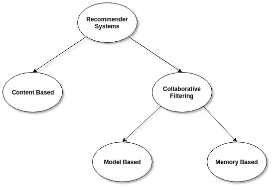
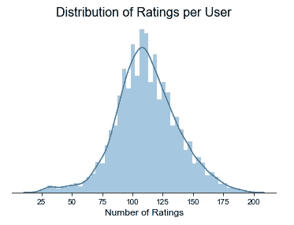
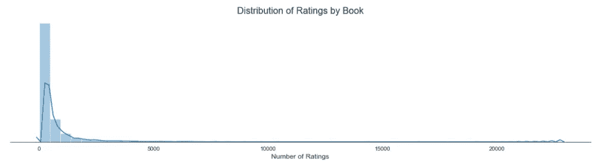
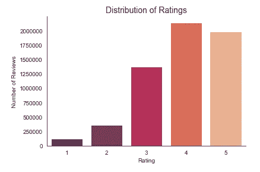

# 接下来该读什么？

> 原文：<https://towardsdatascience.com/what-should-i-read-next-f02a16bec832?source=collection_archive---------41----------------------->

## 一个使用 surprise 的协同过滤图书推荐系统


苏珊·尹在 [Unsplash](https://unsplash.com?utm_source=medium&utm_medium=referral) 上的照片

# 推荐系统快速介绍

推荐系统是一个强大的工具，是亚马逊、网飞、Spotify 和许多其他成功公司的核心。它们旨在预测用户对产品或项目的评分或偏好，基于的标准包括用户搜索过的项目、过去评分较高的项目或他们喜欢的歌曲或电影。目标是向用户展示他们更有可能参与或购买的新商品。

有不同的方法来实现推荐系统。它们基本上分为基于内容的和协同过滤系统。基于内容的系统是根据项目本身的特征信息构建的。它是当你被提供“像这样的其他项目”时你所看到的。它们可能非常有用，因为用户可能喜欢与他们正在搜索的书或电影相似的另一本书或电影。这种类型的系统的一个缺点是一些人工或半人工标记是必要的。

另一方面，协同过滤系统基于用户对项目的评级。它们是通过使用用户对项目的评级集合来计算的。其背后的思想是相似的用户将有相似的偏好，并且用户有喜欢彼此相似的项目的倾向。这种类型的推荐系统可以使用两种不同的方法来计算这种相似性，我们将在这篇文章中尝试这两种方法。这种类型的系统的一个缺点是所谓的冷启动，这意味着系统需要相当数量的初始用户评级，以便能够做出良好的预测。

目前使用的最先进的推荐系统应用几种不同方法的组合来给出最准确的结果，包括自然语言处理和卷积神经网络，但在这篇文章中，我将带你通过一个简单的协同过滤推荐系统，应用一个叫做 [surprise](https://surprise.readthedocs.io/en/stable/#) 的伟大库。



来源: [KDnuggets](https://www.kdnuggets.com/2019/09/machine-learning-recommender-systems.html)

所以回到我手头的问题，接下来该看什么书？为了回答这个问题，我们将使用 surprise 和在 Kaggle 上找到的这个[数据集构建一个简单的协同过滤推荐系统，该数据集由 53，424 个独立用户对 10，000 本书的大约 600 万个评级条目组成。除了评分数据，我们还可以访问书籍的元数据、书籍类型和其他标签，以及用户标记为“待读”的书籍。](https://www.kaggle.com/alexanderfrosati/goodbooks-10k-updated)

协作过滤系统有两种不同的工作方式。基于记忆或邻域的协作过滤方法试图量化用户和项目彼此之间的相似程度，然后基于该相似性度量提供前 N 个推荐。另一方面，基于模型的方法基于这样的概念，即用户的偏好可以由少量的隐藏因素或潜在变量来确定。我们可以使用单值分解(SVD)来帮助提取这些潜在因素，帮助我们理解用户和项目之间的关系。它将我们的任务转化为一个优化问题，我们希望最小化预测中的误差。

# 用惊喜创造推荐系统

首先，如果你没有惊喜，你需要安装它。这就像在您的终端上运行`pip install surprise`一样简单。惊喜带有两个内置数据集，便于练习，但也支持使用您自己的自定义数据(注意，它不支持隐式评级或基于内容的信息)。我们将加载我们的数据，在我们为建模做准备并开始该任务之前，我们必须进行一些数据探索和分析。人们应该在一般的数据分布中寻找空值、异常值等等。

我加载了评级数据集和图书元数据。我们的评分数据没有空值，每个用户的评分分布接近正常，每个用户的平均评分数为 111.87 本书，每个用户评分的中位数为 111 本书。



另一方面，每本书的收视率分布，正如这类问题所预期的那样，是一种长尾分布。少数几本书很受欢迎，收视率很高，而大多数书的收视率较低。每本书的平均评分数和中值评分数之间的差异(分别为 597.65 248)证实了这一点。这就是为什么推荐系统如此重要和有用的原因！帮助用户发现那些不太受欢迎的书，如果他们知道这些书，他们肯定会喜欢的。



这本书的评分从 1 到 5 不等。我想知道 Goodreads 用户在他们的评级中有多挑剔。让我们看看收视率分布是否不平衡。



该图显示，用户在评分方面相当慷慨，很少有书被评为低评分。看起来他们的书友会运气不错！

数据科学家将在数据探索和分析上花费更多的时间，但是为了这篇文章的简洁，我们将继续从建模开始。要想惊喜地使用我们的数据，我们需要将其加载到正确的格式中。您需要用您的评级标准定义一个阅读器，并通过正确的列加载您的数据。

```
# define reader
reader = Reader(rating_scale=(1, 5))# load dataframe into correct format for surprise library
data = Dataset.load_from_df(ratings[['user_id', 'book_id', 'rating']], reader)
```

接下来，我们将数据分成训练集和测试集，以评估我们的模型并避免数据泄漏。我正在分离 20%的数据进行测试。

```
# Split into train and test set
trainset, testset = train_test_split(data, test_size=0.2, random_state=0)
```

您可以检查数据中用户和项目的总数。

```
# confirm number of items and users in data
print('Number of users: ', trainset.n_users, '\n')
print('Number of items: ', trainset.n_items, '\n')Number of users:  53424 

Number of items:  10000
```

## 基于记忆或邻域的方法

我们将开始尝试一种基于邻域的方法。由于我们的用户比条目多，我们将通过计算条目间的相似性来解决这个问题。另一种选择是计算用户之间的相似性。我们可以使用不同的度量来计算相似性，我们知道不同的度量会产生不同的结果。我将尝试使用两个相似性度量标准——余弦相似性和皮尔逊相关性——以及来自 surprise library 的基本 KNN 模型，看看哪一个性能更好。我们将使用均方根误差(RSME)作为我们的评估指标。

```
# define a cosine metric for item-item
sim_cos = {'name':'cosine', 'user_based':False}# define and fit a basic KNN model with a cosine metric
basic = knns.KNNBasic(sim_options=sim_cos)
basic.fit(trainset)# make predictions
predictions = basic.test(testset)# check accuracy
accuracy.rmse(predictions)RMSE: 0.8827
```

现在，我们将使用皮尔逊相关相似性度量进行同样的操作。

```
# define fit and evaluate a KNN basic model with pearson correlation metric
sim_pearson = {'name':'pearson', 'user_based':False}
basic_pearson = knns.KNNBasic(sim_options=sim_pearson)
basic_pearson.fit(trainset)
predictions = basic_pearson.test(testset)
accuracy.rmse(predictions)RMSE: 0.8724
```

太好了，皮尔逊相关性似乎对我们的数据更有帮助。我们还可以尝试使用其他更先进的模型:KNN 均值模型，它考虑了每个项目的平均评级，以及 KNN 基线模型，它考虑了基线评级(全局均值)。让我们看看他们的表现。

```
# KNN with means model
sim_pearson = {'name':'pearson', 'user_based':False}
knn_baseline = knns.KNNWithMeans(sim_options=sim_pearson)
knn_baseline.fit(trainset)
predictions = knn_baseline.test(testset)
accuracy.rmse(predictions)RMSE: 0.8406# KNN baseline model
sim_pearson_baseline = {'name': 'pearson_baseline','user_based':False}#'shrinkage':50, 'min_support':5, 
knn_baseline = knns.KNNBaseline(sim_options=sim_pearson)
knn_baseline.fit(trainset)
predictions = knn_baseline.test(testset)
accuracy.rmse(predictions)RMSE: 0.8371
```

## 基于模型的协作过滤

现在让我们尝试一种不同的方法，一种基于矩阵分解的方法，带有基于模型的协作过滤，看看它是否能更好地处理我们的数据。

```
# define a base singular value decomposition model
svd = SVD()# fit and test algorithm
predictions = svd.fit(trainset).test(testset)# evaluate model
print(accuracy.rmse(predictions))RMSE: 0.8306
```

这已经比我们最好的基于邻居的模型好一点了。我们可以尝试用网格搜索来微调我们的超参数，这可以进一步提高我们的模型性能。我还想将我的数据的一部分作为验证集，一部分作为未知的测试集，我们将使用它们进行预测。做这件事的方法是从惊奇库文档[这里](https://surprise.readthedocs.io/en/stable/FAQ.html#how-to-save-some-data-for-unbiased-accuracy-estimation)复制的。

```
raw_ratings = data.raw_ratings# shuffle ratings
random.shuffle(raw_ratings)# A = 90% of the data, B = 20% of the data
threshold = int(.8 * len(raw_ratings))
A_raw_ratings = raw_ratings[:threshold]
B_raw_ratings = raw_ratings[threshold:]data.raw_ratings = A_raw_ratings  # data is now the set A# define parameter grid and fit gridsearch on set A data
param_grid = {'n_epochs': [5, 10], 'lr_all': [0.002, 0.005]}
grid_search = GridSearchCV(SVD, param_grid, measures=['rmse'], cv=3)
grid_search.fit(data)best_svd = grid_search.best_estimator['rmse']# retrain on the whole set A
trainset = data.build_full_trainset()
best_svd.fit(trainset)# Compute biased accuracy on A
predictions = best_svd.test(trainset.build_testset())accuracy.rmse(predictions)RMSE: 0.7786# Compute unbiased accuracy on B
testset = data.construct_testset(B_raw_ratings)  # testset is now the set B
predictions = best_svd.test(testset)
print('Unbiased accuracy on B,', end=' ')
accuracy.rmse(predictions)Unbiased accuracy on B, RMSE: 0.7924
```

这是一些很好的改进。我们现在可以使用这个模型为新用户做预测，并为每个用户推荐 N 个商品。令人惊讶的文档向我们展示了[如何使用我们最好的模型](https://surprise.readthedocs.io/en/stable/FAQ.html#how-to-get-the-top-n-recommendations-for-each-user)来做到这一点。

*如果你有兴趣查看这篇文章所基于的全部代码，你可以在 Github* *上找到它* [*。*](https://github.com/gioamorim80/Book-Recommendation-System/blob/master/Book%20Recommendation%20System.ipynb)