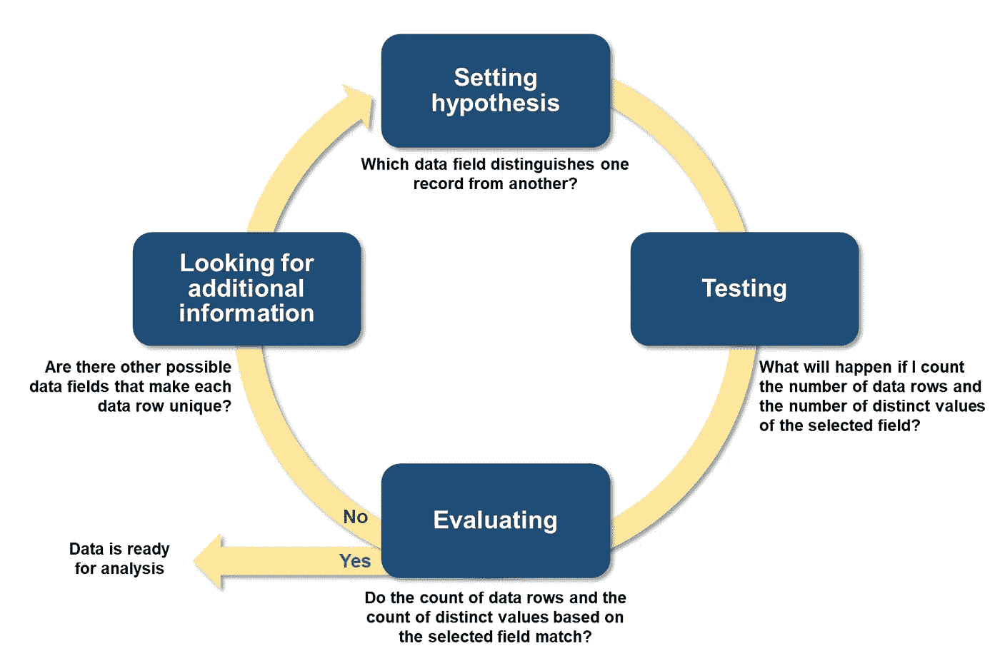

# 哪些 SQL 课程没有让我们为真实世界的数据集做好准备

> 原文：<https://towardsdatascience.com/what-sql-course-didnt-prepare-you-for-real-world-datasets-4a31da8bc150?source=collection_archive---------58----------------------->

## 从商业角度使用 SQL 进行快速数据验证的指南

在您的数据职业生涯中，您可能听说过 SQL，或者对它进行了深入的研究，以至于了解了一切，甚至掌握了表连接的概念。

当你进入真实世界的数据集时，惊喜就来了。大多数时候它们并不干净，到处都有丢失的值和重复的记录。无论我们身处哪个行业，我们都经历过这种情况——花大量时间调查违规行为，只是为了发现底层数据是罪魁祸首。

尽管有这些挑战，我们所经历的大多数 SQL 课程倾向于用干净的数据集来教导我们，而很少给我们这种现实的指导。


布鲁克·卡吉尔在 [Unsplash](https://unsplash.com?utm_source=medium&utm_medium=referral) 上的照片

鉴于我们角色的一个方面是确保业务决策基于一天结束时的准确分析和上述挑战，**进行数据检查和验证**无疑是现实世界数据集不应忽视的基本概念之一。它与决定任何分析和随后的商业决策成败的质量有关。

现在，您已经掌握了 SQL 技能，让我们看看如何将 SQL(及其带来的逻辑)和业务视角结合在一起的一些基本想法，以告知我们如何在任何分析之前执行数据检查和验证。

## 首先，让我们设置一些零售业务的背景


照片由 [Mehrad Vosoughi](https://unsplash.com/@mehrad_vosoughi?utm_source=medium&utm_medium=referral) 在 [Unsplash](https://unsplash.com?utm_source=medium&utm_medium=referral) 上拍摄

在数据世界中，通常被认为等同于你在货架上看到的产品的东西或多或少是一个产品表。

如果我们仔细看看产品表，它通常包含产品 ID(也称为产品条形码)和相关信息，如产品描述和产品类别，当然数据字典对于查看使每个数据行彼此唯一的关键字段非常有用。然而，在现实中，如果获得它很困难，并且您在时间上很紧张，该怎么办呢？

最终，我们需要确保数据的准确性，一个快捷的方法是检查产品记录中是否有重复。为此，我们根据经验推测 *product_id* 是关键字段，并使用 COUNT()和 COUNT(DISTINCT)如下:

```
**SELECT** **COUNT**(product_id), **COUNT**(**DISTINCT** product_id) **FROM** product;
```

*如果我们的猜测是正确的，我们应该期望两个数字相等*，因为这意味着没有重复，并且每一行都是唯一的。

在现实世界中，我们希望使用这个经过验证的表进行连接，并对主要的客户交易进行进一步的数据分析，例如，查看给定客户交易中的产品类型。为了完整起见，我们还假设希望保留交易表中的所有记录，以查看是否有任何交易产品没有记录在产品表中。然后，在连接之后，可以在结果表上扩展上面相同的验证概念，如下面的 SQL 所示。理想情况下，计数应该是相同的，假设列 *transaction_id* 对于事务表中的所有行都是唯一的。

```
**SELECT **  **COUNT**(*), **COUNT**(**DISTINCT** t.transaction_id)
**FROM**     transaction t
         **LEFT JOIN** product p
         **ON** t.product_id = p.product_id;
```

***但是如果这些数字不一样呢？***

首先，不要妄下结论说数据是错误的，这背后可能有一些商业原因。也许您正在处理的产品表基于全球产品目录，这意味着可能有一种产品以相同的条形码(或产品 ID)在不同的国家销售，或者零售商只是简单地回收了他们的内部产品条形码，等等。


照片由[粘土银行](https://unsplash.com/@claybanks?utm_source=medium&utm_medium=referral)在 [Unsplash](https://unsplash.com?utm_source=medium&utm_medium=referral) 上拍摄

## 我们先来看看全球产品目录的案例…

处理大型数据集可能涉及到可以用自然分割线分隔的部分。对于全球或区域参与者，不同的市场可能是一个天然的分割线，我们可以使用它来分离数据集以进行不同的分析。有时，产品表作为包含所有市场中产品列表的单个表出现。在这种情况下，我们需要添加另一列来指示要测试的市场，我们的 SQL 现在将是:

```
**SELECT **  market
         , **COUNT**(product_id)
         , **COUNT**(**DISTINCT** product_id) 
**FROM**     product
**GROUP BY** market;
```

如果这为我们提供了每个市场的相同计数，那么您就已经成功了——产品表是按产品条形码和市场排列的。还要记住，在将该表联接回主客户事务以进行分析时，现在列 *product_id* 和 *market* 都是必需的，因此联接时可能如下所示:

```
**SELECT **  *
**FROM**     transaction t
         **LEFT JOIN** product p
         **ON** t.product_id = p.product_id
         **AND** t.market = p.market;
```

如果数字仍然不相等，那么您需要查看其他列，并开始假设使每个数据行唯一的其他可能的字段。*我希望你明白我的意思，这是关于观察数据，反复建立一个假设并测试它。*



数据验证是一个迭代过程。它从设定一个假设开始，然后检验它。如果测试失败，应考虑额外的信息，并将结果反馈到更新的假设和后续测试中。(图片由作者提供)

## 现在我们来看第二个例子，一家零售商回收了他们的内部产品条形码…

有些人可能想知道这是怎么发生的。根据我的经验，一些零售商有他们所谓的“条形码回收”,这对于私人管理的产品来说很常见。想想看，当你购买一个羊角面包或超市自己制作的熟食时，没有所有超市都同意的通用产品条形码，因为它是在商店内制作的，而不是像国家品牌产品那样由通用的第三方供应商制造的。


[通产省](https://unsplash.com/@gigantfotos?utm_source=medium&utm_medium=referral)在 [Unsplash](https://unsplash.com?utm_source=medium&utm_medium=referral) 上拍摄的照片

一段时间后，您可能会看到这些条形码被重新用于另一种产品，主要是为了提高运营灵活性或避免额外的上市费用。这也是产品表中同一条形码下有 2 个本质不同产品条目的原因之一。

在这种情况下，我们想知道的是这些条形码生效的时间段，因为这使我们能够区分两个重复的条形码。同时，这为数据库设计带来了一些改进的机会，可以引入缓慢变化的维度——但这值得单独讲述。

回到这个话题，假设您现在有了重复产品条形码生效的时间段，如下所示。


该表显示了两个不同产品的两个记录的示例，这两个记录共享随着时间的推移被回收的相同产品条形码。有效时间段列显示每个应用的时间段。(图片由作者提供)

实现 SQL 验证的方式可能如下所示。这时，您假设使每一行唯一的是产品条形码、有效开始日期和有效结束日期的组合。

```
**SELECT **  **COUNT**(*)
         , **COUNT**(**DISTINCT** product_id + effective_start_date +
           effective_end_date)
**FROM**     product;
```

检查计数是否相等后，如何将经过验证的产品表联接回客户事务表，如下所示。

```
**SELECT **  **COUNT**(*)
         , **COUNT**(**DISTINCT** transaction_id)
**FROM**     transaction t
         **LEFT JOIN** product p
         **ON** t.product_id = p.product_id
**WHERE**    t.transaction_date
         **BETWEEN** p.effective_start_date **AND** p.effective_end_date
```

请注意，现在我们需要在 WHERE 语句中添加一个时间段条件，以确保为具有回收条形码的产品提取正确的产品信息，并且计数应该始终相等，否则这表明回收产品存在重叠的有效时间段，我们需要在开始分析之前纠正这一点。

# **总结一下…**


格伦·卡斯滕斯-彼得斯在 [Unsplash](https://unsplash.com?utm_source=medium&utm_medium=referral) 上的照片

进行数据检查和验证是我们一切工作的基础。它与准确的业务决策背后的数据和分析质量直接相关。同时，不要在没有充分考虑背后的商业原因的情况下，仅仅因为验证是这样说的，就妄下结论说数据是错误的。

尽管本文并不打算面面俱到，但我希望给出的几个示例能或多或少地阐明 SQL 或通过 SQL 显示的逻辑可以与业务角度结合使用来处理真实数据集的可能领域。