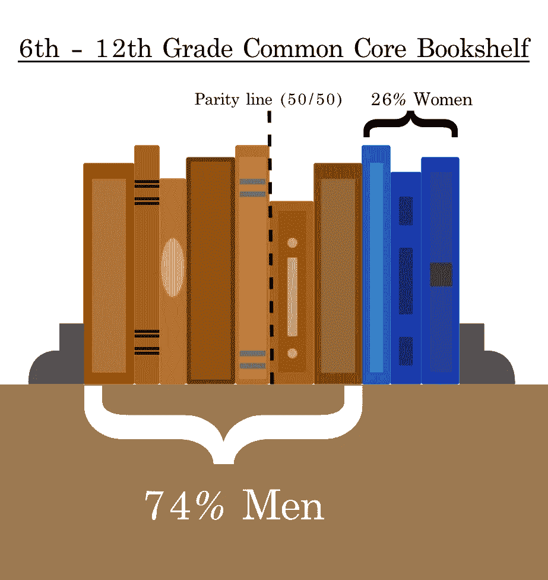
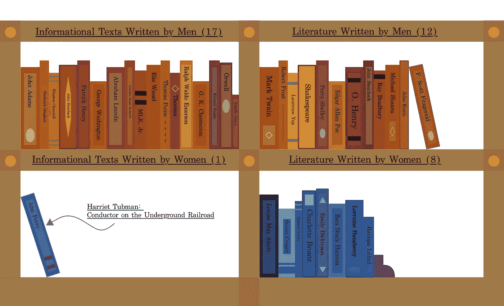
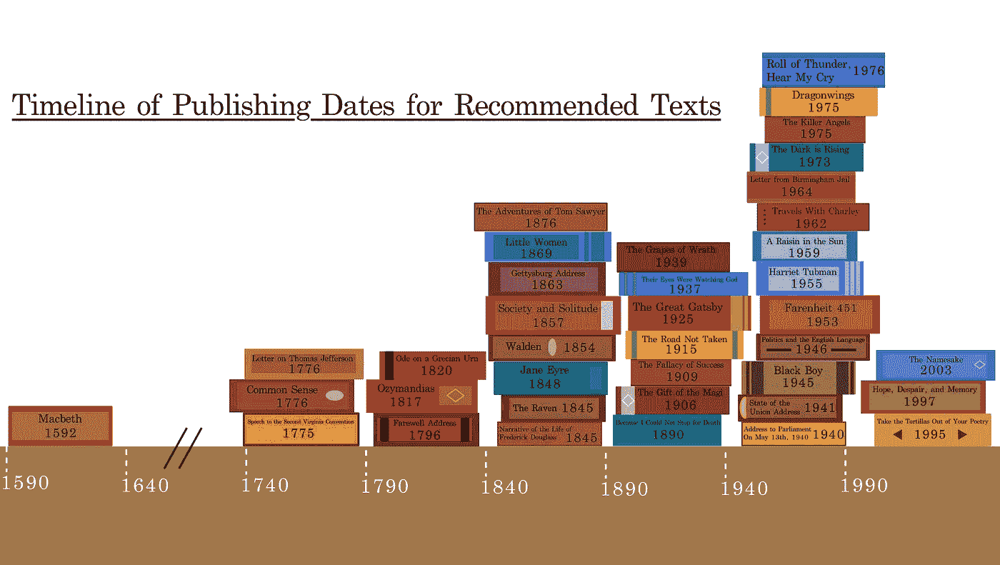

# 学校教给我们什么故事？

> 原文：<https://towardsdatascience.com/what-stories-do-schools-teach-us-43069c6dc040?source=collection_archive---------46----------------------->

## 公共核心英语课程的统计分析

自教育倡议于 2010 年启动以来，共同核心州标准已经决定了全国公立学校的课程。特别是，这些指南已经整理了小学、初中和高中的图书馆书架，通过精心挑选的不到 80 本推荐书籍，有效地塑造了未来的领导者和书虫。

作为书籍和数据新闻的爱好者，我受到启发，尝试“按数字”看待这些共同的核心标准。考虑的因素包括一本书作者的性别、出版日期以及基于 Goodreads 评论数据的受欢迎程度。

这些标题的完整列表可以在[PDF](https://www.newhtfd.org/cms/lib/CT01000055/Centricity/Domain/19/CCSS_ELA_Standards.pdf)中找到，也可以通过本文底部的交互式表格找到。我还制作了最终的数据集，用于生成可用的分析和可视化[这里](https://www.dropbox.com/scl/fi/6pvh9asplvpxkwc7liz7m/Common_Core_Recommendations_6_12.xlsx?dl=0&rlkey=mkh2c3pv3wu5ixf1p8yjlu9c9)。

## 性别

虽然共同核心州标准倡议(CCSI)适用于从幼儿园开始的学生，但本分析将侧重于该计划为 6 至 12 年级学生提出的建议。英语语言艺术推荐可以分为两类:“文学:故事，戏剧，诗歌”和“信息文本:文学非虚构和历史，科学和技术文本。”同样值得注意的是，通用核心标准已经被大多数(但不是全部)州采用[。](http://www.corestandards.org/standards-in-your-state/)

在这七年的教育中，共同核心标准推荐学生阅读 38 种特定的文本。在这份名单中，26%的书是由女性写的(10/38)，74%的书是由男性写的(28/38)。

图片作者:斯潘塞·迪恩

当只考虑信息文本时，这种性别差异变得更加明显，这些信息文本包括原始资料和历史文献，如“弗雷德里克·道格拉斯的生活叙事”或亚伯拉罕·林肯的“葛底斯堡演说”在所有的信息文本中，只有一篇是女性写的——安·皮特里的《哈丽雅特·塔布曼:地下铁路的售票员》

反之，文学类内的比例更为均匀。 **12** 课文是男人写的，而 **8** 是女人写的。

图片作者:斯潘塞·迪恩

## 出版日期

接下来，我检查了推荐文本是什么时候写的。下面的可视化显示了一个时间线，其中书籍被分成 50 年的跨度。如图所示，公共核心课程中的大多数题目都是在 19 世纪或 20 世纪编写的。出版日期的中间值是 1920 年(T0)和 1920 年(T1)，尽管如果忽略《麦克白》(1592)的异常值，这个中间值会上升到 1925 年(T3)，正好是司各特·菲茨杰拉德出版《了不起的盖茨比》的那一年

这张图表也显示了更多的书籍是如何从特定的历史重要时代中挑选出来的。例如，三个信息文本围绕美国独立战争(1775-1783)的日期聚集在一起。

完整的 38 本书中，只有一本出版于 21 世纪:裘帕·拉希莉 2003 年的小说《同名》

图片作者:斯潘塞·迪恩

## 流行

由于每年全国的学生都被分配这些相同的书籍，有些比其他的更能激发热情，我很好奇这些课程的重点到底有多受欢迎。为了这个任务，我求助于 [Goodreads](http://goodreads.com) ，这是一个由用户生成评论和评级的在线图书数据库。

*注:由于 Goodreads 数据缺失，9 篇文章(包括一些文章和演讲记录)被排除在本次分析之外。*

平均而言，Goodreads 用户对普通核心书籍的评分为 4.02 分(5 颗星中的 4.02 分)。榜单上最受欢迎的标题是马丁·路德·金的《来自伯明翰监狱的信》，排名 4.53 位。最不受欢迎的是劳伦斯·耶普 1975 年的小说《龙翼》，在 3500 多条用户评论中，这部小说平均获得了 3.53 颗星。

## 讨论和方法

尽管确切的英语语言艺术课程在不同的学区有所不同，但从这份建议清单中仍然可以得出一些值得注意的结论，该清单声称“让所有学生在高中毕业时为大学、职业和生活的成功做好准备”很明显，虽然似乎做出了一些努力来呈现更多样化的观点(从莎士比亚到艾米莉·狄金森，再到洛林·汉斯贝里)，但女性撰写的故事和历史在共同核心目录中的代表性不成比例，特别是在信息类文本中。

学校总是可以在他们选择教授的角度上争取更多的多样性。这一目标的重要性不仅体现在性别上，还体现在种族、性和国籍等话题上。关于多元文化和国际文学，通过儿童书籍教学中心主任横田顺子写道:“很明显，多元文化文学可以而且应该成为学生学习的核心，精心挑选的高质量文学可以对学生的自我意识和他人意识产生影响。"

熟悉这份名单上的作者表明，大多数文本是由美国白人写的，但具体数字需要用更详细的数据集进行另一次分析。

对于我使用的数据集，信息首先直接从公共核心网站中提取，然后在 Excel 中进行清理和预处理，最后通过独立研究添加新字段(主要是在互联网上搜索作者简历和维基百科页面)。所有图表都是用 DataWrapper 和 Adobe XD 制作的。

## 结论

如果某个学校采用了共同核心制定的标准，他们的英语学生在 6 到 12 年级之间将会阅读 38 本书。在这 38 本书中，10 本将由女性撰写，28 本由男性撰写。这些作品中的大部分，无论是历史文献还是文学经典，都将在 19 世纪或 20 世纪初至中期出版。他们最喜欢什么？根据 Goodreads 用户的说法，人们可能会说“来自伯明翰监狱的信”，或者米歇尔·沙阿拉的“杀手天使”

至于除了性别之外的作者多样性的测量，像种族这样的人口统计学不在这个项目的范围之内。然而，在这个问题上正在进行重要的研究。对于那些有兴趣了解更多关于课堂阅读中的表现的人，我建议去看看[合作课堂中心](https://www.collaborativeclassroom.org/blog/diversity-in-childrens-literature-check-your-blind-spot-part-2/)和[合作儿童图书中心](https://www.cbcbooks.org/2015/02/19/2014-multicultural-literature-statistics-from-the-cooperative-childrens-book-center/#.Vp5fymTF_iR)，该中心出版儿童文学年度评论。

*探索数据:*