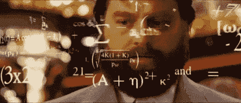
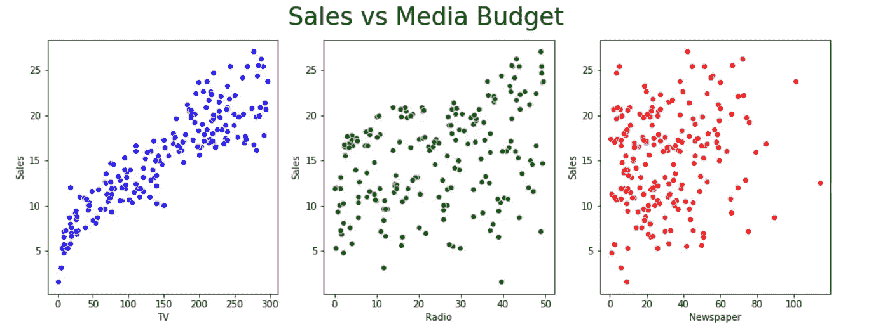
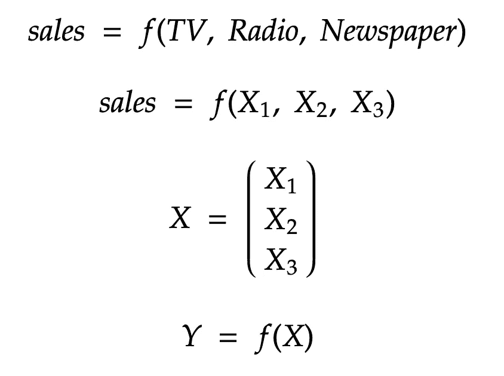
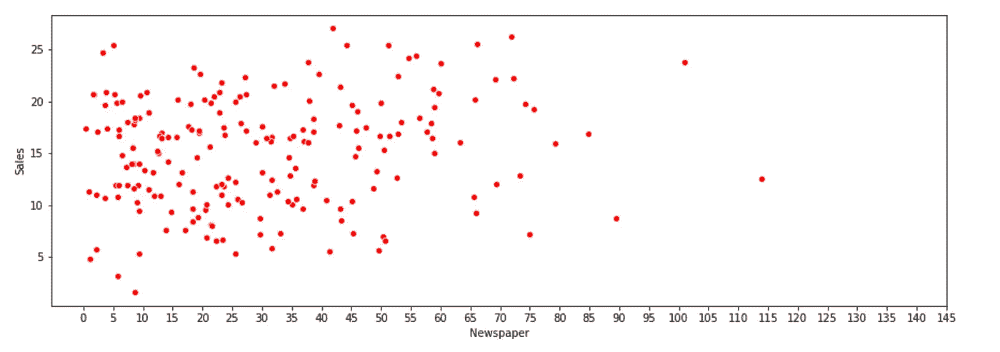
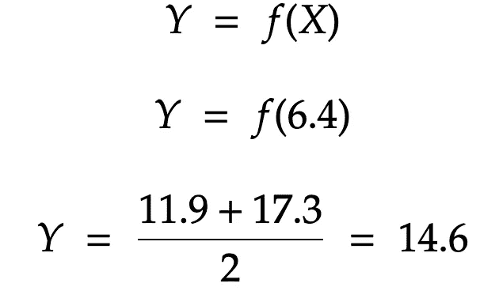

# 怎么回事？

> 原文：<https://towardsdatascience.com/what-the-f-8fb700b5044f?source=collection_archive---------51----------------------->

[来源](https://media.giphy.com/media/3owzW5c1tPq63MPmWk/giphy.gif)

## 好好看看机器学习的‘f’字，以及为什么不能忽略它！

> 声明:所有表达的观点都是我自己的。

我知道你很想知道这个“f”字到底是什么。别走开，我们很快就会到达。我可以马上告诉你的一件事是，不管你对机器学习的熟悉程度如何，理解这个‘f’字将有助于你理解大多数机器学习是怎么回事。

在此之前，我们先来玩一点角色扮演。你是一名数据科学家，你的初创公司让你与一名营销同事合作，以提高公司产品的销量。你必须建议“营销人员”如何调整三种不同媒体渠道的广告预算——电视、广播和报纸。

[来源](https://thumbs.gfycat.com/SimilarChiefGhostshrimp-size_restricted.gif)

你看一下过去的[数据](https://www.kaggle.com/ashydv/advertising-dataset)(图 1)，你可以用肉眼看出，很明显，你在每个媒体渠道——电视、广播和报纸——上投入的广告金额对产品的销售有影响。

图 1:每个广告媒体的销售额(以千单位计)与预算(以千美元计)

作为一名数据科学家，您希望了解并解释这三者是如何共同影响销售的。换句话说，我们希望将销售建模为电视、广播和报纸预算的 ***函数*** 。是的，这就是我们难以捉摸的“f”字——函数。

“销售是电视、广播和报纸预算的一个功能”的说法。

# 这个 f 是什么意思？

简而言之，你可以把 f 想象成一个输入 X 产生输出 y 的东西，一个很好的类比例子就是洗衣机。你把脏衣服(X)放进洗衣机(f)，它会把洗好的衣服(Y)还给你。

[来源](https://thumbs.gfycat.com/ChiefBogusBeagle-size_restricted.gif)

在产品销售和广告媒体预算的上下文中，函数 f 将电视、广播和报纸预算(分别由 X1、X2 和 X3 表示)作为输入，并将销售额 Y 作为输出。(我们以组合形式表示 X1、X2 和 X3——作为向量 X)

> 剧透警报！许多机器学习实际上只是提出一个好的 f，它可以接受一些输入数据并返回一个可靠的输出。

# 我们为什么要这个 f？

[来源](https://media1.giphy.com/media/s239QJIh56sRW/giphy.gif)

我们想找一份好工作有三个主要原因:

*   有了一个好的 f，我们可以输入所有 3 种媒体的预算，并预测销售额。
*   我们可以了解哪些预测因素(如电视、广播、报纸预算)对 y 有重要影响。我们可能会发现，在报纸上花钱实际上是一种浪费，因为报纸广告并不能大幅提高销售额。
*   我们也许能够理解*每个预测因子是如何影响 y 的。例如，我们可能会发现投资电视广告比投资报纸广告有效 5 倍。*

# *玩笑开够了。….我如何找到这个 f？*

*在回答这个问题之前，我们需要问自己以下问题:*

> *在广阔绚丽的宇宙中，是否存在某种完美的 f？*

**

*[来源](https://i.gifer.com/1bDq.gif)*

*嗯，也许不是一个“完美”的 f，但有一个理想/最佳的 f。如果我们看一下图 2，我们会注意到一些奇怪的事情——对于 X 轴上的一个点(报纸预算)，在某些情况下似乎有多个对应的 Y(销售)值。例如，对于图 2 中绘制的数据，对于 x = 6.4，在 Y 轴上有两个相应的值:y =11.9 和 y = 17.3。*

**

*图 2:销售额与报纸预算*

*因此，理想函数可以简单地是对应于特定 x 的所有 y 值的平均值，换句话说，对于上图:*

**

*用更“数学”的术语来说，所有 Y 在任一 X 处的平均值称为期望值 E(Y)。因此，取任意 X 处所有 Y 值的平均值的过程可以是我们的“理想”函数。我们的理想 f 可以用下面的方式来表达:*

**

*(不要担心 Y|X…这只是“给定 X 等于某个特定值 X，Y”的一种“数学”说法*

# *好吧…但是为什么我们需要机器学习呢？*

*可悲的是，因为我们生活在“现实世界”里。*

**

*[来源](https://media0.giphy.com/media/JzzLFXnZt4aiI/200.gif)*

*在“现实世界”中，我们并不具备使用上述平均思想可靠估算 Y 所需的所有数据。甚至对于销售广告数据，你可以看到在图 2 中，对于 x=77.5，x=95，x=110 等，没有相应的 Y 值。*

*解决缺失数据问题的一个简单方法是使用邻域的概念。*

**

*[来源](https://media1.tenor.com)*

*这意味着，不是严格在 x=77.5 取 Y 值的平均值，我们可以取在 x=77.5 附近的所有 Y 值的平均值。因此，可能的邻域可能是这样的，从 x=75 到 x=80(参考图 3 中的蓝色垂直线)。*

**

*图 3:对于 f(77.5)，我们取 75≥x≤80 的所有 Y 值的平均值*

*我们的定义和符号有一点改变，以反映我们不再局限于恰好出现在给定点 X=x 的 Y 值，而是现在查看出现在 X=x 的 ***邻域*** 中的 Y 值*

**

*这很好，直到我们遇到两个主要问题:*

*   *当除了报纸预算之外还有多个预测因素时会发生什么(例如:电视、广播、脸书广告、谷歌广告……)。在这种情况下，问题扩展到多个维度(不仅仅是 x 轴和 y 轴)，定义我们宝贵的小“邻居”变得越来越困难。(这个问题有个很厉害的名字:[维度的诅咒](https://en.wikipedia.org/wiki/Curse_of_dimensionality))*
*   *当邻近区域没有数据时会发生什么？例如，在图 3 中，没有从 x=115 到 x=145 及以上的数据。*

# *机器学习拯救世界！*

*为了不受上述两个问题的约束，我们转而使用机器学习来估计 f。虽然有各种各样的机器学习模型可供选择，但让我们考虑一个简单而有效的模型——线性回归模型。在线性回归模型中，输入 X1(电视预算)、X2(广播预算)、X3(报纸预算)分别乘以 w1、w2 和 w3，然后相加得到 y*

**

*在上面的等式中，w0、w1、w2、w3 是参数，其值通过训练和拟合数据上的模型来学习。换句话说，这些参数的值是通过“观察”数据和反复猜测来改变的，随着时间的推移，猜测变得越来越准确，直到我们得到一个足够好的 f。*

# *结论*

*选择哪个(些)模型来估计 f、如何执行学习过程以及“足够好”的 f 意味着什么是机器学习实践者在处理特定问题时反复研究的重要问题。机器学习实践者通常依靠经验、领域知识和经验证据来尝试回答这些问题。尽管如此，不管问题的背景和性质如何，找到一个好的 f 是使用机器学习进行预测、推理和解决问题的基础。*

## *参考/灵感*

*   *加雷斯·詹姆斯，丹妮拉·威滕，特雷弗·哈斯蒂，罗伯特·蒂布拉尼。统计学习介绍:在 R 中的应用。纽约:施普林格，2013 年。*
*   *哈斯蒂、特雷弗、罗伯特·蒂布拉尼和 j·H·弗里德曼。*统计学习的要素:数据挖掘、推理和预测。第二版。纽约:斯普林格，2009 年。**