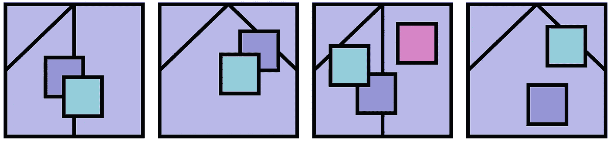
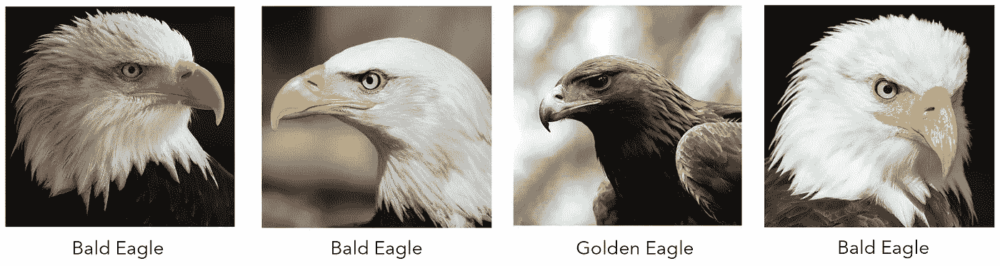
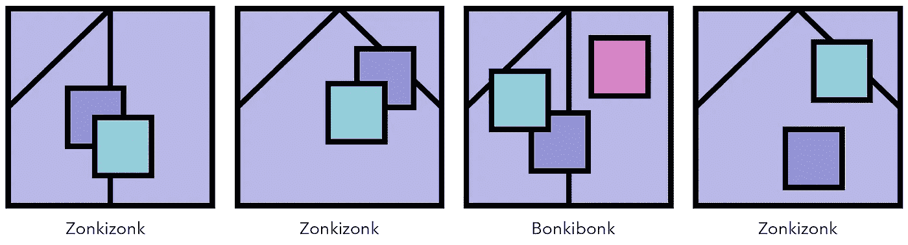
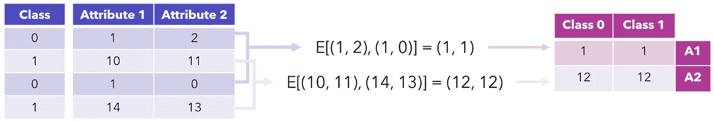

# 深度学习迫切需要的人类大脑:零射击学习指南

> 原文：<https://towardsdatascience.com/what-the-human-brain-has-that-deep-learning-desperately-needs-a-guide-to-zero-shot-learning-2e296741ce51?source=collection_archive---------17----------------------->

来源: [Unsplash](https://unsplash.com/photos/cAQZuqdvba8)

## 以及令人尴尬的简单 ZSL 算法

深度学习有一个很大的问题:它需要吞噬大量的数据，然后才能合理地推广并变得有用。这实际上是深度学习的局限性之一，限制了它在许多数据不丰富或难以获得的领域的应用。

相比之下，人类虽然被描绘为人类与机器智能之战的输家，但却可以通过少量训练样本来学习复杂的概念。不知道什么是猫或狗的宝宝，在看到几张猫的图片和几张狗的图片后，就可以学会给它们分类了。即使当我们学习更复杂的概念时，我们也能够通过一个小的数据集获得大部分知识。

这个属性使得教授人类概念变得费力，但却是可能的。一个四年级学生可以通过几十道题和好老师掌握基本代数原理。深度学习需要精心设计的架构、成千上万(如果不是更多)以专门格式编码的痛苦拼凑的问题和答案，以及几天的计算时间。

也许人类大脑更有趣的一点是，我们可以轻松处理数百甚至数千个类。想想你周围环境中的所有物体——你的电脑、电脑上的应用程序、这些应用程序中的功能、几十种颜色、你同事的名字、所有英语单词。

此外，即使你以前从未见过概念*，你也能认出它们。考虑以下想法(希望你以前没见过这些):将它们归类。这些类的实际名称并不重要——如果您愿意，可以称它们为 zookildezonk。*

这是一个与新物种命名非常相似的过程。如果一位科学家发现了几只秃鹰，他或她可以简单地给这个物种命名为“秃鹰”，这些秃鹰有相似的特征:翼展 6-7 英尺，深棕色的尾巴，白色的尾巴，白色的头，明亮的黄色眼睛。尽管他或她事先并不知道“秃鹰”到底是什么。

这些都是鹰，但我们可以识别以前未学习的类，并给它们命名。来源:[第一张](https://pixabay.com/photos/bird-eagle-animal-bald-eagle-341898/)、[第二张](https://pixabay.com/photos/bald-eagle-bird-wildlife-eagle-140793/)、[第三张](https://pixabay.com/photos/golden-eagle-eagle-golden-bird-2247269/)、[第四张](https://pixabay.com/photos/bald-eagle-adler-bird-of-prey-723540/)图片(均来自 Pixabay)

我们不需要给概念起名字来识别它们；名字是任意的，只是一种快速获取想法的方式。类似地，我们可以用任何我们喜欢的名字对这些抽象形状进行分类，只要这些名字表明了一个更广泛的概念(在这种情况下，两个正方形代表‘Zonkizonk’，三个正方形代表‘Bonkibonk’)。

零射击学习是一种努力，将人类识别以前看不见的概念的能力带给机器。显然，这是迈向真正的人工智能和构建更像人类一样思考的算法的关键一步，但在有太多类，或者数据有限或获取成本高昂的问题中，这也非常实用。

在深度学习尚未解决的问题越来越多地涉及错综复杂和类似人类的认知的世界中，零射击学习是一个答案。

同样，一次性或少量学习指的是只给定一个或几个来自该类的训练示例，就能理解整个类，如[双头连体网络](/the-two-headed-neural-network-shaking-up-image-recognition-8c3c7093d61b)。

一种简单但有效的零镜头学习方法被称为“令人尴尬的简单零镜头学习”(ESZSL)，它以创造性的方式使用矩阵分解和无监督学习来产生一个产生令人惊讶的好结果的模型。理解它可以让你直观地了解许多其他零射击学习技巧的动态。

ESZSL 在由数万个对象组成的 [SUN 数据集](https://groups.csail.mit.edu/vision/SUN/)上对训练期间从未见过的类产生了超过 65%的准确率。查看[论文](http://proceedings.mlr.press/v37/romera-paredes15.pdf)以深入总结该方法在合成和真实数据数据集上的结果。

从根本上说，ESZSL 是一个线性模型。给定形状为`(number of rows, number of features)`的输入矩阵 *X* 和形状为`(number of features, number of classes)`的权重矩阵，线性组合输出将为形状`(number of rows, number of classes)`。

ESZSL 的目标是找到权重矩阵 *W* 的值。

考虑一个相当复杂的模型必须完成的两个步骤:

*   通过将特征空间(input *X* )映射到维度为 *a* 的属性空间来解释输入，其中属性可以是诸如图像是否有四只脚、它是否是棕色的等等。每个属性的含义需要由模型决定。
*   将来自属性空间的知识组合成输出。例如，如果图像有四只脚，并且是棕色的，则输出是狗。

这两个目的可以用矩阵来表示。

*   *V* 有形状(特征数， *a* )。
    当 *X* 乘以 *V* 时，结果有形状(行数， *a* )。现在，每一行都由学习到的属性表示。这非常类似于神经网络层中的连接(没有偏置和激活)。
*   *S* 有形( *a* ，类数)。
    当 *V* 乘以 *S* 时，结果有形状(行数，类数)。这种乘法结合了来自属性空间的学习以产生输出。这就像是神经网络的输出层。

然后，我们可以将模型写成:

上标代表矩阵的形状。r 是数据集中的行数，f 是特征数，a 是中间层学习的属性数，c 是类数。

原来，管道的后半部分——*S*，某些学习到的属性和类之间的关系——可以通过无监督的学习方法找到，如 PCA，或者使用[更复杂的流形学习技术，如局部线性嵌入和 t-SNE](/manifold-learning-t-sne-lle-isomap-made-easy-42cfd61f5183?source=your_stories_page-------------------------------------) 。

1.  训练一个降维算法(PCA，LLE 等。)在 *X* 上，将训练输入数据，转换成 *a* 尺寸。
2.  得到的数据应该有 shape ( *r* ， *a* ，其中 *r* 是行数， *a* 是学习到的属性数。称这个矩阵为 *M* 。
3.  分配大小为( *a* ， *c* 的矩阵 *S* ，其中 *c* 为类数。
4.  对于每个唯一的类，在 *M* 中找到标签与该类匹配的行。找出每一行的平均学习属性 *a* ，并将信息填入 *S* 。

这里，E[(a，b)，(c，d)]表示期望值，或平均值。结果是((a+c)/2，(b+d)/2)。‘a1’和‘A2’代表属性 1 和属性 2。

这是导出 *S* 的一种非常简单和优雅的方式，因为它利用了无监督的提取特征的方法，这对于零触发学习是有用的，因为它不会暴露于测试中可能出现的任何标签。在零触发学习算法中使用聚类也是有意义的，因为新类的识别是非常复杂的聚类任务。

然后，训练和预测过程如下:

*   在训练期间，使用上述无监督方法从`X train`和`y train`数据集计算 *S* 。然后，使用标准优化方法(如梯度下降)计算 *V* ，使模型的预测损失最小。
*   测试时，形成两个数据集，`X test-train & y test-train`和`X test & y test`。前者是测试集的一部分，有标签；这允许 *S* 将类合并到测试集中，而不是训练集中。在后一种情况下，算法没有标签。
    用上述非监督方法从`X test-train`和`y test-train`数据集计算 *S* 。由于已经计算出了将输入转换到属性空间的 *V* ，因此模型已经完成。

即使是“简单得令人尴尬”的零距离学习法也有点难以理解。让我们以 MNIST 数据集为例，该数据集由从 0 到 9 的手写数字组成。

1.  我们将在 0 到 4 的数字上训练模型，然后让它在测试集中识别 5 到 9 的数字。
2.  根据训练集计算 *S* 。然后，找到 *V* 。
3.  形成测试训练组，这是来自测试集的数字的小样本(数字 5 到 9)。由此，计算更新的 *S* 。输出将对应于从 5 到 9 的数字，而不是从 0 到 4(当在训练集上计算时)。
4.  通过模型运行测试集的剩余部分，更新的 *S* 和 *V* 来自训练。

请注意，在测试集期间对 *S* 的计算有点可疑，如果你非常严谨，你可能会反对它是真正的*零命中率*，因为部分预测 *S* 依赖于标签。或者，有人可能会认为这是必要的，并且在整个训练和测试过程中，*V*——负责编码输入的所有工作——保持不变。无论你站在哪里，这都是一个很好的了解零射击算法背后思想的机会。

然而，一般来说，零触发学习方法遵循三种学习范例中的一种:

*   *学习属性*。类伴随着结构化的描述；例如,“白头”和“黄嘴”在描述秃鹰时。这允许算法将输入分解成所描述的类的元素，即使它没有看到来自该类的任何显式示例。
*   *学习文字描述*。类伴随着文本的自然语言描述，就像字典或百科全书中的一个单词。这允许模型解释和映射一个输入到一个只有类描述的类。
*   *自主学习*。类被嵌入到一个连续的空间中，零触发分类器解释嵌入的位置以确定输出。这是 ESZSL 遵循的范例；由于不需要每个类的属性或文本描述，这种方法更符合零起点学习的目标，但性能可能会更差。

零镜头学习应用于图像分类、语义分割、图像生成、对象检测和自然语言处理，以及其他更具体的用例，如语言翻译。该领域的研究数量每年都在快速增长，其中很多都是对传统深度学习方法的创造性背离——毕竟，困难的任务需要更多的创新。

感谢阅读！

如果你对最新的文章感兴趣，可以考虑订阅。如果你想支持我的写作，通过我的推荐链接加入 Medium 是一个很好的方式。干杯！

 [## 双头神经网络抖动图像识别

### 暹罗网络的魔力

towardsdatascience.com](/the-two-headed-neural-network-shaking-up-image-recognition-8c3c7093d61b) 

*图片由作者创作，除非另有说明。*