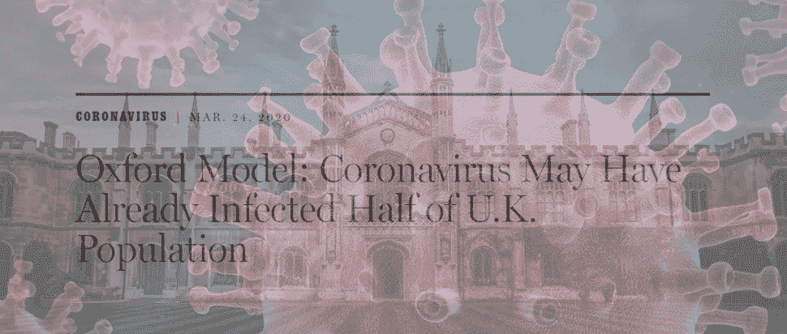
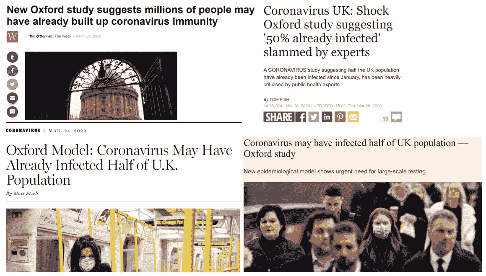
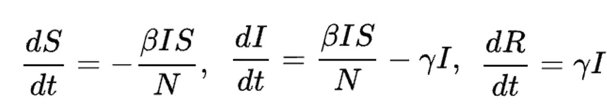
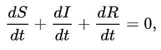
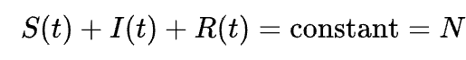
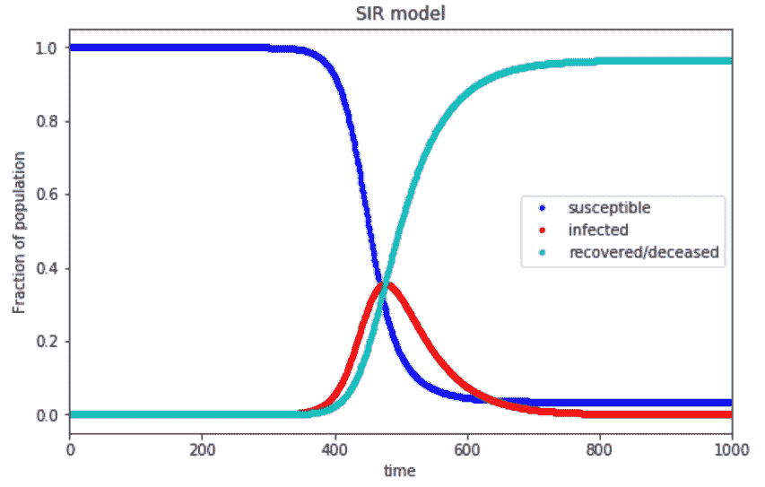
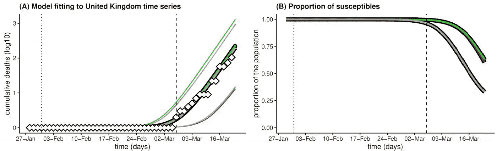
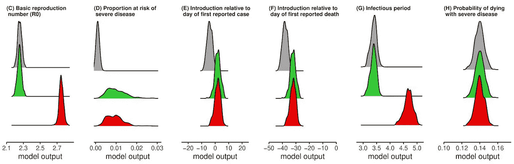
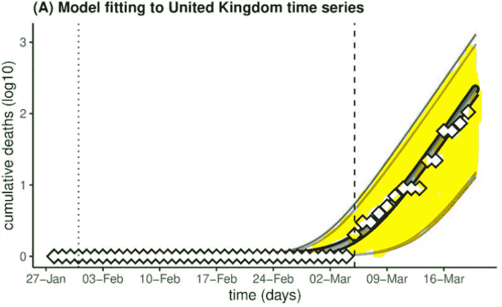

# 臭名昭著的牛津“68%的英国人有新冠肺炎”研究到底说了什么

> 原文：<https://towardsdatascience.com/what-the-infamous-oxford-68-of-the-uk-has-covid-19-study-really-says-49f633339620?source=collection_archive---------11----------------------->

[病毒镜像](https://pixabay.com/illustrations/virus-pathogen-infection-biology-4937553/)。[牛津形象。](https://unsplash.com/photos/d6ebY-faOO0)

## 提示:这不是媒体一直告诉你的

伦敦帝国理工学院的研究人员制作的预测疫情冠状病毒发展的模型在世界各地引发了警报。这项研究是许多政府决定采取严厉措施的重要因素，这表明仅在美国就有 200 万人死亡。

然而，相当臭名昭著的是，牛津大学的一个新模型据称正在“挑战”帝国理工学院模型的准确性。任何关注冠状病毒的人都听说过“68%的英国人患有新冠肺炎”这句话，这似乎是这项研究的特征。毕竟所有的头条都是这么说的。

不幸的是，[的论文](https://www.medrxiv.org/content/10.1101/2020.03.24.20042291v1.full.pdf)并没有真正表明大多数英国人已经感染了冠状病毒。似乎媒体已经染上了另一轮的戏剧化流感——相反，让我们更诚实地看看牛津大学的研究到底说了什么，理解它受到的批评哪些是合理的，哪些是不合理的。

这篇名为“流行病传播的基本原理强调了评估新型冠状病毒流行病阶段的大规模血清学调查的迫切需要”的论文基于一项观察，即“引发保护性免疫的新型致病感染因子”通常表现出以下三个连续阶段:

1.  新感染的缓慢积累的初始阶段，通常不可察觉。
2.  感染、疾病和死亡病例快速增长的第二阶段。
3.  由于人群中易感者的减少，传播最终减缓，通常导致第一波流行病的终止。

在实施控制措施之前，根据幸存感染产生保护性免疫的假设，该论文指出

> ……流行病学理论表明，新型冠状病毒的持续流行将符合这一模式[三个阶段]。

因为这三个阶段被假定存在于流行病的过程中，所以论文的作者使用了 SIR 框架。SIR 模型通常用于模拟冠状病毒等流行病，因为它只考虑处于以下三种互斥状态之一的人群:

*   *易感*。这个人没有患过这种疾病，但是很容易从感染者那里感染。
*   *已感染(I)* 。此人目前感染了这种疾病。
*   *康复/死亡(R)* 。感染者存活并对疾病产生免疫力，或者死亡。无论哪种方式，这一群体都没有患病的风险，也不能冒充患病者。

SIR 模型是流行病学中更大的模型组的一部分，该模型通过将人群分成“隔室”并假设同一隔室中的每个个体具有相同的特征来对传染病进行建模。它通常比 ARIMA 或回归等传统数学预测方法表现更好，因为它允许更多特定领域的模拟。

基于历史实例的时间序列预测。[来源](https://miro.medium.com/max/2936/1*3nRjq-BbTJkf0EchAUih8w.png)。

该模型具有合理的预测性，适用于人与人之间传播的传染病，以及恢复后产生免疫力的传染病，如麻疹、腮腺炎和风疹。

三个变量 S、I 和 R 代表特定时间每个车厢中的人数。这由输出每个车厢人数的三个函数来表示: *S* ( *t* )、 *I* ( *t* )、 *R* ( *t* )。

该模型是动态的，因为每个区间中的数字随时间波动。该系统用下面的一组微分方程来描述:

*   S =易感人群中的人数
*   I =感染人群中的人数
*   T21 =康复/死亡人口中的人数
*   三者之和
*   *t =* 时间
*   β =病原体的传染率
*   γ =回收率

这些微分方程表示某些变量如何根据某些常数(如传染率和恢复率)与其他变量协同移动，这些常数可以符合现实世界的数据。

请注意，从真实等式来看…

…以下陈述是正确的:

这表达了人口的恒定性。SIR 模型依赖于某些参数 *N =* 世界人口，β = 0.3，γ = 0.5，给出了关于流行病的良好感觉。易感和康复/死亡人口百分比类似于 sigmoid 函数，感染百分比类似于正态分布。SIR 模型根据特定疾病的属性/参数(如β和γ)将这些曲线拟合到特定疾病。

资料来源:帕特里克·桑切斯。

虽然这是一个标准的 SIR 框架，但是可以添加许多变体。论文作者概述了他们模型中使用的具体微分方程和变量，这些可以在牛津研究论文的第五页找到。

总体方法基于这样一个假设，即只有很小一部分人有患病风险，作者指出，现有文献中已经很好地描述了他们的风险群体，包括老年人和免疫系统严重缺陷的人。SIR 模型适用于英国和意大利首次记录死亡后 15 天内的累积死亡人数，以避免自那时起当地控制策略的潜在影响。

论文作者总结了英国的三种情况，根据论文作者的说法，英国的再现数 R₀代表了文献中 R₀估计值的变化:

*   R₀ = 2.25，ρ = 0.001(灰色)
*   R₀ = 2.25，ρ = 0.01(绿色)
*   R₀ = 2.75，ρ = 0.01(红色)

请注意，ρ =易患严重疾病的假定人口比例。下面显示的模型是用贝叶斯[马尔可夫链蒙特卡罗](https://en.wikipedia.org/wiki/Markov_chain_Monte_Carlo)方法拟合的，运行了一百万步。

牛津研究论文。

三个场景中的每一个都相当接近地模拟了白色方块，代表从 3 月中旬到 3 月 19 日的真实数据，这些数据不是模型训练的数据。(注意:不要混淆置信区间和实际预测。)

模型输出后验概率可以从不同变量的角度给出三种情景的情况，如下所示。

红色和绿色分别代表 R₀ = 2.75 和 R₀ = 2.25 的模型，处于风险中的人口百分比以大约 1%的平均值分布。R₀ = 2.25 和 R₀ = 2.75 模型估计，到 3 月 19 日，大约 36%和 40%(分别)的人口已经暴露于新冠肺炎。在 R₀的两种情况下，到 3 月 5 日报告第一例死亡时，大约 0.08%(数千人)已经被病毒感染。

当 R₀ = 2.25 且处于严重疾病风险中的人口比例分布在 0.1%左右的相同模型时，将传播开始时间定在第一个病例检测之前的四天，并表明 68%的英国人口将在 3 月 19 日之前被感染。

然而，这个结论有许多警告。首先，有一个*巨大的*置信区间。自然，预测就是预测不可预测的事物，所以真正解释不确定性的唯一方法是提供误差线。因此，一个模型产生的任何数字都应该伴随一个误差指标，就像平均值应该伴随一个标准差一样。

这让人想起电影《T4》中途岛中的一句话，据说这句话让情报官员埃德温·t·雷顿问日本军队将在何时何地发动进攻。

> "我知道我们在问不可能的事情，但我们需要你具体点。"
> ——切斯特·w·尼米兹，*中途*

在许多情况下，具体可能是好的，事实上，是必要的。在其他情况下，比如冠状病毒，它会给不确定性披上确定性的外衣。

不确定性凸显。

该论文事实上并没有表明大多数英国人已经感染了冠状病毒——它只是表明，存在与当前可用数据一致的场景(其中有许多[问题](/why-you-shouldnt-believe-the-coronavirus-death-rate-e52f6ba78806?source=---------25------------------))，其中很大一部分人可能在 3 月 19 日之前感染了新冠肺炎病毒。

然而，正如所证明的，对受感染人口比例的估计取决于对ρ的假设，ρ是人口中易患严重疾病的假设比例，这是未知的。

> “只有当这一风险比例很小(0.1%)时，才能预测高感染水平。如果处于危险中的比例是 1%(与数据一致的另一种情况)，到 3 月 19 日感染的比例将低得多(36-40%)。
> -西蒙·古宾斯博士，皮尔布赖特研究所

这项研究更多的是呈现与现有数据一致的情景，而不是预测有多少人真的被感染了。夸大该研究未经同行评审的事实，并接受 68%的表面价值，淡化了论文的主要观点，即强调需要血清学调查来评估受感染人口的比例。它们对于准确评估死亡率也至关重要。

话虽如此，论文中还是有漏洞的——只是要理解这样一个事实:批评容易，创造却不容易。许多批评可以归结为冠状病毒数据中严重缺乏诚实的数据。对这篇论文的大部分批评在于它所采用的假设；例如，英国是一个混合人口，这一假设导致模型高估了感染人口的比例。

作者承认，很难从如此依赖于假设的研究中得出结论，这些假设可能正确，也可能不正确。

> “这个理论模拟基于一个关键的假设，这个假设可能正确，也可能不正确。这项工作是对科学辩论的贡献，科学常常通过挑战似乎被认为是智慧的东西而进步。”牛津大学罗莎琳德·富兰克林研究所所长詹姆斯·奈史密斯教授

最后自己看[论文](https://www.medrxiv.org/content/10.1101/2020.03.24.20042291v1.full.pdf)。这本书不长，只有 5 页，你自己阅读可以对研究中的免责声明和基本假设有更全面的了解。