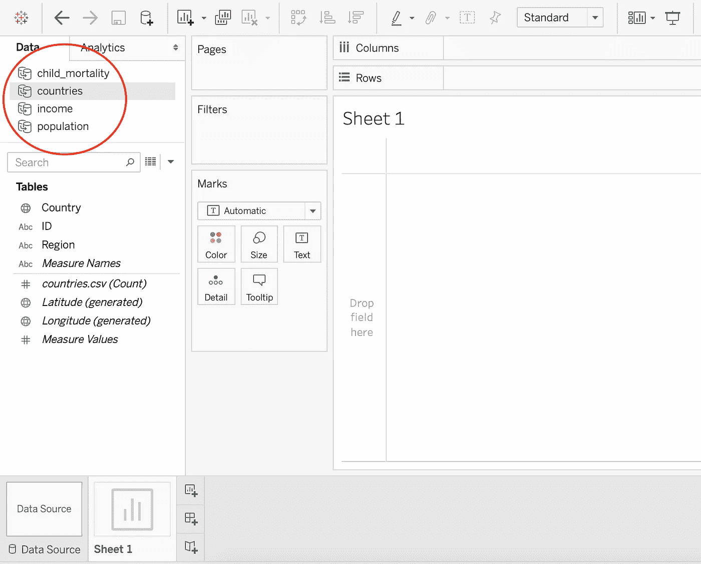
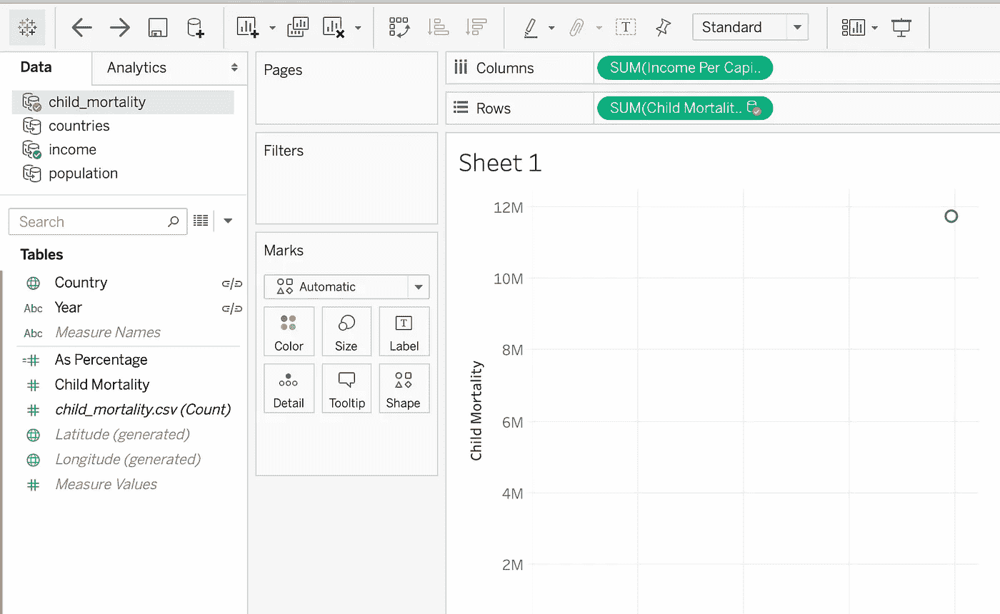
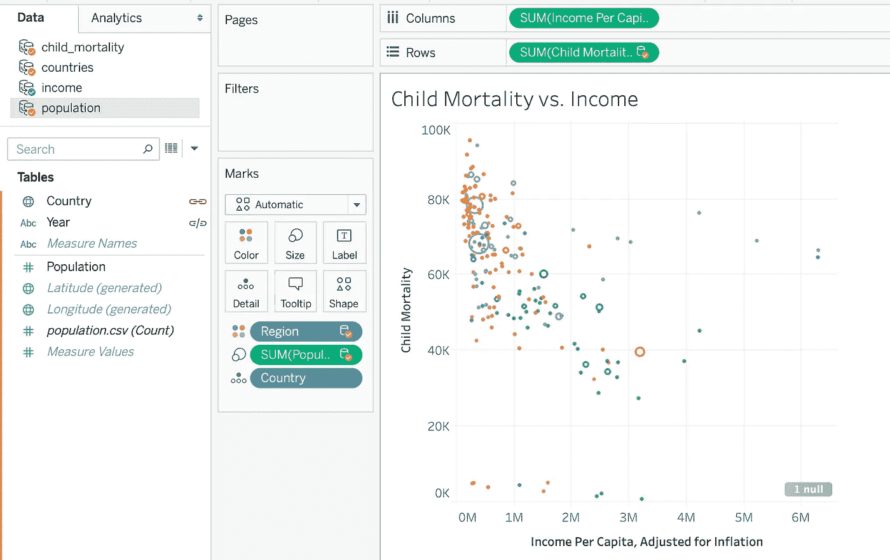
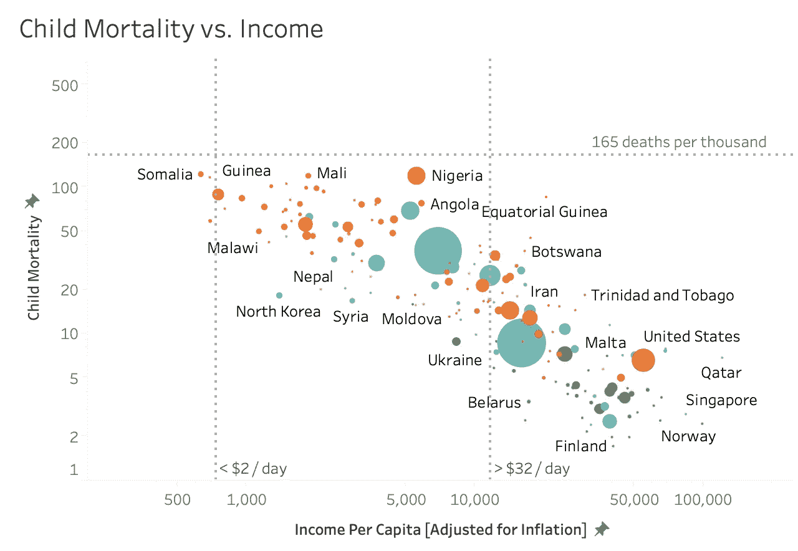

# 基本场景:新闻没有告诉你什么

> 原文：<https://towardsdatascience.com/what-the-news-isnt-telling-you-4e44f3a08c10?source=collection_archive---------71----------------------->

## 以及为什么这个世界比你想象的更好

照片由[阿德里安娜·范·格罗宁根](https://unsplash.com/@arosephotos?utm_source=unsplash&utm_medium=referral&utm_content=creditCopyText)在 [Unsplash](https://unsplash.com/s/photos/poverty?utm_source=unsplash&utm_medium=referral&utm_content=creditCopyText) 上拍摄

人类从未如此美好。不，我不是在讽刺，也不是有人付钱让我这么说的<*在此插入大公司名称* >。对于全球的普通人来说，产品正变得越来越便宜，越来越容易获得。女性接受的教育和避孕措施比我们整个历史上的都多。抛开路上的一些坎坷，世界正在变得越来越好。

不相信我？大多数人不会。这条新闻一定会让你认为世界末日到了，因为直接的悲观论调很畅销。虽然新闻在某些方面是正确的，例如气候变化(这是真正变得越来越糟糕的领域之一)，但新闻也有一百万种方式对可怕的事情给予不相称的重视，而忽略了当今世界逐渐积极的趋势。

当我还是一名学生的时候，在我的论文中以经济发展为主题，我会使用“全球南方”或“发展中国家”这样的关键词来严肃地描述我们与他们之间的差距。然后我读了汉斯·罗斯林的《真实性》,意识到我的整个前提已经严重过时了。更糟糕的是，我的论文导师严肃地点了点头表示同意，然而我们谁也不知道我们对“发展中世界”的偏好在 50 多年里都不是真的！

所以谢谢你汉斯·罗斯林。谢谢你让我明白了这个世界的真实运作方式。我们将使用 Tableau 来了解近年来儿童死亡率、预期寿命和收入是如何变化的。

这是我们今天要做的:

## 1)数据收集🧺🦆

从我的 [Github repo](https://github.com/amawest/factfulness-in-tableau/tree/master) 下载日期文件。所有数据来自 [Gapminder](https://www.gapminder.org/data/) (你也可以直接从这个网站下载，但是我已经冒昧地重新命名了一些列名)。

正在下载。zip 文件会给你 4 个 CSV 文件(加上自述文件；你可以删除它):

*   `income`:经通货膨胀调整后的人均收入(2011 年美元)
*   `child_mortality`:儿童死亡率(每 1000 人中 5 岁前死亡的人数)
*   `countries`:国家(稍后提供颜色编码的区域标识符)
*   `population`:群体(提供气泡的大小)

[ *完整文档:*[https://www.gapminder.org/data/documentation](https://www.gapminder.org/data/documentation/)]

## 2)安装台面📉

如果你没有 Tableau，在这里下载免费的公开版本(这是我目前正在使用的)。安装可能需要几分钟时间；在此过程中，您可能还想创建一个 Tableau 公共帐户。

通过创建一个 Tableau 帐户，你将能够开始导出你的可视化和建立一个漂亮的投资组合([像这样](https://public.tableau.com/profile/bo.mccready8742#!/))。

## 3)准备用于分析的数据📝

现在，我们将上传每个文件，将它们从长格式转换为宽格式，并确保它们已被正确添加:

## **3.1)为**`**child_mortality.csv**`**`**income.csv**`**`**population.csv**`**:******

*   ****打开一个新的“文本文件”，上传这三个中的一个。您将重复这一步骤两次以上，所以从哪一步开始并不重要。****
*   ****选中“文件”下的“使用数据解释器”,将第一行识别为列名。****
*   ****突出显示除第一列之外的整个表格(如下例所示)。右键单击突出显示的框，然后按“pivot”并重命名列标题。****

****你已经成功转向了，哇哦！****

*   ****完成第一个 CSV 后，单击左上角的 Tableau 标题返回主屏幕，对其他两个 CSV 重复相同的步骤。****

## ******3.2)为** `**countries.csv**` **:******

*   ****除了导入文件，你不需要做任何事情→正如你所看到的，它已经是 wide 格式了！****
*   ****如果你本能地通过图标导航到主页，只需再次点击图标，它将带你回到数据。****

## ******3.3)打开“第 1 页”进行检查:******

*   ****一旦您导入/修改了所有 4 个 CSV，我们就可以进入第一个工作表了。转到“第 1 页”,确认您有权访问左上角的所有 4 个数据集:****

********

## ****4)创建散点图📈****

****你已经设置好了一切，现在让我们开始绘图:****

*   ****拖动`income` → `Income Per Capita` ( *或者你在步骤 1 中给它起的名字；*)下的“表格”到“列”架上。这将是 *x* 轴的值。****
*   ****将`child_mortality` → `Child Mortality`拖到“排”架上。这将是 y 轴的值。****

********

*   ****由于数据源不同，您可能需要手动定义 Tableau 的关系。如果弹出错误窗口，请转到数据→编辑关系以确认数据集之间的关系。****

****`"countries"`只有国家变量有共性；其余的分享国家和年份****

*   ****将`income`中的`Country`变量放入“细节”框中(它*必须*来自收入，因为原始数据来源很重要)。****
*   ****将`population`中的`Population`变量放入“尺寸”框中。****
*   ****将`countries`中的`Region`变量放入“颜色”框中。****

****图表在这一点上应该是这样的:****

********

****恭喜您，您在 Tableau 中制作了散点图！****

## ****现在让我们开始吧。漂亮🌼****

****这是有趣的部分，真的。因为在这一点上，你可以停止听我说，开始摆弄图表，直到它变成你喜欢的样子。****

****我将给出一些关于如何改变轴、颜色、形状和大小的提示:****

******更新轴:**右击 x 轴或 y 轴，进入`format`。在这里，您可以更改轴的长度、反转轴或切换到对数刻度。****

****我把`income`和`child mortality`都换成了日志，因为它比关卡更能捕捉变化。然后，我将轴从“自动”改为“自定义”，并进行试验，直到我找到每个轴的正确尺寸。****

******填充颜色和调整大小:**这些可以在标记框中完成，无需任何拖放操作(见下文):****

****给点添加名字: Tableau 很好地展示了点，而没有将它们写在彼此的顶部。将`Country`变量拖动到“标签”框中:****

******排除空值:**有时会出现空值，数据不完整。您可以通过转到区域→空值→排除来删除空值(这将在页面的右侧)。****

******更改网格线:**这部分完全是可选的，但我喜欢有人提醒我某些阈值意味着什么(尤其是当它与全球贫困相关时)。****

*   ****要删除背景线，请右键单击网格，然后转到格式→格式线→网格线。按“无”会将背景变成全白。****

****要添加一行，请离开格式选项卡。转到分析→参考线，将参考线拖到网格上。在这里，您可以尝试各种垂直、水平和垂直线条。****

****这是一张我添加了 3 条参考线的图片，两条垂直加一条水平:****

********

## ****6)现在让我们开始吧。分层的🍰****

> ****“洋葱有层次。食人魔有层次。洋葱有层次。明白了吗？我们都有层次。”—史莱克****

****最后一件要做的事，那就是加上*时间*。在过去的 220 年里(见鬼，甚至是过去的 50 年)，人类在生活质量方面取得了巨大的进步，所以增加时间给了这张图很大的魅力。****

****要添加时间维度，您只需将收入→年份变量拖到页面架上，就可以开始了:****

****这是我最终的图表结果:****

## ****调查结果和结论****

****在现代医学发明之前，大约 20% -50%的儿童在 5 岁生日之前死亡(取决于你生活在哪个国家)。另一方面，近年来许多国家将这一比例降至 1%以下，世界上最糟糕的国家都降至 20%以下。虽然还有很多工作要做，但医学在降低儿童死亡率方面已经做了很多(耶，科学！).****

****现在让我们看看 x 轴。在 1800 年，基本上没有人拥有今天世界上大多数人享有的金融资源。许多人每天的平均生活费不到 2 美元；如果他们生病或受伤，他们的孩子就会死去，而且世界上大多数地方几乎没有教育。另一方面，在今天的世界上有*非常非常*少数国家仍然靠每天 2 美元生存；大多数人每天的生活费超过 32 美元(你可能会认为这是“第一世界”)，如果不是这样，他们就在中间。****

****最后，注意进步和 ***表明所有国家都在一起行动。随着人类变得越来越有创造力，这似乎对社会的每一个阶层都有好处——那些当时没有将资源转移到研发上的小的和不发达的国家，仍然和其他国家一起前进。就像一个大斑点走向独立和财务自由，似乎我们都在一起。*******

********

****罗伯特·柯林斯在 [Unsplash](https://unsplash.com/s/photos/friendship?utm_source=unsplash&utm_medium=referral&utm_content=creditCopyText) 上拍摄的照片****

## ****参考****

****汉斯·罗斯林,《真实:我们看错世界的十个理由——以及为什么事情比你想象的要好》, 2017 年 2 月****

****Parul Pandey，在 Tableau 中重现 Gapminder:向汉斯·罗斯林致敬，2018 年 9 月([https://medium . com/analytics-vid hya/Recreating-Gapminder-in-Tableau-A-Humble-tribute-to-Hans-rosling-53 de 74 b 18 EC](https://medium.com/analytics-vidhya/recreating-gapminder-in-tableau-a-humble-tribute-to-hans-rosling-53de74b18ec)****