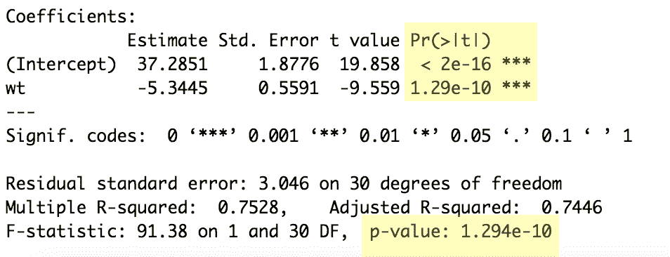
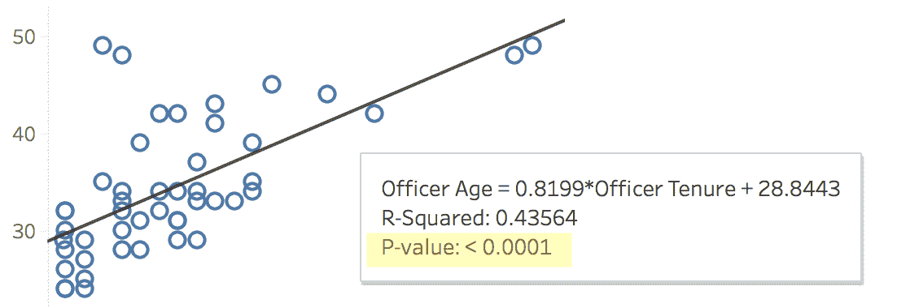
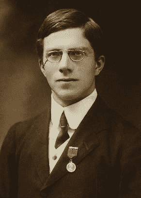
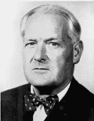

# 根据一位统计学教授的说法，零假设的真正含义是什么

> 原文：<https://towardsdatascience.com/what-the-null-hypothesis-really-means-according-to-a-statistics-professor-1dae099ad8f?source=collection_archive---------11----------------------->

## 统计学最易混淆概念的简单解释

罗伯特·蒙哥马利是堪萨斯大学医学中心的研究助理教授和生物统计学家。在教授研究生水平的统计学课程时，他喜欢问学生一个简单的问题:“零假设是什么意思？”

这是一个非常具有挑战性的问题，有着非常具体的答案——即使对于已经学过一些统计学课程的研究生来说也是如此。

“如果有人没有正式的统计学背景，”他说。“他们通常不明白，我们是在试图证伪无效假设，而不是证明什么。”

这听起来像是语义学，但实际上不是。他指的是支持学术界、商业和制药行业使用的许多统计方法的数学理论。

这些方法属于通常所说的 T2 统计学派。

“频率主义者的统计是基于*伪造*假设的想法，”他告诉我。“这更难消化，因为它与人们认为你在做的事情相反。”

蒙哥马利医生这么说是什么意思？

真的很简单。有了这些方法，你就提供了反对假设什么都没发生的证据。它实际上并没有证明一组变量和另一组变量之间的关系。

迷茫？我们举个简单的例子。

## 盲人怎么知道下雨了？

想象一个盲人在外面行走。他看不见面前的东西，只能依靠他的嗅觉和触觉。

照片由[谢尔盖·别雷舍夫](https://www.shutterstock.com/g/SergeyBelyshev)提供

当他在外面行走时，他开始感觉到头上有水滴。他认为可能会下雨，但他不能肯定地说，因为他实际上看不到雨从天而降。

在频率统计中，说“下雨了”的假设是另一种选择。说“没有雨”的假设是无效假设。零假设通常假设正常(即没有雨)。

由于盲人不能证明有雨(因为他缺乏视力)，他必须找到证据来反对没有雨的观点。

这就是统计学家在使用频率主义方法时所做的。他们是盲人，不能证明真的在下雨。相反，它们提供了证据，表明如果不下雨，无论发生什么都不太可能。

这对盲人是如何起作用的？首先，他知道他感觉到头上有水滴。可能是雨，也可能是洒水车。然而，他没有听到喷水声。他确实注意到他走过的草地比平时更泥泞。这支持了更多的水来自其他地方的观点。他还注意到，当他走路时，水滴跟着他。如果是洒水车，水大概不会跟着他。最后，他听到了远处的雷声。

基于他感觉到和听到的一切，如果没有下雨，他不太可能经历所有这些。因此，水滴很可能来自雨水。

这就是频繁主义者统计工作的症结所在。你表明，如果什么都没发生，你就不会有数据中的结果。这允许你*拒绝*中的*无效，支持*备选方案。它不*否定*无效，也不允许你*证明*另一种选择。

“你在假设零假设是正确的，”蒙哥马利博士在提到你的研究或分析时说。“如果这个假设是真的，那么 p 值就是你看到与你得到的结果相似的结果的概率。”

他所指的 p 值是在假设零假设为真的情况下，观察到的结果等于或大于观察到的结果的概率。

蒙哥马利博士接着说，“没有正式统计学背景的人通常希望 p 值是空值为假的概率，或者他们的研究假设为真的概率——这两者都不是。”

以下雨为例，p 值是在没有下雨的情况下，你头上有水滴、脚上有泥、背景中有雷声的概率。可以想象，如果不下雨的话，这种概率会很低。

## **这对大局意味着什么？**

这不是大多数人想到预测建模时想到的，但这些方法是大多数研究的基础。它甚至出现在常用的分析工具中。

在 R 和 Tableau 中都可以看到 frequentist 方法，它们是具有完全独立的应用程序的独立数据工具。

这里有一个 R 中回归分析的截图:

作者提供的照片

这是 Tableau 中一个线性回归的截图:

作者提供的照片

在进行简单的回归分析时，这两种工具都会引用 p 值。

这也超越了连续数据。您还可以计算列联表中分类数据的 p 值，这应该是任何进行分类数据分析的分析师的最佳实践。

这意味着如果你在分析中使用 p 值，你是在试图拒绝一个零假设——不管你认为你是还是不是。

## 统计学能证明因果关系吗？

低 p 值很少能让你明确地得出“变量 A *导致变量 b*”的结论，这自然会让人问这样一个问题——那么统计学有什么用？有没有一个点，我们可以超越拒绝零假设和证明因果关系？

“证明因果关系更多的是一个哲学问题，而不是统计学问题，”蒙哥马利博士说。“统计学帮助你在面对不确定性时做出决策；它不能保证这些决定每次都是正确的。”

一些统计学家试图解决这个关于因果关系的哲学问题。在一次著名的科学辩论中，这导致了他们之间非常公开的分歧——香烟和癌症之间的联系。

“因果关系问题的著名例子是 R.A .费舍尔吸烟，”蒙哥马利博士说。

照片由[维基媒体](https://commons.wikimedia.org/wiki/File:Youngronaldfisher2.JPG)提供

罗纳德·阿瑟·费希尔是一位著名的统计学家，他创建了费希尔精确检验，并推广了学生 t 分布和 f 分布。

显然，费希尔也喜欢吸烟。他发表了许多公开声明，反对将癌症和香烟联系起来的观点。

蒙哥马利博士说:“他是非常怀疑(关于吸烟的)因果关系的著名统计学家之一，因为所有的统计问题都可能出现。”。

虽然费希尔可以实事求是地宣称，所用的统计方法并没有证明香烟会致癌，但其他统计学家概述了他们做出这些论断的原因。

照片由[维基媒体](https://commons.wikimedia.org/wiki/File:Austin_Bradford_Hill.jpg)提供

一位名叫奥斯汀·布拉德福德·希尔(Austin Bradford Hill)的统计学家和流行病学家阐述了统计学家，尤其是医学领域的统计学家，何时可以对一个变量(如吸烟)和结果(癌症)之间的因果关系做出合理的声明。

希尔写道，因果关系主张的一个重要支持因素是一致性。在香烟和肺癌的例子中，来自不同人的重复研究都得出了相同的结论:拒绝否定，支持香烟增加癌症风险的替代方案。

不过，这通常超出了一名研究人员或数据科学家的范围。通常你的分析是基于一个数据样本，而不是重复的研究。除非你在回顾不同研究人员的大量研究，否则你可能会局限于拒绝无效假设，而不是声称有因果关系。

如果你对将“布拉德福德·希尔”标准应用到你自己的研究或分析中感兴趣，你可以在这里阅读他的文章[和他对如何应用标准的建议。](https://www.edwardtufte.com/tufte/hill)

以下是证明因果关系的“布拉德福德·希尔标准”的完整列表:

1.  力量
2.  一致性
3.  特征
4.  暂时性
5.  生物梯度