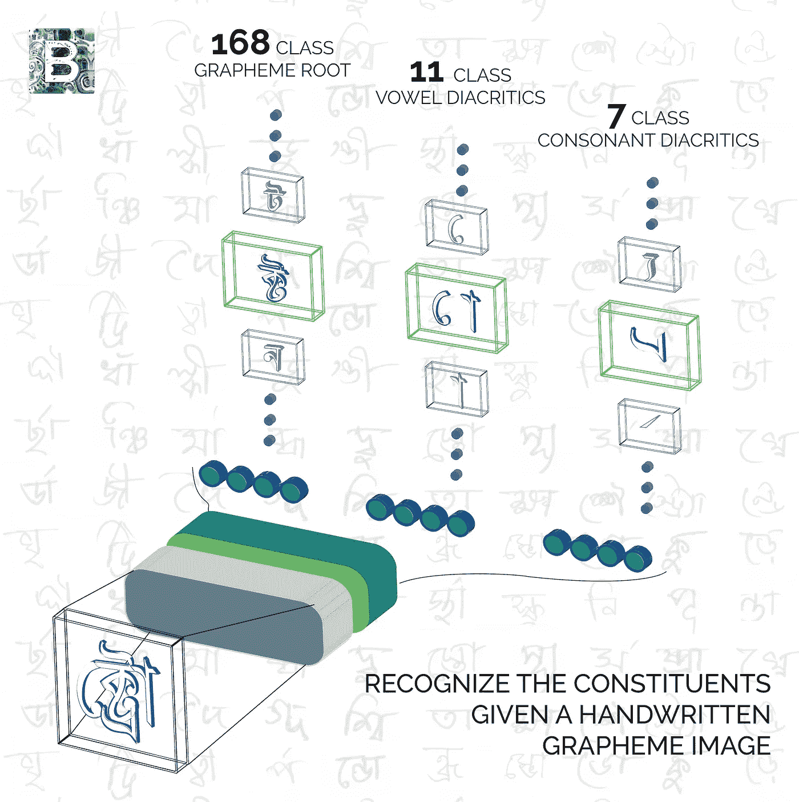
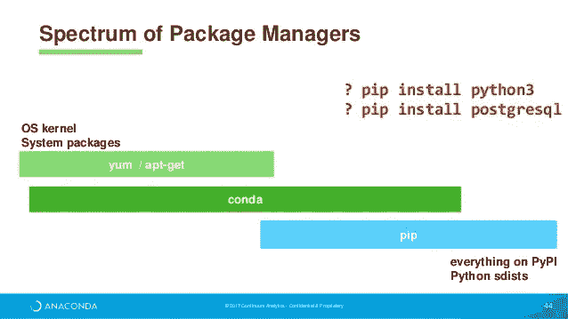
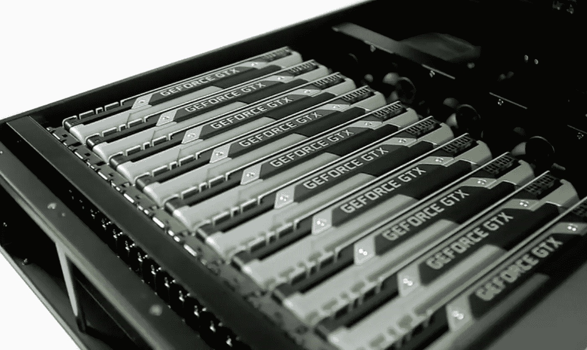
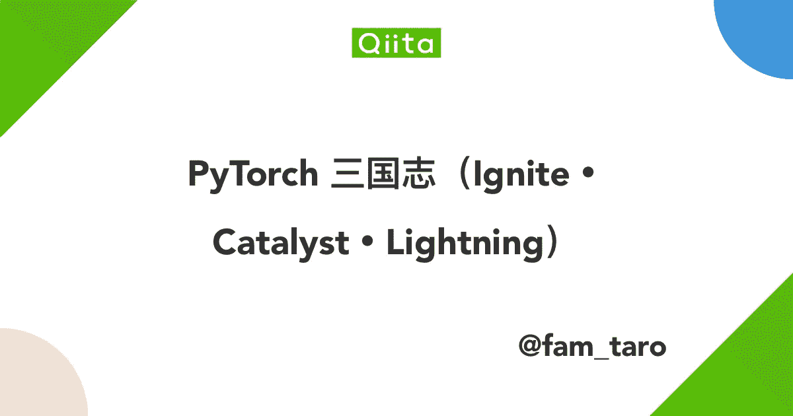
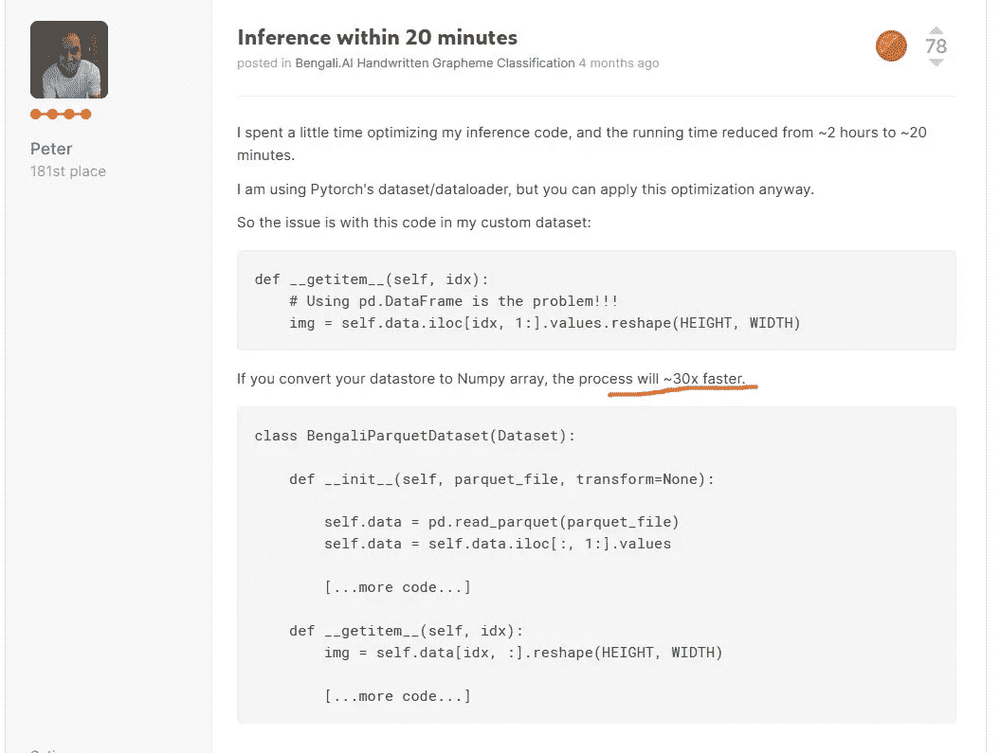
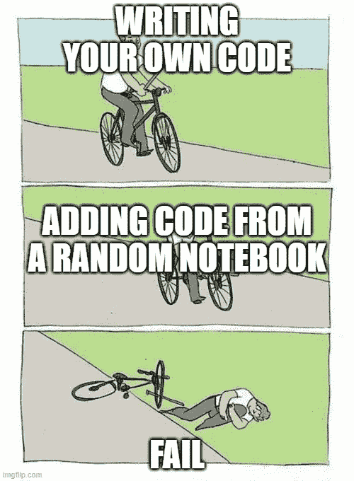
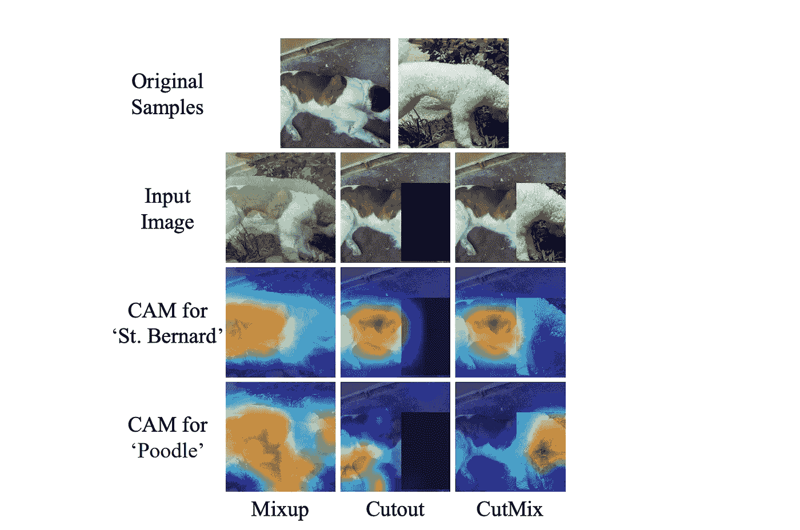

# 当你在高尔夫球比赛中没有获得任何奖牌时，你会怎么做？

> 原文：<https://towardsdatascience.com/what-to-do-when-you-dont-get-any-medal-in-a-kaggle-competition-b54cc433da3?source=collection_archive---------29----------------------->

就像梯度下降——从错误中学习！

几周前，又一场卡格尔比赛结束了——孟加拉语。人工智能手写字形分类。



来源: [Kaggle](https://www.kaggle.com/c/bengaliai-cv19)

孟加拉语是世界上第五大通用语言。这项挑战希望改进孟加拉语识别的方法。它的字母表有 49 个字母和 18 个音调符号，这意味着有很多可能的字素(书面语言的最小单位)。

在这个竞赛中，我们应该预测这些字素的三个独立部分的类别——字素词根、元音发音符号和辅音发音符号。

两千多支队伍参加了比赛。起初我是一个人参加比赛，但过了一段时间后，五个人组成了一个团队。我们在这场比赛上花费了大量的时间和资源……却以第 254 名的成绩完赛，没有获得任何奖牌。

我对这些结果非常沮丧，闷闷不乐了一段时间。


来源:[论坛](https://forum.champcar.org/topic/16640-official-gingerman-2017/page/3/)

在此之后，我整理了我的想法，反思了我所做的事情，阅读了顶级团队的解决方案，并吸取了一些教训，我想分享一下。这些经验是通用的，可以应用于任何比赛。它们可以大致分为几个主题:思维模式和一般方法，编码实践，准备。

## **设置你的工作环境**



来源: [SlideShare](https://www.slideshare.net/continuumio/revolutionizing-data-science-package-management-with-conda)

模特训练是 kaggle 比赛的主要部分，因此有必要为此做好准备。Kaggle 笔记本不错，但是 GPU 时间限制苛刻——每周只有 30h。因此，实验通常在我们自己的硬件上或云中运行。首先，有必要设置一个工作环境。这可以使用 pip、conda 或其他方式来完成。值得检查 kaggle 上的库版本，并在您的环境中安装相同的版本——不同的版本可能有不同的 API 或不同的逻辑。

## **硬件**



来源: [whatech](https://www.whatech.com/market-research/it/590457-gpu-for-deep-learning-market-future-growth-by-2025)

另一件重要的事情当然是硬件本身。如果我们有很多数据(就像在这场比赛中一样),在一张显卡上训练一个模型可能需要一天甚至更长时间。值得一提的是，运行实验通常会比训练最终模型花费更多的时间，因为我们需要尝试许多不同的东西。

我的 Windows PC 上有 2 个 1080ti，真的不够用。我在 Google Cloud 上租过多次 GPU，但是相当贵，于是开始寻找其他途径。

最近我听说了 Hostkey，他们提供网络服务，你可以租用他们的服务器。

他们有一个 T2 的宣传节目:

```
We offer **free GPU servers** to the winners of grants at large competition venues for their use in further competitions, for training or for personal projects related to data science.
```

作为交换，参与者应该在社交媒体上分享他们的反馈和经验。

一开始我得到了一个 4 x 1080ti 的服务器。设置环境没有问题，很快我就开始训练模型。在单个 GPU 上的训练效果很好，我开始逐渐增加使用的卡的数量。2，3 个 GPU 工作得很好，但是使用所有 4 个 GPU 都失败了——什么也没有发生。技术支持反应迅速，在几天内就调查了问题。结果发现服务器本身存在一些问题——处理器无法充分利用 4 x 1080ti。结果我换了另一台服务器 2x2080ti。起初有一个小问题，因为电源不够强大(双关语)，但工程师们增加了另一个电源，问题就解决了。

从那时起，我在服务器上运行了许多模型，一切都很好。我喜欢这种体验，并计划在未来继续使用来自 [Hostkey](https://www.hostkey.com/) 的服务器。

## 有一个工作管道



来源: [qiita](https://qiita.com/fam_taro/items/c32e0a21cec5704d9a92)

有一个好的工作管道是非常重要的。我所说的管道是指用于为训练、训练本身和推理准备数据的整个代码。使用一些高级框架是值得的，但是从头开始编写自己的代码也是一个好主意。主要的好处是可以快速改变事情，并且确保所有基本的事情都正常工作，你可以专注于高级的事情。

在这次比赛中，我开始在 Catalyst 中使用 Jupyter API，但由于一些问题，很快就停止了。一段时间后，由于我的队友，我切换到 Catalyst 的配置 API。对我来说效果更好，但需要花很多时间来适应。我的一个队友正在使用 fastai，唉，由于 fastai 的独特风格，我很难理解它。

因此，我认为选择一种方法(某个框架或你自己的管道)并坚持下去会更好。

## 代码优化



[页面](https://www.kaggle.com/c/bengaliai-cv19/discussion/122993)截图

很多人说人们写的代码很糟糕。事实上这往往是真的，一个主要原因是快速迭代的必要性，所以通常尝试一些新的想法比编写更好的代码更好。但这并不总是正确的。

有时候小的代码优化会产生巨大的影响。正如你在截图中看到的，做出推断的速度可以提高 30 倍。训练也会快得多，所以把事情做对很重要。

另一方面…

## 不要盲目相信来自论坛/内核的代码和想法



使用此[站点](https://imgflip.com/memegenerator/39714036/Bike-Fall)生成

Kaggle 很棒，有很多很棒的笔记本，你可以用，也有论坛可以找到很酷的想法，对吧？不，不完全是。

虽然论坛上有很多高质量的笔记本和优秀的想法，但也存在一些问题:

*   有一些笔记本在代码上有很小的错误，有错误的代码实践，有不正确的验证，有一些想法的错误实现和许多其他可能的问题；
*   论坛上的一些想法可能会误导人。这不是因为人们想做坏事，不，其中一个原因是很多想法不能独立工作——有些想法只能与其他想法一起工作，有些需要足够好的分数模型等等；

所以，如果你想使用一些代码或者一些想法，首先检查并验证它们。

作为这一点的延续:

## 总是寻找新的想法并尝试它们



arxiv [论文](https://arxiv.org/pdf/1905.04899.pdf)

参加 kaggle 比赛最棒也是最酷的事情之一是，它将人们推向新的 SOTA 结果。为了取得最好的成绩，尝试新事物是必要的。所以阅读 arxiv 上的论文，寻找好的博客等等。但是仅仅阅读新方法是不够的——有必要尝试一下。为一些新想法编写代码可能很困难，但这是学习新事物的一种令人惊奇的方式。即使有些想法行不通，你也得到了有用的经验。

**不要过多调整超参数**


[xkcd](https://xkcd.com/1838/)

这是一个常见的陷阱(我多次被发现)——有些人认为调优超参数会帮助他们获得很好的结果。这个想法有一些优点，但并不完全正确。

在表格竞争中，值得调优超参数两次:在最开始和最末尾。

开始时的调整很重要，因为梯度推进和其他模型必须针对不同的问题进行调整。不同的目标，不同的深度，叶子的数量和其他的东西会导致不同问题的不同分数。但是在你找到一些好的参数之后，把它们固定下来，直到比赛接近尾声的时候再去碰。当您添加新功能或尝试新想法时，请保持超参数不变，以便您可以比较实验。

当你用尽所有的想法时，你可以再次调整以获得分数的小幅增加。

对于深度学习来说，事情有点不同。超参数的空间是巨大的:你调整架构、损耗、增强、前后处理和其他事情。所以不可避免的，你会花更多的时间来优化事情。但仍然值得记住的是，一个好主意比调整小事情更能提高分数。

这些是我从这场比赛中学到的教训。我希望它们是有用的，并且真的希望我自己能够跟随它们:)