# 当你的数据对于你的内存来说太大了怎么办？

> 原文：<https://towardsdatascience.com/what-to-do-when-your-data-is-too-big-for-your-memory-65c84c600585?source=collection_archive---------8----------------------->

## 使用 Panda 处理大数据


照片由来自 [Pexels](https://www.pexels.com/photo/dark-computer-green-software-225769/?utm_content=attributionCopyText&utm_medium=referral&utm_source=pexels) 的 [Markus Spiske](https://www.pexels.com/@markusspiske?utm_content=attributionCopyText&utm_medium=referral&utm_source=pexels) 拍摄

当我们在进行任何数据科学项目时，要采取的一个基本步骤是从 API 下载一些数据到内存，以便我们可以处理它。

在这样做的时候，有些问题是我们可以面对的；其中一个问题是有太多的数据需要处理。如果我们数据的大小大于我们可用内存(RAM)的大小，我们在完成项目时可能会面临一些问题。

***那么，接下来该怎么办呢？***

解决大*数据、*小问题有不同的选择。这些解决方案要么耗费时间，要么耗费金钱。

## 可能的解决方案

1.  **成本计算解决方案**:一个可能的解决方案是购买一台新电脑，配备更强大的 CPU 和更大的 RAM，能够处理整个数据集。或者，租用云或虚拟内存，然后创建一些集群安排来处理工作负载。
2.  **时间成本解决方案**:你的 RAM 可能太小，无法处理你的数据，但通常你的硬盘要比 RAM 大得多。那么，为什么不直接用它呢？使用硬盘来处理你的数据会使它的处理速度慢得多，因为即使是 SSD 硬盘也比 RAM 慢。

现在，这两种解决方案都非常有效，也就是说，如果你有资源这样做的话。如果您的项目预算很大，或者时间不是一个限制因素，那么使用其中一种技术是最简单、最直接的答案。

*但是，*

如果不能呢？如果你在做预算呢？如果您的数据非常大，从硬盘加载会增加您的处理时间 5X 或 6 倍甚至更多？有没有不花钱也不花时间的处理大数据的解决方案？

我很高兴你问了——或者我问了？。

您可以使用一些技术来处理大数据，而不需要花费任何资金或处理很长的加载时间。这篇文章将介绍三种技术，你可以使用**熊猫**来处理大型数据集。

# 技巧 1:压缩

我们要介绍的第一项技术是*压缩数据。*这里的压缩不是指把数据放在 ZIP 文件中；相反，它意味着将数据以压缩格式存储在内存中。

换句话说，压缩数据就是找到一种以不同的方式来表示数据的方法，这种方式将使用更少的内存。数据压缩有两种:*无损*压缩和*有损*一种。这两种类型只会影响数据的加载，不会导致代码的处理部分发生任何变化。

## 无损压缩

无损压缩不会造成任何数据损失。也就是说，原始数据和压缩数据在语义上是相同的。您可以通过三种方式对数据帧执行无损压缩:

在本文的剩余部分，我将使用这个包含美国不同县的新冠肺炎案例的数据集。

*   **加载特定列**

我使用的数据集具有以下结构:

```
import pandas as pd
data = pd.read_csv("[https://raw.githubusercontent.com/nytimes/covid-19-data/master/us-counties.csv](https://raw.githubusercontent.com/nytimes/covid-19-data/master/us-counties.csv)")
data.sample(10)
```

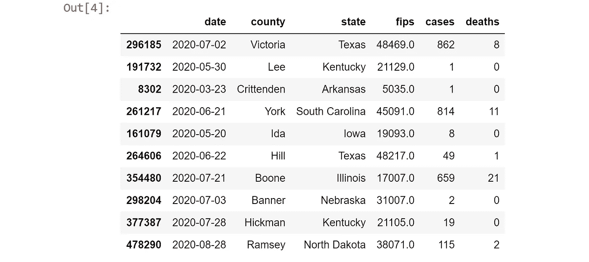

加载整个数据集需要 111 MB 的内存！

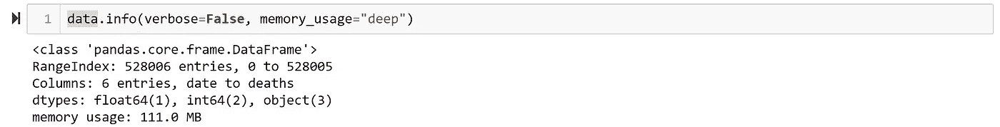

然而，我真的只需要这个数据集的两列，county 和 case 列，那么我为什么要加载整个数据集呢？只加载我需要的两列需要 36 MB，这减少了 32%的内存使用。

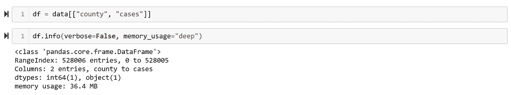

我可以像这样使用 Pandas 只加载我需要的列

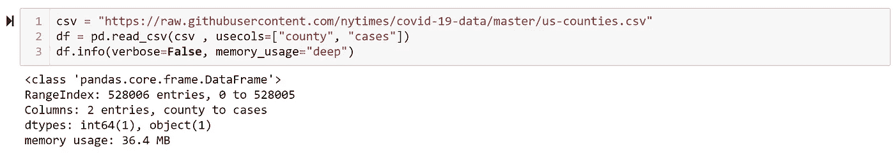

此部分的代码片段

*   **操作数据类型**

另一种减少数据内存使用的方法是截断数据中的数字项。例如，每当我们将一个 CSV 文件加载到一个数据框的列中时，如果该文件包含数字，它将把它存储为需要 64 个字节来存储一个数值。但是，我们可以截断它，并使用其他 int 格式来节省一些内存。

`int8`可以存储-128 到 127 的整数。

`int16`可以存储-32768 到 32767 的整数。

`int64`可以存储从-9223372036854775808 到 9223372036854775807 的整数。

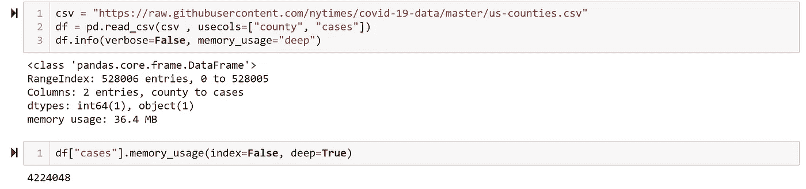

如果您知道特定列中的数字永远不会高于 32767，您可以使用一个`int16`或`int32`，并将该列的内存使用减少 75%。

因此，假设每个县的病例数不能超过 32767 —这在现实生活中是不正确的—那么，我们可以将该列截断为`int16` 而不是`int64`。

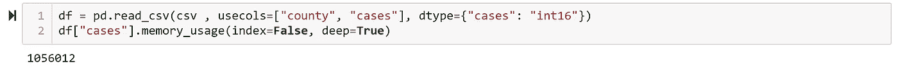

*   **稀疏列**

如果数据有一列或更多的列存储为`NaN`的空值，你可以使用[稀疏列表示](https://pandas.pydata.org/pandas-docs/stable/user_guide/sparse.html)来节省内存，这样你就不会浪费内存来存储所有这些空值。

假设 county 列有一些`NaN`值，我只想跳过包含`NaN`的行，我可以使用稀疏序列轻松地做到这一点。

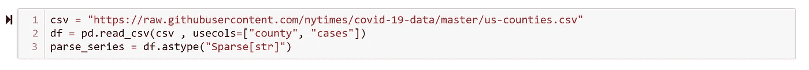

## 有损压缩

如果执行无损压缩还不够呢？如果我需要进一步压缩数据，该怎么办？在这种情况下，您可以使用有损压缩，因此为了节省内存，您牺牲了数据的 100%准确性。

您可以通过两种方式执行有损压缩:修改数值和采样。

*   **修改数值:**有时，您不需要完全精确的数值数据，这样您可以将它们从`int64`截断到`int32`或`int16`。
*   **抽样:**也许你想证明有些州的 COVID 病例比其他州高，所以你对一些县进行抽样，看看哪些州的病例更多。这样做被认为是有损压缩，因为您没有考虑所有行。

# 技巧 2:分块

处理大型数据集的另一种方法是分块。也就是说，将一个大型数据集切割成较小的块，然后分别处理这些块。处理完所有数据块后，您可以比较结果并计算最终结果。

该数据集包含 1923 行。

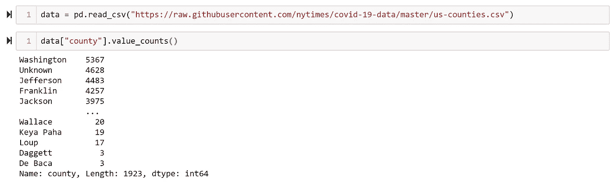

假设我想找到病例最多的国家。我可以将我的数据集分成 100 行的块，分别处理每一行，然后获取较小结果中的最大值。

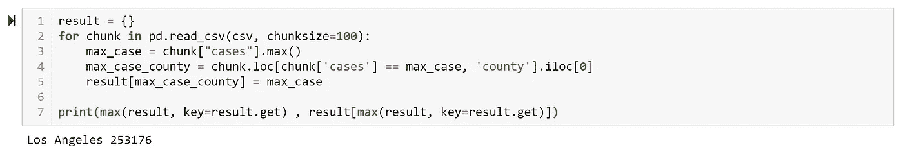

此部分的代码片段

# 技巧 3:索引

如果您只需要加载一次数据集，分块是很好的选择，但是如果您想要加载多个数据集，那么索引是一个不错的选择。

把索引想象成一本书的索引；你不需要阅读整本书就可以知道某个方面的必要信息。

例如，假设我想获得特定州的案例。在这种情况下，组块是有意义的；我可以写一个简单的函数来实现它。

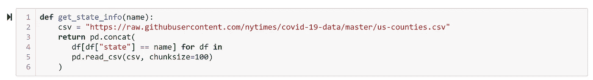

## 索引与分块

在分块中，你需要读取所有数据，而在索引中，你只需要一部分数据。

因此，我的小函数加载每个块中的所有行，但只关心我想要的状态。这导致了巨大的开销。我可以通过使用熊猫旁边的数据库来避免这种情况。我能用的最简单的是 SQLite。

为此，我首先需要将我的数据框加载到 SQLite 数据库中。

然后我需要重新编写我的`get_state_info`函数，并使用其中的数据库。

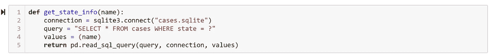

通过这样做，我可以减少 50%的内存使用。

# 结论

处理大型数据集可能会很麻烦，尤其是当它不适合您的内存时。有些解决方案既费时又费钱，这是最简单、最直接的方法。

然而，如果您没有资源，您可以使用 Pandas 中的一些技术来减少加载数据的内存使用——如压缩、索引和抓取等技术。