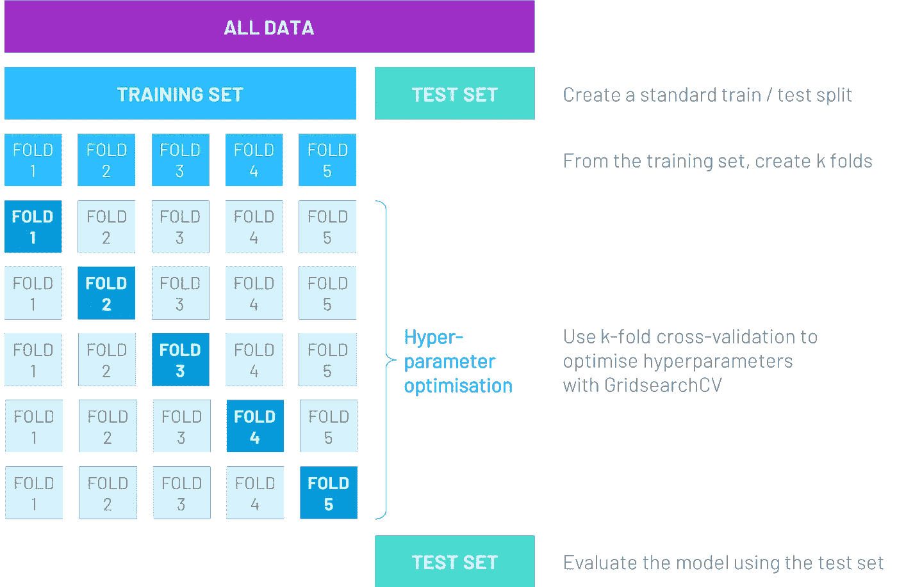
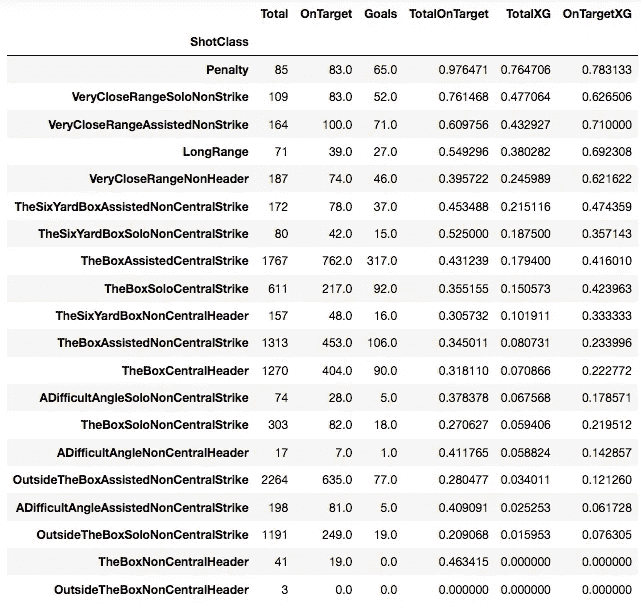
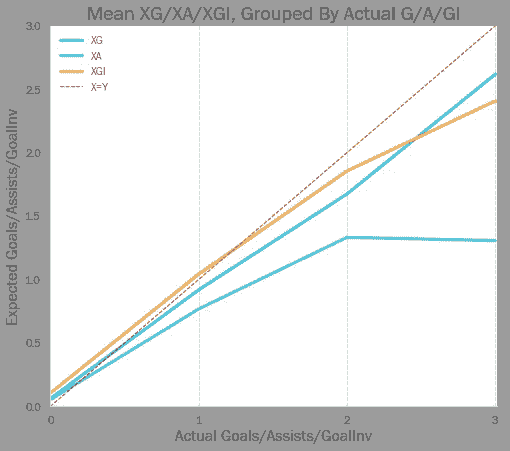
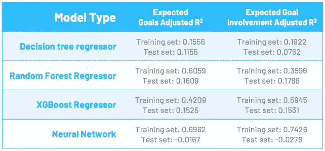
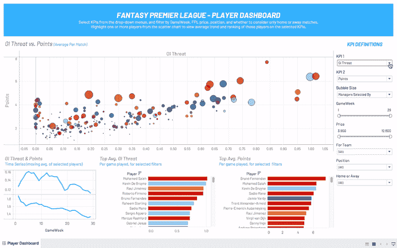
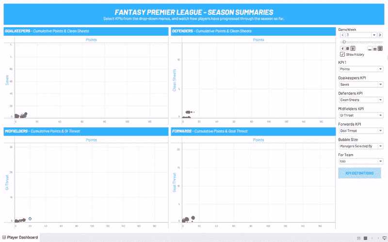
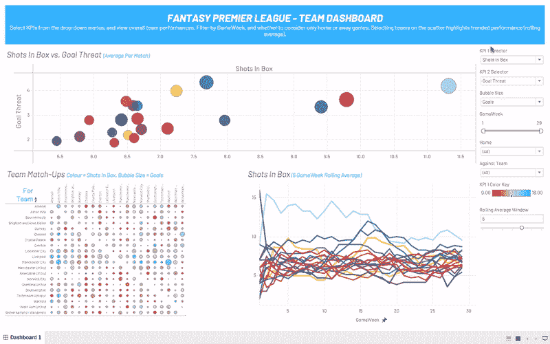

# 当你的项目失败时该怎么办

> 原文：<https://towardsdatascience.com/what-to-do-when-your-data-science-project-fails-6087b91c02cd?source=collection_archive---------50----------------------->

## [按目标](https://towardsdatascience.com/tagged/on-target)

## 不要惊慌——通常情况下，事情是可以扭转的


照片由[塑造的](https://unsplash.com/@shapelined?utm_source=medium&utm_medium=referral)在[的](https://unsplash.com?utm_source=medium&utm_medium=referral)上

你可能已经知道这种感觉了。

你花了几周甚至几个月的时间寻找、收集、整理和清理数据。EDA 制作了一些有希望的图表。一切都表明绝对成功。

然后，在离项目截止日期还有几周的时候，你开始训练你的第一个模型。这太糟糕了。

第二个也是。第三个。

让我们明确一点，我不是在说当你希望准确率达到 90%的时候，有 80%准确率的模型。我说的是功能无用的模型。我说的是*负*调整 R 平方的车型。

你到底是做什么的？

对于这篇博客中概述的建议，有一些警告——你采取的确切策略几乎肯定会受到环境的影响。这是个人项目还是专业项目？是否有一个迫在眉睫、不可动摇的最后期限？你的工作取决于这个吗？尽管如此，下面列出的步骤应该是大多数情况下的粗略指南。

提醒一下，我在这个[*【On Target】*](https://towardsdatascience.com/tagged/on-target)系列中一直在进行的项目是一个看似简单的项目——我们能根据哪些球员的历史表现预测他们将参与英超足球比赛的进球吗？

我最初试图构建的模型是一个二元分类器。数据集的每一行代表一场比赛中的一名球员。在那场比赛中，要么一名球员参与了进球，要么他没有，所以每一行的目标值是 1 或 0。

然后，我有 83 个特征，由几组不同的指标组成，以帮助告知球员是否会参与进球:

*   玩家在*最后一场*比赛中的表现(包括总进球数、射门总数、命中目标数、禁区内射门数、头球总数、助攻数以及他为其他玩家创造的各种不同类型射门的数量)
*   相同的一组指标，但是是过去 4 场比赛的平均值
*   相同的一组指标，但根据情况对*最近 4 场主场比赛或最近 4 场客场比赛进行平均(我们知道比赛的场地会对表现产生重大影响)*
*   即将到来的对手的防守统计数据，是他们最近 4 场比赛的平均值(即失球总数、失球总数、禁区内失球数等)。)
*   在适当的情况下，在最近 4 场主场比赛或最近 4 场客场比赛中使用相同的综合防守数据

总之，这些特征告诉我们，在过去的几场比赛中，玩家的进攻有多好，他们即将到来的对手的防守有多好。这似乎是一个明智的起点。

对于模型构建本身，我确保我使用了彻底的训练/验证/测试数据分割，使用 [GridSearchCV](https://medium.com/@cjl2fv/an-intro-to-hyper-parameter-optimization-using-grid-search-and-random-search-d73b9834ca0a) 来优化模型超参数(我将测试集与模型训练完全分开，以最好地复制模型在现实世界中的未来匹配情况)。



这种方法适用于一系列不同的适合二元分类的算法(逻辑回归、决策树、随机森林、SVM、XGBoost 等)。)

尽管各种模型在交叉验证的*训练*组中处理得相对较好，但当暴露在*测试*组中时，它们却挣扎得很厉害。做了这么多准备工作后，这有点让人摸不着头脑。

从这里去哪里？

# 数据是否适合模型？

一些模型可以在没有各种预处理步骤的情况下处理数据集(如果您正在处理不同类型的算法，这很容易忘记)。例如，支持向量机和神经网络在没有[标准缩放](https://scikit-learn.org/stable/modules/generated/sklearn.preprocessing.StandardScaler.html)的情况下苦苦挣扎。

类似地，如果数据不平衡(这个数据集就是如此，大约是 8 比 1)，我们需要通过告诉算法按类对结果进行加权来缓解这种情况(大多数算法都有这样的功能)，或者通过使用 [SMOTE](https://machinelearningmastery.com/smote-oversampling-for-imbalanced-classification/) 算法创建合成数据。

# 您是否使用了最佳评估指标？

到目前为止，我一直使用准确性作为我的评估标准。这是非常标准的，通常可以对分类器进行全面的评估。

考虑以下混淆矩阵:


在理想世界中，我们希望 B 和 C 等于零，尽管这通常很难实现。因此，我们可以使用不同的评估指标来判断我们能够达到的状态有多接近。

精度由下式给出:

```
(A + D) / (A + B + C + D)
```

换句话说，在所有的预测中，这个模型的正确率是多少？

然而，请记住，我们数据集中的不平衡——大多数球员不会逐场比赛进球。对于我们的模型来说，简单地预测负面情况(没有进球)是相当琐碎的，因为这是我们九分之一的数据点的情况。事实上，一个简单预测每种情况下负面结果的模型将有 89%的准确性，尽管这显然是一个无用的模型。

让我们考虑一下我们最初的意图，并试着对此更明智一些。我想预测谁会进球，这样我就可以为我幻想的英超球队挑选这些球员。而且在任何时候，我的队伍中的球员数量都是非常有限的——从数百名可用球员中最多选出七名进攻球员。

因此，我实际上并不关心模型对每个玩家的猜测是否正确。如果模型只预测在给定的一周内有 10 名球员得分，而我选择了这 10 名球员，那么我不会真的关心其他人是否得分——我可以愉快地忽略这些假阴性。

因此，我实际上想要最大化的是*精度。*

```
A / (A + C)
```

采用这种方法也让我可以尝试预测阳性病例的阈值。与标准的 50%相比，我可以让模型更有辨识力——如果你有 60%或 70%的把握，只预测一个积极的情况。当然，这减少了正面案例的总数，但是它应该保留那些更好的案例(从而有助于提高精确度)。

# 你能使用不同的目标变量吗？

事实上，这些都没有帮助。我所有的模型仍然有着可怕的精确度，不管我为一个积极的预测设置了多高的门槛。

我开始思考我的目标变量的有效性。当然，*球员是否进球*似乎是预测*球员是否会进球*的明显起点。

事实证明，事情要比这稍微复杂一些。想想贾马尔·刘易斯，排名垫底的诺维奇城队的后卫，只有 0.2%的梦幻超级联赛经理选择他。他已经有三个多月没有射中目标了，而且是在和联盟中最好的防守之一比赛。

然后他去做了这个:

(目标在 2 点 35 分)

这不仅仅是一个难以预测的目标——它几乎是不可能的。除了趾高气扬的中后卫远距离射门，意外的进球也可能是由不幸的偏差、守门员的吼叫和球的反常移动造成的。相反，被钉进的球可能会被意想不到的守门员的神勇表现所否定，同样也会被门柱所否定。

因此，尝试预测实际进球的另一种方法是，根据球员射门的位置和质量，计算出*预期*球员会进多少球。

已经定义了不同类型的可能射门(它们是从球场上的什么地方拍摄的，它们是被脚还是被头球击中的，它们是否被另一个球员直接辅助等等。)我们可以看到各自的目标转化率(预期目标，或 XG)。我们还可以看到如果射门击中目标，进球转化率的提高。



总进球数/总射门数。OnTargetXG 作为目标上的目标/镜头给出

然后，我们可以查看玩家在游戏中拍摄的不同镜头，根据每个镜头的类型对他们拍摄的每个镜头的“XG”求和，并为该游戏中的玩家创建一个整体“预期目标”衡量标准。

注意——我们也可以对助攻(即，根据后续投篮的质量，我们预计球员会获得多少助攻)和总体预期进球参与度(XGI，预期进球加上预期助攻)进行同样的操作。

碰巧的是，每场比赛的预期进球(XG)和每场比赛的预期进球参与(XGI)似乎是以线性方式增加的——即在一场比赛中梅开二度的球员的平均 XG 大约是只进球一次的球员的 XG 的两倍。



XG 和 XGI 是有用的指标——它们很好地描述了倾向于参与进球的球员。他们还消除了一些随机边缘情况(如贾马尔·刘易斯对莱斯特城的晴天霹雳)，否则这些情况会在训练中混淆模型。

鉴于 XG 和 XGI 是连续变量，这项工作成为一个回归问题，而不是一个分类问题。

长话短说，我用这个新的目标变量(使用我在分类尝试中使用的相同的、严格的测试/验证/训练数据分割方法)生成的模型并不成功。



使用*调整后的* R 平方(因为我们有许多特征)，我们可以看到模型最多只能解释预期目标/预期目标参与的 15-20%的差异。我们还可以看到训练集和测试集 R-Squared 之间的显著差异——尽管有交叉验证过程，我仍然受到过度拟合的困扰。

# 理解为什么事情不工作

可以说，事情到了这一步变得令人绝望。离我的最后期限只剩几天了，我已经快速通过了悲伤的必要阶段，我承认我不能在这个项目中展示一个工作的预测模型。

掌握这种结果的原因是很重要的，原因有很多(尤其是因为它给了你一个下一步该做什么的好主意，如果你有额外的时间或者需要把项目交给别人的话)。

值得一提的是，我认为我的造型存在以下问题:

*   我几乎没有时间来迭代和调整特性集。特征通常彼此高度相关，一些特征，如“目标上的镜头”实际上是其他特征(“总镜头”)的子集。这完全排除了参数模型的使用。
*   到目前为止，收集整个 19/20 赛季的数据产生了大约 4000 行数据——不坏，但不惊人。可以收集前几季的数据来支持这一点。
*   这个项目的最初目标——预测足球比赛中的任何特定事件——从根本上说是非常困难的。尽管“预期目标”指标可以稍微消除随机性，但球员的表现在不同的比赛中可能会有很大的波动，看起来没有什么规律或原因。
*   正如我的搭档所指出的，如果有人能在不到两个月的时间内独自完成这项工作，那么体育博彩市场早在几年前就已经崩溃了。

# 不要让你的努力白费！

需要注意的是，一般来说，空结果并不是没有价值的。事实上，根据您正在研究的特定假设，空值(即您的目标实际上无法预测的结论)可能与有效的预测模型一样重要。

就我而言，我无法预测英超联赛进球的事实对我表现不佳的 FPL 队来说是一个冰冷的安慰。然而，由于我项目的最初几个阶段，我确实发现自己坐在几千行干净、有组织的数据上。不把它用于*某事*就太可惜了。

在我的项目环境中，那个*东西*是一系列交互式仪表盘。它可能无法准确预测尚未进行的游戏的结果，但它确实让用户对玩家的表现有了一些独特的见解——当选择哪些玩家加入你的幻想团队时，你肯定可以使用这些工具来帮助决策(参见下面的视频以了解使用案例)。

这些交互式仪表盘可在[我的网站](http://www.cb91.io/projects/fpl)上找到。有戏看你怎么想！



玩家表现的完全交互式视图



本赛季到目前为止的总结，汉斯·罗斯林风格…



团队绩效的汇总视图

# 让其他人试试吧…

这是一个艰难的问题——人类喜欢获得荣耀，单枪匹马“破解”梦幻英超是一个非常诱人的前景。但是数据科学本质上常常是一种协作追求。无论你是多么优秀的数据科学家，仍然会有成千上万的人比你更优秀。因此，本着这种精神，我邀请你看看你是否能得到更好的结果——我几乎可以肯定你能。

你可以在这里找到 [GitHub 回购](https://github.com/calbal91/project-moneyballing-fpl)。

我期待看到你想出的东西…

> *这是我的博客系列“* [*关于目标*](https://towardsdatascience.com/tagged/on-target) *”中的最新帖子，在其中，我将尝试为梦幻英超建立“赚钱”工具。我很乐意听到关于这个博客的任何评论，或者这篇文章涉及的任何概念。欢迎在下方随意留言，或者通过*[*LinkedIn*](https://www.linkedin.com/in/callum-ballard/)*联系我。*