# 当您的模型具有非正态误差分布时该怎么办

> 原文：<https://towardsdatascience.com/what-to-do-when-your-model-has-a-non-normal-error-distribution-f7c3862e475f?source=collection_archive---------5----------------------->

## [优化和机器学习](https://towardsdatascience.com/tagged/optimization-and-ml)

## 如何使用弯曲来拟合任意误差分布

照片由[尼尔·罗森斯泰克](https://unsplash.com/@neilrosenstech)**T5【在 [Unsplash](https://unsplash.com/photos/KG-9TUrAFsg)**

模型能告诉我们的最重要的事情之一是它在预测中有多确定。这个问题的答案可以以误差分布的形式出现。误差分布是关于点预测的概率分布，它告诉我们每个误差增量的可能性有多大。

误差分布可能比点预测更重要。

假设你是一个投资者，考虑两个不同的机会(A 和 B)，并使用一个模型来预测一年的回报(以投资额的百分比表示)。该模型预测 A 和 B 具有相同的 10%的预期 1 年回报率，但显示了这些误差分布

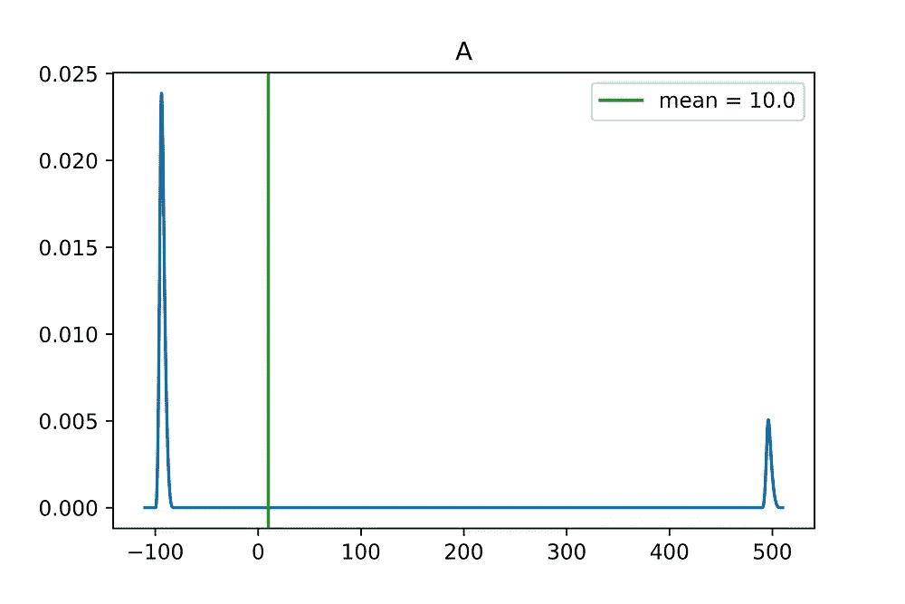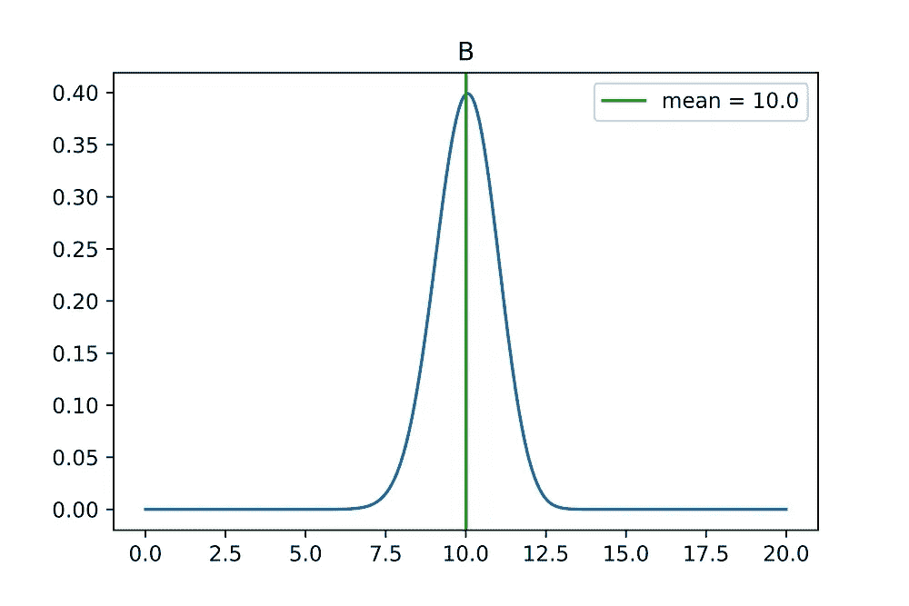

即使两个机会有相同的预期回报，误差分布显示它们是多么的不同。b 紧紧围绕其期望值分布，损失金钱的风险很小；而 A 更像是彩票。高回报的可能性很小(大约 500%的回报)；但是大多数时候，我们会失去一切(100%的回报)。

点预测没有告诉我们目标值可能分布在哪里。如果知道一个预测可以偏离多远很重要，或者如果目标值可以聚集在[厚尾](https://en.wikipedia.org/wiki/Fat-tailed_distribution)附近，那么精确的误差分布就变得至关重要。

错误分布的一个简单方法是试图强迫它变成一种它不接受的形式。当我们追求方便但经常被误用的正态分布时，这种情况经常发生。

正态分布很受欢迎是有原因的。除了使数学变得更容易之外，[中心极限定理](https://en.wikipedia.org/wiki/Central_limit_theorem)告诉我们正态分布可以是许多问题的自然选择。

## 正态分布如何自然产生？

让 *X* 表示特征矩阵，让 *b* 表示回归向量。假设目标值由以下等式生成

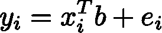

在哪里

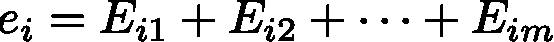

[中心极限定理](https://en.wikipedia.org/wiki/Central_limit_theorem)说如果 *E* 是[独立同分布的](https://en.wikipedia.org/wiki/Independent_and_identically_distributed_random_variables)有限方差的随机变量，那么当 *m* 增加时，和将接近正态分布。

即使当 *E* 非常不正常时，如果求和包含足够多的项， *e* 也会接近正常。

我们来看一个具体的例子。设置 *b = (-2，3)* 。让 *X* 的条目独立于均匀分布 *[-1，1】*生成。我们将从这个明显的非正态分布中产生 E

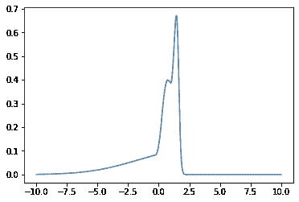

我们将 *e* 的误差分布归一化，使其具有单位方差，并允许项数 *m* 变化。以下是最小二乘模型的误差直方图(橙色),这些误差来自不同的 *m* 值的模拟运行，如果误差呈正态分布(蓝色),则与误差的预期直方图重叠。

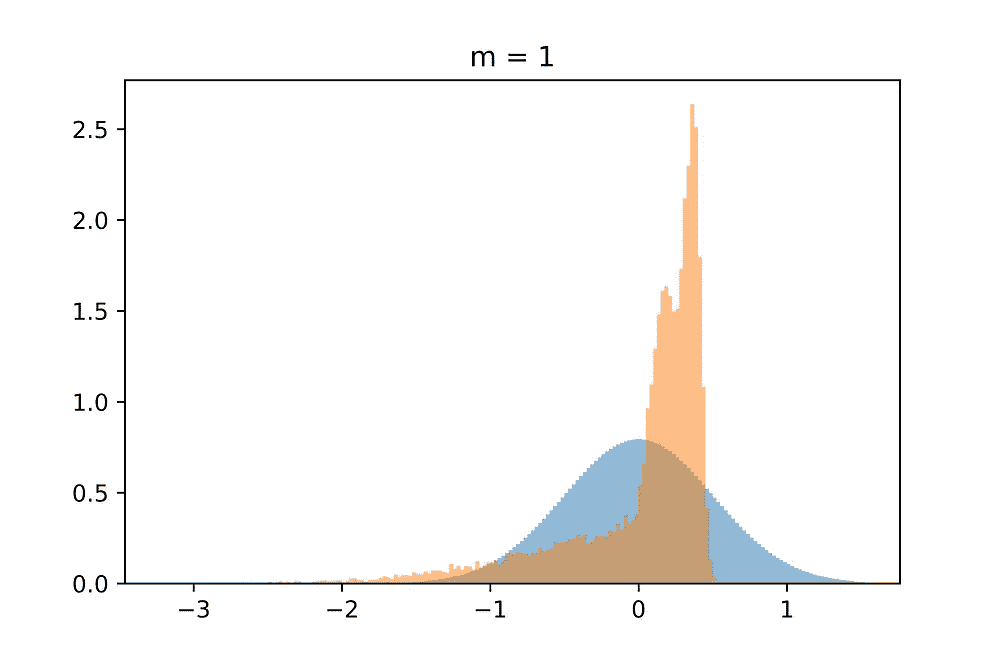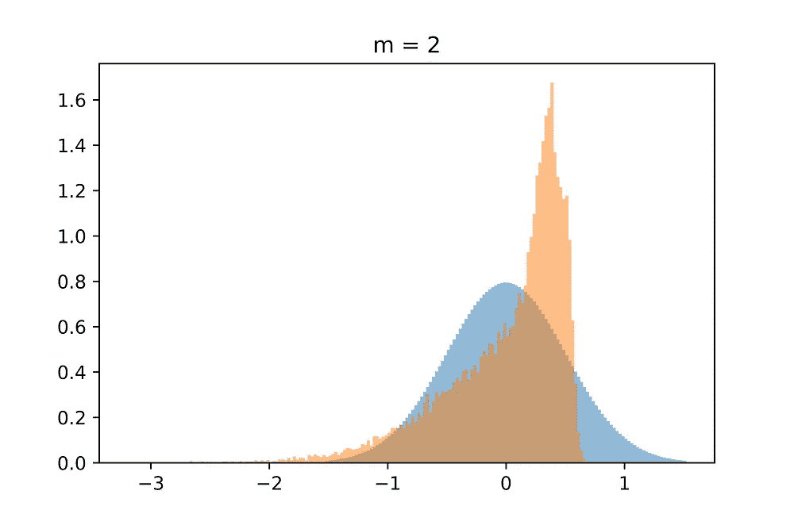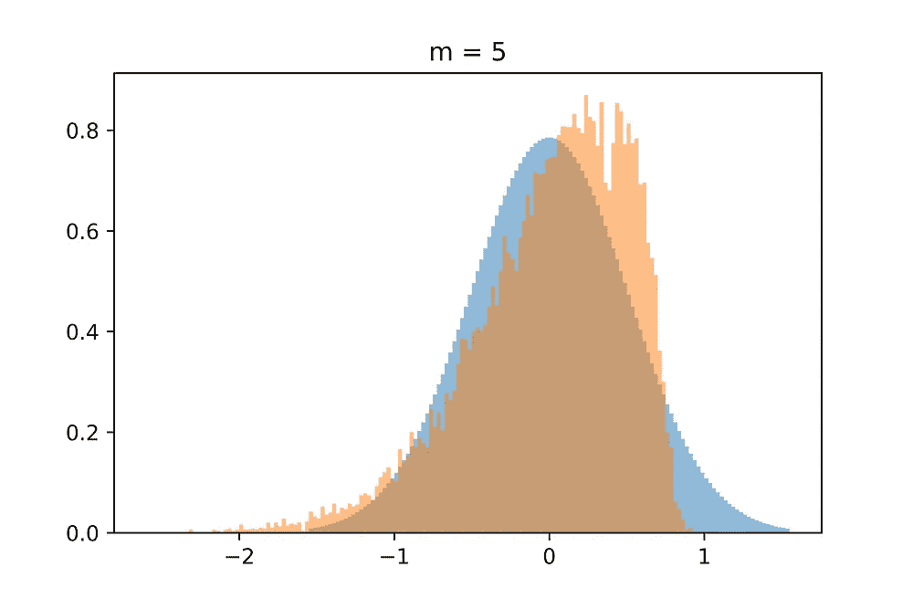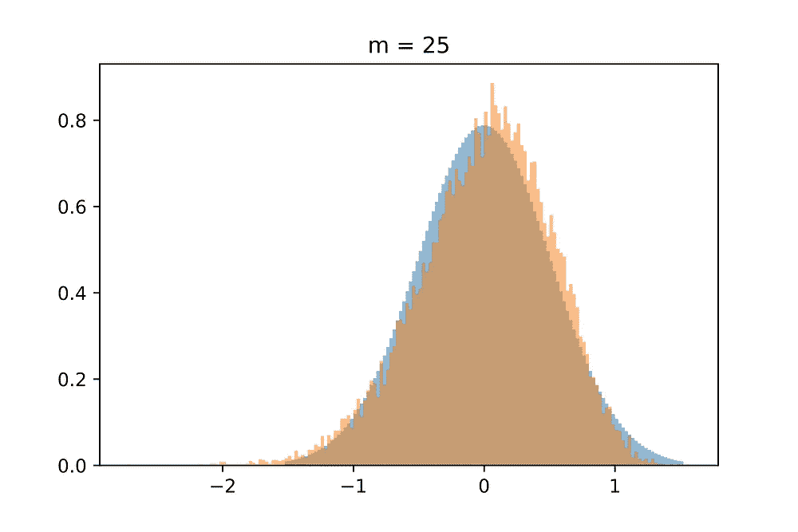

随着 *m、*值的增大，误差直方图越来越接近正态分布。

当有理由认为误差项可以分解为独立同分布因子的和时，正态分布是一个不错的选择。但在一般情况下，我们没有理由去假设它。事实上，许多误差分布是不正常的，表现为[偏斜](https://en.wikipedia.org/wiki/Skewness)和[厚尾](https://en.wikipedia.org/wiki/Fat-tailed_distribution)。

## 当误差分布呈非正态分布时，我们该怎么办？

这就是翘曲帮助我们的地方。它使用正态分布作为构建模块，但为我们提供了局部调整分布的旋钮，以更好地适应数据误差。

为了了解扭曲是如何工作的，可以观察到，如果 *f(y)* 是单调递增的[满射函数](https://en.wikipedia.org/wiki/Surjective_function)并且 *p(z)* 是概率密度函数，那么*p(f(y))f′(y)*形成了一个新的概率密度函数。

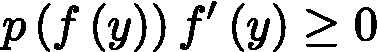

因为*f′(y)*≥0；**应用[替换](https://en.wikipedia.org/wiki/Integration_by_substitution) *u=f(y)* 后，我们看到**

**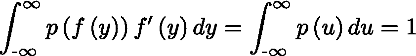**

**让我们看一个例子，看看 *f* 如何重塑一个分布。假设 *p(z)* 是标准正态分布 *N(0，1)* 和 *f(y)* 定义如下**

**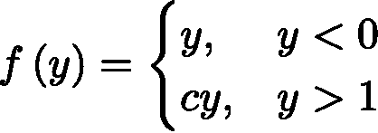**

**其中*c>0；*和*【0，1】之间，f* 是在 *y* 和 *cy 之间平滑过渡的样条。*下面是几个不同的 *c* 值下 *f* 的样子**

**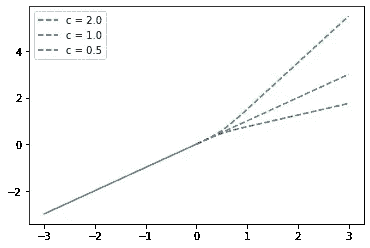**

**这是产生的扭曲概率分布的样子**

**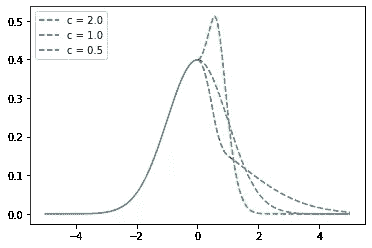**

**当 *c = 2* 时，面积从标准正态分布重新分布，使得概率密度函数(PDF)达到峰值，然后快速下降，从而具有更细的右尾。当 *c = 0.5* 时，相反的情况发生:PDF 快速下降，然后减缓其下降速度，以便有一个更胖的右尾。**

**现在，想象一下 *f* 被一个向量 *ψ* 参数化，这个向量允许我们对增长率进行任意的局部调整。(后面更多关于如何参数化 *f* )。然后配合合适的 *ψ* ， *f* 可以拟合各种不同的分布。如果我们能找到适当调整 *ψ* 的方法，那么这将为我们提供一个强大的工具来拟合误差分布。**

## ***如何调整整经参数？***

**更好的拟合误差分布使得训练数据上的误差更有可能。接下来，我们可以通过最大化训练数据的似然性来找到弯曲参数。**

**首先，让我们看看最大似然法是如何工作的，而没有扭曲。**

**设 *θ* 表示给定回归模型的参数向量。设*g(x；* θ) 代表模型对特征向量 *x* 的预测。如果我们使用具有标准差σ的正态分布来模拟预测的误差分布，则训练数据的可能性为**

**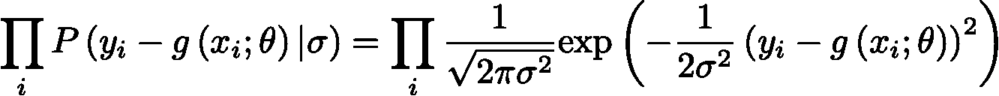**

**对数可能性是**

**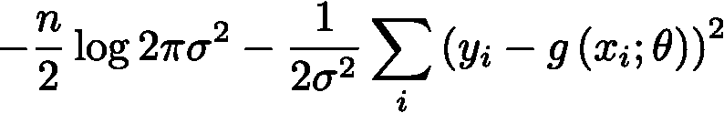**

**放**

**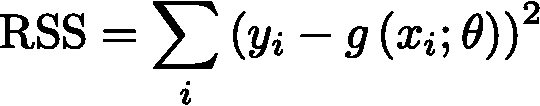**

**(RSS 代表[残差平方和](https://en.wikipedia.org/wiki/Residual_sum_of_squares))**

**对于 *θ* 固定，σ*最大化可能性，当***

**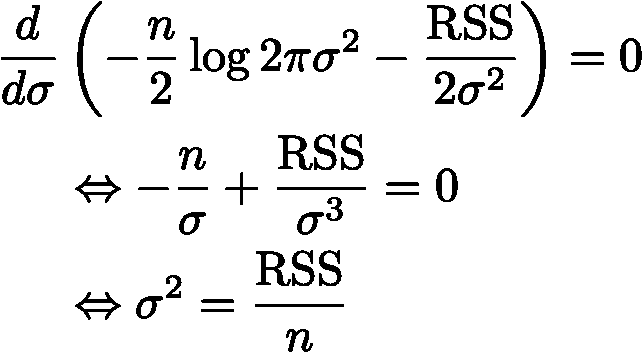**

**更一般地，如果*σ= cRSS*(*c>0*，那么对数似然简化为**

**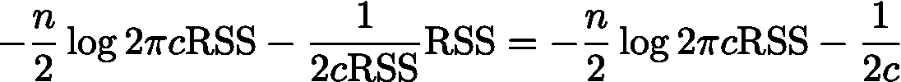**

**我们看到，当 *θ* 最小化 RSS 时，可能性最大。**

**现在，假设我们用由 *ψ参数化的单调函数 *f* 扭曲目标空间。*让*f(y；ψ)* 表示扭曲的目标值。那么扭曲误差分布的可能性是**

*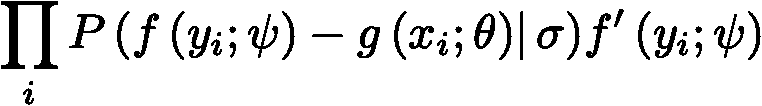*

*对数似然变成了*

*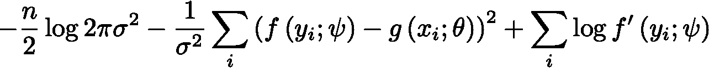*

*或与*

*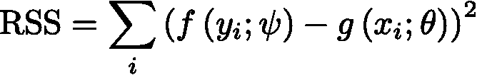*

*和 *σ = cRSS**

*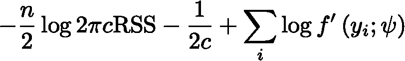*

*为了拟合误差分布，我们将使用优化器来找到使这种可能性最大化的参数 *(θ，ψ)* 。*

*为了让优化器工作，它需要一个目标的局部近似值，可以用它来迭代地改进参数。为了建立这样的近似，我们需要计算对数似然相对于参数向量的梯度。*

*放*

*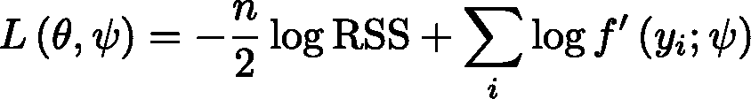*

*我们可以使用 *L* 作为对数似然的代理，因为它只相差一个常数。*

*Warping 是一个通用过程，可以应用于任何基础回归模型，但我们将重点关注最简单的基础模型，线性回归。*

## **如何扭曲一个线性回归模型？**

*通过线性回归，我们可以推导出 *θ* 的封闭形式。设 *Q* 和 *R* 为特征矩阵 *X* 的 [QR 分解](https://en.wikipedia.org/wiki/QR_decomposition)的矩阵*

*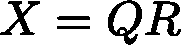*

*其中 Q 是正交的，R 是直角三角形。放*

*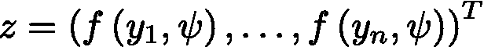*

*并且让 *b̂* 表示使扭曲目标 *z* 的 RSS 最小化的向量*

*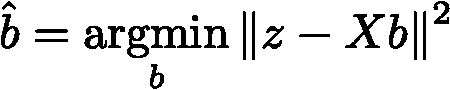*

*放*

*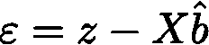*

*然后*

*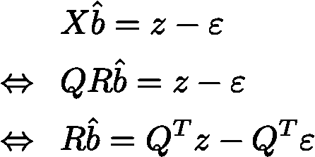*

*如果 X 有 m 个线性独立列，那么矩形三角形矩阵 *R* 的前 m 行在对角线上有非零项，其余行为 0。因此*

*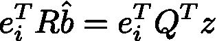*

*对于 *i ≤m* 和*

*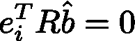*

*对于*我>米*。因此，*

*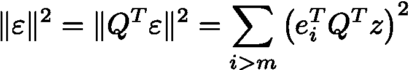*

*设 P 是 n×n 对角矩阵，其中*

*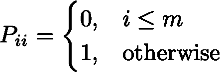*

*一组*

*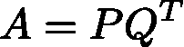*

*然后*

*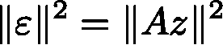*

*将这些等式代入对数似然代理，我们得到*

*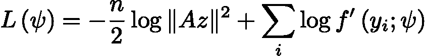*

*对翘曲参数进行微分可以得到*

*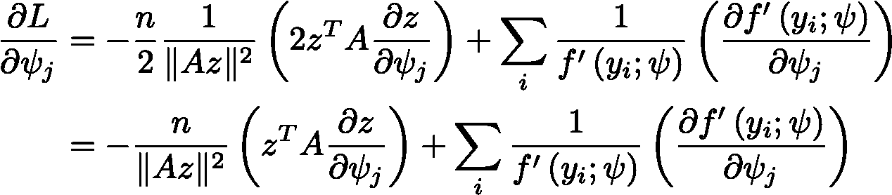*

*使用这些导数，优化器可以攀升到扭曲参数 *ψ* 以最大化训练数据的可能性。*

## **如何用扭曲线性回归模型进行预测？**

*现在我们已经找到了扭曲参数，我们需要做预测。*

*考虑这在标准的普通最小二乘模型中是如何工作的。假设数据是从模型中生成的*

*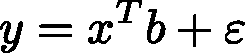*

*其中 *ε* 在 *N(0，* σ)中。让 *X* 和 *y* 表示训练数据。使训练数据[的 RSS 最小的回归量是](https://en.wikipedia.org/wiki/Least_squares#Linear_least_squares)*

*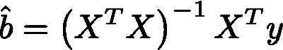*

*如果*x′*和 y*′*表示样本外特征向量和目标值*

*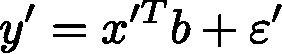*

*那么样本外预测的误差为*

*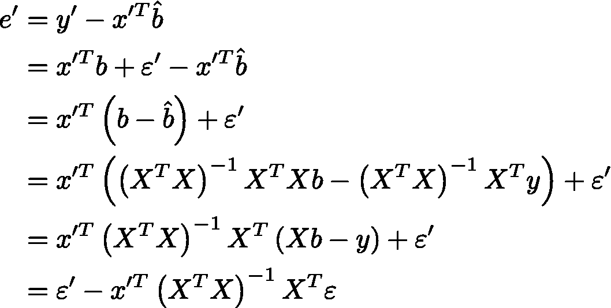*

*因为 *ε* 和*ε′*正态分布，所以*e′*正态分布，方差 is⁴*

*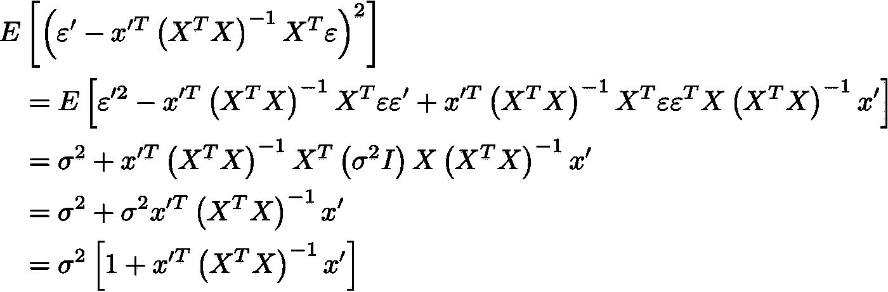*

*我们很少知道噪声方差σ，但我们可以使用这个等式获得它的[无偏估计](https://en.wikipedia.org/wiki/Bias_of_an_estimator)*

*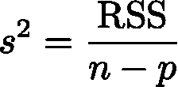*

*其中 *p* 是回归数。*

*假设现在普通的最小二乘模型适合扭曲的目标值*

**

*普通的最小二乘法为我们提供了潜在空间的点预测和误差分布，但是我们需要反转扭曲来获得目标空间的预测。*

*设 *ẑ* 代表样本外特征向量*x’*的潜在预测。如果 *s* 是估计的潜在噪声方差，则目标值 y 的概率是*

*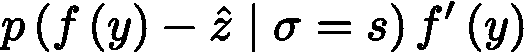*

*预期的目标值是*

*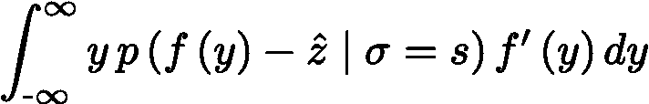*

*在进行了[替换](https://en.wikipedia.org/wiki/Integration_by_substitution) *u=f(y)* 之后，期望值可以改写为*

**

*可以使用[牛顿法](https://en.wikipedia.org/wiki/Newton%27s_method)来计算 *f* 的倒数，以找到*f(y)*-*u，*的根，并且可以使用[高斯-埃尔米特积分](https://en.wikipedia.org/wiki/Gauss%E2%80%93Hermite_quadrature)来有效地计算积分。*

## **有哪些有效的整经功能？**

*让我们把注意力转向翘曲函数*f(y；ψ)* 以及如何参数化。我们希望参数化允许各种不同的函数，但我们也需要确保它只允许单调递增的满射翘曲函数。*

*观察翘曲函数在重缩放下不变:*c f(y；ψ)* 导致与*f(y；ψ)* 。设置*θ’*使*g(x；*θ*’*)= c g(x；θ).然后对数似然代理 *L(ψ，θ’)*为*c f(y；ψ)* 是*

*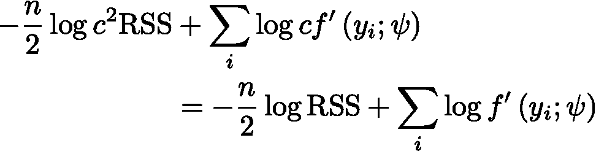*

*重要的是扭曲函数如何改变目标值之间的相对间距。*

*翘曲的一个有效函数族是*

*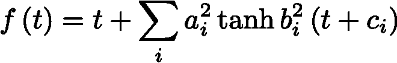*

*每个 *tanh* 步骤都允许对翘曲函数的斜率进行局部改变。 *t* 项确保翘曲函数是单调满射的，并且当 *t* 远离任何一步时回复到恒等式。由于缩放的不变性，没有必要给 *t* 增加缩放系数。*

*我们将做一个额外的调整，使弯曲函数的平均值为零。放*

*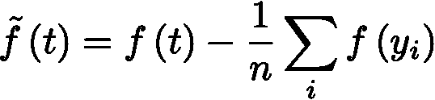*

## **一道例题**

*Dataset⁵社区和犯罪组织提供全美不同地区的犯罪统计数据。作为一个回归问题，任务是从不同的社会经济指标来预测暴力犯罪率。我们将对数据集拟合一个扭曲的线性回归模型，并与普通的最小二乘模型进行比较。*

*让我们来看看适合最大化训练数据的对数似然的弯曲函数。*

*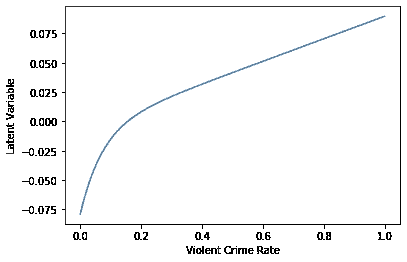*

*设σ表示潜在空间中的估计噪声标准偏差。为了直观显示该函数如何改变误差分布，我们将绘制范围*

*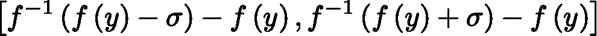*

*跨越目标值*

**

*在较低的目标 values⁶.下，扭曲会使预测的误差范围变小*

*为了了解扭曲是否会带来更好的结果，让我们在社区数据集的十倍交叉验证上比较扭曲线性回归模型(WLR)和普通最小二乘模型(OLS)的性能。我们使用平均对数似然(MLL)作为误差测量。MLL 对 cross-validation⁷.中每个样本外预测的对数似然进行平均*

**

*结果显示，扭曲线性回归的表现要好得多。深入研究一些随机选择的预测及其误差分布有助于解释原因。*

********

*值的范围自然地被限制在零，并且变形将概率密度函数整形为逐渐变小，以便有效目标值有更多的概率质量。*

## *摘要*

*使用正态分布来模拟误差是很诱人的。它使数学变得更容易，并且中心极限定理告诉我们，当误差分解成独立同分布随机变量的和时，正态性自然出现。*

*但是许多回归问题并不适合这样的框架，误差分布可能远非正常。*

*当面对非正态误差分布时，一种选择是变换目标空间。使用正确的函数 *f* ，当我们用 *f(y)* 替换原来的目标值 *y* 时，可能会达到正态性。问题的细节有时会导致对 *f* 的自然选择。在其他时候，我们可能会用一个固定转换的工具箱来解决问题，并希望其中一个能够打开常态。但这可能是一个临时的过程。*

*扭曲将转换步骤变成了最大似然问题。warping 没有应用固定的转换，而是使用参数化的函数，这些函数可以近似任意的转换，并在优化器的帮助下使函数适合问题。*

*通过转换函数，warping 可以捕捉误差分布中的非正态性，如偏斜和厚尾。对于许多问题，它可以提高样本外预测的性能，并避免使用固定变换。*

**对构建扭曲模型感兴趣？查看 Python 包* [*峰值引擎*](https://github.com/rnburn/peak-engines) *。**

*脚注*

*[1]:有关完整模拟的详细信息，请参见[https://github . com/rn burn/warped-regression-doc/blob/master/notebooks/normal _ errors . ipynb](https://github.com/rnburn/warped-regression-doc/blob/master/notebooks/normal_errors.ipynb)。*

*[2]:翘曲的表示和使用的特定翘曲函数取自*

> *e .斯尼尔森，CE Rasmussen，Z Ghahramani。[扭曲高斯过程](https://papers.nips.cc/paper/2481-warped-gaussian-processes.pdf)。神经信息处理系统的进展 16，337–344*

*[3]:扭曲函数和绘图可在[https://github . com/rn burn/warped-regression-doc/blob/master/notebooks/warp . ipynb](https://github.com/rnburn/warped-regression-doc/blob/master/notebooks/warp.ipynb)中找到*

*[4]:请参见[https://github . com/rn burn/warped-regression-doc/blob/master/notebooks/ols _ prediction _ error . ipynb](https://github.com/rnburn/warped-regression-doc/blob/master/notebooks/ols_prediction_error.ipynb)以验证该等式*

*[5]:作为 [UCI 机器学习库](https://archive.ics.uci.edu/ml/datasets/Communities+and+Crime)的一部分提供。请参见*

> *单位美国商业部，人口普查局，1990 年美国人口和住房普查:简要磁带文件 1a 和 3a(计算机文件)，*
> 
> *美国商务部、DC 华盛顿州人口普查局和密歇根州安阿伯市大学间政治和社会研究联合会。(1992)*
> 
> *美国司法部、司法统计局、执法管理和行政统计(计算机文件)美国商务部、DC 华盛顿州人口普查局和密歇根州安阿伯市大学间政治和社会研究联合会。(1992)*
> 
> *美国司法部、联邦调查局，《美国的犯罪》(计算机档案)(1995 年)*
> 
> *Redmond，M. A .和 A. Baveja:一个数据驱动的软件工具，用于在警察部门之间实现合作信息共享。欧洲运筹学杂志 141(2002)660–678。*

*[6]:参见[https://github . com/rn burn/warped-regression-doc/blob/master/notebooks/communities _ example . ipynb](https://github.com/rnburn/warped-regression-doc/blob/master/notebooks/communities_example.ipynb)*

*[7]:参见[https://github . com/rn burn/warped-regression-doc/blob/master/notebooks/communities _ example _ cv . ipynb](https://github.com/rnburn/warped-regression-doc/blob/master/notebooks/communities_example_cv.ipynb)*