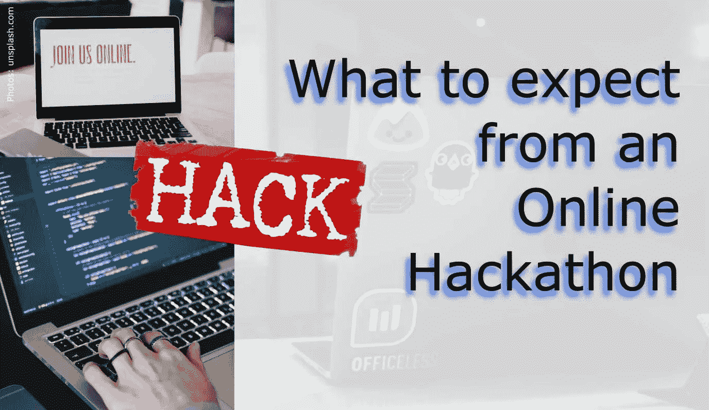

# 对在线黑客马拉松有什么期待

> 原文：<https://towardsdatascience.com/what-to-expect-from-an-online-hackathon-138665bc5d8a?source=collection_archive---------62----------------------->

## 你将不得不做出什么样的取舍？

照片: [AltumCode](https://unsplash.com/@altumcode) ，[萨曼莎·博尔赫斯](https://unsplash.com/@samich_18)，[马里奥·高](https://unsplash.com/@mariogogh)@[https://unsplash.com/](https://unsplash.com/)

这一年给工作场所、学术界以及我们如何度过业余时间带来了许多变化。许多原本要面对面举行的活动现在都在网上进行。这有其好处，但也有挑战。

我决定报名参加在得克萨斯州 A&M 举行的 2020 年 TAMU 数据马拉松，因为去年我有一次很棒的经历。是的，我再次被录取了，因为我知道，由于不再有物理空间的限制，一个大厅里可以安全地容纳多少人，所以参与者的数量增加了一倍。

至此，so 2019 ( [此处阅读帖子](https://www.christianhaller.me/blog/projectblog/2019-10-26-Hackathon-Guide/))。一切都与 2019 年的活动非常相似:在线申请，注册 Slack 频道，如果可能的话，在活动前几天找到队友，从周六中午到周日中午花 24 小时工作。

几天前，我找到了另外两个参与者来组成一个团队。直到活动真正开始时才宣布挑战，所以很难招募成员获得技能，我只能通过谁有兴趣来组建一个小团体。我认为三个是理想的。

接下来的主要分歧是:你不需要前往活动地点，而只是从黑客马拉松网站、Slack 频道、视频流(仪式)中获取所有信息，或许还会参加一些视频通话(例如，组织者的指导课程)。

我想细述这次经历的好处和挑战，以及我从中收获了什么。

# 赞成的意见

1.  在舒适的家中享受安静的工作时间。睡在自己的床上而不是睡袋有它的好处。
2.  使用大屏幕工作站而不是小型笔记本电脑，立即提高工作效率。
3.  减少数百名其他黑客的干扰和干扰。
4.  节省旅行的金钱和时间。你可以参加比面对面更多的在线黑客马拉松。然而，如果黑客马拉松在城里举行，这些节省可能不太显著。
5.  不用排队挂号。否则这可能需要一个小时。
6.  显而易见的一条:不要生病。

# 骗局

1.  与您的团队成员没有即时面对面的互动。
2.  每个人都在做自己的事情，定期检查和状态报告是很重要的。
3.  不太可能与团队以外的人交往。
4.  数据科学的多用户环境，比如 Google Colab 笔记本，还不是很成熟。覆盖发生时，Colab 比 Git 更容易丢失工作记录。
5.  可能会被来访者、家人等分散注意力。
6.  你必须自己做食物。没有免费的晚餐和饮料。

# 结果

从正反两方面来看，似乎各种论点或多或少是平衡的。但是再想一想，如果你可以在面对面和在线之间进行选择，那么为什么直到现在我们还没有这么多在线黑客马拉松呢？

如果事先没有制定规则，在团队中远程工作会是一个很大的挑战。我的印象是，启动阶段，即搜索数据、收集和评估，是我们项目中最需要协作的部分，从那以后就安静下来了。我真的认为经常报告每个人在做什么很重要，并且互相帮助解决问题，找到解决方案或重构的方法。例如，定期(1-2 小时)与团队进行语音通话以分享结果、需求和计划可能是个好主意。2019 年，我的团队坐在一起，所有人都在他们的 Jupyter 笔记本上工作——不断解释每个人在做什么。今年，我想尝试一下 [Google Colab](https://colab.research.google.com) ，因为我认为这将改善协作，让每个人都添加到同一个文件中，所有的进展都可以立即看到。但这被证明是一个主要的痛点。我记得有过几次不愉快的情况，在滞后的同步过程中单元格内容被删除，不得不重写笔记本的大部分内容。在从 Colab 中消除同步问题之前，建立 Git 存储库可能是更可靠的方法。

# 我的裁决

我认为一旦许可，黑客马拉松很可能会回到现场活动。但我也希望它们可能成为混合赛事，如果在线流媒体和本地人的双重组织不是太多。它将允许远程参与者从该国的另一端侵入，并可能进一步提高受欢迎程度和参与率。团队需要调整他们的沟通频率和风格，以适应这种新的合作模式，从而获得与面对面同样好的结果。

你怎么想呢?你参加过黑客马拉松吗？你有什么经历？

*原载于 2020 年 11 月 15 日*[*https://www . Christian Haller . me*](https://www.christianhaller.me/blog/projectblog/2020-11-15-OnlineHackathon/)*。*