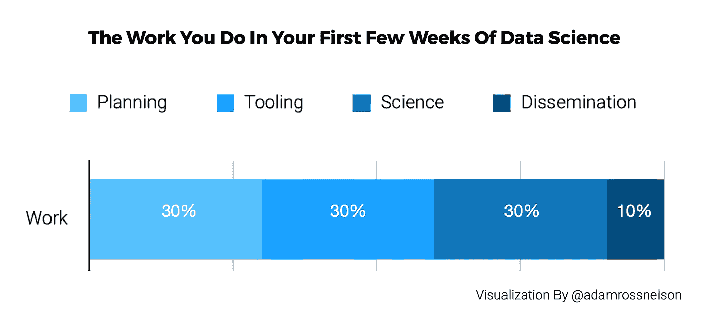
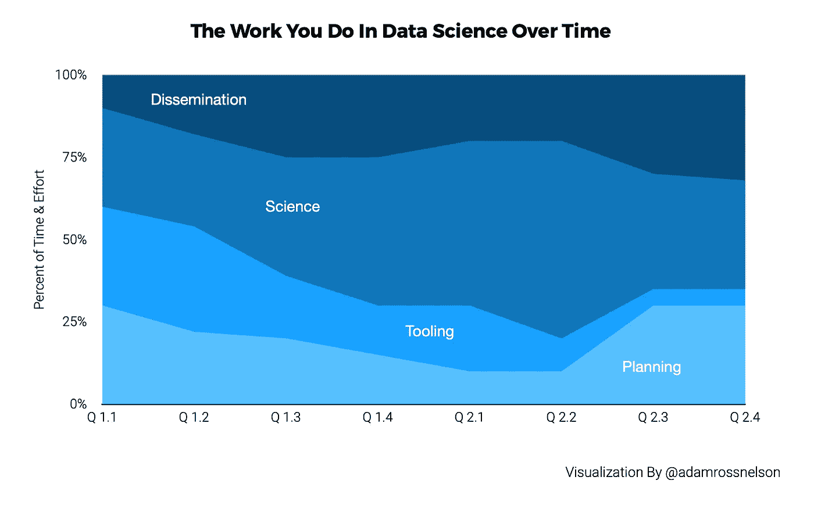
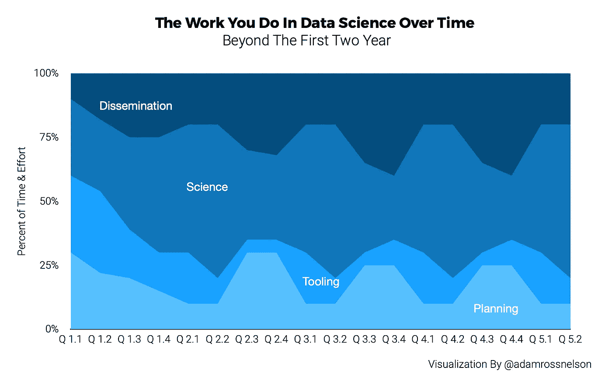

# 数据科学的头两年有什么可期待的

> 原文：<https://towardsdatascience.com/what-to-expect-in-the-first-two-years-of-data-science-3033bf0b1404?source=collection_archive---------11----------------------->

## 回顾我从事数据科学的头两年(8-10 个财政季度及以后)

# 介绍

在中，我的数据科学生涯有一百万种方式没有按计划进行。我已经分享了我的一些[最大的错误](/my-biggest-career-mistake-in-data-science-b95ad9fd0ff7)。我分享了一些我在 T4 最喜欢的日子。

这篇文章是写给那些有兴趣了解他们应该从数据科学职业中得到什么类型的工作任务的人的。我也推荐这篇文章给任何对评估自己职业感兴趣的人。将你的经历与我的(或其他人的)经历进行比较，可能有助于你找到正确的视角。下面，我邀请你联系我，如果你有兴趣进入该领域。我在晚年转向了数据科学。我很乐意帮助别人做同样的事情。

数据科学家的工作大致分为四大类。这些包括计划、工具、科学和传播。我经常收到的一个问题是，作为一名数据科学家，你的大部分时间是如何度过的？我从经验中了解到，这些问题的答案至少部分取决于你在这个角色中呆了多久；你如何度过你的时间，会随着时间而改变。

本文将回顾这四个高级别工作类别中的每一个，然后解释这些类别中的工作分配将如何开始，然后随着时间的推移而变化。

# 工作的四个类别

## 发行是如何开始的

这里有一个合理的分类，说明在最初的几个星期里，你将如何在这四个任务类别中的每一个上花费时间。

图片来源:作者对数据科学前几周工作的再现。

## 这项工作包括什么

**计划:**与选择需要回答的问题相关的过程。有时候，发现一个问题更好的框架是选择一个需要解决的问题。计划还包括检查其他人是否已经回答了问题或解决了问题。

**工具化:**工具化包括选择最适合回答问题或解决问题的工具。这意味着审查现有的工具和方法。工具化通常也意味着定制现有的工具或者构建新的工具。

科学:可以说，科学可以被定义为提出和回答一个问题，然后传播它的过程。就本文而言，我将科学定义为花费时间和精力收集数据并执行过程早期制定的计划。这意味着，将先前选择的工具和方法应用于该数据。更详细地说，这包括调整模型和参数，以及解释和比较输出结果。

**传播:**这是报告结果的过程。报告结果可以通过多种方式出现，包括出版、文章或报告。这可能还包括对小型或大型团体的演示。传播是指你分享最初的问题，揭示你的答案或解决方案，描述你的数据和方法，并且对你工作的相对优势和劣势保持透明。

当你花 30%的时间在计划上，超过 40 小时的工作周，相当于一天半或 12 小时。在一个多月的时间里，包括大约 20 个工作日，你将花其中的 6 天做计划。

同样，你也可以在工具和科学上花费同样多的时间。这使得一周中有 4 个小时用于传播。或者在一个 20 个工作日的月份中，大约有 3 天的时间用于传播。

# 工作分配如何随时间变化

> 你如何度过你的时间，会随着时间而改变。

## 头两年

下图提供了有关数据科学工作以及工作性质如何随时间变化的大量信息。它表明，在周期开始时，实际进行的科学研究往往是有限的。直到第二年(Q 2.1 和 Q 2.2)，这份工作的科学性还不到 50%。然后，紧接着花在实际科学上的时间的增加，科学的数量显著下降。随着科学的推进，工作立即转移到传播先前的结果，然后为前方的下一个周期做更多的计划。

图片来源:作者对数据科学前两年工作的再现。

此图描绘了一个事件版本，显示了计划在第二年的第三和第四季度恢复到大约 30%所花费的时间和精力。在第二年的后期，工具会减少，因为第一年早期执行的工具工作应该是可重用的。第一年早期花在工具上的时间现在可以用来传播前面的结果了。

## 两年后，一个惯例出现了

在最初的两年后，可能会形成一个常规。有一个自然循环。这个周期开始类似于一个循环，你花大约两个季度的时间进行传播和计划。传播与最近的过去的发现有关，规划与执行后续步骤有关。然后，两个季度将专注于涉及执行计划的科学。最终回到几个季度的计划和传播。

图片来源:作者对数据科学领域工作的再现。

# 结论

本文回顾了数据科学中的四个高级工作类别，包括规划、工具、科学和传播。本文还解释了这些类别之间的工作分配将如何开始，然后随着时间的推移而变化。

免责声明是，这些信息是基于我的经验。您的体验或结果可能会有所不同。你的经历可能不同的一个原因是，在我职业生涯的早期，我曾为一家非营利组织工作，该组织认为聘请一名数据科学家是明智的。一位科学家。一个。

科学是一项团队运动。我相信单飞迫使我在计划和工具上花更多的时间。如果我在一个团队环境中，计划和工具工作可能会在我们的团队成员中分配。此外，工具和计划在团队环境中进行得更好更快。

 [## 加入我的介绍链接媒体-亚当罗斯纳尔逊

### 作为一个媒体会员，你的会员费的一部分会给你阅读的作家，你可以完全接触到每一个故事…

adamrossnelson.medium.com](https://adamrossnelson.medium.com/membership) 

如果你正在考虑从事数据科学方面的职业，这些信息是很重要的。例如，如果您目前是一名开发工具的工程师，并且您最喜欢的工作任务与开发这些工具相关，那么您最初可能会很高兴担任数据科学的角色。但是，以后当您的工作远离工具时，您可能会体验到工作满意度的降低。

作为一名未来的数据科学家，这些信息也可能有助于你面试职位。问未来雇主或客户的一个好问题是，你希望我花多少时间在计划、工具、科学或传播上。一些组织将把这项工作的部分职责交给非数据科学家。比如，传播可能是营销团队为你做的事情。或者，你可能会发现高管团队更喜欢在你处于幕后的时候传播你的工作。讨论这些动态是我建议你在接受工作机会或签署合同之前与未来雇主或客户进行的许多讨论之一。

对于任何希望雇佣数据科学家或建立数据科学家团队的人来说，这些信息也是有帮助的，因为它将帮助您了解您可以从该科学家或团队那里得到什么。例如，你不应该马上期待结果。你的科学家或团队将需要时间来计划和工具。然后他们需要时间来做科学研究。如果一切顺利，最终会有有意义的结果*——不是马上。*

# *感谢阅读*

*感谢阅读。把你的想法和主意发给我。你可以写信只是为了说声嗨。如果你真的需要告诉我是怎么错的，我期待着尽快和你聊天。推特:[@ adamrossnelson](https://twitter.com/adamrossnelson)LinkedIn:[亚当罗斯尼尔森](https://www.linkedin.com/in/arnelson/)。*