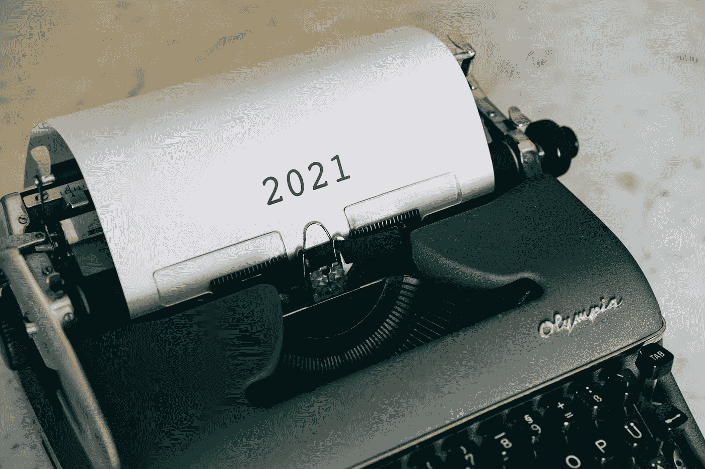

# 2021 年成为数据科学家要学什么

> 原文：<https://towardsdatascience.com/what-to-learn-to-become-a-data-scientist-in-2021-95970d4b3b17?source=collection_archive---------4----------------------->

## 以及为什么数据科学通才会胜出

马库斯·温克勒在 [Unsplash](https://unsplash.com/s/photos/2021?utm_source=unsplash&utm_medium=referral&utm_content=creditCopyText) 上的照片

几年前，当我开始学习数据科学时，大多数招聘广告都要求获得数学、统计学或类似学科的博士学位，或者至少是硕士学位。

在过去的几年里，事情发生了变化。随着机器学习库的发展，抽象出了算法背后的许多复杂性，并且认识到实际应用机器学习来解决商业问题需要一系列技能，这些技能通常不是通过单独的学术研究获得的。公司现在雇用数据科学家是基于他们执行应用数据科学的能力，而不是研究能力。

在尽可能短的时间内为企业带来价值的应用数据科学需要非常实用的技能组合。此外，随着越来越多的公司将其数据和机器学习解决方案迁移到云，数据科学家了解与此相关的新工具和技术变得至关重要。

此外，我相信，数据科学家只研究数据建模，使用数据工程师收集的数据，然后将模型交给软件工程师团队投入生产的时代已经过去了。尤其是在亚马逊、脸书和谷歌等科技巨头之外。在大多数公司中，除了一些非常大的技术公司，这些团队要么没有可用的资源，要么没有在正确的时间调整优先事项。

> “有句谚语说，‘什么都懂，什么都不懂。’说到成为一名数据科学家，你需要有点像这样，但也许更好的说法是，**“多面手，精通一些。”"** [*布伦丹·蒂尔尼*](https://www.linkedin.com/in/brendantierney/) *，Oralytics 首席顾问。*

为了让数据科学家向企业交付最大价值，他们需要能够在整个模型开发生命周期中工作。至少具备开发数据管道、执行数据分析、机器学习、数学、统计学、数据工程、云计算和软件工程方面的工作知识。这意味着，随着我们迈向 2021 年，数据科学家通才是大多数企业的首选。

> “画面越大，潜在的人类贡献就越独特。我们最大的优势是与狭隘的专业化正好相反。是广泛融合的能力。”大卫·爱泼斯坦(David Epstein)，[为什么通才在专业化的世界里取得胜利](https://www.amazon.co.uk/dp/B07M6QPRRG/ref=dp-kindle-redirect?_encoding=UTF8&btkr=1)。

本文并没有涵盖 2021 年成为数据科学家所需的全部内容。相反，它涵盖了新老关键技能，在不久的将来，这些技能已经成为每个成功的数据科学家最基本的技能。

# 1.Python 3

仍然有一些情况下，数据科学家可能会使用 R，但一般来说，如果你现在正在做应用数据科学，那么 Python 将是最有价值的编程语言。

Python 3(最新版本)现在已经成为大多数应用程序的默认语言版本，因为大多数库在 2020 年 1 月 1 日放弃了对 Python 2 的支持。如果你现在正在学习数据科学的 Python，选择一门与这个版本兼容的课程是很重要的。

你需要很好地理解这门语言的基本语法，以及如何编写函数、循环和模块。熟悉 Python 面向对象和函数式编程，能够开发、执行和调试程序。

# 2.熊猫

Pandas 仍然是数据操作、处理和分析的头号 Python 库。在 2021 年，这仍然是数据科学家最重要的技能之一。

数据是任何数据科学项目的核心，Pandas 是一个工具，它将使您能够提取、清理、处理数据并从中获得洞察力。如今，大多数机器学习库也普遍将熊猫数据帧作为标准输入。

# **3。SQL 和 NoSQL**

SQL 自 20 世纪 70 年代就已经存在，但它仍然是数据科学家最重要和最需要的技能之一。绝大多数企业使用关系数据库作为他们的分析数据存储，而作为一名数据科学家，SQL 是向你提供这些数据的工具。

NoSQL(“不仅是 SQL”)是不将数据存储为关系表的数据库，而是将数据存储为键值对、宽列或图形。示例 NoSQL 数据库包括 Google Cloud Bigtable 和 Amazon DynamoDB。

随着公司收集的数据量增加，非结构化数据在机器学习模型中的使用越来越频繁，组织正在转向 NoSQL 数据库，作为传统数据仓库的补充或替代。这种趋势可能会持续到 2021 年，作为一名数据科学家，至少对如何以这种形式与数据交互有一个基本的了解是很重要的。

# 4.云

根据 O'reilly 在今年 1 月发布的一份名为[‘2020 年云的采用’](https://www.oreilly.com/radar/cloud-adoption-in-2020/)的报告，88%的组织目前正在使用某种形式的云基础设施。新冠肺炎的影响很可能进一步加速了这种采用。

> “乍一看，云的使用似乎势不可挡。超过 88%的受访者以这样或那样的形式使用云。大多数受访组织还预计在未来 12 个月内使用量会增加。”由[罗杰·马古拉](https://www.oreilly.com/people/roger-magoulas/)和[史蒂夫·斯沃耶](https://www.oreilly.com/people/steve-swoyer/)撰写。

在企业的其他领域使用云通常与基于云的数据存储、分析和机器学习解决方案密切相关。谷歌云平台、亚马逊网络服务和微软 Azure 等主要云提供商正在快速开发用于培训、部署和服务机器学习模型的工具。

作为一名在 2021 年及以后工作的数据科学家，你很可能会处理存储在基于云的数据库中的数据，如谷歌 BigQuery，并开发基于云的机器学习模型。随着我们进入 2021 年，这方面的经验和技能可能会非常受欢迎。

# 5.气流

Apache Airflow ，一个开源的工作流管理工具，正迅速被许多企业用于 ETL 过程和机器学习管道的管理。谷歌和 Slack 等许多大型科技公司都在使用它，谷歌甚至在这个项目的基础上构建了他们的 [cloud composer](https://cloud.google.com/composer/docs/concepts/overview) 工具。

我注意到，在招聘广告中，气流越来越多地被作为数据科学家需要的技能。正如本文开头提到的，我认为数据科学家能够为分析和机器学习建立和管理自己的数据管道将变得更加重要。气流越来越受欢迎，至少在短期内可能会继续，作为一个开源工具，肯定是每个初露头角的数据科学家都应该学习的东西。

# 6.软件工程

数据科学代码传统上是混乱的，并不总是经过良好的测试，并且缺乏对样式约定的遵守。这对于初始数据探索和快速分析来说很好，但当涉及到将机器学习模型投入生产时，数据科学家需要对软件工程原理有很好的理解。

如果你计划成为一名数据科学家，你很可能要么自己将模型投入生产，要么至少大量参与这个过程。因此，在你从事的任何学习中，涵盖以下技能是至关重要的。

*   代码约定，比如 [PEP 8 Python 风格指南](https://www.python.org/dev/peps/pep-0008/#introduction)。
*   单元测试。
*   版本控制，例如 Github。
*   依赖性和虚拟环境。
*   集装箱，如码头工人。

在这篇文章中，我想强调在数据科学家所需技能方面出现的一些关键趋势。这些见解是从查看当前数据科学招聘广告、我自己作为数据科学家的工作经验以及阅读涵盖该领域未来趋势的文章中收集的。

这并不是一份详尽的清单，要成为一名成功的数据科学家，当然还需要更多的技能和经验。然而，在这篇文章中，我想涵盖一些最重要的技能，这些技能很可能在未来的一年中被需要。

如果你正在学习成为一名数据科学家，为了获得你应该学习的更全面的技能列表，我写了一系列文章给出了完整的学习路线图。下面是它们的链接。

 [## 编程技能，学习数据科学的完整路线图—第 1 部分

### 数据科学编程技能的完整指南，包括免费学习资源的链接。

medium.com](https://medium.com/vickdata/programming-skills-a-complete-roadmap-for-learning-data-science-part-1-7913b289751b)  [## 数据分析，学习数据科学的完整路线图—第 2 部分

### 我的学习数据科学的完整路线图的第二部分着眼于数据所需的重要技能…

medium.com](https://medium.com/vickdata/data-analysis-a-complete-roadmap-for-learning-data-science-part-2-25f8d1abc1fd)  [## 数学与统计，学习数据科学的完整路线图—第 3 部分

### 数据科学的数学和统计学中的关键概念，以及在哪里学习它们。

medium.com](https://medium.com/vickdata/maths-and-statistics-a-complete-roadmap-for-learning-data-science-part-3-e1ec585195cf) 

感谢阅读！

[**我每月发一份简讯，如果你想加入请通过这个链接注册。期待成为您学习旅程的一部分！**](https://mailchi.mp/ce8ccd91d6d5/datacademy-signup)