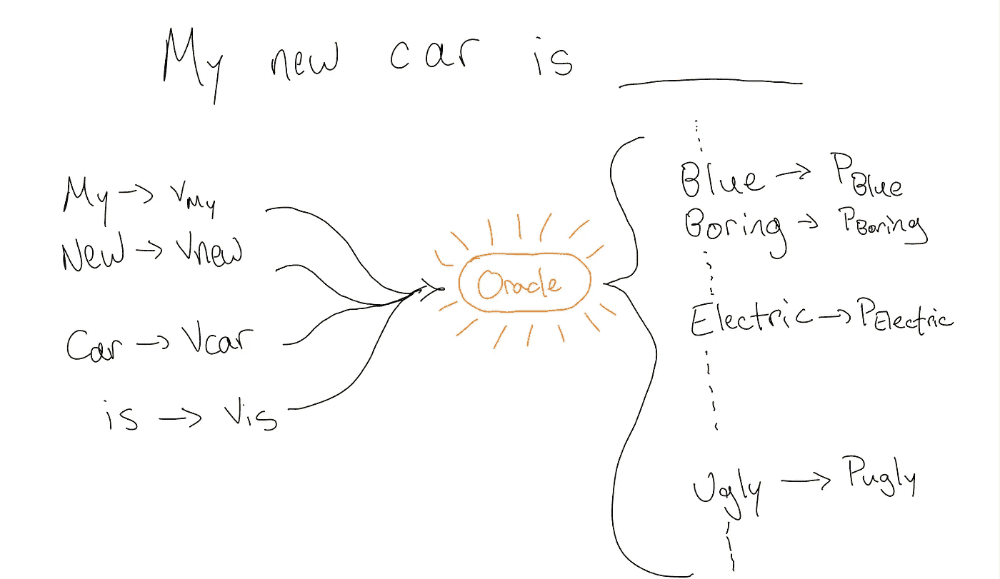

# 接下来看什么？一个基于 NLP 思想的基本推荐系统。

> 原文：<https://towardsdatascience.com/what-to-watch-next-a-basic-recommender-system-using-ideas-from-nlp-c0a1338fa514?source=collection_archive---------62----------------------->

## 大数据时代如何做好推荐？

恭喜你！你刚刚被聘为网飞的新首席技术官。你的主要任务？增加 1.8 亿用户的参与度和观看时间。您的团队认为您可以通过个性化每个用户的主屏幕来实现这一点。这就提出了一个自然的问题:给定一个用户过去的观看偏好，你应该突出显示哪些节目让他们接下来观看？

这个问题的关键在于设计一个推荐系统。设计这样的系统是一个价值百万美元的行业:[说真的](https://en.wikipedia.org/wiki/Netflix_Prize)。无论是[亚马逊推荐你下一次](https://www.amazon.science/the-history-of-amazons-recommendation-algorithm)应该购买哪种产品，还是 [Tinder 向你展示你所在地区最兼容的单曲](https://mlconf.com/sessions/personalized-user-recommendations-at-tinder-the-t/)，现代公司投入大量的时间、金钱和精力来创建越来越精确的推荐系统。

在本文中，我们将讨论如何使用自然语言处理(NLP)的思想创建一个基本的推荐系统。这个*并不是*对推荐系统的详尽讨论，我们描述的算法*也不一定是创建这样一个系统的最佳方式。但无论如何都会很有趣的！*

首先:什么是 NLP？自然语言处理是语言学的一个分支，旨在将人类语言分解成计算机可以理解的信息。这就是谷歌如何让你使用 Smart Compose 更快地发送电子邮件，或者一些金融公司如何使用社交媒体情绪来影响他们的交易算法。NLP 的一个关键思想是 [word2vec](https://en.wikipedia.org/wiki/Word2vec) :这是一种将单词嵌入高维向量空间的方法，其方式是“相似”单词映射到“相似”向量。

这样做的第一步是“一键”嵌入。让我们以英语中大约 20 万个单词为例。我们可以按字母顺序排列这些单词。这些单词的一键嵌入将把字典中的第 *i* 个单词映射到向量(0，…，0，1，0，…，0)，该向量在第 *i* 个条目中只有一个 1，在其他地方有 199，999 个 0。

不幸的是，这种嵌入太天真了。首先，它将人类语言嵌入到 20 万维向量空间中。这使得计算[T5 非常慢](https://en.wikipedia.org/wiki/Curse_of_dimensionality)。记住:在一天结束的时候，我们*需要*用这些信息进行计算，使其变得有用！第二，它没有保留任何意义上的相似性。例如:在 NLP 中，我们希望两个同义词，比如“happy”和“joyy”，映射到相似的向量。同样重要的是，反义词如“快乐”和“悲伤”需要映射到不同的向量。我们通常通过两个向量的[余弦相似度](https://en.wikipedia.org/wiki/Cosine_similarity)来衡量两个向量的相似度，余弦相似度与两个向量的点积有关。但是一键嵌入中的任意两个字映射到正交向量，点积为零！

将单词嵌入向量空间的一个更好的方法依赖于在相似的上下文中使用相似的单词的想法。正如一句古老的谚语所说，“告诉我你的朋友，我会告诉你你是谁。”

一种精确的方法是由谷歌工程师托马斯·米科洛夫、程凯、格雷格·科拉多和杰弗里·迪安在 2013 年提出的 [*连续单词袋*](/nlp-101-word2vec-skip-gram-and-cbow-93512ee24314)*【CBOW】*方法(我们将使用一种轻微的“不对称”变体，但想法基本相同)。想法如下。想象一下，一次只允许你读五个单词。所以要读“我的新车是蓝色的，速度很快”这句话，我们必须读三大块:“我的新车是蓝色的”，“新车是蓝色的，而且”，“车是蓝色的，速度很快。”现在玩下面的游戏:给定一个组块的前四个单词，试着猜最后一个单词。

很明显，我们可以看到上下文线索在这个游戏中告诉了我们很多；例如，“我的新车是 __”这一大块肯定不会以“汉堡包”这个词结尾。更微妙的是，它也可能不以“丑陋”、“无聊”或“低效”结尾。

话虽如此，背景只能让我们到此为止。“时尚”、“电动”或“蓝色”这些词以及许多其他形容词都有助于完成这一大块。我们不能指望用一个独特的单词来结束这一大块，但如果我们足够努力，我们可以提供一个类似的单词类别，即“描述新车的单词”，每个单词都可以结束这个短语。

CBOW 方法使用这种思想来产生如下的单词向量。假设我们词典中的每个单词都映射到一个 50 维向量。最初这些向量是完全随机的。我们所知道的是，单词“car”与一个由 50 个实数组成的向量 *v_car = (v_1，…，v_50)* 相关联，还有“new”、“blue”以及其他我们关心的单词。

现在假设我们有一个先知。一个神奇的、无所不知的机器，它让你输入随机单词向量列表和一个由四个特殊单词组成的“包”(组块中的前四个单词)。基于这些信息，oracle 会输出您的语言中单词的概率分布。甲骨文给每个单词分配一个 0 到 1 之间的数字，告诉你这个特定单词完成你的组块的可能性有多大。

图片由作者提供

如何利用这个甲骨文获得更好的词向量？以大量的英语文本为例。流行的选择是跨越几十年的新闻故事集，或者在维基百科上找到的超过 600 万篇文章。然后，我们告诉计算机一个接一个地扫描我们的文本语料库。对于扫描的每个块，我们*迭代更新每个单词向量* *，以最大化我们目前所看到的可能性*。

文字中发生了什么？计算机首先给英语中的每个单词分配“随机”相似性。每当它扫描一个文本块，比如说“我的新车是蓝色的”，它就会更新文本块中的单词，使它们彼此“更加相似”。因此，从上面的选择中，它干扰了“蓝色”单词向量，使其更类似于“我的”、“新的”、“汽车”和“是”单词向量。在对成千上万的数据块做了这样的处理后，计算机在我们的空间中改变了向量，这样相似的单词(希望如此！)映射到相似的向量。

从技术角度来看，这引发了许多问题。例如:我们在哪里可以获得这样的神谕？我们如何在每次迭代训练后扰动空间中的单词向量？现在我将传递一些细节，但是对于那些感兴趣的人，我将指出一些参考文献。使用的甲骨文通常被认为是感兴趣的单词向量的点积的 [softmax](https://en.wikipedia.org/wiki/Softmax_function) (因此出现余弦相似度:与感兴趣的向量的点积越高，softmax 概率越大)。当然，也可以使用其他相关函数。至于第二个问题，上面描述的方法暗示了一个[随机梯度下降](https://en.wikipedia.org/wiki/Stochastic_gradient_descent)。换句话说，以这样一种方式扰动向量，我们可以最快地移动到全局最小值。在实践中，人们通常使用小批量下降来降低噪声的影响，但实施细节在这里也是无关紧要的。

连续单词袋方法和它的表亲，跳格模型，近年来取得了巨大的成功。首先，他们将单词映射到 50 维的向量，而不是一键编码的 200，000 维向量。这当然属于现代计算的范畴。而且最重要的是，*这些方法在实际任务中起作用*。

作为一个惊人的壮举，[人们可以用这些模型让计算机解决基本的类比问题](https://aclweb.org/aclwiki/Analogy_(State_of_the_art))。例如:如果我让你填写类比“男人是国王，就像女人是 ___”，你可能会填写“女王”也可以使用自然语言处理通过搜索同时与“国王”和“女人”最相似而与“男人”最不相似的单词来解决这个问题换句话说，在经过适当训练的模型中，你可以从“国王”的向量中减去“男人”的向量，然后加上“女人”的向量，最接近这个结果的向量将对应于“女王”。是不是很神奇？！

好了，回到我们最初的问题。一个人如何向网飞的用户推荐一部电影，基于他们的观看历史？根据前面的讨论，也许人们可以猜出我们要去哪里。让我们使用“连续电影包”模型。也就是说，每部电影将被分配一个 50 维向量。我们将扫描用户观看数据的“窗口”,在每一步，我们都将尝试从前四部电影中预测第五部电影。在每一步训练后，我们都会更新电影向量，以使我们的“softmax oracle”更好地适应现实。例如:扫描窗口“风中奇缘、丛林之书、灰姑娘、幻想曲、美女与野兽”将导致我们的系统将“美女与野兽”向量移近“风中奇缘”，等等。

在对数以百万计的数据点做了这个过程之后，我们的推荐系统有了(希望如此！)将迪士尼电影拉近距离，将喜剧从恐怖电影中分离出来，并将史泰龙电影与查克·诺里斯电影归为一类。结果呢？给定已经看过几部电影的新观众，人们可以推荐他们接下来可能喜欢观看的不同电影(或一组电影)。

正如开始提到的，这是一个非常粗略的推荐系统，任何现代公司都可以使用。例如:为什么我们只关心前 4 部电影，而不是用户的整个观看历史？为什么不采用用户对电影的评分，而不是简单地看他们是否看了什么？当然，这些是*应该*整合的数据点，以便形成更多更准确的建议。正如[贝尔、科伦和沃林斯基的百万美元大奖推荐系统](https://www.netflixprize.com/assets/ProgressPrize2007_KorBell.pdf)中所述，“当混合多个预测器时，预测准确性得到了显著提高。我们的经验是，大部分的努力应该集中在衍生实质上不同的方法上，而不是改进单一的技术。因此，我们的解决方案是许多方法的集合。”换句话说，仅来自 NLP 的想法不会给出完美的推荐。但是它们确实提供了一个有趣的起点！

鉴于这篇文章的性质，我肯定必须以提供相关阅读的进一步建议作为结束。如果你对推荐系统感兴趣，你可以看看网飞自己关于这个主题的技术博客。如果你对自然语言处理的技术方面感兴趣，[去看看克里斯·曼宁关于这个话题的 CS 224 课程，](http://web.stanford.edu/class/cs224n/)，该课程每年在斯坦福大学讲授，并向公众开放。对于那些认真的读者来说，浏览[关于这个话题的一篇原创文章是不会错的。](https://arxiv.org/abs/1301.3781)