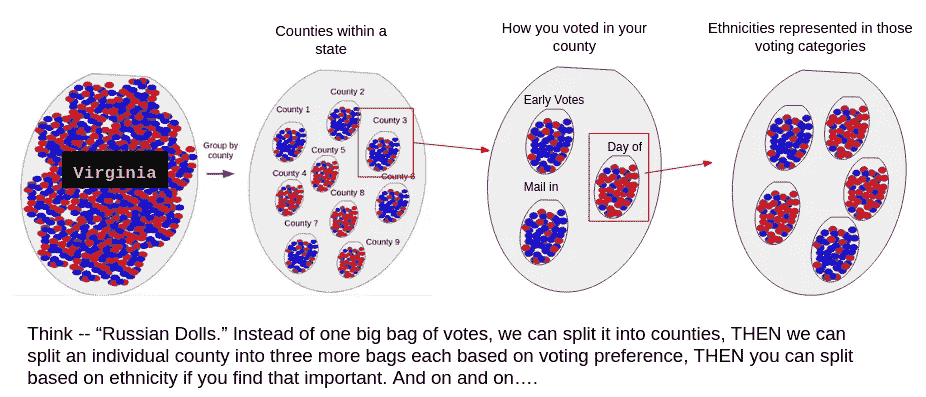

# 摇摆州为什么花了这么长时间？

> 原文：<https://towardsdatascience.com/what-took-so-long-in-the-swing-states-c7ee8d4eb778?source=collection_archive---------54----------------------->

## 善待统计学家，他们正在尽最大努力

图片来源:[约翰尼·科恩](https://unsplash.com/photos/sxzuj6npVGU)

你可能已经注意到了上周选举结果出来后的一个特殊趋势。事实上，如果你像我一样，你不仅会注意到它…你还会痴迷地点击浏览器上的刷新，不相信结果页面上方的“更新于{time}”消息。

我要说的是，在周二晚上，唐纳德·特朗普似乎几乎肯定会在 4 年内继续担任我们的总统。他基本上在所有的战场州都取得了胜利，而在那些已经打了电话的州却打成平手。但出于某种原因，新闻站没有宣布任何一方的胜利。为什么不呢？

我们看到[许多州只需要几张选票](/calling-elections-early-fake-news-or-statistics-dd2e8cc196c5)就能做出可靠的猜测。好吧，好吧……有些州打破了这种模式，走上了不同的趋势。然而，即使在像弗吉尼亚州的 T4 这样的州，即使拜登落后 20%，统计学家也能正确地猜出获胜者。

那么，为什么我们不能在密歇根州或宾夕法尼亚州运用同样的魔法呢？为什么我们要等 4 天才知道谁赢了？！

# 把弹珠拿出来

如果你读过我写的关于这次选举的其他帖子，你会很熟悉我对用弹珠解释统计数据的痴迷。如果没有，让我们快速重温一下。

我们首先假设，在选举日，人们不用去各个投票站、邮箱等地方，而是带着一个彩色弹球到他们州的首府来投票。这为“召唤”一个州需要多少张选票做了一个很好的初步估算

但后来我们意识到，媒体在报道他们进来的选票，一些县比其他人点的快。这给出了一个非常有偏见的投票样本，在弗吉尼亚州，给人的初步印象是特朗普将获得压倒性胜利(实际上拜登赢得了该州)。

好吧，我们了解到，我们可以通过将大袋的弹珠(该州的总票数)分成代表每个县的小袋来拯救我们心爱的袋子-o-marbles 模型。这是一个很好的"[二阶近似法](/what-in-the-world-happened-in-virginia-tuesday-night-117d13cd318b)"，有助于解释为什么状态可以这么早被调用。但我们在这次选举中看到的是，不仅县很重要，你如何选择投票也很重要(以及其他因素)。

# 哦，该死的！

在一个候选人可能会告诉他的支持者避免通过邮件投票的世界里，你可能会看到“通过邮件投票”的群体和“在选举日投票”的群体之间的巨大差异。

此外，我们可以假设不同的种族群体可能在一些县发挥关键作用，根据当年的投票人数来左右一个州。
事实上，你可以继续下去:性别、年龄组、首次投票者等等。选择这些选民中的较大比例可能会不自然地对你的样本产生偏见，并给你一个关于你的人口的不切实际的观点(以及整个选举)。

这些就是我们所说的“混淆变量”，我发现这是一个非常恰当的名字，用来形容那些让统计学家们困惑和夜不能寐的东西。他们的作用是推翻我们的假设，即在我们开始取样之前，大理石袋是“混合良好”的。如果不考虑它们，人们真的不知道发生了什么。

# 大理石世界的俄罗斯娃娃

那么这意味着什么呢？首先，这意味着肯定没有一群人在等待一定数量的选票后才能给州政府打电话(在撰写本文时，尽管有 99%的选票，佐治亚州仍未被打电话)。

相反，这意味着有一个团队试图找出在每个州、每个县、每个人口中值得关注的重要趋势。

例如，解释混杂变量的一个详尽的方法是回到我们用于各县的袋中袋方法。把它想象成一套俄罗斯娃娃。在一个州内，您选择分隔县，因为您认为人们会根据他们居住的地方进行不同的投票。然后，在县内，你假设某人投票的方式对他们投票给谁有影响。然后你可以继续在每个亚群体中讨论种族问题。一旦你对这些小群体的反应有所了解，你就可以预测整个州的最终统计结果。

作者图片

# 所有的模型都是错的，有些是有用的

请允许我重申，我对他们的过程并不知情。我只是一个和统计数字打交道的人。我们为伊利诺伊州和弗吉尼亚州做的工作假设我们有代表性的样本，并且我们知道每个县和州的选民总数。通过这种方式，我们能够对每个候选人的最坏和最好情况进行近似，并根据这些情况进行猜测。不幸的是，这些假设都不成立。然而，他们在这些其他情况下工作，因为误差幅度足够大，这样的不确定性被吸收(即一个候选人在该州赢得超过 5%)。

> 摇摆州是一个不同的故事…

一个摇摆州代表了一个几乎分裂的人口，这导致了如此激烈的竞争，有时不到一个百分点就能决定胜负。

# 两袋问题(尺寸问题)

我们有时会遇到没有先例的情况，因此极难预测。在这次选举中，大量的邮寄选票是我们从未经历过的，很难预测到底会有多少(即使是一周后！).

当宾夕法尼亚州统计了 100，000 多张选票并将他们的报告百分比从 89%减少到 88%时，这一点就很明显了(这是倒退！).更重要的是，一些州允许计票，即使他们晚了几个星期，只要他们在某个日期做了标记。在这种情况下，很难知道“选票中的邮件”有多大，即使你已经可以推断出大约 70%的邮件会支持某个候选人。

想象一下，如果一个州将选票分为亲自投票和邮寄投票，我们最终会得到两袋选票(我想我们已经没有“弹珠”了)。今年似乎发生的是，他们首先从“亲自”袋子里数出选票，一般来说，对袋子有多大有一个相当好的感觉。然而，对于第二个袋子，即使我们统计了足够的票数来了解里面的东西(假设是 65%的拜登)，我们可能也不知道这个袋子有多大。

# 假设的例子

如果“亲自”袋是 65%的特朗普，包含一百万张选票。那么，川普在第一轮计票中就会多获得 30 万张选票，我们可能不需要完成对[的计票就能知道这个](/calling-elections-early-fake-news-or-statistics-dd2e8cc196c5)。

现在,“邮件”袋给我们带来了麻烦，不是因为我们无法确定支持拜登的选票比例(可能很早就知道是 65%),而是因为我们不知道这个袋子有多大。每次我打开新闻，他们都在邮局或投票站“发现”更多的选票。这确实表明，我们还没有准备好这样的事情，因此车轮没有像处理“亲自”投票那样润滑良好。

所以我们不知道这个子集中是否有足够的选票来弥补拜登落后的 30 万张选票。所以我们只能继续数，直到我们对结果更有信心。

# 后果和风险评估

我想强调的是，我不在那里，所以我实际上不知道是什么真正导致了每个州的问题。但是我看到了和你们所有人一样的新闻报道，这是我对这个问题的看法，我觉得这可能会有所启发。

这实际上是我在本系列中介绍的模型对不确定性的风险承受能力。很难自信地宣布一个国家。在弗吉尼亚州运作良好的模式的内在缺陷在佐治亚州显露无遗。

> 统计学家…没穿衣服。

再加上做出“正确决定”的外部压力(比如对这位福克斯新闻频道分析师的调查)，你就会看到我们上周经历的情况。

对我来说，这足以让我相信每一张选票都很重要，但我想仍然会有一些疑问，特别是在看到一个国家可以这么快成立的情况下。这超出了本文的范围，但是我认为[从统计上来说，你的投票肯定是算数的](/how-swing-able-is-texas-anyways-83623f0911f3)。

## 如果你喜欢这篇文章

> 考虑鼓掌(或者 10？)所以 TDS 会更容易与他人分享

看看我关于选举的其他案例研究:

*   [伊利诺伊州](/calling-elections-early-fake-news-or-statistics-dd2e8cc196c5)(需要多少票才能举行选举)
*   弗吉尼亚(统计学家怎么知道拜登赢了，即使他输了 20%)
*   [德州](/how-swing-able-is-texas-anyways-83623f0911f3)(它到底有多能荡？)