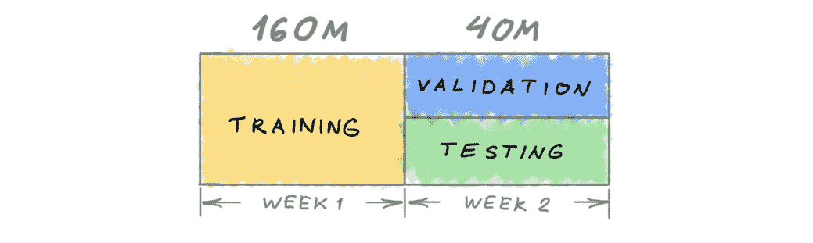
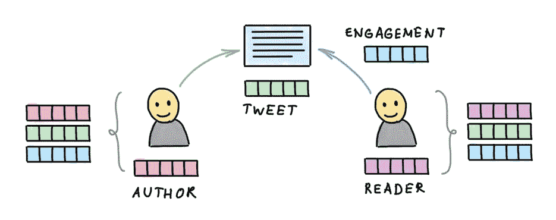

# Twitter 从 Recsys 2020 挑战赛中学到了什么

> 原文：<https://towardsdatascience.com/what-twitter-learned-from-the-recsys-2020-challenge-d3ae2f7ccf0f?source=collection_archive---------34----------------------->

## [理解大数据](https://towardsdatascience.com/tagged/making-sense-of-big-data)，2020 年推荐系统挑战

## 今年，Twitter 赞助了 [RecSys 2020 挑战赛](https://recsys-twitter.com/)，提供了大量的用户参与数据集。在本帖中，我们描述了获胜团队的挑战和见解。

*本文由来自 Twitter Cortex 的卢卡·贝利、阿波夫·夏尔马、·谢、、丹·谢伯勒、马克斯·汉斯迈尔和·施共同撰写。*

电子商务系统是现代社交网络和电子商务平台的重要组成部分。他们旨在最大限度地提高用户满意度以及其他关键业务目标。与此同时，科学界在构建和测试新模型以根据用户兴趣定制内容时，缺乏大规模的公共社交网络数据集。在过去的一年里，我们一直在努力解决这个问题。

Twitter 与 [RecSys conference](https://recsys.acm.org/recsys20/) 合作赞助 [2020 挑战赛](https://recsys-twitter.com/)。我们发布了一个由两周内的推文和用户参与组成的数据集，在两周内有 1.6 亿条公共推文用于培训，4000 万条公共推文用于验证和测试。

在这篇文章中，我们描述了由 Nvidia，Learner 和 Wantely 团队提交的数据集和三个获奖作品。我们试图对帮助获胜者取得成果的选择做出一般性的结论，特别是:

*   最重要的功能
*   特征选择和模型训练的实验速度极快
*   一般化的对抗性验证[1]
*   内容功能的使用
*   在神经网络上使用决策树

我们希望这些发现将对更广泛的研究社区有用，并启发推荐系统的未来研究方向。

挑战的参与者被要求预测用户参与四种互动中任何一种的概率:*喜欢*，*回复*，*转发*，以及*引用*推文。根据两个指标对提交的内容进行评估:相对于我们提供的简单基线的相对[交叉熵](https://en.wikipedia.org/wiki/Cross_entropy) (RCE)，以及精度-召回曲线下的[面积](https://en.wikipedia.org/wiki/Receiver_operating_characteristic#Area_under_the_curve) (PR-AUC)。

一段时间内训练、测试和验证数据集的表示。

特别注意保持数据集与推特平台同步。该数据集反映了平台的变化，例如，当一条推文被删除时，用户将其个人资料设为私有，或者将其完全删除。提交的内容也会被重新评估，排行榜也会根据重新计算的指标进行更新[2]。

数据集要素的表示。它们分为用户功能(针对作者和读者)、推文功能和参与功能。

今年的挑战赛竞争尤为激烈，注册用户超过 1000 人。参与者在整个挑战过程中积极提交解决方案，并在挑战的第一阶段修改其团队组成(根据提交指南)。最后阶段有 20 个竞争者，平均团队规模为 4 人。此外，团队开发了 127 种不同的方法试图赢得挑战。在整个挑战过程中，参与者的活跃度一直很高，在最后几天，当参与者完善他们的提交材料时，活跃度达到顶峰。最终结果出现在[排行榜](https://recsys-twitter.com/final_leaderboard/results)上。

伴随而来的[RecSys Challenge 2020 Workshop](https://recsys.acm.org/recsys20/challenge-workshop/)共收到 12 篇论文，由计划委员会评审。其中九篇论文被接受。

# 第一名:英伟达

**面向推荐系统的 GPU 加速特征工程和训练。** Nvidia 的论文[3]描述了训练 [xgboost](https://xgboost.readthedocs.io/) 模型来预测每个交互事件。总的重点是为这个模型创建有用的特性。它强调了快速特征提取和模型训练是该方法成功的关键。本文在附录中列出了 4 个模型中每个模型的 15 个最有用的特性。

从数据集中快速提取特征并重新训练是获胜者和亚军之间的关键区别。功能工程管道和培训管道运行时间都不到一分钟。除此之外，*目标编码*(均值编码+加法平滑)用于不同的分类特征和特征组合，包括这些组合的目标均值。作者还从推文的内容中创建分类特征(例如，两个最流行的词和两个最不流行的词)。*针对特征重要性和选择的对抗性验证*用于通过选择更一般化的特征来防止过度拟合。基于树的模型的集成方法用于产生最终模型。

# 第二名:学习者

**用深度语言模型预测 Twitter 参与度。**学习者方法[4]将深度学习与梯度增强决策树(GBDT)相结合，并专注于创建不同的功能。作者使用启发式方法设计了 467 个功能，并使用[伯特](https://en.wikipedia.org/wiki/BERT_(language_model))和 [XLM-R](https://arxiv.org/abs/1911.02116) 创建了推文的文本表示(使用了目标推文文本和最近参与推文的文本)。

这个条目和其他条目之间的关键区别是使用了预先训练的自然语言处理(NLP)模型 BERT 和 XLM-R 以及微调。第一层微调是以无人监管的方式完成的。接下来，将语言模型与其他特征相结合，以在监督设置中进行微调。该模型是一个多层感知(MLP ),有四个头，每个头对应一种参与类型。该论文还使用注意力来创建用户过去十次交互的嵌入。将注意力和目标 tweet 作为关键，将这些嵌入结合起来。此外，使用启发式特征，例如参与用户、推特创建者、推特特征和用户-创建者交互特征的不同表示。与其他条目一样，本文使用 [xgboost](https://xgboost.readthedocs.io/) 进行特征工程和选择，并将 [Yeo-Johnson 变换](https://en.wikipedia.org/wiki/Power_transform#Yeo%E2%80%93Johnson_transformation)应用于分类特征和非标准化连续特征。

# 第三名:肆意

用于预测多种类型推特参与度的堆叠集成模型。 Wantely 的提交材料[5]提出了一种预测推特参与度的两阶段方法。第一级分类器是轻量级的，并且仅使用概括不同目标(例如，转发等)的特征，并且具有相似的训练/测试准确度。第二级分类器使用轻量级分类器的输出作为特征以及特定于目标的特征。

上游可归纳模型生成下游模型使用的特征。通过这样做，作者认为，每种参与类型的下游模型都能够通过消耗通用上游模型的预测，从所有其他参与的数据中受益。除此之外，本文还通过对抗验证*、*直接评估训练和测试数据集之间的特性分布差距，来确定哪些特性是可概括的，如 Nvidia 条目中所示。

T 以下是所有提交材料中的许多共同见解。我们强调主要主题:

**获奖机型中使用的有用功能——目标编码为王。**首先，*目标编码*(用目标变量的均值代替一个分类变量)让问题更简单。它同时用于用户和作者 id，从而对用户的平均参与度进行编码。第二，大量的[特性交叉](https://developers.google.com/machine-learning/crash-course/feature-crosses/video-lecture)被使用【6】。

**特征选择的快速实验。**快速测试多种假设的能力一直是数据科学竞赛不可或缺的一部分，并再次证明了这一挑战的决定性。Nvidia 团队能够在 GPU 上运行整个管道。这使得他们训练一个模型(包括特征工程)只需要 2 分 18 秒，而在 CPU 上则需要几个小时。

**用对抗性验证应对过度拟合。**竞争对手使用的一种常见技术是构建一个鉴别器来预测训练集和测试/验证集之间的差异。基于在模型的特征选择中使用的重要性分数，通过移除最重要的特征，可以帮助模型更好地概括。这项技术有助于避免过度拟合训练数据。

**内容特性的使用。**今年的数据集与去年的一个显著区别是我们提供的内容特征。在三篇获奖论文中，有两篇论文对 BERT 的内容特性进行了复杂的运用。NLP 的深度学习已经证明了它对推荐系统的有用性，尽管我们认为在这个领域还有更多改进的空间。

**决策树 vs 深度学习。**[梯度增强决策树](/machine-learning-part-18-boosting-algorithms-gradient-boosting-in-python-ef5ae6965be4) (GBDT)的一个显著优势是，不需要标准化和计算出单个特征的规模。这有助于加快所有获奖论文的迭代速度。

在计算机视觉和 NLP 等领域，深度学习模型通过利用 [CNN](https://en.wikipedia.org/wiki/Convolutional_neural_network) s 和 transformers 展示了令人印象深刻的进步。基于这一挑战的结果，我们仍然不明白什么是推荐系统中深度学习的良好架构。我们呼吁研究社区共同寻找推荐系统的最佳深度学习架构。

我们还注意到，虽然我们只评估了提交的模型性能，但我们的生产系统中还有许多其他约束。延迟对我们来说是一个大问题:模型需要在毫秒内对推文进行评分。在这种情况下，需要仔细检查集合方法的使用。整体中每一步的附加延迟可能导致它们对于我们的目的来说太慢。

我们感谢所有参与者和我们的同事，是他们让这项挑战成为可能。我们相信，发布大规模数据集将有助于在推荐系统领域取得新的进展。Twitter 现在比以往任何时候都更致力于帮助外部研究工作，最近为学术研究人员发布了[新的 API 端点](https://developer.twitter.com/en/use-cases/academic-researchers)，以帮助促进进一步的探索和合作。

[1] J. Pan 等.[针对用户导向自动化系统中概念漂移问题的对抗性验证方法](https://arxiv.org/pdf/2004.03045.pdf) (2020) arXiv:2004.03045 .引入了对抗性验证，这是一种被多个参与者使用的强大技术。

[2] L. Belli 等人[Twitter 主页时间线上的隐私感知推荐系统挑战](https://arxiv.org/pdf/2004.13715.pdf) (2020) arXiv:2004.13715 提供了关于挑战和数据集的详细信息。

[3] B. Schifferer 等人，[面向推荐系统的 GPU 加速特征工程与训练](https://github.com/rapidsai/deeplearning/blob/main/RecSys2020/RecSysChallenge2020.pdf) (2020)。继续。推荐系统挑战 2020。Nvidia 的提交，也在他们的[博客文章](https://medium.com/rapids-ai/winning-solution-of-recsys2020-challenge-gpu-accelerated-feature-engineering-and-training-for-cd67c5a87b1f)中描述。

[4] M. Volkovs 等人，用深度语言模型预测 Twitter 参与度(2020)。继续。推荐系统挑战 2020。学习者的提交。

[5] S .戈达等人，预测多种类型推特参与的堆叠集成模型(2020)。继续。推荐系统挑战 2020。万特利的屈服。

[6]在 [Nvidia 论文](https://github.com/rapidsai/deeplearning/blob/main/RecSys2020/RecSysChallenge2020.pdf)的附录中提供了对不同目标具有重要性的功能的完整列表，如转发/回复。

*[*RecSys 挑战赛*](https://recsys.acm.org/recsys20/challenge/) *由 Nazareno Andrade、Walter Anelli、Amra、Jessie Smith、Gabriele Sottocornola 组织，Luca Belli、Michael Bronstein、Alexandre Lung Yut Fong、Sofia Ira Ktena、Frank Portman、Alykhan Tejani、Xie、和 Shi 对数据集做出了贡献。**

**见我的* [*其他帖子*](https://towardsdatascience.com/graph-deep-learning/home) *上媒，或者关注我的* [*推特*](https://twitter.com/mmbronstein) *。**