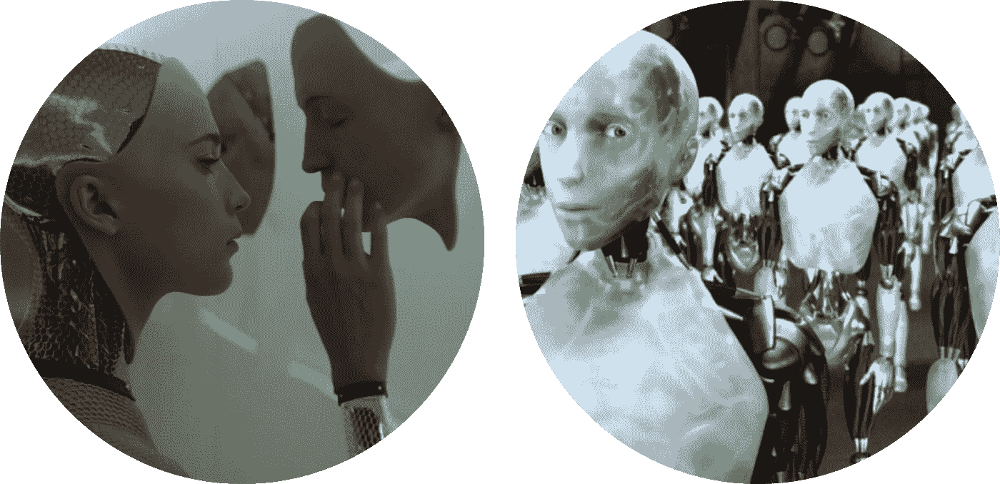
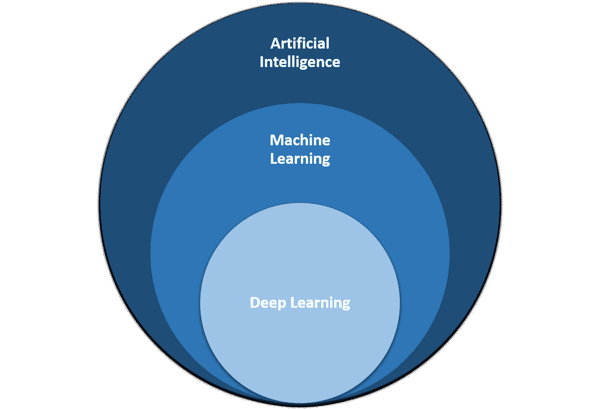
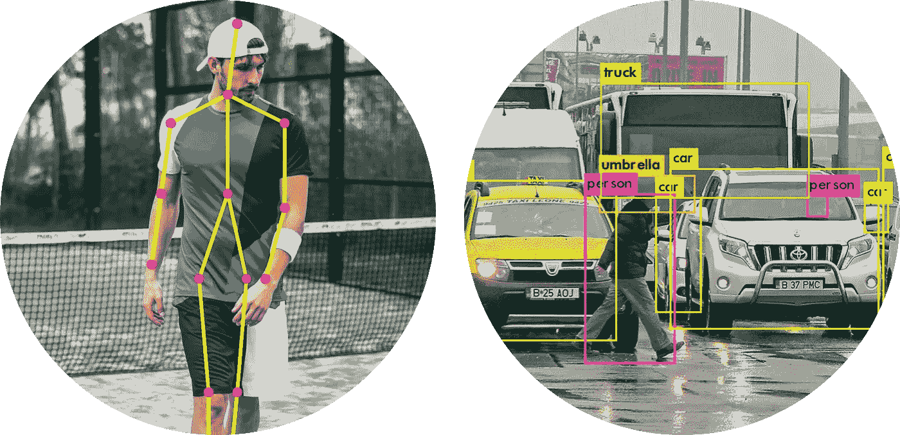
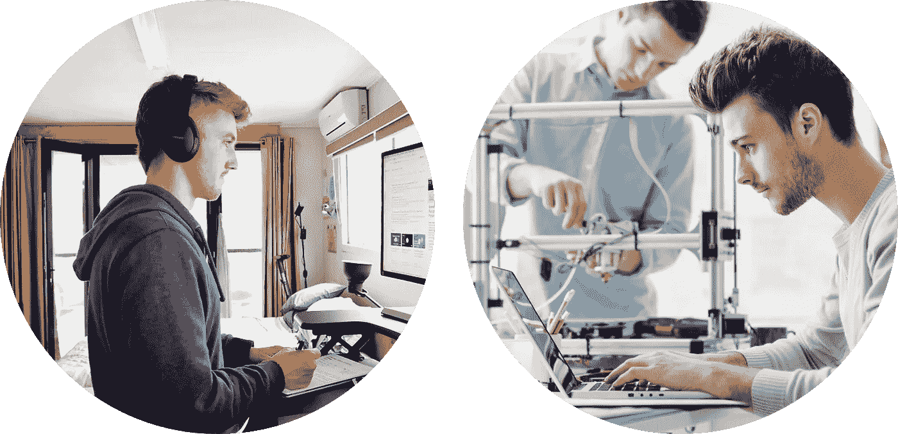

# 你是什么类型的人工智能爱好者？

> 原文：<https://towardsdatascience.com/what-type-of-artificial-intelligence-enthusiast-are-you-32ca88c01a7e?source=collection_archive---------21----------------------->

## 根据人工智能领域的常用术语，衡量你在人工智能爱好者等级中的排名。列出的术语你知道多少？你是好奇爱好者还是实干家？

没有人对人工智能或机器学习的术语感到陌生。

普通大众可能会将 AI 和 ML 与自动驾驶汽车、机器人或无人机联系在一起。

技术专家将术语 AI 和 ML 与计算机视觉、自然语言处理、对象检测等联系起来。

这篇文章旨在提供一些在这个领域中使用的传统人工智能和人工智能术语的知识。同时，说明什么类型的人会知道所列的术语。

> **免责声明** : **不要用本文的内容来衡量你在人工智能领域的专业知识。概述的水平只是为了参与和娱乐的目的。**

*我们走吧。*

# 好奇者(1 级)

好奇者看过一些流行的科幻电影(IRobot，前玛奇纳),可能会就普通的人工智能进行一次体面的对话。

好奇者对人工智能的未来有一两个看法。他们准备就这个话题进行长时间的讨论。

> 好奇发烧友是醒了 ***。***

左:[前玛奇纳](https://en.wikipedia.org/wiki/Ex_Machina_(film))。右:[我，机器人](https://en.wikipedia.org/wiki/I,_Robot_(film))

好奇的发烧友知道下面这些术语——你是如何匹配的？

*   **人工智能:**这是指存在于机器和程序中的类人智能。这个术语概括了机器执行和完成人类智能任务的能力。
*   **机器学习**:人工智能的子集。专门程序从提供的训练数据模式中获取知识的过程。程序获得的知识可以转移到与程序训练的数据相关的任务上进行推理。
*   **深度学习**:机器学习的一个子集，算法利用几层神经网络从输入数据中提取更丰富的特征。深度学习技术的例子有[卷积神经网络(CNN)](https://en.wikipedia.org/wiki/Convolutional_neural_network) 。
*   **计算机视觉**:*‘计算机怎么看’*。计算机视觉涉及处理数字图像和视频，以推断出对这些图像和视频中的内容的一些理解。
*   **自然语言处理**:’*计算机如何理解我们*。一个专门的领域，专注于在系统和程序中实现语言理解范例和模型，以通过语言实现并行的机器与人的交互。

里士满·阿拉克的《人工智能机器和深度学习的层次》

# 勇敢者(等级 2)

勇敢的人不只是阅读关于人工智能的新闻文章和媒体帖子。

勇敢者深入兔子洞，探索人工智能系统用来完成特定任务的技术。

他们被认为*勇敢*，因为他们愿意为人工智能领域及其子领域奉献更多的时间。他们是你的学者、学生和研究人员。

> 勇敢的企业家是认真的。

左:姿态估计。右图:物体检测

*   **人脸检测**:这个术语指的是实现可以自动识别和分类图像和视频中人脸的系统的任务。面部检测存在于与面部识别、摄影和动作捕捉相关联的应用中。
*   **目标检测**:作为计算机视觉任务的目标检测被定义为从图像或序列图像(视频)中的特定类别中识别感兴趣的目标的存在。
*   **姿势估计**:从提供的数字资产，如图像、视频或图像序列中推断身体主要关节位置的过程。通过几种计算机视觉技术使得姿态估计成为可能，姿态估计的形式存在于诸如动作识别、人类交互、虚拟现实和 3d 图形游戏的资产创建、机器人等应用中
*   **物体识别:**识别与 a 类目标物体相关的过程。对象识别和检测是具有相似结果和实现方法的技术，尽管在各种系统和算法中识别过程先于检测步骤。
*   **运动分析:**运动分析是对物体的运动、移动或轨迹的研究。
*   **运动检测**:运动检测是对包含运动物体的图像进行图像处理的过程，该图像处理技术能够通过差分方法或背景分割来跟踪运动。通过丢弃图像的静止部分来提取图像的运动部分，以获得运动部分。
*   **跟踪:**这是一种识别、检测和跟踪一段时间内图像序列或视频中感兴趣的对象的方法。系统内跟踪的应用存在于许多监控摄像机和交通监控设备中。
*   **迁移学习**:重用从解决问题中获得的知识，并将获得的知识应用于相关但独立的问题的方法

# 实干家(第三级)

实践者不仅知道嵌入式机器学习技术，而且还会实施它们。

参与者具备至少两种编程语言的中级知识、足够的数学技能和一些实用的硬件知识。

行为者有一个工作头衔，如机器学习工程师、数据科学家、数据工程师、机器人专家，以及类似的角色。

> 实干家是务实的。

左:[丹尼尔·伯克](https://medium.com/u/dbc019e228f5?source=post_page-----32ca88c01a7e--------------------------------)。右图:硬件工程师

*   **尺度不变特征变换(SIFT)** :一种计算机视觉算法，识别并封装图像内局部兴趣点(特征)的信息，根据提取的特征描述图像内的物体。
*   **区域卷积神经网络** **(RCNN)** :解决物体检测和分割的深度学习方法。RCNN 利用选择性搜索算法来建议图像中的感兴趣区域，然后使用卷积神经网络来检测建议区域中感兴趣对象的存在。
*   **你只看一次(YOLO)** :采用神经网络架构的一步式物体检测过程。YOLO 通过在图像上覆盖网格来工作，其中每个单元负责计算网格中对象存在/类别的概率，并对识别的对象应用边界框。
*   **优化算法**:执行预定次数的算法，用于寻找问题的最优解，在数学术语中，这些“问题”被称为函数。
*   **梯度下降**:这是一种优化算法，用于通过计算梯度值来寻找降低成本函数的值，梯度值用于在寻找成本函数局部最小值的每一步选择值。梯度的负值用于寻找局部最小值。
*   **成本函数**:这是一种量化机器学习模型执行“有多好”的方法。量化是基于一组涉及参数值的输入的输出(成本)。参数值用于估计预测值，而“成本”是预测值和实际值之间的差异。
*   **全局最小值**:这是位于成本函数整个域内的最小参数值。您可能会遇到局部最小值，它是指位于成本函数的设定范围内的最低参数值。
*   **收敛**:这描述了在机器学习环境中使用时向最佳参数值或全局最小值移动的概念
*   **相关性**:在机器学习中，这是指两个变量或特征之间的统计关系。该关系描述了两个变量之间的潜在关联。两个变量之间的相关性可以是负的，也可以是正的。负相关表示当一个变量增加时，另一个变量显示减少的模式。正相关是指当相关变量增加时，变量也增加。正相关的一个例子是，一个地区的房价会因为学校数量的增加而上涨。
*   **协方差**:指两个变量线性相关的程度。
*   **支持向量机:**一种监督学习模型，常用于以分类为重点的机器学习程序中。当提供训练集时，SVM 可以将训练集中的每个数据点分类到不同的类别。SVM 算法最优地将训练集中的每个点分离到一个关联类。因此，SVM 模型能够基于从训练数据中学习到的知识将新的数据点关联到关联的类。
*   **真阳性**:指训练好的模型的分类结果，预测的分类是准确的。
*   **假阴性**:指来自训练模型的分类结果，其中预测的分类与实际/预期结果相比不准确。
*   **假阳性(I 型错误)**:指来自训练模型的分类结果，其中分类预测结果为阳性，但实际/预期结果为阴性。
*   **假阴性(II 型错误)**:指来自训练模型的分类结果，其中分类预测结果为阴性，但实际/预期结果为阳性。

# 专家(4 级)

这些专家都是非常聪明的人，他们将生命中的大部分时间投入到人工智能和人工智能的研究和发展中。

他们的奉献精神使他们在学术机构、顶级科技公司和令人兴奋的商业企业中身居高位。

这些专家是教授、首席机器学习工程师、顶级研究人员、人工智能公司的首席执行官和顾问、作家等。

> **专科**

左:[吴恩达](https://medium.com/u/592ce2a67248?source=post_page-----32ca88c01a7e--------------------------------)。右:[杨乐村](http://yann.lecun.com/)

专家在某种程度上知道本文中列出的每一个术语。

专家可能没有太多时间通读这篇文章，因为他们是这个领域最忙的人之一。

> **所以**专家**可能在这里向下滚动**。

下到最后一层，因为专家不需要被告知他们是不是专家，他们已经知道了。

# 结论

我希望这篇文章像我希望的那样吸引人和有趣。

如果不是，至少它是有教育意义的。

非常欢迎你在评论区写下你是什么类型的机器学习爱好者。

我自己可能属于“*实干家*”这一类，但我希望在未来十五年左右的时间里，我可以认为自己是“**专家*”中的一员。*

## *如果你对更多的术语感兴趣，那么请阅读下面的文章，其中介绍了一些基本的机器学习术语。*

* [## 机器学习初学者的 30 个袖珍术语

### 你在数据科学或机器学习职业生涯中会遇到的有用的机器学习术语列表。

towardsdatascience.com](/30-pocket-sized-terms-for-machine-learning-beginners-5e381ed93055) 

## **如果你喜欢这篇文章，并想阅读我的更多内容，请关注我，或者你可以通过**[**LinkedIn**](https://www.linkedin.com/in/richmondalake/)与我联系*