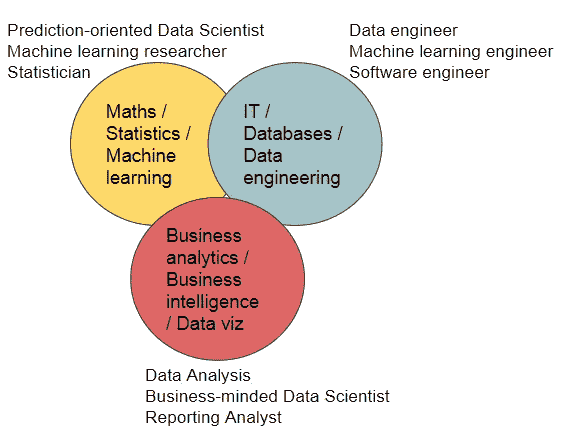

# 你是哪种类型的数据科学家？

> 原文：<https://towardsdatascience.com/what-type-of-data-scientist-are-you-2984140f6378?source=collection_archive---------49----------------------->

## 了解最常见的数据科学家角色

[阿克森](https://unsplash.com/@akson?utm_source=unsplash&utm_medium=referral&utm_content=creditCopyText)在 [Unsplash](https://unsplash.com/s/photos/collaboration-office?utm_source=unsplash&utm_medium=referral&utm_content=creditCopyText) 上拍照

数据科学是一个相对较新的领域，它融合了几个学科的特征和个性。但是，在数据科学出现之前，有哪些不同类型的数据科学家，这些人在做什么工作？

大多数人都见过这个三部曲图表的某种形式，我在下面重新改编了它。

来源:Gianluca Gindro

成功的数据科学确实是三个核心要素的混合体:统计、商业敏锐度和编程技能，但很少有人在所有这些领域都很强。

那么，你是哪个角色？或者说，如果你要招聘一名数据科学家，你需要哪一位？

三条背景路径通向三个不同的角色:

*   恢复的管理顾问
*   这位研究员逃离了学术界
*   开发人员变成了数据科学家

## 恢复的管理顾问

这个类别包括初级商业分析师和前麦肯锡顾问。他们有一个共同点，那就是对 Excel 的热情，以及炫耀 v-lookup 和花哨的公式的能力，甚至是计划搬家的能力。

他们也是对业务问题更有热情的人:他们首先考虑业务，然后才是数据。

他们不得不学习 Python 或 R，这不是因为他们喜欢编程。他们仍然尽可能地避免编码，他们的代码通常像一次性餐巾一样可重复使用。

他们对统计学的基础知识有很好的直觉，但他们不得不艰难地学习像 p 值或 t 检验这样的概念。

他们擅长的:支持决策的数据科学项目、面向业务的流程、一次性项目。

## 这位研究员逃离了学术界

他们通常拥有博士学位，并有研究背景。他们研究核心的数学和统计学，他们可以花几个小时谈论贝叶斯和频率主义方法之间的哲学差异。

他们通常擅长编码，只要他们不必过多地将自己推入数据工程师的界限。测试驱动的编程方法对他们来说可能是一种挑战。

但他们可能擅长较低级别的程序，如 C++，这对于大规模或深度学习的应用程序来说很方便。

他们往往缺乏的是商业思维。开发产品可能是他们的最终目标，因为他们认为这相当于在学术界发表一篇论文。

擅长领域:创新前沿的复杂机器学习项目。他们可以突破界限，阅读大量的研究论文来挑选和实施最好的想法。一家高科技公司可能需要一些这样的资料。

## 开发人员变成了数据科学家

由于数据科学需要大量的编码，这些可能会成为你最好的朋友。

你可以相信他们能够构建良好的可重用代码，不必向他们解释测试的概念，他们可能会比你希望的更多地自动化管道。

他们可能可以使用现成的机器学习工具，但如果他们需要冒险进入更深层次的统计思维，这可能会成为一个雷区。

他们中的一些人可能相当擅长理解事情的业务方面，特别是如果他们以前参与过收集需求和处理业务关系。但是不要期望他们对新颖的商业想法过于主动。

他们真正擅长的是需要技术挑战的场景，例如需要大规模工作的大数据项目或复杂的数据管道。同时，他们在需要更高级的建模和预测准确性需要成为竞争优势的项目中不太适应。它们也最适合于那些必须专注于构建产品而不是支持决策的项目。

## 结论

如果你是一名数据科学家或者正在考虑成为一名数据科学家，试着找出你适合的角色和你的差距，但也不要羞于承认你的优势。

作为一名数据科学家，你将需要所有这些技能的混合，但期望成为一名纯粹的多面手是一个神话:总有你更喜欢的一面！

如果你需要雇用一名数据科学家，试着确定候选人更适合哪一类:雇用一个人来建立一个大规模的推荐引擎，肯定需要一个不同于在销售预测中支持你的首席执行官的人。