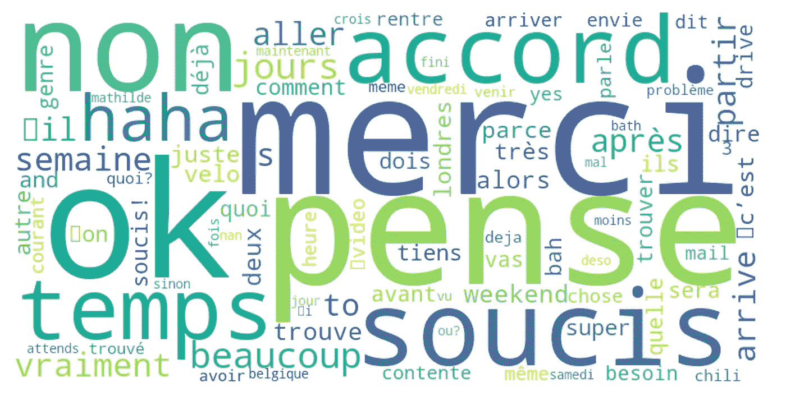
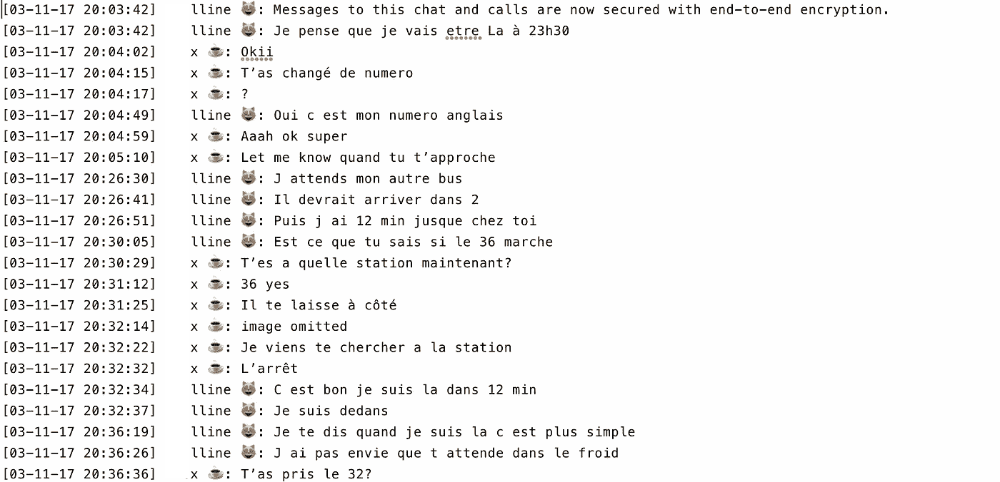
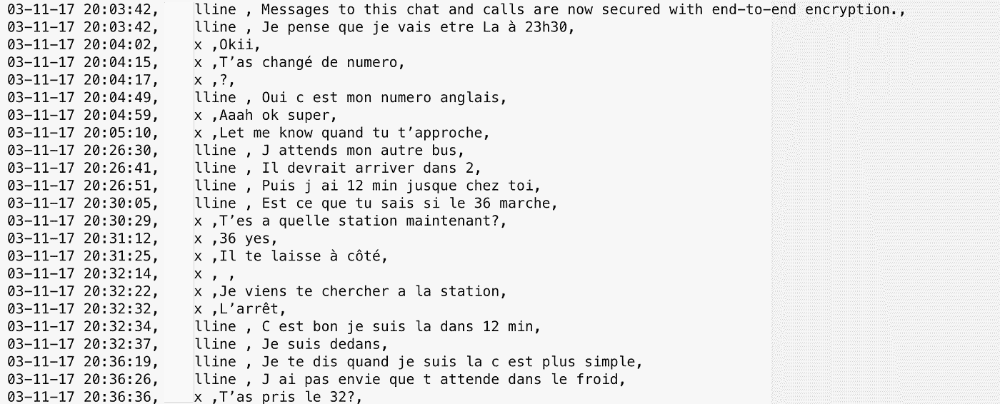
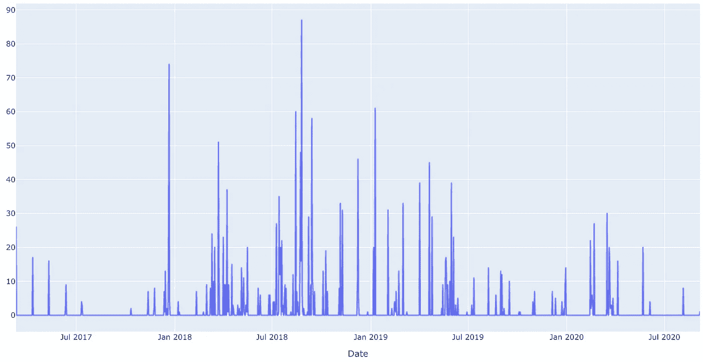
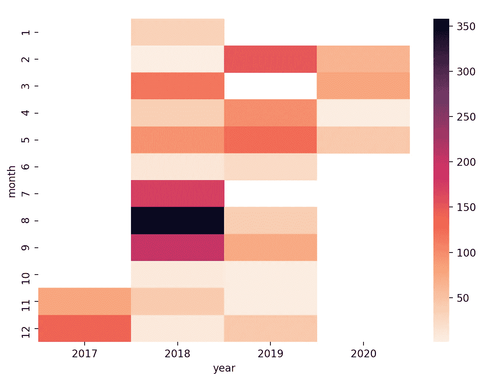
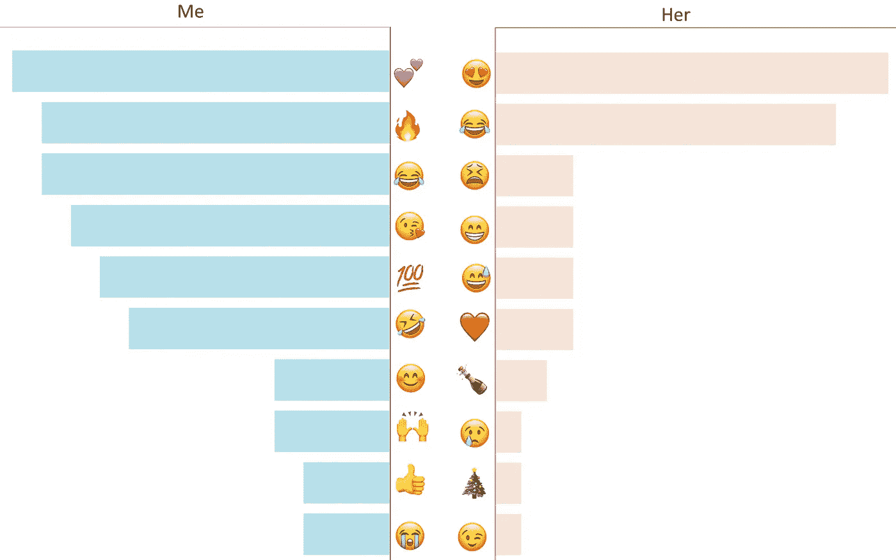

# 使用 WhatsApp 数据的自然语言处理

> 原文：<https://towardsdatascience.com/what-whatsapp-conversations-tell-us-about-our-friendships-73ce7104d84e?source=collection_archive---------72----------------------->

## 潜入表情符号、音频、附件和深夜对话的世界。



几天前是我最好的朋友的生日，我决定利用我的编程技能给她一份独特的礼物。准备好深入分析**单词、表情符号、数字、单词、链接、图像、视频、音频和附件**

# 在这篇文章中，你会发现

*   格式化 Whatsapp 对话指南的分步指南
*   **折线图:**3 年内发送消息的频率
*   **Spyder graph** :每年**、**每周和每小时消息
*   **条形图:**表情符号分析
*   **WordCloud:** 最常发送的消息

# 数据，数据和数据

在我们深入分析 WhatsApp 对话之前，先做一点概述…

*   从 2017 年 3 月 3 日发送的第一条消息到 2020 年 5 月 22 日的最后一条消息，相隔 932 天。
*   对话中的参与者:我和我的朋友
*   总共发送了 2150 条消息
*   **11821**字被调换

# 导入并重新格式化文本文件

第一步是从 WhatsApp 下载对话。这可以通过应用程序本身或 web 服务器扩展非常容易地完成。



为了隐私，姓名被部分隐藏

在我们开始可视化之前，有几件关于清洁过程的事情需要注意。

导入的文本文件的格式如下:

> **【日-月-年时:分:秒】名称:消息\换行符**

第一步的主要目标是从最初下载的文本文件创建一个“csv”文件。我用逗号替换了右方括号[]和左方括号[]，也用逗号替换了冒号。

我还删除了发件人名字中的表情符号，没有什么特别的原因，我更喜欢干净的名字。清理后文件的结果格式如下:

> **日-月-年时:分:秒，姓名，消息**

这是我想要实现的格式，以便创建 csv 文件，这将允许我分析消息。



为了隐私，姓名被部分隐藏

现在我们有了一个漂亮的“csv”文件，其中包含所有日期、发件人姓名和信息，我们可以创建一个熊猫数据帧来存储所有信息。

```
df=pd.read_csv('conversation.csv')
```

数据帧的结构如下:|日期|发件人姓名|消息|

# 日期时间格式

分析中的一个重要步骤是能够理解消息何时被发送。这需要通过轻松处理日期、时间、分钟等来完成。

Python 有一个非常有用的库，就是为此而创建的。从一个 ***字符串*** 类型到 ***日期时间*** 类型的一个非常简单的转换可以通过下面的代码行实现:

```
from datetime import datetimedf['date'] = pd.to_datetime(df['Date']**,** format = '%d-%m-%y %H:%M:%S')
```

现在，我的“日期”熊猫栏的格式被指定了，这非常有用，因为它允许在使用不同的日期格式时有很大的灵活性。

# 年度和月度分析

一旦我们将“date”列更改为 datetime 类型，我们就可以非常容易地提取任何想要的指标，例如*小时*、*月*或*年*。我决定创建新的列来包含邮件发送的具体月份和年份。

```
df['year'] = df['date'].dt.year
df['month'] = df['date'].dt.month
```

我用 **Plotly Express** 和 **Seaborn** 绘制了下面两张图。他们传达的意思是，虽然我和我的朋友很亲密，但我们在 Whatsapp 上不是特别经常说话。有很多间隔，几个星期都没有一条消息被发送，然后有几天我们交换了 80 多条消息。似乎我们有一种要么全有要么全无的交流方式。



沟通最多的一年是 2018 年，尤其是最后一个季度。这很有意义，因为我们正在组织一次欧洲旅行。在每年的年末和年初，交流减少了，因为我们都有考试和家庭假期要照顾。

下面的热图和上面的折线图传达的信息是一致的。

> **热图**是一种数据可视化技术，以二维颜色显示现象的大小。

我选择对相同的时间变量使用两种可视化，以确保我不会错过隐藏在一个图表中但在另一个图表中很明显的东西。我建议在大多数情况下这样做，因为它提供了一个快速的“理智检查”。



这些观想很容易实现，一步一步的教程可以在[这里](/3-quick-and-easy-data-visualisations-inspired-by-game-of-thrones-37c0e611b9bf)找到。

# 每小时和每周消息

鉴于之前的图表没有显示我们的消息传递方式的趋势，我决定通过查看每小时**和每周**发送的**和**条消息来进一步细分。

我创建了一个雷达图来可视化信息的频率，因为它们是循环的，我相当有信心会有一个强大的趋势。

> **雷达图**是一种以二维图表的形式显示多元数据的图形方法，该二维图表是从同一点开始在轴上表示三个或更多的定量变量。

我为发送的每条消息创建了包含工作日和时间的列。

```
df['weekday'] = df['date'].dt.weekday
df['hour'] = df['date'].dt.hour
```


这些图表包含了更丰富的信息，显示出我们在一周的某几天和一天的某几个小时更有规律地交谈。

对于小时图，95%的阴影区域在早上 5 点到下午 6 点之间，这相当代表了我们的生活方式，因为我们是非常活跃的人。我们通常在周末聊天，因为我们是异地恋，或者是为了叙旧或者组织旅行。

# 表情符号，不仅仅是文字？

> 表情符号是一种非常受欢迎的交流形式，通常用于描绘情感或喜剧效果，而无需键入文字。

我惊讶地发现，除了哭笑表情符号，我们使用的表情符号几乎没有重叠。

在看这个图的时候，我注意到了一些有趣的事情。很明显，我用的表情符号种类更多，而她用的表情符号从不出错。我很惊讶地看到她有更多庆祝表情，比如香槟和 T2 圣诞树，而我的表情更多地依赖于反应。

此外，我使用表情符号的次数比她多得多。事实上，我用了两倍多的量。这很有意义，因为我们说话和交流信息的语言不是我的第一语言。我更依赖表情符号来传达我的想法或情绪，而她更自信地使用文字。



你可以在这里找到如何创建这些支线剧情[的分步说明。](/step-by-step-bar-charts-using-plotly-express-bb13a1264a8b)

# 最常见的消息

我们俩发送的最常见的信息非常相似。我加了一个法语的翻译(以防万一)。下面一行代码让我可以非常轻松地浏览我的“消息”栏，找到重复次数最多的消息。我总是对一行代码所能实现的东西感到敬畏。

```
df.message.value_counts().head(**20**)
```

我非常惊讶地发现，重复次数最多的信息表达了我们对某件事的一致意见。

*   同意
*   ****Pas de soucis！** —没问题**
*   ****是** —是**
*   **没问题**
*   **凉爽的**
*   **行**
*   **非常好**
*   **好吧好吧**
*   ****T'es ou？你在哪里？****
*   **好的，没问题**
*   **️:是的，是的**
*   ****Ok****
*   **超级！**
*   **没问题**

> **结论:我们在大多数事情上意见一致，很多时候。**

# **单词单词单词**

**我决定更进一步，调查一下我们俩重复使用最多的词。**

****

**让我想起了俄罗斯方块**

**这是通过将所有单词设置为小写并使用' **Counter** '函数实现的(不幸的是有多行代码)。该函数跟踪每一个单词，并且每当特定单词出现在消息中时，增加唯一的+1 计数。**

```
for i in df.message.values:
    words += '{} '.format(i.lower()) # make all words lowercase

wd = pd.DataFrame(Counter(words.split()).most_common(**200**)**,** columns=['word'**,** 'frequency']) 
```

**这个计数器函数的结果保存在一个新的 pandas dataframe ' *wd* '中，我用它来绘制单词 Cloud(在我看来，这是最漂亮的可视化效果:)**

**WordCloud 函数使用字典，所以我必须在开始绘图之前进行快速转换。**

```
data = dict(zip(wd['word'].tolist()**,** wd['frequency'].tolist()))wc = WordCloud(background_color='white'**,** width=**800,** height=**400,** max_words=**200**).generate_from_frequencies(data)
```

# **结束语**

**通过这个小项目，我学到了很多。这是我第一次处理非数字数据。在编写代码时，有很多错误和事情需要记住，比如法国口音，或者表情库比我想象的更难使用。**

**我很高兴地看到，这个探索性的数据分析过程传达了关于我的友谊的非常积极的信息。所有使用的表情符号都描绘了积极或充满活力的情绪。最常用的信息是用来表达同意。**

> ****最常用的一个词是“谢谢”。****

**生日快乐，甜心！**

# **Github 知识库**

**所有代码都可以在 Github [这里](https://github.com/alejandra-gutierrez/Chat_Analysis.git)的 **analysis.py** 文件中找到。**

# **非常感谢你的阅读！**

**如果你喜欢我的作品，我会非常感谢你跟随我的媒介[到这里](https://towardsdatascience.com/medium.com/@alejandra.vlerick)。**

**如果您有任何关于如何改进的**问题**、**建议**或**想法**，请在下面留下评论或通过 LinkedIn [这里](https://www.linkedin.com/in/alejandra-g-283595b8)取得联系。**