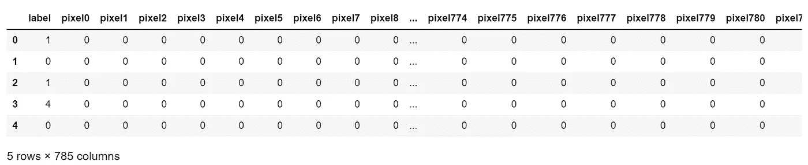

# SNE 霸王龙是什么，为什么和怎样

> 原文：<https://towardsdatascience.com/what-why-and-how-of-t-sne-1f78d13e224d?source=collection_archive---------10----------------------->


t-SNE 简介(图片来自 [Pixabay](https://pixabay.com/photos/light-bulb-light-halogen-bulb-lamp-1407610/)

想象一下我们一天创造的数据；产生的新闻、帖子、视频、社交媒体平台上的图片、沟通渠道上的消息、有助于商业发展的网站等等……巨大无比！对吗？


巨大！对吗？图片来自 [Pixabay](https://pixabay.com/photos/mammal-elephant-wildlife-animal-3218712/)

现在，想象一下分析这些海量数据并获得有用的见解以做出数据驱动的决策的任务。复杂！对吗？


复杂！对吗？图片来自 [Pixabay](https://pixabay.com/photos/beach-surfing-wave-ocean-outdoors-1836366/)

对于这个问题，我们可以做的是删除冗余信息，只分析影响大的信息。
***降维*** 在任何数据分析或数据可视化的最初阶段都会出现。

> ***降维*** 是将数据投影到一个更低维度的空间，这样更便于数据的分析和可视化。然而，维度的减少需要在准确性(高维)和可解释性(低维)之间进行权衡。

但这里的关键是保留最大方差特征，消除冗余特征。

**在本文中，我们将重点讨论 t-SNE 降维的原因、内容、方式以及非内容。**

下面是讨论的流程:

1.  为什么不是 PCA？为什么是 t-SNE？
2.  什么是 t-SNE？
3.  SNE 霸王龙是如何工作的？
4.  如何实现 t-SNE？
5.  如何有效使用 tSNE？

# ***为什么不是 PCA？为什么是 t-SNE？***

说到降维，PCA 出名是因为它简单、快速、易用，并且保留了数据集的**总体方差**。关于 PCA 的更多信息，请查看[和](/pca-in-a-single-line-of-code-ed79ae42059b)。

虽然 PCA 很棒，但它也有一些缺点。PCA 的一个主要缺点是它没有保留**非线性方差**。这意味着 PCA 将无法得到这样的结果。


三叶形结。

简单来说，PCA 只保留**全局方差**，因此保留**局部方差**是 t-SNE 背后的动机。

# ***什么是 t-SNE？***

t-SNE 是一种**非线性降维**技术，非常适合将高维数据嵌入到低维数据(2D 或 3D)中进行数据可视化。

t-SNE 代表 **t 分布随机邻居嵌入**，它讲述了以下内容:
随机→不确定但随机概率
邻居→只关心保留邻居点的方差
嵌入→将数据绘制到更低的维度

简而言之，t-SNE 是一种机器学习算法，每次在相同的数据集上生成略有不同的结果，专注于保留邻居点的结构。

## 超参数调谐

2 能高度影响结果的参数有
a) *n_iter:* 算法运行的迭代次数
b) *困惑度:*这可以认为是 t-SNE 必须考虑的邻点数

# ***t-SNE 是如何工作的？***

**步骤 1:** t-SNE 在更高维度中构建成对的概率分布，使得相似的对象被分配较高的概率，而不相似的对象被分配较低的概率。

**步骤 2:** 然后，t-SNE 在较低维度上迭代复制相同的概率分布，直到库尔巴克-莱布勒散度最小化。

*Kullback-Leibler 散度*是衡量第一步和第二步的概率分布之间的差异。KL 散度在数学上被给出为这些概率分布的差的对数的期望值。

# 如何实现 t-SNE

在本节中，让我们使用来自 Kaggle 的数字识别器数据集，使用 t-SNE 进行维数约简。

[](https://www.kaggle.com/c/digit-recognizer) [## 数字识别器

### 用著名的 MNIST 数据学习计算机视觉基础

www.kaggle.com](https://www.kaggle.com/c/digit-recognizer) 

***数据描述:***

*   数据文件包含手绘数字的灰度图像，从 0 到 9。
*   每幅图像高 28 像素，宽 28 像素，总共 784 像素。每个像素都有一个与之关联的像素值，表示该像素的亮度或暗度，数字越大表示越暗。该像素值是 0 到 255 之间的整数，包括 0 和 255。
*   训练数据集(train.csv)有 785 列。第一列称为“标签”，是用户绘制的数字。其余的列包含相关图像的像素值。
    数据集中的每个像素列都有一个类似 pixelx 的名称，其中 x 是 0 到 783 之间的整数，包括 0 和 783。为了在图像上定位这个像素，假设我们将 x 分解为 x = i * 28 + j，其中 I 和 j 是 0 到 27 之间的整数，包括 0 和 27。那么 pixelx 位于 28×28 矩阵的第 I 行和第 j 列(由零索引)。

***加载数据:***

```
import pandas as pd
mnist_data = pd.read_csv("mnist.csv")
```

使用 Pandas 将 CSV 格式(逗号分隔值)的数据文件加载到数据框中。

```
mnist_data.shape
```

输出:(42000，785)

查看数据，我们发现有 42，000 个数据点和 785 个特征。

```
mnist_data.head()
```

输出:



mnist_data 中的前 5 个数据点

第一列标签是目标变量。剩下的 784 列是特征。

```
target_variable = mnist_data["label"]
features_variable=mnist_data.drop("label",axis=1)
```

将标签列分配给*目标变量*，将剩余列分配给*特征变量*。

```
print(target_variable.shape)
print(features_variable.shape)
```

输出:(42000，)
(42000，784)

现在，让我们看看这个*特征变量*是如何使用 t-SNE 减少 42000 个数据点和 784 个特征的。

***利用 t-SNE 实现降维:***

**第一步:**数据标准化

```
from sklearn.preprocessing import StandardScaler
standarized_data = StandardScaler().fit_transform(features_variable)
```

使用*标准定标器()。fit_transform( )* ，数据可以一步标准化。

**步骤 2:** 对标准化数据应用 t-SNE

```
from sklearn.manifold import TSNE
model = TSNE(n_components=2, random_state=0,perplexity=50, n_iter=5000)
tsne_data = model.fit_transform(standarized_data)
```

在这里，我们创建一个 TSNE 的对象，并设置*困惑*和 n_iter 值。我们对标准化数据使用了 *fit_transform( )* 方法，通过 t-SNE 得到降维数据。

为了验证这一点，让我们打印 tsne_data 的形状

```
print(standarized_data.shape)
print(tsne_data.shape)
```

输出:(42000，784)
(42000，2)

我们现在可以一起玩各种*困惑*和 *n_iter* 来观察结果。

# ***如何有效利用 t-SNE？***

1.  t-SNE 图受参数的影响很大。因此，在分析结果之前，有必要使用不同的参数值执行 t-SNE。
2.  由于 t-SNE 是随机的，每次运行可能会导致略有不同的输出。这可以通过固定所有运行的 *random_state* 参数值来解决。
3.  SNE 霸王龙没有保留原始数据中聚类之间的距离。t-SNE 降维后，聚类之间的距离可能会发生变化。建议不要仅从集群之间的距离获得任何结论。
4.  t-SNE 压缩广泛传播的数据，扩展密集包装的数据。因此，建议不要基于输出来决定聚类的大小和密度/分布/方差。
5.  更低的*困惑度*值可能导致更少的聚类。因此，建议尝试不同的*困惑*值，范围从 2 到数据点数，以获得更好的结果。

**资源:**

这篇[博客文章](https://distill.pub/2016/misread-tsne/#perplexity=10&epsilon=5&demo=0&demoParams=20)由 distill.pub 在谷歌大脑的支持下完成。
一定要看看这个博客，了解更多关于 t-SNE 如何有效地帮助减少可视化的各种数据模式的见解。

谢谢你的阅读。以后我会写更多初学者友好的帖子。请在[媒体](https://medium.com/@ramyavidiyala)上关注我，以便了解他们。我欢迎反馈，可以通过 Twitter [ramya_vidiyala](https://twitter.com/ramya_vidiyala) 和 LinkedIn [RamyaVidiyala](https://www.linkedin.com/in/ramya-vidiyala-308ba6139/) 联系我。快乐学习！