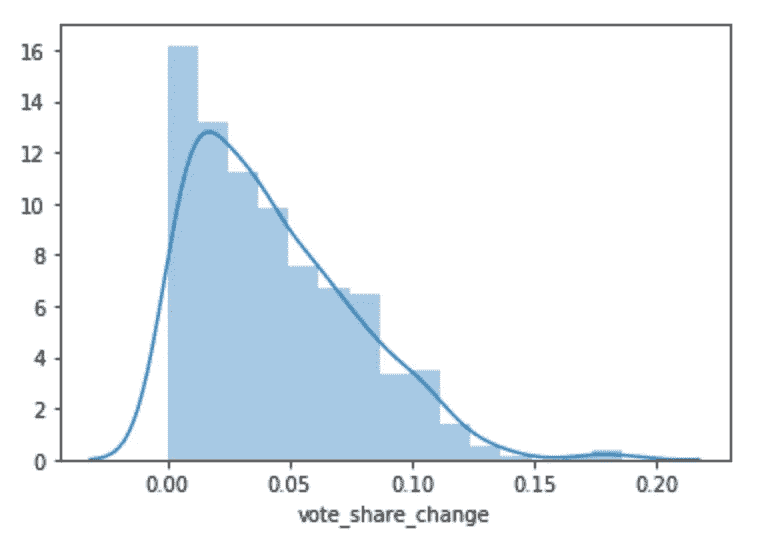
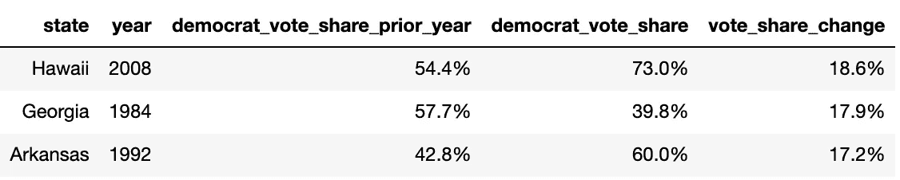
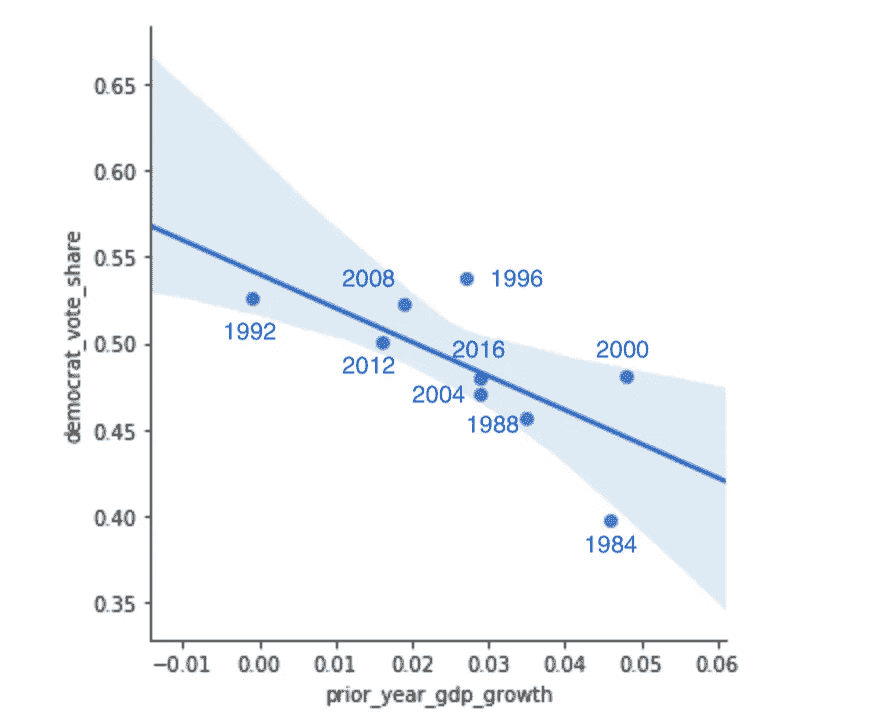
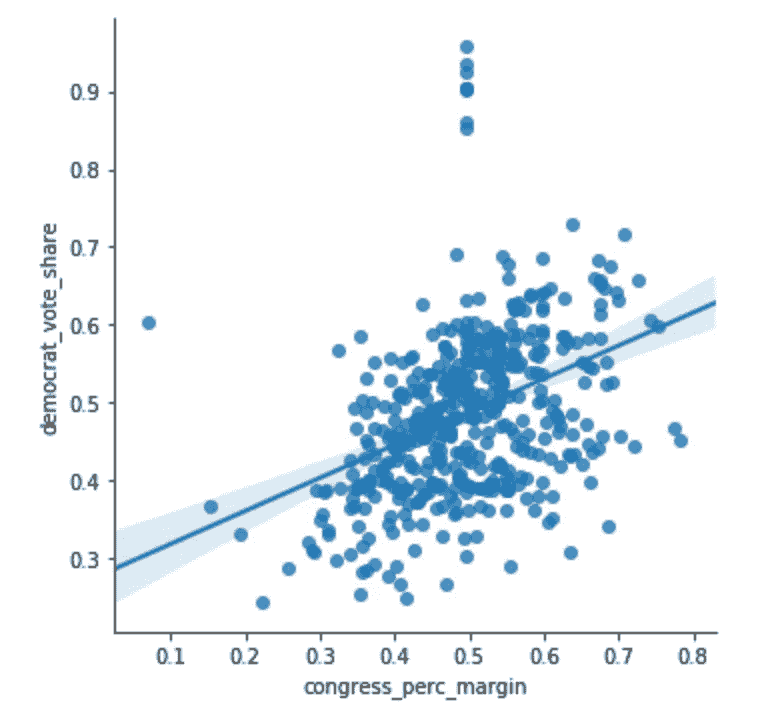
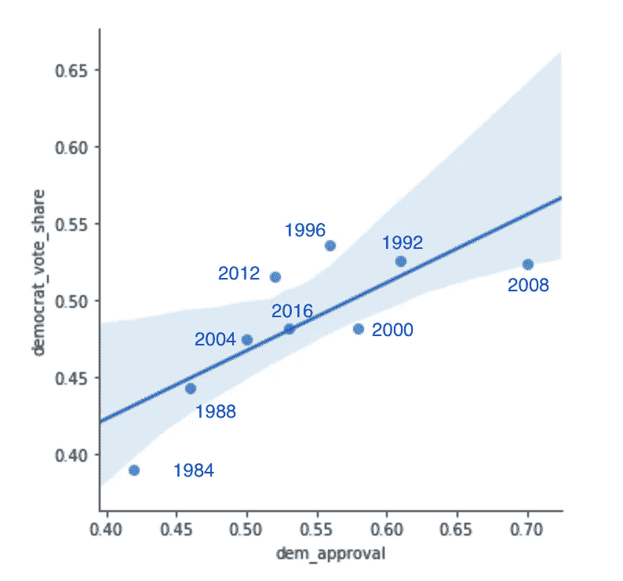
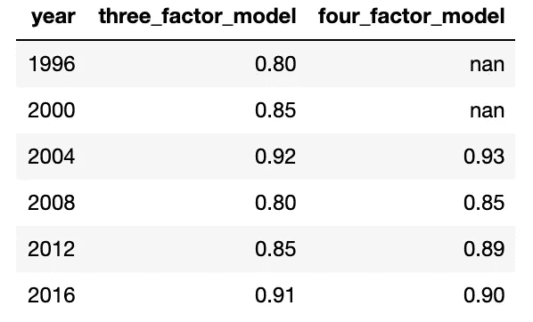
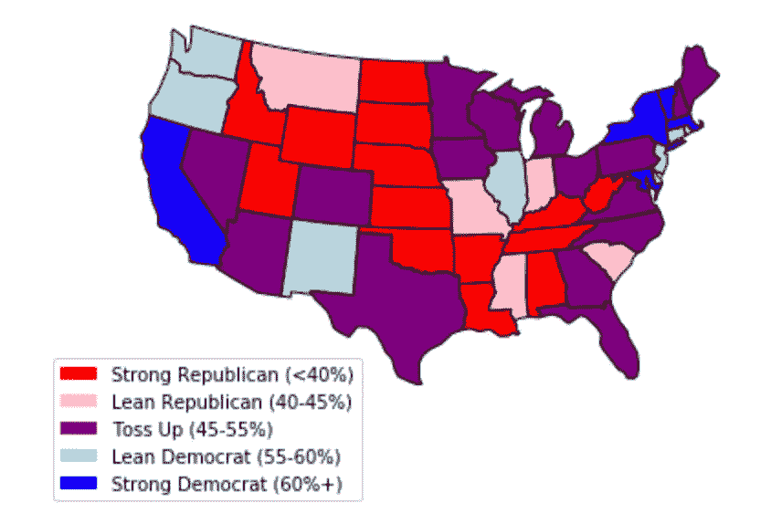

# 2020 年选举会怎样？

> 原文：<https://towardsdatascience.com/what-will-happen-in-the-2020-election-e6efb0a7b2ad?source=collection_archive---------29----------------------->

## 提示:将会非常接近

随着 2019 年太阳落山，没有什么比即将到来的总统选举更重要的了。预计参加人数将打破现代记录，许多人认为这将是美国历史上最大的政治事件之一。

在接下来的 12 个月里，在全国各地的起居室里，我们会问同样的问题。谁会赢？它们将承载哪些州？他们为什么会赢？

为了帮助得到一些早期的答案——以及[受到其他方法](https://medium.com/vinod-b/who-will-win-the-2020-presidential-election-4e495378cae5)的启发——我建立了一个回归模型，预测美国每个州将会发生什么

# 方法学

在开始之前，下面简单介绍一下我是如何构建这个模型的。如果您对技术细节不太感兴趣，可以直接跳到“关键见解”部分。

我设置了一个回归问题，预测民主党候选人在大选中获得的选票占投给民主党或共和党的总票数的百分比。

数据很少，所以我只分析了 1976 年至 2019 年这段时间。我选择了基于时间序列交叉验证方案的模型和特性。每一个选举年都是仅用以前的年份来预测的。例如，为预测 1980 年选举而训练的模型只看到 1976 年的数据，而为预测 2016 年选举而训练的模型看到 1976-2015 年的数据。

这种方法的一个后果是，在我们得到稳定的结果之前，需要若干年的时间。因此，使用过去 4 到 6 次选举的平均表现来估计最终表现(R 平方)。

下面是这种方法的示意图，其中每个“测试”时间段是对一次大选内所有州的预测。

来源:[https://stats . stack exchange . com/questions/14099/using-k-fold-cross-validation-for-time-series-model-selection](https://stats.stackexchange.com/questions/14099/using-k-fold-cross-validation-for-time-series-model-selection)

# 关键见解

## 各州倾向于一致投票

我首先关注的是之前的大选对下一次大选的预测有多准确。或许并不令人意外的是，投票份额每年变化不大，中位数绝对波动仅为 3.7%。

事实上，在过去的四十年里，只有三个州的波动幅度超过了 15%:

其中两个是被提名人的出生地(奥巴马 2008；克林顿 1992 年出生于夏威夷；出生于阿肯色州)。第三次——里根在 1984 年翻转佐治亚——是罗斯福第一次竞选以来最大的大选压倒性胜利的一部分。

除非有特殊情况，我们通常可以通过简单地查看上一次大选来很好地了解下一次大选将接近的州。

这是经济问题，笨蛋

根据[詹姆斯·卡维尔 1992 年的建议](https://en.wikipedia.org/wiki/It%27s_the_economy,_stupid)——*“是经济愚蠢”*——我关注的下一个因素是经济增长。对于每个选举年，我都会查看前一年的实际 GDP 增长，这是衡量经济健康状况的一个常用指标。将这一变量与平均民主党投票份额相对照，会得出一个负面关系:

一般来说，经济表现不佳对民主党候选人更有利。当经济受到伤害时，中产阶级在挣扎。当中产阶级举步维艰时，进步政策往往更能引起共鸣。

这一总体模式的最大例外是 1996 年和 2000 年——这两年尽管经济强劲，但民主党的投票份额相当高。

## **中期选举是一个信号**

我还查看了民主党在上次国会选举中赢得的选票百分比。这里的理论是，中期选举为这个国家对执政党的感觉提供了一个脉冲检查。

为了创建这个变量，我合并了众议院和参议院选举中的总票数，并删除了不包括民主党和共和党的任何选举。

这两个变量之间似乎确实存在某种轻微的关系。政党在国会竞选中的表现与在大选中的表现相关联。

当添加到模型中时，该特征在预测能力方面提供了适度但明显的增益。

## **支持率**

显示前景的最后一个变量是大选前现任总统的支持率。在民主党不执政的年份，我从 1 减去共和党的支持率。例如，乔治·h·布什的支持率在 1992 年是 39%，所以我把它转换成 61%来支持民主党。

我再次将变量与平均民主党投票份额进行了对比:

正如所料，我们发现更高的“民主党支持率”与民主党在大选中的更好表现相关。

# **评估绩效**

利用上面的见解，我开发了两个模型。第一个只包括三个变量:“前民主党投票份额”、“前一年 GDP 增长”和“中期民主党投票份额”。第二个使用这三个变量，但也包括“民主党人的批准。”

我建立两个模型有两个原因:

1.  四因素模型比三因素模型表现更好，但只是在我们评估最近 4 次选举(2004 年至 2016 年)时。当我们查看之前的 6 次选举(1996 年至 2016 年)时，3 因素模型做得更好。我怀疑这可能是由于缺乏交叉验证的训练数据，但很难确定。拥有这两个估计值给了我们更多的解释灵活性。
2.  四因素模型包括 10 月份的支持率数据——就在选举之前——我们目前没有 2020 年的数据。因此，我们被迫将特朗普在 10 月份的支持率估计为他今天的支持率。这使得 4 因素模型是动态的。随着我们全年对支持率估计值的更新，我们将调整我们的预测。

以下是每个型号的性能汇总，由 R 衡量:

凭借相当强劲且持续的表现，让我们对 2020 年进行预测。

# **预测 2020 年**

以下是对 2020 年大选的预测。为了得出这个结果，我对两个模型的得分进行了平均，并根据预测的民主党投票份额将各州分为 5 类。

1.  **强势共和党:** < 40%民主党

*'怀俄明州(25%)'，'西弗吉尼亚州(30%)'，'俄克拉荷马州(31%)'，'爱达荷州(32%)'，'北达科他州(32%)'，'南达科他州(34%)'，'肯塔基州(35%)'，阿拉巴马州(35%)'，阿肯色州(36%)'，田纳西州(37%)'，犹他州(37%)'，内布拉斯加州(37%)'，路易斯安那州(39%)'，堪萨斯州(40%)'*

2.精简的共和党人:40-45%的民主党人

*“蒙大拿州(40%)”、“印第安纳州(41%)”、“密西西比州(41%)”、“密苏里州(41%)”、“阿拉斯加州(42%)”、“南卡罗来纳州(43%)”*

3.掷硬币:45-55%的民主党人

*'得克萨斯州(46%)'，'爱荷华州(46%)'，'俄亥俄州(46%)'，'佐治亚州(47%)'，'亚利桑那州(48%)'，'北卡罗来纳州(49%)'，* ***'佛罗里达州(49.37%)'，'威斯康星州(50.02%)，'密歇根州(50.39%)'，'宾夕法尼亚州(50.41%)'，'明尼苏达州(50.89%)，***

4.精简的民主党人:55-60%的民主党人

*“特拉华州(56%)”、“俄勒冈州(56%)”、“新墨西哥州(56%)”、“新泽西州(57%)”、“康涅狄格州(57%)”、“华盛顿(59%)”、“罗德岛(59%)”、“伊利诺伊州(60%)”*

5.强大的民主党人:60%以上的民主党人

*“马里兰州(63%)”、“纽约州(64%)”、“马萨诸塞州(65%)”、“加利福尼亚州(66%)”、“佛蒙特州(67%)”、“夏威夷(69%)”、“哥伦比亚特区(91%)”*

# 最终结果和后续步骤

如果这种建模方法在 2020 年达到完美的精确度，下面是选举的结果:

**民主党选举人票:** 279 张

**共和党选举人票:** 259

然而，值得注意的是，有 16 个州属于“抛硬币”类别，每个州都在 5%的范围内。还有 5 个州的差距在 1%以内——佛罗里达州(49.37%)、威斯康星州(50.02%)、密歇根州(50.39%)、宾夕法尼亚州(50.41%)和明尼苏达州(50.89%)。

有了如此严密的预测，我的主要观点是选举将会非常接近。事实上，如果模型错过了威斯康星州，只有威斯康星州，我们会看到 269-269 平局。

不言而喻，该模型无法捕捉所有重要因素。最值得注意的是，它没有说明非现任提名者是谁，以及他们对国内关键摇摆州的吸引力如何。

尽管如此，该模型为理解和讨论各方的各种胜利之路提供了坚实的基础。在[我的下一篇文章](https://medium.com/@skylerdale/three-paths-to-victory-in-the-2020-election-ff41e029664)中，我将更深入地探究这些策略和潜在的结果。