# 会发生什么？—使用无代码人工智能模型和微软的人工智能构建器预测未来业务。

> 原文：<https://towardsdatascience.com/what-will-happen-predict-future-business-using-a-no-code-ai-model-and-microsofts-ai-builder-52996a13243c?source=collection_archive---------23----------------------->

## 微软 POWER 平台解决方案

## 微软 Power 平台中的 AI Builder 的第一个外观和一个关于预测的激励性逐步指南


伊利亚·赫特在 [Unsplash](https://unsplash.com?utm_source=medium&utm_medium=referral) 上拍摄的照片

人工智能和机器学习是很大的词汇，通常隐藏在大量技术堆栈和各种背景的人获得的一系列复杂技能的背后。

最近，我们看到许多市场运动将这些技术大众化，从而使每个人都可以使用，不管他们的编码或数据科学技能如何。

**当然，微软也在这场游戏中。**

AI Builder——作为*微软 Power 平台*的一部分——可能还不是最知名的功能，但它肯定是最激动人心的功能之一。

它允许商业用户创建应用程序，在没有任何编码技能或其他数据科学相关知识的情况下，从功能上丰富了人工智能。

该解决方案跨越了[微软的 Power 平台](https://powerplatform.microsoft.com/en-us/)和 [Dynamic 365](https://dynamics.microsoft.com/en-us/) 的更大范围。它进一步本机集成到*通用数据服务* ( [什么是 CDS？这给了它一个非常强大的生态系统。](https://docs.microsoft.com/en-us/powerapps/maker/common-data-service/data-platform-intro)

到目前为止，AI Builder 的当前版本支持广泛的预构建 AI 模型:

*   名片阅读器
*   关键短语提取
*   语言检测
*   文本识别
*   情感分析

此外，AI Builder 为您提供了使用以下 AI 模型类型训练您自己的 AI 定制模型的选项:

*   预言；预测；预告
*   目标检测
*   表单处理
*   文本分类

使用 AI Builder 构建 AI 模型的高级过程非常简单明了。

你**用现有数据配置你的模型**并**训练**它。之后，你验证**型号性能**并做一些快速测试。一旦模型准备好了，你就**发布**它。从那时起，你可以在不同的地方以不同的方式消费这个模型。您可以在您的业务工作流程或移动应用程序中使用它，仅举几例。

让我们更详细地看一下其中一个 AI 定制模型:**预测**。

# 预测模型

预测模型允许我们通过使用具有历史结果的历史数据来预测业务结果。

*换句话说:*它允许训练和测试机器学习模型，完全没有代码，也没有数学、统计或任何其他数据科学相关领域的背景。

这是我们自己的人工智能模型所需的一切:

*   [微软动力平台](https://powerplatform.microsoft.com/en-us/)试用
*   每个历史结果有 50 多条记录，存储在公共数据服务中
*   每个结果值有 10 多条记录(是、否、数字等。)

# 一个激励人心的场景—预测未来的自行车租赁

让我们假设我们为一家自行车共享/租赁服务公司工作，我们有一堆历史数据告诉我们许多关于过去的租赁数字和那天的确切天气情况。此外，我们的数据包含关于工作日、假日和其他有趣事实的信息。

## 预测目标

我们的目标是建立一个人工智能模型，在给定一组输入变量的情况下，该模型可以预测一天的潜在租金数量，这些变量由天气预报、整个季节以及即将到来的假期或周末表示。

## 抽样资料

我们将使用从 [UCI 机器学习网站](https://archive.ics.uci.edu/ml/datasets/bike+sharing+dataset#)获取并存储在我的 GitHub 存储库中的数据集的稍微修改的版本。

[](https://github.com/sebastianzolg/ai-builder-intro) [## sebastianzolg/ai-builder-intro

### bike-sharing.csv 数据集是来自 UCI 机器学习知识库的数据集的修改版本。引用…

github.com](https://github.com/sebastianzolg/ai-builder-intro) 

## 人工智能构建器—一步一步

让我们一步一步地了解我们的人工智能模型的创建过程。

首先，进入[https://make.powerapps.com](https://make.powerapps.com/)，选择**实体，**点击**获取数据。**

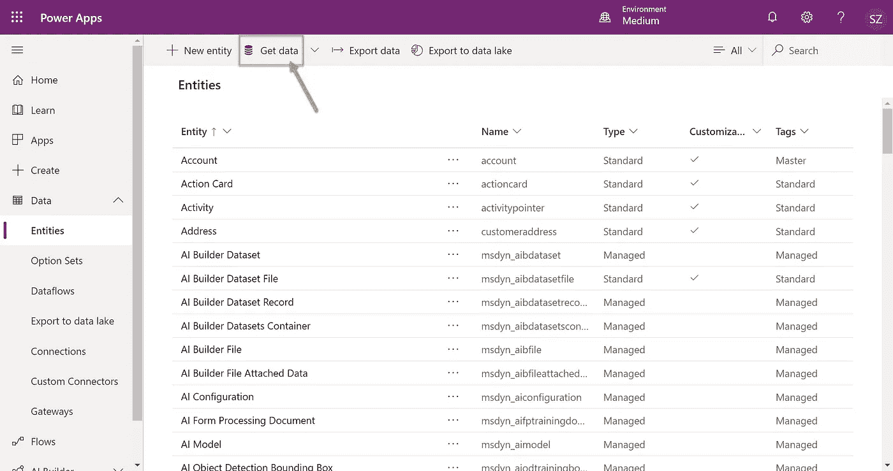

从来源列表中，点击**文本/CSV。**

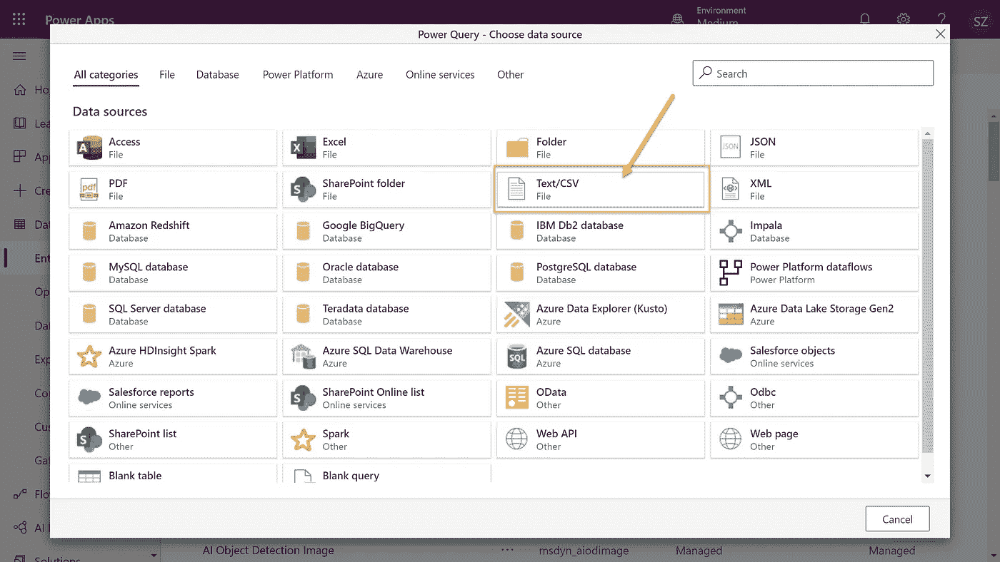

接下来，在我的 GitHub 存储库中输入 *bike-sharing.csv* 的 URL，直接从那里抓取数据。

[https://raw . githubusercontent . com/sebastianzolg/ai-builder-intro/master/bike-sharing . CSV](https://raw.githubusercontent.com/sebastianzolg/ai-builder-intro/master/bike-sharing.csv)

点击下一个的**。**

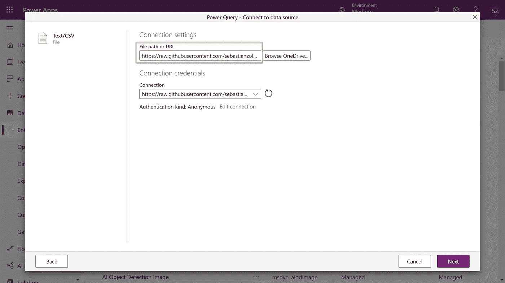

数据加载后，注意`cnt #(count)`列是很重要的，它代表当天自行车租赁的数量。这就是我们想要预测的所谓特征。

注意，前十个条目有一个`null`的`cnt`。我们稍后将使用这些条目来测试我们的训练模型。

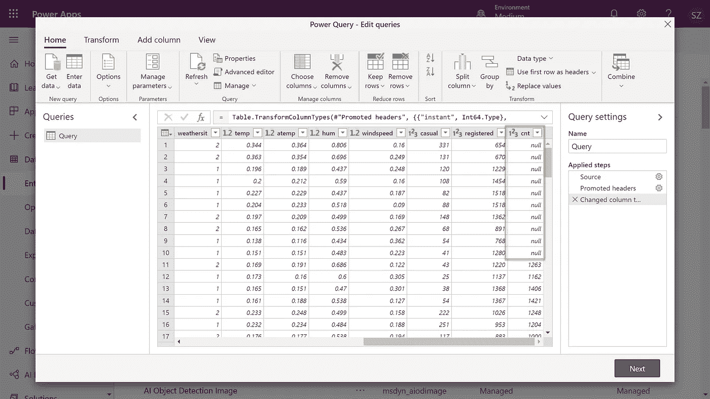

在我们继续之前，我们必须将`instant`列的类型更改为 text，这样我们以后就可以将它用作主名称字段。当我们想要覆盖/替换条目时，这变得很重要。

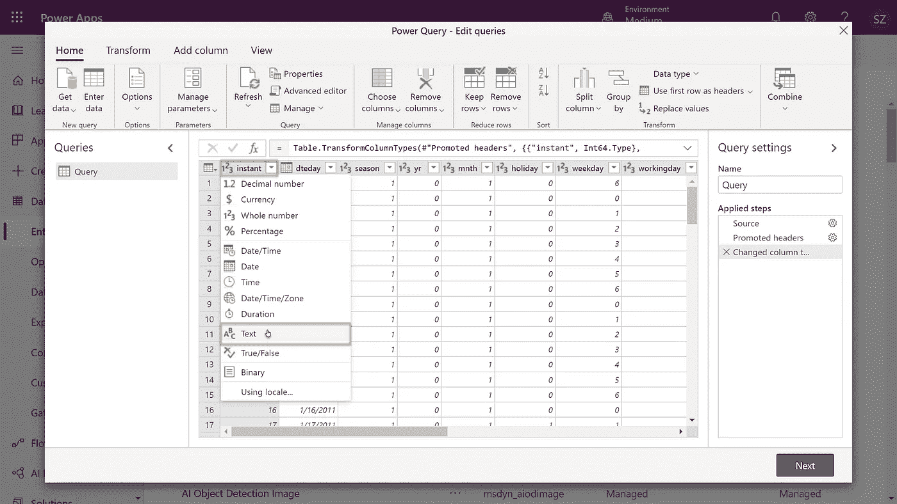

出现提示时点击**添加新步骤**，然后点击**下一步**。

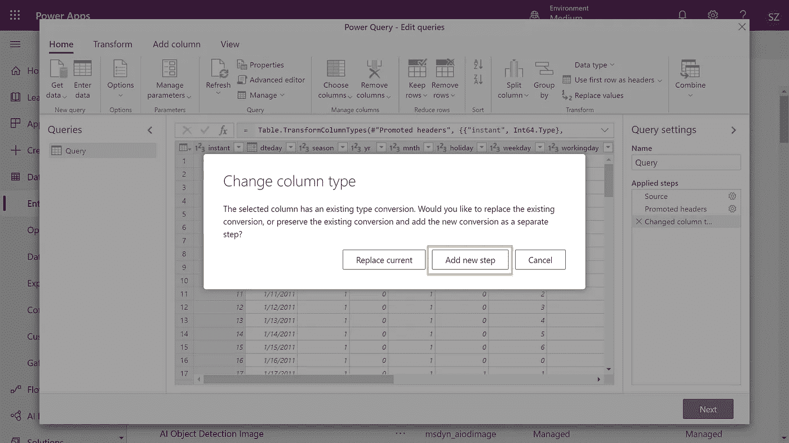

在*地图实体*表单上，我们最终对*自行车共享记录建模。*根据截图配置好一切，点击**下一步**。

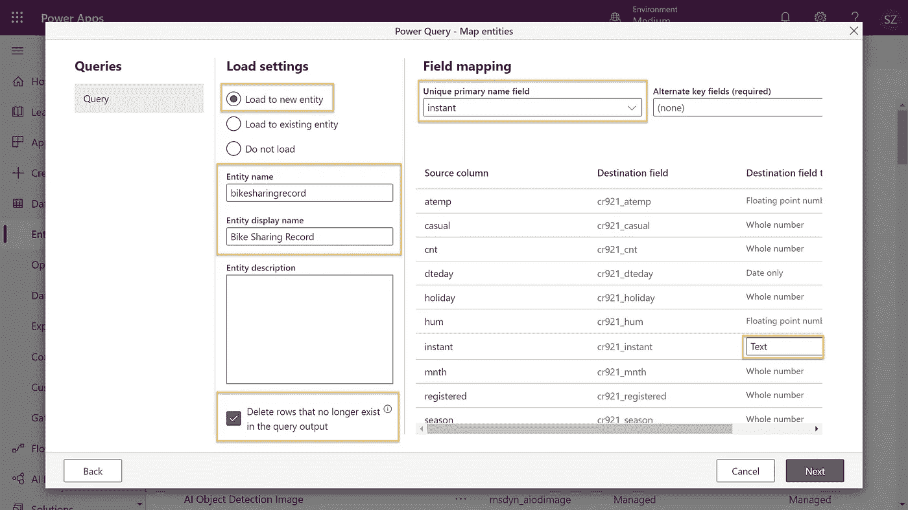

选择**手动刷新**并点击**创建**。

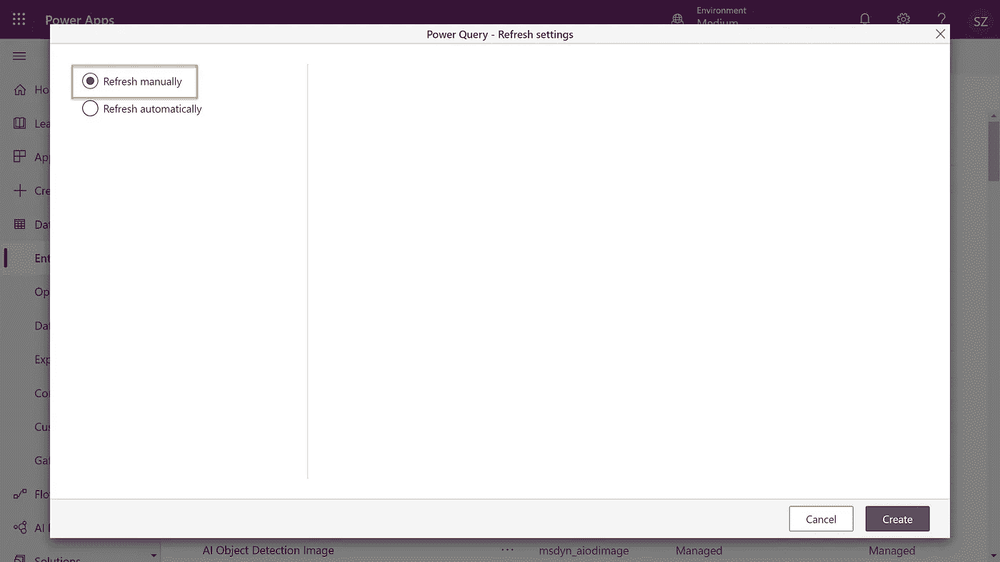

回到**数据**，点击浏览器的刷新按钮，新创建的**自行车共享记录**实体出现。确保您已经从右上角的**视图选项**中选择了**自定义**。这样，你可以更快地找到你的客户实体。

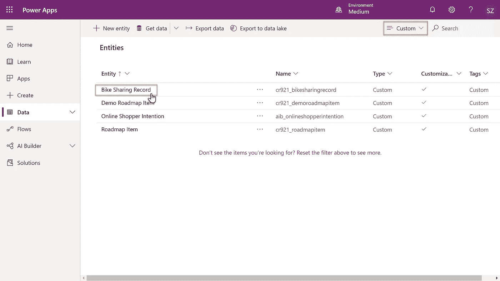

在**自行车共享记录**的**数据**选项卡上，确保您已经从**选择视图**下拉列表中选择了**自定义字段**视图。您将立即看到我们的数据，并再次发现前十个条目，其中我们对`cnt`特性没有价值。

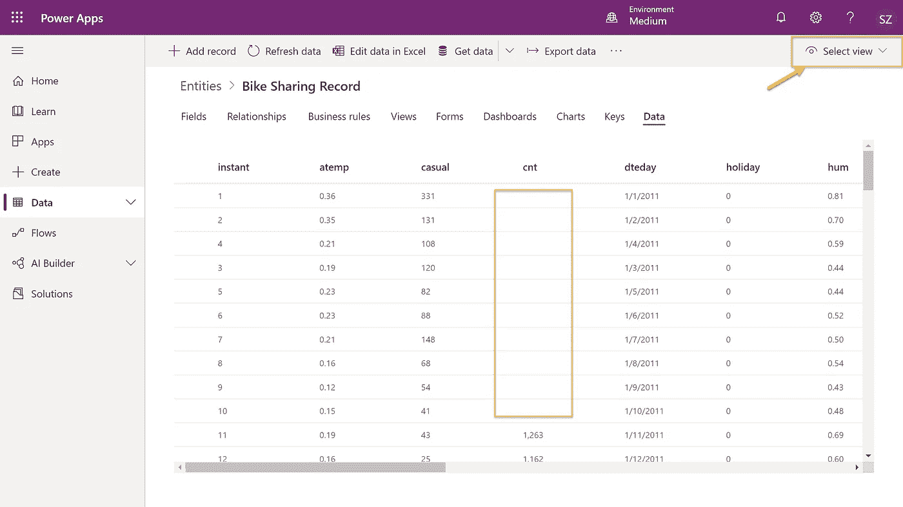

我们现在已经导入了一个实体和一堆数据来训练 AI 模型。我们开始吧。

## 训练人工智能预测模型

现在我们已经准备好了数据，我们转到 **AI 构建器>构建**并选择**预测**模型。

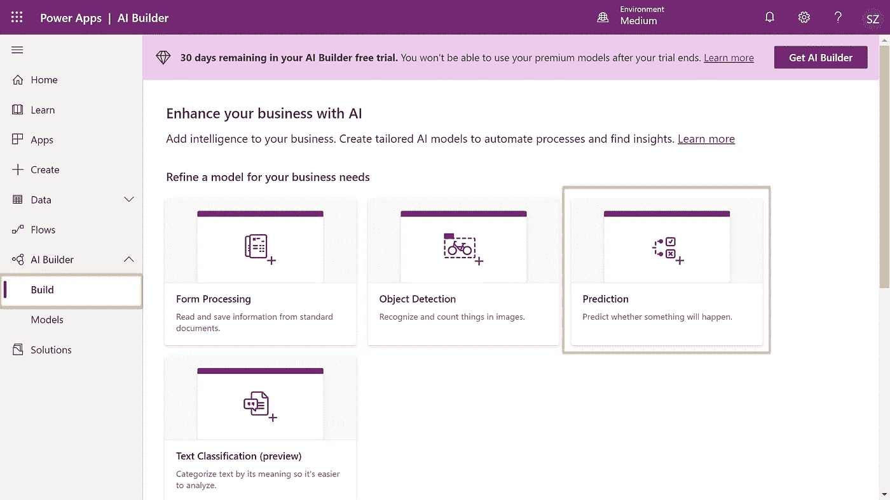

给新模型起一个合适的名字，比如**自行车共享预测**，点击**创建**。

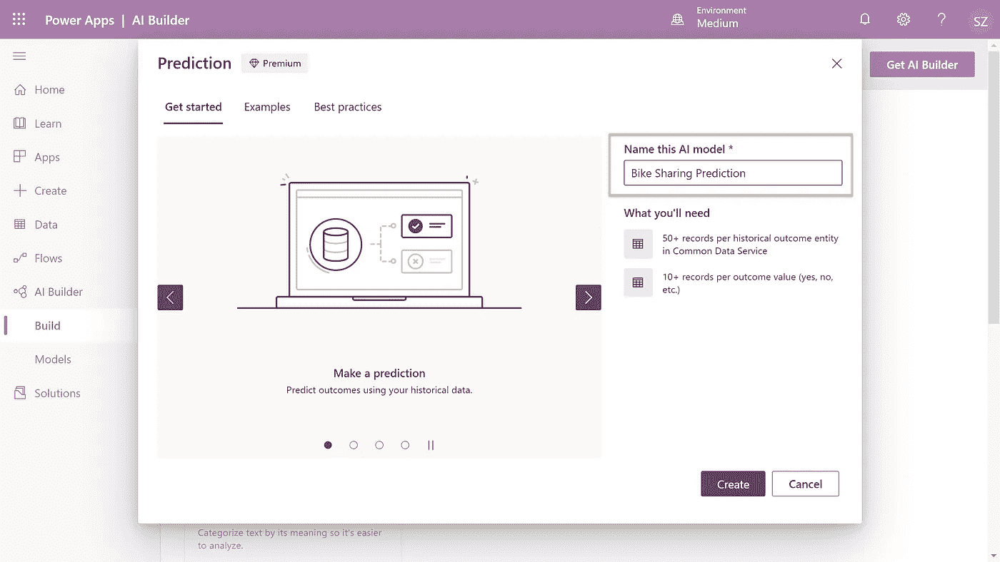

让我们从**实体**下拉列表中查找我们的**自行车共享记录**实体，并从**字段**下拉列表中选择`cnt`功能。这就是我们如何告诉 AI 构建器我们想要预测哪个特征。点击**下一个**。

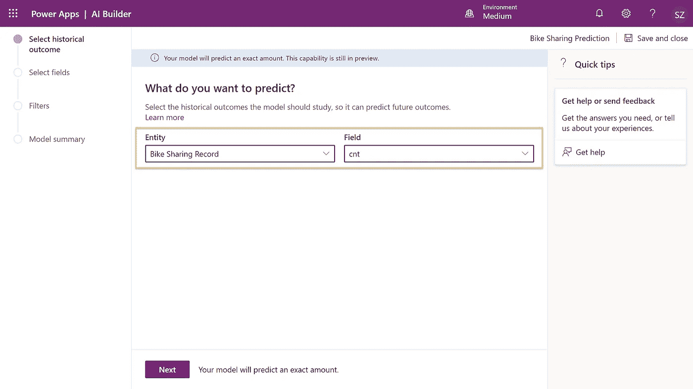

在下一个屏幕上，我们选择我们想要用来构建模型的所有特性。

请注意，有些字段已经被排除。这是因为由 CDS 创建的系统字段，如在上创建的*会扭曲预测结果，所以它们默认被排除。*

此外，没有显示所有的数据类型。我们的模型可以研究数字、货币、日期、两个选项、选项集和文本数据类型。

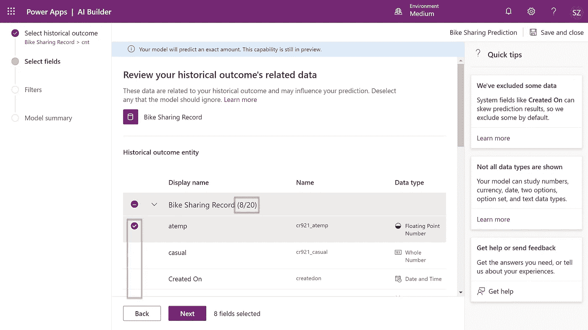

剩下的选择取决于你和你的业务领域知识的一部分。对于我们的数据集，我们依赖于原始数据集的[文档](https://archive.ics.uci.edu/ml/datasets/bike+sharing+dataset#)，并选择以下字段。

```
- **season**: 
season (1:winter, 2:spring, 3:summer, 4:fall)- **holiday**: 
weather day is holiday or not (extracted from [[Web Link]](http://dchr.dc.gov/page/holiday-schedule))- **workingday**: 
if day is neither weekend nor holiday is 1, otherwise is 0.- **weathersit**:
- 1: Clear, Few clouds, Partly cloudy, Partly cloudy
- 2: Mist + Cloudy, Mist + Broken clouds, Mist + Few clouds, Mist
- 3: Light Snow, Light Rain + Thunderstorm + Scattered clouds, Light Rain + Scattered clouds
- 4: Heavy Rain + Ice Pallets + Thunderstorm + Mist, Snow + Fog- **temp**: 
Normalized temperature in Celsius. The values are derived via (t-t_min)/(t_max-t_min), t_min=-8, t_max=+39 (only in hourly scale)- **atemp**: 
Normalized feeling temperature in Celsius. The values are derived via (t-t_min)/(t_max-t_min), t_min=-16, t_max=+50 (only in hourly scale)- **hum**: 
Normalized humidity. The values are divided to 100 (max)- **windspeed**: 
Normalized wind speed. The values are divided to 67 (max)
```

当然，你可以选择不同的组合，看看你是否能得到更好的结果。我们将在后面看到哪个变量对预测影响最大。准备好后点击**下一个**。

我们跳过过滤步骤，点击下一步的**。**

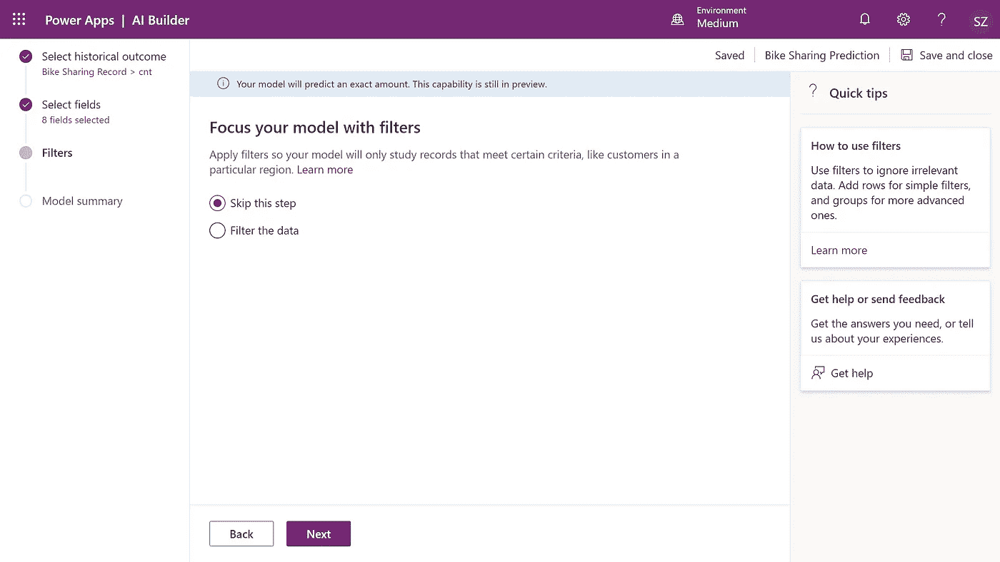

现在是时候做最后的回顾了。完成后点击**训练**，等待模型被训练。

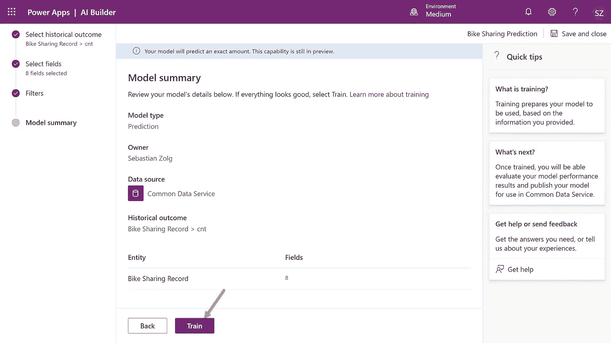

点击**转到型号**。

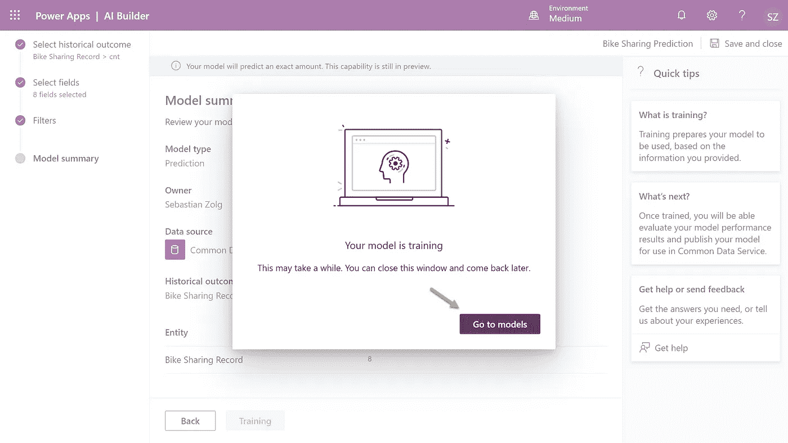

仔细观察**状态**栏中的进度*和*。当模型状态变为**已训练**时，点击模型。

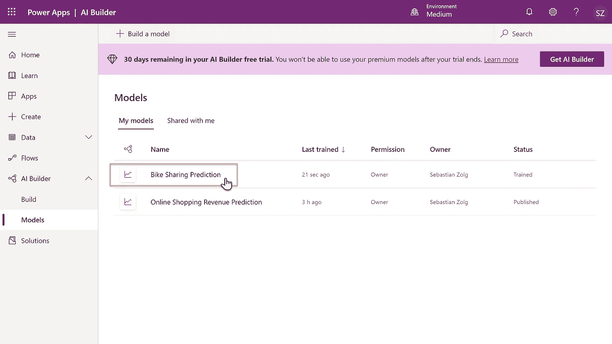

给你。🚀你的第一个人工智能模型用人工智能构建器构建。

您可以看到您的模型的性能，以及哪个变量对它的驱动最大。这个模型很好，但并不完美。它给我们留下了改进的空间，但这是另一个故事的一部分。

在你检查完所有东西后，你只需要点击**发布**。该流程将模型发布到生产环境中，并立即开始对`cnt`列中**值为空的所有条目(前十个)进行预测。**

**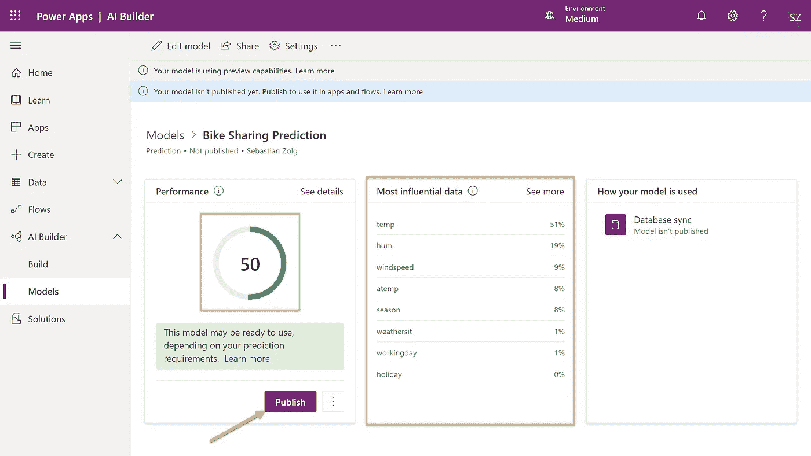**

**要查看模型预测的内容，请返回到**数据>实体**并点击**自行车共享记录**。**

**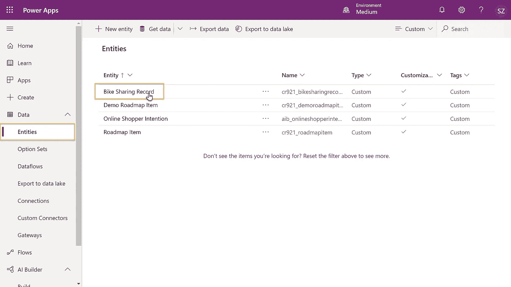**

**在**数据**选项卡上，确保选择**自定义字段**视图，并查找前十个条目。`cnt`字段仍然为空，这是故意的。预测值是*而不是*存储在原始字段中。相反，创建了三个额外的列。找一个叫`xxx_cnt-predicted`的，注意那里的数字。**

**预测是在这样的一天里我们可以预计的自行车租赁数量。**

**这不是很好吗？🤓**

**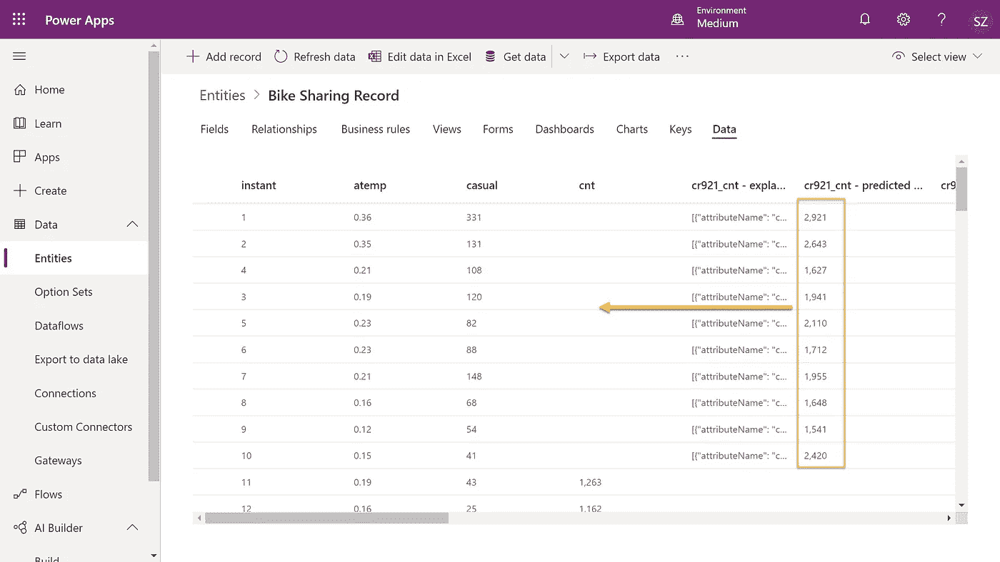**

****恭喜你！👏你已经用 AI Builder 创建了你的第一个模型，并根据几个条件预测了潜在的自行车租赁数量。****

**从这里，我们可以执行以下操作:**

*   **通过处理输入数据来改进预测。**
*   **在 Power App 或 Power Automate 中使用 AI 模型。**
*   **附加到天气服务，预测未来的租金，并调整轮班计划。**

**但是我们把这一切留到下一个故事。**

**就这样吧👉，
塞巴斯蒂安**