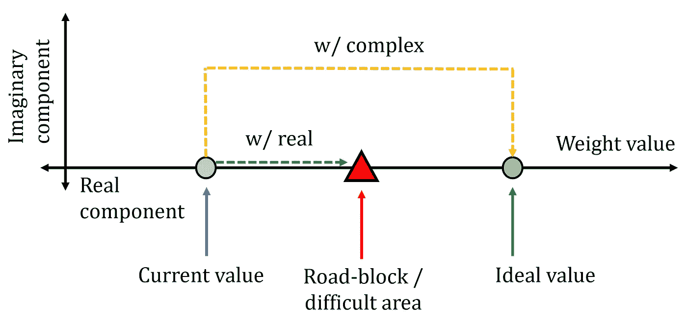
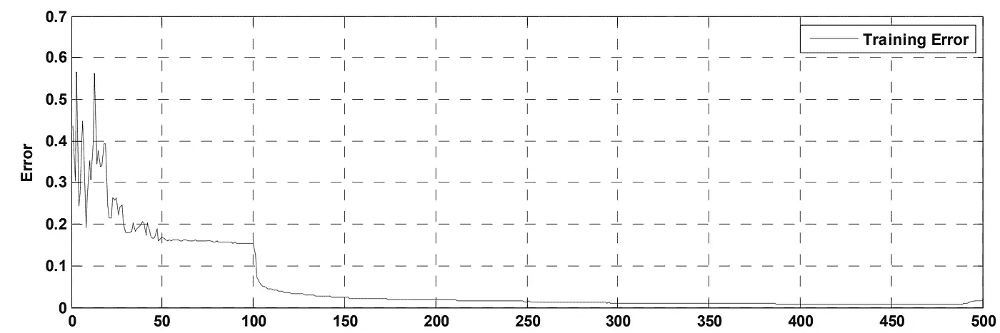

# 如果神经网络状态是复数会发生什么？

> 原文：<https://towardsdatascience.com/what-would-happen-if-neural-network-states-were-complex-numbers-dc5b47731184?source=collection_archive---------20----------------------->

作者创建的图像。

## 将 *i* 并入网络

这是一个目前处于神经网络研究边缘的问题:如果神经网络状态是复数会发生什么？由于权重、偏差和其他网络分量都有一个实部*和一个虚部*，一个曾经的一维测量将可以在两个维度*中自由移动。*

这是一个值得思考的有趣想法。从理论上讲，如果一个人能够在一个空间中传达两个值，神经网络可能能够找到某个结果的更高维度、更快的解决方案，就像你能够在三维空间中跳过一块岩石，但一只蚂蚁看到前方似乎永远延伸的墙，需要绕过它。

作者创建的图表。

也许通过利用虚数，神经网络将能够探索比目前更远的潜力。

幸运的是，这个问题并没有完全被忽略，并且已经有大量关于复值神经网络(CVNNs)的研究。几乎所有这些论文中提到的第一个问题是激活函数——为了使反向传播有效，促进网络非线性的激活函数必须是解析的，或者在所有点上都是可微分的。然而，刘维尔定理表明，在完全复平面*上的每个有界(闭)函数必定*是常数，因此是线性的。

因此，为了实现激活函数的目的，像 sigmoid 和双曲正切这样的有界函数在 CVNNs 中没有位置。当应用于复平面时，这些有界函数具有奇点——在空间中周期性出现的不可微的点。在这些奇点，函数向无穷大爆炸，导致神经网络计算失控。

在 CVNNs 的研究中，解决这个问题的一个常见方法是使用复杂的 sigmoid 函数，该函数不可避免地在无穷远处具有某些奇点，但是限制了权重和偏差参数的搜索空间，使得它们总是保持在“安全”区域内，并且永远不会接近计算爆炸。

尽管涉及大量的数学工作，简单地说，用于复值神经网络的反向传播算法不仅需要考虑权重的实部误差，还需要考虑虚部误差。因为它分别处理这些组件，所以它将搜索空间维度扩展了两个数量级。

由于这种稀疏性，在训练的前几百个时期使用随机搜索算法(RSA)来在空间中跳跃，找到复值反向传播算法(故意设置为具有非常慢的学习速率)要去的局部最小值。从这个意义上说，随机搜索算法是一种重型初始化技术。考虑使用这种方法的训练误差，对前 100 个历元执行 RSA，对剩余的历元执行复值反向传播:

来源:“用梯度下降和随机搜索算法训练的复值和实值神经网络的比较”。图片免费分享。

很明显，RSA 已经从大约第 75 个历元找到了合适的开始位置，这使得梯度下降算法很容易跟随误差的巨大减小和随后的长的、逐渐减小的序列。

通常，在实值神经网络(RVNN)上测试 CVNN 性能的论文要么看到相似的性能，要么看到更好的性能。通过增加虚数的额外维度，出现了一大堆新问题，但已构建的少数解决方案似乎足以将 CVNNs 与 RVNNs 相提并论。最近的研究甚至涉及复杂卷积、LSTMs 和批量归一化的构建，以进一步帮助 CVNNs。

总的来说，复杂的神经网络可以用一个词来概括:有前途。虽然目前，它们与普通标准神经网络的同等性能，但更高的计算成本和对各种问题的鲁棒性下降令人沮丧，但最近的研究表明，随着足够的发展，CVNNs 在音频相关任务(使用 MusicNet 数据集的音乐转录和语音频谱预测)上大大优于它们的实值兄弟。

虽然在不久的将来，CVNNs 在机器学习领域掀起风暴的希望很小，但在解决许多复杂的问题方面的持续发展可能会大大增加其解决特定任务的能力，例如在模拟信号(音频、电子等)方面。)，就像其他为处理图像和顺序数据而设计的架构一样。将虚数整合到神经网络中的想法绝对值得关注。

## **延伸阅读**

*   [一篇介绍性论文](https://www.elen.ucl.ac.be/Proceedings/esann/esannpdf/es2011-42.pdf)介绍复杂神经网络中的问题和解决方案。
*   [一篇深入的论文](http://citeseerx.ist.psu.edu/viewdoc/download?doi=10.1.1.83.4720&rep=rep1&type=pdf)专门讨论复平面中的奇点和激活函数问题。良好的可视化，但数学密集型。
*   [最近的一篇论文](https://arxiv.org/pdf/1705.09792.pdf)介绍了复杂神经网络的许多数学密集型发展，显示了在音频相关任务上的卓越性能。